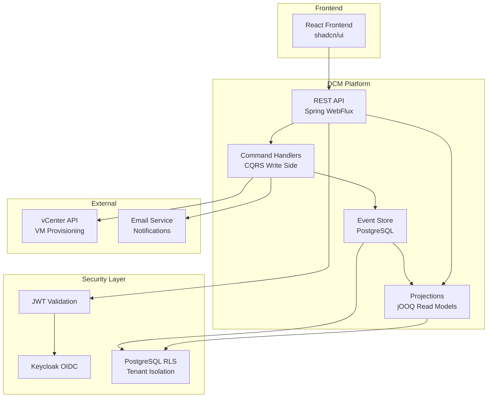

# Dynamic Virtual Machine Manager (DCM)

**Enterprise-grade VM provisioning platform built on the EAF framework for ISO 27001-compliant organizations.**

<p align="center">
  
  
  
  
  
  
  
</p>

<p align="center">
  <a href="docs/architecture.md">Architecture</a> •
  <a href="docs/prd.md">PRD</a> •
  <a href="docs/concepts/api-security.md">API Guide</a> •
  <a href="docs/devops-strategy.md">DevOps</a>
</p>

---

## Overview

DCM is a self-service VM provisioning platform designed for medium-sized enterprises (50-500 employees) in regulated industries. It streamlines the VM request-approval-provisioning workflow while maintaining full audit trails for compliance.

**Key Value Propositions:**
- **30-Second Audit Trail:** Complete request history accessible instantly for ISO 27001 audits
- **Self-Service Workflow:** End users request VMs, administrators approve, system provisions automatically
- **Multi-Tenant Architecture:** Complete data isolation via PostgreSQL Row-Level Security
- **VMware Integration:** Direct vCenter API integration for automated provisioning

## Core Features

- **Event Sourcing (CQRS):** Full audit trail with immutable event history
- **Multi-Tenancy:** 3-layer isolation (Request Filter, Service Validation, PostgreSQL RLS)
- **Hexagonal Architecture:** Clean separation of domain logic from infrastructure
- **Approval Workflow:** Configurable approval chains with email notifications
- **VMware Provisioning:** Automated VM creation via vSphere API
- **Compliance Ready:** ISO 27001, GDPR crypto-shredding support

### Module Map

| Module | Path | Purpose |
|--------|------|---------|
| **EAF Core** | `eaf/eaf-core` | Domain primitives (Entity, AggregateRoot, ValueObject, DomainEvent) |
| **EAF Event Sourcing** | `eaf/eaf-eventsourcing` | Event Store interfaces, projection base classes |
| **EAF Tenant** | `eaf/eaf-tenant` | Multi-tenancy with PostgreSQL RLS |
| **EAF Auth** | `eaf/eaf-auth` | IdP-agnostic authentication interfaces |
| **EAF Testing** | `eaf/eaf-testing` | Test utilities (InMemoryEventStore, TestClock) |
| **DCM Domain** | `dcm/dcm-domain` | Business logic, aggregates (NO Spring) |
| **DCM Application** | `dcm/dcm-application` | Use cases, command/query handlers |
| **DCM API** | `dcm/dcm-api` | REST controllers, DTOs |
| **DCM Infrastructure** | `dcm/dcm-infrastructure` | Persistence, VMware integration |
| **DCM App** | `dcm/dcm-app` | Spring Boot entry point |
| **DCM Web** | `dcm/dcm-web` | React frontend (Vite + TypeScript) |

## Architecture

DCM follows a **Hexagonal Architecture** with **CQRS/Event Sourcing**, enforced by Konsist architecture tests.



## Getting Started

### Prerequisites

- **Java 21+** (Eclipse Temurin recommended)
- **Node.js 20+** (Required for frontend)
- **Docker** and **Docker Compose** (for infrastructure & tests)
- **Git**

### Run Locally

#### 1. Start Infrastructure (PostgreSQL + Keycloak)
```bash
docker compose -f docker/dcm/docker-compose.yml up -d postgres keycloak
```
*Wait for containers to be healthy.*

#### 2. Start Backend (Spring Boot)
```bash
./gradlew :dcm:dcm-app:bootRun
```
*Backend API runs on: `http://localhost:8080`*

#### 3. Start Frontend (React)
Open a new terminal:
```bash
cd dcm/dcm-web
npm install
npm run dev
```
*Frontend runs on: `http://localhost:5173`*

#### Default Credentials

| Service | Username | Password | URL |
|---------|----------|----------|-----|
| **Keycloak Admin** | `admin` | `admin` | http://localhost:8180 |
| **PostgreSQL** | `eaf` | `eaf` | `jdbc:postgresql://localhost:5432/eaf` |
| **App Users** | See test-realm.json | (see file) | (see file) |

### Build & Test

```bash
# Clone the repository
git clone git@github.com:acita-gmbh/eaf.git
cd eaf

# Build with all quality checks (recommended before commits)
./gradlew clean build

# Run tests only
./gradlew test

# Generate merged coverage report (all modules)
./gradlew :koverHtmlReport
# Report: build/reports/kover/html/index.html

# Verify coverage threshold (≥70%)
./gradlew koverVerify

# Run mutation testing
./gradlew pitest
# Report: build/reports/pitest/index.html
```

### Module-Specific Commands

```bash
# Build specific module
./gradlew :dcm:dcm-app:build
./gradlew :eaf:eaf-core:build

# Test specific module
./gradlew :dcm:dcm-domain:test

# Run single test
./gradlew :dcm:dcm-app:test --tests "ArchitectureTest"
```

## Quality Gates

All quality gates are enforced in CI and block merges if not met:

| Gate | Threshold | Tool | Gradle Task |
|------|-----------|------|-------------|
| Test Coverage | ≥70% | Kover | `./gradlew koverVerify` |
| Mutation Score | ≥70% | Pitest | `./gradlew pitest` |
| Architecture Rules | All pass | Konsist | `./gradlew test` |

### CI Pipeline

The GitHub Actions CI pipeline (`.github/workflows/ci.yml`) runs on every push to `main` and every PR:

1. **Build** - Compile all modules
2. **Test** - Unit and integration tests (Testcontainers)
3. **Coverage** - Kover verification (≥70%)
4. **Mutation** - Pitest mutation testing (≥70%)

Reports are uploaded as workflow artifacts (coverage-report, mutation-report).

### Branch Protection

The `main` branch is protected with these rules:

- **Require pull request** before merging
- **Require status checks** - CI pipeline must pass
- **Require branches to be up to date** before merging
- Direct push to main is **rejected**

To configure (GitHub → Settings → Branches → Add rule for `main`):
1. Enable "Require a pull request before merging"
2. Enable "Require status checks to pass before merging"
3. Add `build-and-quality-gates` as required status check
4. Enable "Require branches to be up to date before merging"

### Architecture Rules (ADR-001)

Enforced by Konsist tests in `ArchitectureTest.kt`:

- EAF modules **MUST NOT** import from `de.acci.dcm.*`
- DCM modules **CAN** import from `de.acci.eaf.*`
- `dcm-domain` **MUST NOT** import from `org.springframework.*`

## Testing

The project follows a **Tests First** approach with integration tests taking priority:

```bash
# Run all tests
./gradlew test

# Run with detailed output
./gradlew test --info

# Run architecture tests
./gradlew :dcm:dcm-app:test --tests "*ArchitectureTest*"
```

### Testing Stack

- **JUnit 6** - Test framework
- **MockK** - Kotlin-native mocking
- **Testcontainers** - PostgreSQL, Keycloak integration tests
- **Konsist** - Architecture rule enforcement

## Project Structure

```
eaf/
├── build-logic/              # Gradle convention plugins
│   └── conventions/
│       └── src/main/kotlin/
│           ├── eaf.kotlin-conventions.gradle.kts
│           ├── eaf.spring-conventions.gradle.kts
│           ├── eaf.test-conventions.gradle.kts
│           └── eaf.pitest-conventions.gradle.kts
├── eaf/                      # Framework modules (reusable)
│   ├── eaf-core/
│   ├── eaf-eventsourcing/
│   ├── eaf-tenant/
│   ├── eaf-auth/
│   └── eaf-testing/
├── dcm/                     # Product modules
│   ├── dcm-domain/
│   ├── dcm-application/
│   ├── dcm-api/
│   ├── dcm-infrastructure/
│   └── dcm-app/
├── docs/                     # Documentation
│   ├── architecture.md
│   ├── prd.md
│   ├── epics.md
│   └── sprint-artifacts/
├── gradle/
│   └── libs.versions.toml    # Version catalog
└── settings.gradle.kts
```

## Contributing

We follow **Conventional Commits** and require all quality gates to pass:

```bash
# Commit message format
git commit -m "feat: implement VM request validation"
git commit -m "fix: correct tenant isolation in event store"
git commit -m "[DCM-123] feat: add approval workflow"

# Branch naming
git checkout -b feature/story-1.2-eaf-core-module
git checkout -b fix/tenant-leak-in-projections
```

### Before Submitting a PR

1. Run `./gradlew clean build` - all tests must pass
2. Ensure ≥70% test coverage for new code
3. Follow architecture rules (Konsist will enforce)
4. Update documentation if needed

## Documentation

| Document | Description |
|----------|-------------|
| [Architecture](docs/architecture.md) | System design, ADRs, module structure |
| [PRD](docs/prd.md) | 90 FRs + 95 NFRs, success criteria |
| [Epics](docs/epics.md) | 5 Epics, 51 Stories for MVP |
| [Security](docs/security-architecture.md) | Threat model, STRIDE, compliance |
| [Test Design](docs/test-design-system.md) | Testability concerns TC-001–TC-004 |
| [DevOps](docs/devops-strategy.md) | CI/CD, quality gates, monitoring |
| [UX Design](docs/ux-design-specification.md) | Design system, user journeys |

## License

Copyright 2025 ACCI (Axians Competence Center Infrastructure). All rights reserved.

---

<p align="center">
  <sub>Built with the <a href="docs/architecture.md">Enterprise Application Framework (EAF)</a></sub>
</p>
