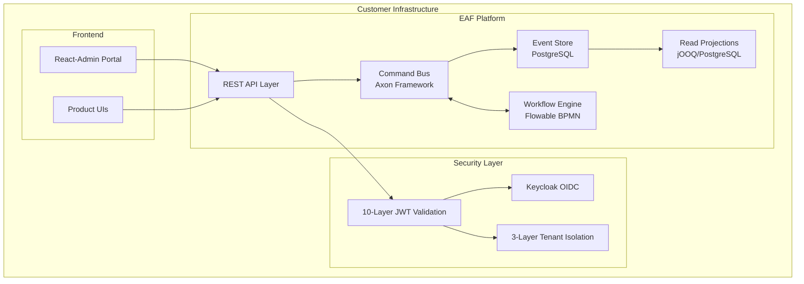

# 🏗️ Enterprise Application Framework (EAF)

**A batteries-included framework for building robust, secure, and scalable enterprise applications at Axians.**

<p align="center">
  
  
  
  
  
  
</p>

---

## ✨ Overview

The Enterprise Application Framework (EAF) is designed to provide a hyper-productive development environment. Its primary purpose is to furnish a runnable local development stack with pre-configured, production-grade modules for persistence, security, and observability, all governed by immediate code quality enforcement.

This allows developers to **focus exclusively on business logic**, drastically accelerating development velocity while ensuring the highest standards of quality. EAF replaces the legacy DCA framework, providing a modern, efficient, and secure foundation for the next generation of Axians products.

## 🚀 Core Features

EAF is built on a foundation of proven architectural patterns to ensure scalability, security, and maintainability.

- 🏛️ **Hexagonal Architecture (Ports & Adapters):** The core domain logic is completely isolated from external concerns like databases or web APIs. This is programmatically enforced by **Spring Modulith**, ensuring clean boundaries and making the system highly adaptable.

- ✍️ **CQRS & Event Sourcing:** Using the **Axon Framework**, the system separates read and write responsibilities (CQRS) and models business processes as a series of immutable events (Event Sourcing). This provides a full audit trail, improves performance, and simplifies complex domain logic.

- 🛡️ **Secure by Default:** The framework includes pre-built, non-negotiable security modules:
    - **10-Layer JWT Validation:** A robust, defense-in-depth pipeline for validating JSON Web Tokens.
    - **3-Layer Tenant Isolation:** A comprehensive multi-tenancy model (Request Filter, Service Validation, Database Row Level Security (RLS)) to ensure data is strictly segregated.

- 🧪 **Constitutional TDD & Integration-First Testing:** The framework mandates a Test-Driven Development approach with a focus on high-value integration tests using **Kotest** and **Testcontainers**.

- ⚙️ **Integrated Workflow Engine:** Long-running business processes are orchestrated using the integrated **Flowable BPMN Engine**.

- 🧑‍💻 **Developer-First Tooling:** The entire developer experience is optimized for productivity:
    - **One-Command Setup:** A single script to provision the entire local development environment.
    - **Scaffolding CLI:** A command-line tool to instantly generate new modules and domain aggregates that automatically adhere to all architectural patterns.

## 🏛️ Architecture at a Glance

The EAF is a "Modular Monolith" implemented in Kotlin on Spring Boot, built using Hexagonal Architecture with boundaries programmatically enforced by Spring Modulith.


```mermaid
graph TD
    subgraph Customer Infrastructure
        subgraph EAF Platform
            API[REST API Layer]
            CMD[Command Bus<br/>Axon Framework]
            EVT[Event Store<br/>PostgreSQL]
            PROJ[Read Projections<br/>jOOQ/PostgreSQL]
            FLOW[Workflow Engine<br/>Flowable BPMN]

            API --> CMD
            CMD --> EVT
            EVT --> PROJ
            CMD <--> FLOW
        end

        subgraph Security Layer
            KC[Keycloak OIDC]
            JWT[10-Layer JWT Validation]
            TEN[3-Layer Tenant Isolation]

            API --> JWT
            JWT --> KC
            JWT --> TEN
        end

        subgraph Frontend
            RA[React-Admin Portal]
            PROD[Product UIs]

            RA --> API
            PROD --> API
        end
    end
```

## 🏁 Getting Started

### Prerequisites

Ensure the following tools are installed on your system:

- **Java 21+**
- **Docker** and **Docker Compose** (V2 plugin)
- **Git**
- **npm** (for the optional admin UI)

### One-Command Setup

The entire local development environment can be provisioned with a single command. This script starts all required backing services (PostgreSQL, Keycloak, Redis, Prometheus, Grafana), runs database migrations, and launches the core application.

```bash
./scripts/init-dev.sh
```

The script supports overriding the default Grafana port via the `GRAFANA_PORT` environment variable. Upon first run, you will be prompted to set a secure password for the Keycloak administrator. The script provides a summary of all running services and their access URLs, including manual health check commands.

To stop all services, use:
```bash
./scripts/stop-dev.sh
```

## 🧪 Testing

The framework is built on a philosophy of **Constitutional TDD**. All quality gates (linting, static analysis, unit tests, and integration tests) can be executed with a single Gradle command:

```bash
./gradlew check
```

### Key Testing Patterns

- **Kotest Framework**: Kotest is the mandatory testing framework. JUnit is forbidden.
- **Spring Integration Tests**: For Spring Boot integration tests, use `@Autowired` field injection with an `init` block. Avoid constructor injection as it causes compilation issues.
- **Test Isolation**: Use the `axonIntegrationTest` source set for complex Axon/Flowable tests and the `@Profile("!test")` annotation to isolate tests from external dependencies like Keycloak.
- **Asynchronous Testing**: Use the `eventually` polling pattern from Kotest to handle asynchronous operations and avoid flaky tests.
- **Nullable Design Pattern**: For domain tests, the framework encourages the Nullable Design Pattern, where dependencies are replaced with lightweight, in-memory fakes.

## 🛡️ Security

- **Prometheus Endpoint**: Access to the `/actuator/prometheus` endpoint is restricted to operators with the `ROLE_eaf-admin` role.
- **Tenant Isolation**: Workflow handlers must perform a dual-layer tenant validation (event + process) to prevent cross-tenant data leakage.
- **Monitoring**: Production monitoring should be configured to alert on `TENANT_ISOLATION_VIOLATION` BpmnErrors.
- **Rate Limiting**: A Redis-backed rate limiter (100 events/sec/tenant) protects against DoS attacks on asynchronous event processors.

## ⚙️ Flowable Integration

- **Schema Isolation**: Flowable tables are currently created in the `public` schema. This is a known technical debt (ARCH-001) with a documented remediation plan.
- **Event Correlation**: A two-step query pattern is required to correlate events to Flowable process instances due to a limitation in how Flowable handles business keys.

## 📚 Documentation

For more detailed information, please refer to the architecture documents in the `docs/architecture/` directory.