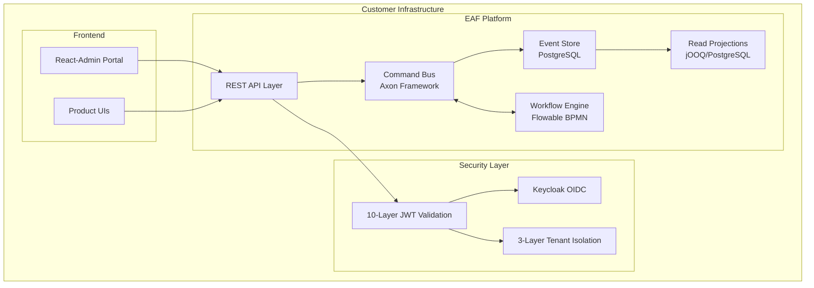

# 🏗️ Enterprise Application Framework (EAF) v1.0

**A batteries-included framework for building robust, secure, and scalable enterprise applications at Axians.**

<p align="center">
  
  
  
  
  
  
</p>

<p align="center">
  <a href="https://github.com/acita-gmbh/eaf/actions/workflows/ci.yml"></a>
  <a href="https://github.com/acita-gmbh/eaf/actions/workflows/nightly.yml"></a>
  <a href="https://github.com/acita-gmbh/eaf/actions/workflows/security-review.yml"></a>
</p>

---

## ✨ Overview

The Enterprise Application Framework (EAF) is designed to provide a hyper-productive development environment. Its primary purpose is to furnish a runnable local development stack with pre-configured, production-grade modules for persistence, security, and observability, all governed by immediate code quality enforcement.

This allows developers to **focus exclusively on business logic**, drastically accelerating development velocity while ensuring the highest standards of quality. EAF replaces the legacy DCA framework, providing a modern, efficient, and secure foundation for the next generation of Axians products.

## 🚀 Core Features

EAF is built on a foundation of proven architectural patterns to ensure scalability, security, and maintainability.

- 🏛️ **Hexagonal Architecture (Ports & Adapters):** The core domain logic is completely isolated from external concerns like databases or web APIs. This is programmatically enforced by **Spring Modulith**, ensuring clean boundaries and making the system highly adaptable.

- ✍️ **CQRS & Event Sourcing:** Using the **Axon Framework**, the system separates read and write responsibilities (CQRS) and models business processes as a series of immutable events (Event Sourcing). This provides a full audit trail, improves performance, and simplifies complex domain logic.

- 🛡️ **Secure by Default:** The framework includes pre-built, non-negotiable security modules:
    - **10-Layer JWT Validation:** A robust, defense-in-depth pipeline for validating JSON Web Tokens.
    - **3-Layer Tenant Isolation:** A comprehensive multi-tenancy model (Request Filter, Service Validation, Database Row Level Security (RLS)) to ensure data is strictly segregated.

- 🧪 **Constitutional TDD & Integration-First Testing:** The framework mandates a Test-Driven Development approach with a focus on high-value integration tests using **Kotest** and **Testcontainers**.

- ⚙️ **Integrated Workflow Engine:** Long-running business processes are orchestrated using the integrated **Flowable BPMN Engine**.

- 🧑‍💻 **Developer-First Tooling:** The entire developer experience is optimized for productivity:
    - **One-Command Setup:** A single script to provision the entire local development environment.
    - **Scaffolding CLI:** A command-line tool to instantly generate new modules and domain aggregates that automatically adhere to all architectural patterns.

### Core Module Map

| Module | Path | Primary Responsibility |
| --- | --- | --- |
| Core Domain Services | `framework/core` | Encapsulates domain logic, aggregates, and application services enforced by Hexagonal boundaries. |
| CQRS & Event Handling | `framework/cqrs` | Provides Axon-based command, event, and query infrastructure plus Event Sourcing configuration. |
| Persistence Layer | `framework/persistence` | Supplies PostgreSQL integrations, jOOQ projections, and repository adapters. |
| Security Controls | `framework/security` | Hosts authentication/authorization policies, tenant isolation, and JWT validation pipeline. |
| Workflow Orchestration | `framework/workflow` | Contains Flowable BPMN definitions and supporting process utilities. |
| Observability Stack | `framework/observability` | Delivers metrics, tracing, and logging instrumentation for platform services. |
| Web Adapters | `framework/web` | Exposes REST controllers and API gateways aligned with Hexagonal interface contracts. |
| Admin Shell | `framework/admin-shell` | Provides CLI administration tools, scaffolding commands, and operational scripts. |

## 🏛️ Architecture at a Glance

The EAF is a "Modular Monolith" implemented in Kotlin on Spring Boot, built using Hexagonal Architecture with boundaries programmatically enforced by Spring Modulith.


```mermaid
graph TD
    subgraph Customer Infrastructure
        subgraph EAF Platform
            API[REST API Layer]
            CMD[Command Bus<br/>Axon Framework]
            EVT[Event Store<br/>PostgreSQL]
            PROJ[Read Projections<br/>jOOQ/PostgreSQL]
            FLOW[Workflow Engine<br/>Flowable BPMN]

            API --> CMD
            CMD --> EVT
            EVT --> PROJ
            CMD <--> FLOW
        end

        subgraph Security Layer
            KC[Keycloak OIDC]
            JWT[10-Layer JWT Validation]
            TEN[3-Layer Tenant Isolation]

            API --> JWT
            JWT --> KC
            JWT --> TEN
        end

        subgraph Frontend
            RA[React-Admin Portal]
            PROD[Product UIs]

            RA --> API
            PROD --> API
        end
    end
```

## 🏁 Getting Started

### Prerequisites

Ensure the following tools are installed on your system:

- **Java 21+**
- **Docker** and **Docker Compose** (V2 plugin)
- **Git**
- **npm** (for the optional admin UI)

### One-Command Setup

The entire local development environment can be provisioned with a single command:

```bash
./scripts/init-dev.sh
```

**What it does:**
1. ✅ Validates Docker and Docker Compose are installed and running
2. ✅ Starts all backing services (PostgreSQL, Keycloak, Redis, Prometheus, Grafana)
3. ✅ Waits for services to be healthy with automatic retry logic (max 2 minutes)
4. ✅ Validates test data (Keycloak users, PostgreSQL schema)
5. ✅ Installs Git hooks (pre-commit: ktlint, pre-push: Detekt + tests)
6. ✅ Downloads all Gradle dependencies

**Typical execution time:** ~22 seconds (first run may take longer for Docker image downloads)

**Services Available After Init:**
- **PostgreSQL:** localhost:5432 (user: eaf_user, password: eaf_password, database: eaf)
- **Keycloak:** http://localhost:8080 (admin/admin, realm: eaf)
- **Redis:** localhost:6379
- **Prometheus:** http://localhost:9090
- **Grafana:** http://localhost:3100 (admin/admin)

**Test Users** (automatically imported via Keycloak realm):
- `admin@eaf.local` / `password` (tenant: tenant-a, roles: admin, user)
- `viewer@eaf.local` / `password` (tenant: tenant-a, roles: user)
- `tenant-b-admin@eaf.local` / `password` (tenant: tenant-b, roles: admin, user)

**Port Configuration:** All ports can be customized via `.env` file (copy from `.env.example`). Grafana uses port 3100 by default to avoid conflicts with other development stacks.

To stop all services:
```bash
docker compose down
```

## 🧭 Usage

Once the environment is provisioned, developers typically rotate through three high-frequency workflows:

- **Run the platform locally:**

    ```bash
    ./gradlew :apps:admin:bootRun
    ```
  Starts the Spring Boot admin interface with hot reload support. Use `CTRL+C` to stop when finished.
- **Generate a new bounded context or aggregate:**

    ```bash
    ./framework/admin-shell/bin/eaf-cli scaffold aggregate --name Invoice --module billing
    ```
  Produces fully wired ports, adapters, and test harnesses that comply with Hexagonal Architecture expectations.
- **Smoke test a REST capability:**

    ```bash
    curl -H "Authorization: Bearer $(./scripts/dev-token.sh admin@eaf.local)" \
      http://localhost:8080/api/health
    ```
  Validates the service, JWT pipeline, and tenant isolation against the running stack.

## 🧪 Testing

The framework is built on a philosophy of **Constitutional TDD**. All quality gates (linting, static analysis, unit tests, and integration tests) can be executed with a single Gradle command:

```bash
./gradlew check
```

### Key Testing Patterns

- **Kotest Framework**: Kotest is the mandatory testing framework. JUnit is forbidden.
- **Spring Integration Tests**: For Spring Boot integration tests, use `@Autowired` field injection with an `init` block. Avoid constructor injection as it causes compilation issues.
- **Test Isolation**: Use the `axonIntegrationTest` source set for complex Axon/Flowable tests and the `@Profile("!test")` annotation to isolate tests from external dependencies like Keycloak.
- **Asynchronous Testing**: Use the `eventually` polling pattern from Kotest to handle asynchronous operations and avoid flaky tests.
- **Nullable Design Pattern**: For domain tests, the framework encourages the Nullable Design Pattern, where dependencies are replaced with lightweight, in-memory fakes.

## 🛡️ Security

- **Prometheus Endpoint**: Access to the `/actuator/prometheus` endpoint is restricted to operators with the `ROLE_eaf-admin` role.
- **Tenant Isolation**: Workflow handlers must perform a dual-layer tenant validation (event + process) to prevent cross-tenant data leakage.
- **Monitoring**: Production monitoring should be configured to alert on `TENANT_ISOLATION_VIOLATION` BpmnErrors.
- **Rate Limiting**: A Redis-backed rate limiter (100 events/sec/tenant) protects against DoS attacks on asynchronous event processors.

## ⚙️ Flowable Integration

- **Schema Isolation**: Flowable tables are currently created in the `public` schema. This is a known technical debt (ARCH-001) with a documented remediation plan.
- **Event Correlation**: A two-step query pattern is required to correlate events to Flowable process instances due to a limitation in how Flowable handles business keys.

## 🛠️ Troubleshooting & Support

- **Docker compose fails health checks:** Run `docker compose ps` and inspect container logs with `docker compose logs <service>`; ensure ports in `.env` are not occupied by other stacks.
- **Gradle cache issues:** Clear the local cache via `./gradlew --stop && ./gradlew clean` and remove `~/.gradle/caches` when dependencies become inconsistent after upgrades.
- **Keycloak users missing:** Re-run `./scripts/init-dev.sh --force` to trigger realm import and verify Keycloak readiness at http://localhost:8080/health.
- **Slow integration suite:** Enable the Smart Test subset with `./gradlew check -Pprofile=smart` during iterative development; reserve full runs for CI or nightly builds.

If issues persist, open a discussion on the internal Axians developer forum or contact the EAF platform guild via Slack channel `#eaf-core`.

## 🤝 Contributing

We welcome improvements that uphold the framework's architectural guardrails. Review the [contribution guidelines](CONTRIBUTING.md) before opening a pull request. The guide outlines mandatory Git hooks, commit message conventions (`[JIRA-XXX] type: description`), and required test scopes for each change type.

## 📄 License

EAF is distributed under the Apache License 2.0. Refer to `framework/admin-shell/LICENSE` for the complete terms while the root license file is being finalized.

## 📚 Documentation

For more detailed information, please refer to the architecture documents in the `docs/architecture/` directory.
