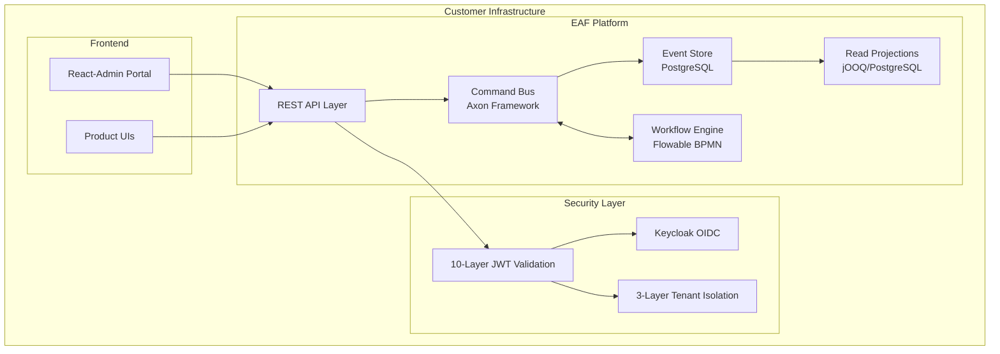

# 🏗️ Enterprise Application Framework (EAF)

**A batteries-included framework for building robust, secure, and scalable enterprise applications at Axians.**

---

## ✨ Overview

The Enterprise Application Framework (EAF) is designed to provide a hyper-productive development environment. Its primary purpose is to furnish a runnable local development stack with pre-configured, production-grade modules for persistence, security, and observability, all governed by immediate code quality enforcement.

This allows developers to **focus exclusively on business logic**, drastically accelerating development velocity while ensuring the highest standards of quality. EAF replaces the legacy DCA framework, providing a modern, efficient, and secure foundation for the next generation of Axians products.

## 🚀 Core Features

EAF is built on a foundation of proven architectural patterns to ensure scalability, security, and maintainability.

- 🏛️ **Hexagonal Architecture (Ports & Adapters):** The core domain logic is completely isolated from external concerns like databases or web APIs. This is programmatically enforced by **Spring Modulith**, ensuring clean boundaries and making the system highly adaptable.

- ✍️ **CQRS & Event Sourcing:** Using the **Axon Framework**, the system separates read and write responsibilities (CQRS) and models business processes as a series of immutable events (Event Sourcing). This provides a full audit trail, improves performance, and simplifies complex domain logic.

- 🛡️ **Secure by Default:** The framework includes pre-built, non-negotiable security modules:
    - **10-Layer JWT Validation:** A robust, defense-in-depth pipeline for validating JSON Web Tokens.
    - **3-Layer Tenant Isolation:** A comprehensive multi-tenancy model (Request Filter, Service Validation, Database RLS) to ensure data is strictly segregated.

- 🧪 **Constitutional TDD & Integration-First Testing:** The framework mandates a Test-Driven Development approach with a focus on high-value integration tests using **Kotest** and **Testcontainers**. This philosophy ensures that tests are fast, reliable, and validate real-world interactions.

- ⚙️ **Integrated Workflow Engine:** Long-running business processes are orchestrated using the integrated **Flowable BPMN Engine**, providing a powerful and industry-standard solution for complex workflows.

- 🧑‍💻 **Developer-First Tooling:** The entire developer experience is optimized for productivity:
    - **One-Command Setup:** A single script to provision the entire local development environment.
    - **Scaffolding CLI:** A command-line tool to instantly generate new modules and domain aggregates that automatically adhere to all architectural patterns.

## 🏛️ Architecture at a Glance

The EAF is a "Modular Monolith" implemented in Kotlin on Spring Boot, built using Hexagonal Architecture with boundaries programmatically enforced by Spring Modulith.


```mermaid
graph TD
    subgraph Customer Infrastructure
        subgraph EAF Platform
            API[REST API Layer]
            CMD[Command Bus<br/>Axon Framework]
            EVT[Event Store<br/>PostgreSQL]
            PROJ[Read Projections<br/>jOOQ/PostgreSQL]
            FLOW[Workflow Engine<br/>Flowable BPMN]

            API --> CMD
            CMD --> EVT
            EVT --> PROJ
            CMD <--> FLOW
        end

        subgraph Security Layer
            KC[Keycloak OIDC]
            JWT[10-Layer JWT Validation]
            TEN[3-Layer Tenant Isolation]

            API --> JWT
            JWT --> KC
            JWT --> TEN
        end

        subgraph Frontend
            RA[React-Admin Portal]
            PROD[Product UIs]

            RA --> API
            PROD --> API
        end
    end
```

## 🏁 Getting Started

### Prerequisites

Ensure the following tools are installed on your system:

- **Java 21+**
- **Docker** and **Docker Compose** (V2 plugin)
- **Git**
- **npm** (for the optional admin UI)

### One-Command Setup

The entire local development environment can be provisioned with a single command. This script starts all required backing services (PostgreSQL, Keycloak, etc.), runs database migrations, and launches the core application.

```bash
./scripts/init-dev.sh
```

Upon first run, you will be prompted to set a secure password for the Keycloak administrator. The script provides a summary of all running services and their access URLs.

## 🧑‍💻 Developer Workflow: Creating a Product

EAF provides a scaffolding CLI to automate the creation of all boilerplate required by the framework's architecture. This allows you to start writing business logic in minutes.

### Step 1: Create a New Product Module

Create a new, isolated Spring Modulith module for your product. This command sets up the Gradle sub-project and all required build configurations.

```bash
# Usage: eaf scaffold module <your-product-name>
eaf scaffold module my-new-product
```

### Step 2: Scaffold a Domain Aggregate

Next, generate a complete CQRS/ES vertical slice for a core entity within your domain. This command creates the Axon Aggregate, its associated Commands and Events, API stubs, and a full suite of tests.

```bash
# Usage: eaf scaffold aggregate <AggregateName> --module <your-product-name>
eaf scaffold aggregate Customer --module my-new-product
```

This generates all necessary files, allowing you to immediately implement the business rules for your `Customer` aggregate.

### Step 3: Run the Project

After scaffolding your components, simply re-run the initialization script to build and launch your new product.

```bash
./scripts/init-dev.sh
```

## 💡 Core Concepts

### Error Handling

The framework uses a standardized error handling approach. All exceptions are handled by a `GlobalExceptionHandler` and formatted as **RFC 7807 Problem Details** (`application/problem+json`). This provides consistent, machine-readable error responses across all APIs.

Domain-specific errors are modeled using sealed hierarchies (e.g., `WidgetError.kt`) and handled within the domain layer using functional constructs from the **Arrow** library (`Either`).

### Input Validation

Validation is enforced at two levels:

1.  **Gateway Level:** An `InputValidationFilter` performs initial sanitization and checks for common threats like injection patterns.
2.  **Domain Level:** The aggregate itself is the final authority on validity. It contains precise validation logic (e.g., regex patterns, range checks) for its commands. This ensures the domain can never enter an invalid state.

### Logging

All logs are written in a **structured JSON format**, enriched with critical context fields like `service_name`, `trace_id`, and `tenant_id`. This enables powerful querying and analysis in external logging platforms like Loki or Splunk.

## 🧪 Testing

The framework is built on a philosophy of **Constitutional TDD**. All quality gates (linting, static analysis, unit tests, and integration tests) can be executed with a single Gradle command:

```bash
./gradlew check
```

This command is the source of truth for code quality and must pass before any code is merged.

For domain tests, the framework encourages the **Nullable Design Pattern**, where dependencies are replaced with lightweight, in-memory fakes. This allows for extremely fast and focused business logic tests without the overhead of mocking frameworks.

## ⚙️ Configuration

Application configuration is managed via Spring profiles and environment variables.

- **Runtime Configuration:** The primary configuration file is `application.yml`. It is used to set database connections, Axon event processor settings, logging levels, and other runtime options.
- **Environment Variables:** For sensitive values, the configuration uses environment variables (e.g., `${SPRING_DATASOURCE_PASSWORD}`).
- **Setup Script Options:** The `init-dev.sh` script accepts flags to modify its behavior:
    - `--skip-tests`: Skips the automated test execution.
    - `--skip-test-data`: Skips loading optional SQL test data.
    - `--detach`: Leaves all services running in the background.

## 🛑 Stopping the Environment

If you ran the setup script in the foreground, press `Ctrl+C`. If you used the `--detach` flag, use the following script to stop all services:

```bash
./scripts/stop-dev.sh
```