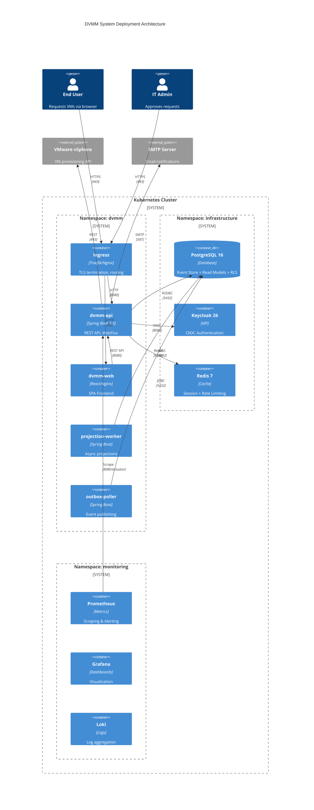

# DVMM Architecture

## Executive Summary

DVMM is a multi-tenant self-service portal for VMware VM provisioning, built as the pilot project for the Enterprise Application Framework (EAF). The architecture follows **Framework-First principles** with strict separation between reusable framework modules (`eaf-*`) and product-specific code (`dvmm-*`).

**Key Architectural Decisions:**
- **CQRS + Event Sourcing** with PostgreSQL-based Event Store and jOOQ Read Projections
- **Multi-Tenancy** via PostgreSQL Row-Level Security (RLS) with fail-closed semantics
- **Kotlin 2.2 + Spring Boot 3.5** with WebFlux/Coroutines for reactive, non-blocking I/O
- **IdP-Agnostic Auth** with pluggable identity providers (Keycloak for MVP)
- **Hexagonal Architecture** with Konsist-enforced module boundaries

## Project Context Understanding

**Project:** DVMM (Dynamic Virtual Machine Manager)
**Type:** Multi-Tenant Self-Service Portal for VMware ESXi/Windows VM Provisioning
**Framework:** Enterprise Application Framework (EAF) Pilot Project

### Requirements Scope

| Category | MVP | Growth | Total |
|----------|-----|--------|-------|
| Functional Requirements | 66 | 25 | 91 |
| Non-Functional Requirements | 83 | 12 | 95 |
| **Total** | **149** | **37** | **186** |

### FR Categories

1. User Account & Authentication (10 FRs)
2. Project Management (6 FRs)
3. VM Request Management (9 FRs)
4. Approval Workflow (9 FRs)
5. VM Provisioning (10 FRs)
6. Status & Notifications (7 FRs)
7. Onboarding & Empty States (2 FRs)
8. Admin Dashboard (6 FRs)
9. Reporting & Audit (9 FRs)
10. Multi-Tenancy (7 FRs)
11. System Administration (6 FRs)
12. Error Handling & Resilience (4 FRs)
13. Quota Management (3 FRs)
14. Capacity & Cost Visibility (3 FRs)

### Complexity Assessment

| Aspect | Level | Details |
|--------|-------|---------|
| Multi-Tenancy | **High** | PostgreSQL RLS (database-enforced isolation) |
| Architecture | **High** | CQRS + Event Sourcing |
| Compliance | **High** | ISO 27001, GDPR with Crypto-Shredding |
| Authentication | **Medium** | Keycloak OIDC, JWT with tenant_id claim |
| Integration | **High** | VMware vSphere API with graceful degradation |
| Real-time | **Medium** | Status updates (Polling MVP, WebSocket Growth) |

### UX Requirements Summary

- **3 User Roles:** End User, IT Admin, IT Manager
- **4 Critical Screens:** User Dashboard, VM Request Form, Approval Queue, Manager Dashboard
- **Design System:** React + shadcn-admin-kit + Tailwind CSS
- **Theme:** Tech Teal (#0f766e)
- **Accessibility:** WCAG 2.1 AA Compliance
- **Multi-Tenant UX:** AWS-style header dropdown for tenant switching

### Critical NFRs

| Category | Key Targets |
|----------|-------------|
| Performance | API < 500ms (P95), Dashboard < 2s |
| Scalability | 100+ concurrent users, 50+ tenants, 1000+ VMs/tenant |
| Security | TLS 1.3, OIDC, RLS, Rate Limiting (100 req/min/user) |
| Compliance | ISO 27001-ready, 7-year audit retention, GDPR Crypto-Shredding |
| Availability | 99.5% uptime, RTO < 4h, RPO < 1h |
| Quality | ≥80% test coverage, ≥70% mutation score |

### Key Architectural Challenges

1. **Synchronous Quota Enforcement in CQRS:** Command Handler must validate quota BEFORE accepting command
2. **GDPR vs. Audit Retention:** Crypto-Shredding pattern for personal data in events
3. **VMware API Instability:** Contract tests (Pact) + graceful degradation with request queuing
4. **Multi-Tenant Isolation:** RLS at database level, fail-closed on missing tenant context

---

## ADR-001: EAF Framework-First Architecture

**Status:** Accepted
**Date:** 2025-11-24
**Participants:** Winston (Architect), Amelia (Dev), Murat (TEA), John (PM), Bob (SM), Sally (UX)

### Context

DVMM is not just a product—it's the pilot project for EAF (Enterprise Application Framework). The framework must emerge from DVMM but remain completely independent of it, enabling future products to use EAF without any DVMM dependencies.

### Decision

We adopt a **Framework-First Architecture** using Hexagonal Architecture principles within a Gradle multi-module monorepo structure.

### Architectural Principles

1. **Strict Dependency Direction:** EAF ← DVMM (never the reverse)
2. **Domain Independence:** Framework core has zero external dependencies
3. **Hexagonal Boundaries:** Ports & Adapters pattern for all integrations
4. **Module Isolation:** Kotlin `internal` modifier + Konsist enforcement
5. **First Consumer Pattern:** DVMM validates EAF, but doesn't define it

### Monorepo Structure

```
eaf-monorepo/
├── settings.gradle.kts              # Defines all modules
├── build.gradle.kts                 # Root build with conventions
├── gradle/
│   └── libs.versions.toml           # Version Catalog (centralized)
│
├── build-logic/                     # Shared Build Conventions
│   ├── settings.gradle.kts
│   └── conventions/
│       └── src/main/kotlin/
│           ├── eaf.kotlin-conventions.gradle.kts
│           ├── eaf.spring-conventions.gradle.kts
│           └── eaf.test-conventions.gradle.kts
│
├── eaf/                             # 🔷 FRAMEWORK
│   ├── eaf-core/                    # Domain Primitives (zero deps)
│   │   └── src/main/kotlin/
│   │       └── com/eaf/core/
│   │           ├── domain/          # Entity, AggregateRoot, ValueObject
│   │           ├── events/          # DomainEvent, EventMetadata
│   │           └── validation/      # Validation abstractions
│   │
│   ├── eaf-cqrs-core/               # CQRS Core (Commands & Queries)
│   │   └── src/main/kotlin/
│   │       └── com/eaf/cqrs/
│   │           ├── command/         # CommandBus, CommandHandler, CommandGateway
│   │           └── query/           # QueryBus, QueryHandler, QueryGateway
│   │
│   ├── eaf-eventsourcing/           # Event Sourcing Infrastructure
│   │   └── src/main/kotlin/
│   │       └── com/eaf/eventsourcing/
│   │           ├── EventStore.kt    # Interface only
│   │           ├── Projection.kt    # Interface + base classes
│   │           ├── Snapshot.kt      # Snapshotting abstractions
│   │           └── aggregate/       # AggregateRoot base class (NO concrete aggregates!)
│   │
│   ├── eaf-tenant/                  # Multi-Tenancy Infrastructure
│   │   └── src/main/kotlin/
│   │       └── com/eaf/tenant/
│   │           ├── TenantContext.kt
│   │           ├── TenantFilter.kt  # Servlet/WebFlux Filter
│   │           └── rls/             # PostgreSQL RLS Support
│   │
│   ├── eaf-auth/                    # Authentication & Authorization (IdP-AGNOSTIC)
│   │   └── src/main/kotlin/
│   │       └── com/eaf/auth/
│   │           ├── IdentityProvider.kt    # 🔑 INTERFACE - Products choose implementation
│   │           ├── TokenClaims.kt         # Abstracted token claims
│   │           ├── UserInfo.kt            # Abstracted user info
│   │           ├── rbac/                  # Role-based Access Control
│   │           └── jwt/                   # Generic JWT Processing
│   │
│   ├── eaf-audit/                   # Audit Trail Infrastructure (Interfaces Only)
│   │   └── src/main/kotlin/
│   │       └── com/eaf/audit/
│   │           ├── AuditEvent.kt    # Interface - products define concrete events
│   │           ├── AuditStore.kt    # Interface - products choose implementation
│   │           ├── AuditContext.kt  # Correlation ID, User, Tenant context
│   │           └── crypto/          # Crypto-Shredding utilities for GDPR
│   │
│   ├── eaf-observability/           # Logging, Metrics, Tracing
│   │   └── src/main/kotlin/
│   │       └── com/eaf/observability/
│   │           ├── logging/         # Structured JSON logging
│   │           ├── metrics/         # Micrometer/Prometheus
│   │           └── tracing/         # OpenTelemetry integration
│   │
│   ├── eaf-notifications/           # Notification Infrastructure
│   │   └── src/main/kotlin/
│   │       └── com/eaf/notifications/
│   │           ├── NotificationService.kt  # Interface
│   │           ├── EmailNotification.kt    # Email abstraction
│   │           ├── templates/              # Template engine integration
│   │           └── providers/              # SMTP, SendGrid, etc.
│   │
│   ├── eaf-testing/                 # Test Support (Minimal, Generic Only)
│   │   └── src/main/kotlin/
│   │       └── com/eaf/testing/
│   │           ├── TenantTestContext.kt   # Set tenant in test scope
│   │           ├── InMemoryEventStore.kt  # For unit testing aggregates
│   │           ├── TestClock.kt           # Control time in tests
│   │           └── TestUser.kt            # Mock authenticated user
│   │
│   ├── eaf-starters/                # 🚀 MODULAR AUTO-CONFIGURATION
│   │   ├── eaf-starter-core/        # Minimal: eaf-core + observability
│   │   ├── eaf-starter-cqrs/        # + CommandBus, QueryBus
│   │   ├── eaf-starter-eventsourcing/ # + EventStore, Projections
│   │   ├── eaf-starter-tenant/      # + Multi-Tenancy, RLS
│   │   ├── eaf-starter-auth/        # + Auth (IdP-agnostic)
│   │   └── eaf-starter-notifications/ # + Email/Push/SMS
│   │
│   └── eaf-auth-providers/          # 🔐 IdP IMPLEMENTATIONS
│       ├── eaf-auth-keycloak/       # Keycloak Adapter
│       ├── eaf-auth-azure-ad/       # Azure AD Adapter (future)
│       └── eaf-auth-okta/           # Okta Adapter (future)
│
├── dvmm/                            # 🔶 PRODUCT (First Consumer)
│   ├── dvmm-domain/                 # DVMM Business Logic
│   │   └── src/main/kotlin/
│   │       └── com/dvmm/domain/
│   │           ├── vm/              # VM Aggregate
│   │           ├── request/         # Request Aggregate
│   │           ├── project/         # Project Aggregate
│   │           └── approval/        # Approval Value Objects
│   │
│   ├── dvmm-application/            # Use Cases / Application Services
│   │   └── src/main/kotlin/
│   │       └── com/dvmm/application/
│   │           ├── vm/              # VM Commands & Queries
│   │           ├── request/         # Request Use Cases
│   │           └── ports/           # Output Ports (Interfaces)
│   │
│   ├── dvmm-api/                    # REST API (Input Adapters)
│   │   └── src/main/kotlin/
│   │       └── com/dvmm/api/
│   │           ├── rest/            # Controllers
│   │           └── dto/             # Request/Response DTOs
│   │
│   ├── dvmm-infrastructure/         # Output Adapters
│   │   └── src/main/kotlin/
│   │       └── com/dvmm/infrastructure/
│   │           ├── persistence/     # JPA/R2DBC Repositories
│   │           ├── vmware/          # VMware vSphere Adapter
│   │           └── notification/    # Email Adapter
│   │
│   └── dvmm-app/                    # Spring Boot Application
│       └── src/main/kotlin/
│           └── com/dvmm/
│               └── DvmmApplication.kt
│
├── frontend/                        # 🎨 UI COMPONENTS
│   ├── packages/
│   │   ├── eaf-ui/                  # Framework UI Kit
│   │   │   ├── components/
│   │   │   │   ├── TenantSwitcher/
│   │   │   │   ├── AuditTimeline/
│   │   │   │   └── StatusBadge/
│   │   │   └── hooks/
│   │   │       ├── useTenant.ts
│   │   │       └── useAuth.ts
│   │   │
│   │   └── dvmm-ui/                 # Product-specific UI
│   │       ├── components/
│   │       │   ├── VMRequestCard/
│   │       │   ├── VMSizeSelector/
│   │       │   └── ApprovalActionBar/
│   │       └── pages/
│   │
│   └── apps/
│       └── dvmm-web/                # DVMM Web Application
│
└── docs/                            # Documentation
    └── docusaurus/
```

### EAF Module Definitions

| Module | Responsibility | Dependencies | Can Use Standalone? |
|--------|---------------|--------------|---------------------|
| `eaf-core` | Domain primitives, events, validation | None (pure Kotlin) | ✅ Yes, basis for all |
| `eaf-cqrs-core` | CommandBus, QueryBus, Gateways | eaf-core | ✅ Yes |
| `eaf-eventsourcing` | EventStore, Projection, Snapshot (interfaces + base classes) | eaf-core | ✅ Yes |
| `eaf-tenant` | Multi-tenancy, RLS support | eaf-core | ✅ Yes |
| `eaf-auth` | **IdP-agnostic** auth interfaces, RBAC, JWT | eaf-core, eaf-tenant | ✅ Yes |
| `eaf-auth-keycloak` | Keycloak `IdentityProvider` implementation | eaf-auth | ✅ Yes |
| `eaf-audit` | Audit interfaces + crypto-shredding (NO concrete events) | eaf-core | ✅ Yes |
| `eaf-observability` | Logging, metrics, tracing | eaf-core | ✅ Yes |
| `eaf-notifications` | Email/Push/SMS abstractions, Templates | eaf-core, eaf-tenant | ✅ Yes |
| `eaf-testing` | Minimal test utilities (TenantTestContext, InMemoryEventStore, TestClock) | eaf-core, eaf-eventsourcing | ✅ Yes |

### Modular Starters (À La Carte)

| Starter | Includes | Use Case |
|---------|----------|----------|
| `eaf-starter-core` | eaf-core, eaf-observability | Minimal EAF footprint |
| `eaf-starter-cqrs` | + eaf-cqrs-core | Apps with Command/Query separation |
| `eaf-starter-eventsourcing` | + eaf-eventsourcing | Apps with Event Sourcing |
| `eaf-starter-tenant` | + eaf-tenant | Multi-tenant applications |
| `eaf-starter-auth` | + eaf-auth | Auth without specific IdP |
| `eaf-starter-notifications` | + eaf-notifications | Email/Push/SMS notifications |

**Example Usage (DVMM):**
```kotlin
// dvmm-app/build.gradle.kts
dependencies {
    implementation("com.eaf:eaf-starter-core")
    implementation("com.eaf:eaf-starter-cqrs")
    implementation("com.eaf:eaf-starter-eventsourcing")
    implementation("com.eaf:eaf-starter-tenant")
    implementation("com.eaf:eaf-starter-auth")
    implementation("com.eaf:eaf-starter-notifications")
    implementation("com.eaf:eaf-auth-keycloak")  // Konkrete IdP-Implementierung
}
```

**⚠️ Critical Rule: Aggregates ALWAYS in Product Domain**

Concrete aggregates (e.g., `VmRequestAggregate`, `ProjectAggregate`) MUST reside in `dvmm-domain`, never in `eaf-eventsourcing`. The EAF module provides only:
- `AggregateRoot<ID>` base class
- `DomainEvent` interface
- `EventStore` interface

Products implement their specific aggregates using these abstractions.

### Dependency Rules (Konsist Enforced)

Architecture rules are enforced using [Konsist](https://docs.konsist.lemonappdev.com/) - a Kotlin-native architecture testing library that understands Kotlin-specific features like extensions, data classes, and sealed classes.

```kotlin
class ArchitectureRulesTest {

    @Test
    fun `EAF modules must not depend on DVMM`() {
        Konsist
            .scopeFromPackage("com.eaf..")
            .files
            .assertFalse {
                it.hasImport { import -> import.name.startsWith("com.dvmm") }
            }
    }

    @Test
    fun `DVMM domain must not depend on infrastructure or Spring`() {
        Konsist
            .scopeFromModule("dvmm-domain")
            .classes()
            .assertFalse {
                it.hasImport { import ->
                    import.name.startsWith("com.dvmm.infrastructure") ||
                    import.name.startsWith("com.dvmm.api") ||
                    import.name.startsWith("org.springframework")
                }
            }
    }

    @Test
    fun `EAF core must have zero external dependencies`() {
        Konsist
            .scopeFromModule("eaf-core")
            .files
            .assertTrue {
                it.imports.all { import ->
                    import.name.startsWith("com.eaf.core") ||
                    import.name.startsWith("kotlin") ||
                    import.name.startsWith("java")
                }
            }
    }

    @Test
    fun `domain classes must not use Spring annotations`() {
        Konsist
            .scopeFromPackage("..domain..")
            .classes()
            .assertFalse {
                it.hasAnnotation { ann -> ann.name.startsWith("org.springframework") }
            }
    }

    @Test
    fun `data classes in domain must be immutable`() {
        Konsist
            .scopeFromPackage("..domain..")
            .classes()
            .filter { it.hasModifier(KoModifier.DATA) }
            .properties()
            .assertTrue { it.hasValModifier }
    }

    @Test
    fun `sealed classes must be used for domain events`() {
        Konsist
            .scopeFromPackage("..domain..events..")
            .classes()
            .filter { it.name.endsWith("Event") }
            .assertTrue { it.hasModifier(KoModifier.SEALED) }
    }

    @Test
    fun `use cases must reside in application module`() {
        Konsist
            .scopeFromProject()
            .classes()
            .filter { it.name.endsWith("UseCase") }
            .assertTrue { it.resideInPackage("..application..") }
    }
}
```

### Test Strategy by Module

| Module | Test Type | Dependencies | CI Gate |
|--------|-----------|--------------|---------|
| `eaf-core` | Unit only | Pure Kotlin | ≥90% coverage |
| `eaf-cqrs-core` | Unit only | Pure Kotlin + eaf-core | ≥85% coverage |
| `eaf-eventsourcing` | Unit + Integration | Testcontainers (PostgreSQL) | ≥80% coverage |
| `eaf-tenant` | Integration | Testcontainers (PostgreSQL) | RLS tests pass |
| `eaf-auth` | Unit + Contract | WireMock (Keycloak) | Contract tests pass |
| `eaf-audit` | Unit only | Pure Kotlin (interfaces) | ≥90% coverage |
| `eaf-testing` | Unit only | Minimal deps | ≥80% coverage |
| `dvmm-domain` | Unit only | eaf-testing | ≥85% coverage |
| `dvmm-application` | Unit + Contract | Mocks for ports | ≥80% coverage |
| `dvmm-infrastructure` | Integration + Contract | Pact, Testcontainers | Contract tests pass |
| `dvmm-app` | E2E | Full stack | All scenarios pass |

### Story Categorization

| Prefix | Type | Target | Example |
|--------|------|--------|---------|
| `EAF-CORE-xxx` | Framework Core | eaf-core | "Add Result type for error handling" |
| `EAF-CQRS-xxx` | CQRS Feature | eaf-cqrs | "Implement snapshot after N events" |
| `EAF-TENANT-xxx` | Multi-Tenancy | eaf-tenant | "Add RLS policy generator" |
| `EAF-AUTH-xxx` | Auth Feature | eaf-auth | "Configurable JWT claim mapping" |
| `DVMM-xxx` | Product Feature | dvmm-* | "VM Request Form with size selection" |
| `INT-xxx` | Integration | Cross-module | "DVMM uses EAF-CQRS for Request Aggregate" |

**Acceptance Criteria for EAF Stories:**
```gherkin
Given a new product "TestProduct" without DVMM dependency
When TestProduct includes EAF module {module}
Then TestProduct compiles without errors
And all EAF tests for {module} pass
And Konsist architecture rules pass
```

### Consequences

**Positive:**
- Future products can use EAF without DVMM code
- Clear boundaries enable parallel team development
- Framework quality is independently testable
- Consistent patterns across all EAF-based products

**Negative:**
- More initial setup complexity
- Need discipline to maintain boundaries
- Some code duplication between EAF and DVMM initially

**Mitigation:**
- Konsist tests in CI prevent boundary violations
- Regular architecture reviews
- Clear documentation of what belongs where

### References

- [Hexagonal Architecture with Spring Boot](https://www.happycoders.eu/software-craftsmanship/hexagonal-architecture-spring-boot/)
- [Gradle Multi-Project Builds](https://docs.gradle.org/current/userguide/multi_project_builds.html)
- [Konsist Documentation](https://docs.konsist.lemonappdev.com/)
- [Kotlin Multi-Module Best Practices](https://github.com/mrclrchtr/gradle-kotlin-spring)

---

## ADR-002: IdP-Agnostic Authentication & Modular Starters

**Status:** Accepted
**Date:** 2025-11-25
**Origin:** First Principles Analysis

### Context

The original architecture was tightly coupled to Keycloak. First Principles Analysis showed:
1. Not all products use Keycloak (Azure AD, Okta in other enterprises)
2. A monolithic starter forces products to load all modules

### Decision

**1. Identity Provider Abstraction**

```kotlin
// eaf-auth/src/main/kotlin/com/eaf/auth/IdentityProvider.kt
package com.eaf.auth

/**
 * Abstraction for identity providers (Keycloak, Azure AD, Okta, etc.)
 * Products choose their implementation via eaf-auth-{provider} modules.
 */
interface IdentityProvider {
    /**
     * Validates an access token and extracts claims.
     * @throws InvalidTokenException if token is invalid or expired
     */
    suspend fun validateToken(token: String): TokenClaims

    /**
     * Retrieves user information from the IdP.
     * May use token introspection or userinfo endpoint.
     */
    suspend fun getUserInfo(accessToken: String): UserInfo

    /**
     * Checks if the user has the required role.
     */
    fun hasRole(claims: TokenClaims, role: String): Boolean

    /**
     * Extracts tenant ID from token claims.
     * @throws MissingTenantClaimException if tenant claim is missing
     */
    fun extractTenantId(claims: TokenClaims): TenantId
}

// eaf-auth/src/main/kotlin/com/eaf/auth/TokenClaims.kt
data class TokenClaims(
    val subject: String,
    val email: String?,
    val roles: Set<String>,
    val tenantId: TenantId?,
    val expiresAt: Instant,
    val customClaims: Map<String, Any> = emptyMap()
)

// eaf-auth/src/main/kotlin/com/eaf/auth/UserInfo.kt
data class UserInfo(
    val userId: UserId,
    val email: String,
    val displayName: String,
    val tenantId: TenantId,
    val roles: Set<String>,
    val attributes: Map<String, Any> = emptyMap()
)
```

**2. Keycloak Implementation (eaf-auth-keycloak)**

```kotlin
// eaf-auth-keycloak/src/main/kotlin/com/eaf/auth/keycloak/KeycloakIdentityProvider.kt
package com.eaf.auth.keycloak

@Component
@ConditionalOnProperty("eaf.auth.provider", havingValue = "keycloak")
class KeycloakIdentityProvider(
    private val keycloakClient: KeycloakClient,
    private val jwtDecoder: JwtDecoder
) : IdentityProvider {

    override suspend fun validateToken(token: String): TokenClaims {
        val jwt = jwtDecoder.decode(token)
        return TokenClaims(
            subject = jwt.subject,
            email = jwt.getClaimAsString("email"),
            roles = extractRoles(jwt),
            tenantId = jwt.getClaimAsString("tenant_id")?.let { TenantId(it) },
            expiresAt = jwt.expiresAt!!
        )
    }

    private fun extractRoles(jwt: Jwt): Set<String> {
        // Keycloak stores roles in realm_access.roles
        val realmAccess = jwt.getClaim<Map<String, Any>>("realm_access")
        return (realmAccess?.get("roles") as? List<*>)
            ?.filterIsInstance<String>()
            ?.toSet() ?: emptySet()
    }

    // ... further implementations
}
```

**3. Modular Starters**

Instead of a monolith, products can selectively choose:

```kotlin
// Minimal product (Core + Observability only)
implementation("com.eaf:eaf-starter-core")

// DVMM (Full Stack with Keycloak)
implementation("com.eaf:eaf-starter-core")
implementation("com.eaf:eaf-starter-cqrs")
implementation("com.eaf:eaf-starter-eventsourcing")
implementation("com.eaf:eaf-starter-tenant")
implementation("com.eaf:eaf-starter-auth")
implementation("com.eaf:eaf-auth-keycloak")

// Future product with Azure AD
implementation("com.eaf:eaf-starter-auth")
implementation("com.eaf:eaf-auth-azure-ad")  // To be implemented later
```

### Consequences

**Positive:**
- Products can switch IdP without EAF changes
- Smaller deployment artifacts through à-la-carte starters
- Testable with Mock-IdentityProvider
- Future-proof for multi-cloud scenarios

**Negative:**
- More modules to manage
- Abstraction must cover all IdP features

**Mitigation:**
- `customClaims` map for IdP-specific extensions
- Regular reviews for new IdP requirements

---

## ADR-003: Core Technology Decisions

**Status:** Accepted
**Date:** 2025-11-25
**Origin:** Team Party Mode Discussion

### Overview

| # | Area | Decision |
|---|------|----------|
| 1 | Reactive Model | WebFlux + Kotlin Coroutines |
| 2 | Event Store | Single Table + Outbox Pattern |
| 3 | Projection Strategy | Async + Read-Your-Own-Writes |
| 4 | Multi-Tenant Data | PostgreSQL RLS |
| 5 | API Versioning | URL Path (`/api/v1/`) |
| 6 | Error Handling | Custom Result Type in eaf-core |
| 7 | Read Projections | jOOQ for Type-Safe Queries |

---

### Decision 1: WebFlux + Kotlin Coroutines

**Context:** Choice between blocking (Web MVC) and reactive (WebFlux) stack.

**Decision:** WebFlux with Kotlin Coroutines instead of Reactor Mono/Flux.

```kotlin
// Suspend functions instead of Mono/Flux
suspend fun getVmRequest(id: RequestId): VmRequest? {
    return repository.findById(id)
}

// Controller
@GetMapping("/requests/{id}")
suspend fun getRequest(@PathVariable id: UUID): ResponseEntity<VmRequestDto> {
    val request = vmRequestService.getVmRequest(RequestId(id))
        ?: return ResponseEntity.notFound().build()
    return ResponseEntity.ok(request.toDto())
}
```

**Rationale:**
- Better performance for I/O-bound operations (VMware API, DB)
- Kotlin Coroutines more idiomatic than Reactor
- Virtual Threads (Spring Boot 3.5) as fallback for blocking libraries

---

### Decision 2: Single Table + Outbox Pattern

**Context:** Event Store Schema Design for Event Sourcing.

**Decision:** Single `events` table with separate `outbox` table for reliable Event Publishing.

```sql
-- Event Store
CREATE TABLE events (
    id UUID PRIMARY KEY,
    aggregate_id UUID NOT NULL,
    aggregate_type VARCHAR(255) NOT NULL,
    event_type VARCHAR(255) NOT NULL,
    payload JSONB NOT NULL,
    metadata JSONB NOT NULL,
    tenant_id UUID NOT NULL,
    version INT NOT NULL,
    created_at TIMESTAMPTZ NOT NULL DEFAULT NOW(),
    UNIQUE(aggregate_id, version)
);

-- Outbox for reliable Publishing
CREATE TABLE outbox (
    id UUID PRIMARY KEY DEFAULT gen_random_uuid(),
    event_id UUID NOT NULL REFERENCES events(id),
    published BOOLEAN DEFAULT FALSE,
    published_at TIMESTAMPTZ,
    created_at TIMESTAMPTZ NOT NULL DEFAULT NOW()
);

-- Index for Outbox Polling
CREATE INDEX idx_outbox_unpublished ON outbox(created_at) WHERE NOT published;
```

**Rationale:**
- Single table easier to manage than table-per-aggregate
- Outbox guarantees at-least-once delivery
- RLS on `tenant_id` for multi-tenancy

---

### Decision 3: Async Projections + Read-Your-Own-Writes

**Context:** Eventual Consistency between Event Store and Read Models.

**Decision:** Asynchronous Projections with Read-Your-Own-Writes Pattern for UX.

```kotlin
// After Command: Read directly from Events (not from Projection)
class CreateVmRequestHandler(
    private val eventStore: EventStore,
    private val projectionUpdater: ProjectionUpdater
) {
    suspend fun handle(command: CreateVmRequestCommand): VmRequestCreatedResponse {
        // 1. Create and persist events
        val events = VmRequestAggregate.create(command)
        eventStore.append(command.aggregateId, events)

        // 2. Trigger Async Projection Update (fire-and-forget)
        projectionUpdater.scheduleUpdate(command.aggregateId)

        // 3. Build response directly from Events (Read-Your-Own-Writes)
        return VmRequestCreatedResponse.fromEvents(events)
    }
}
```

**Rationale:**
- User sees own changes immediately
- Projections can catch up asynchronously
- No latency from synchronous projection updates

---

### Decision 4: PostgreSQL Row-Level Security (RLS)

**Context:** Multi-Tenant Data Isolation.

**Decision:** RLS Policies on all tenant-related tables.

```sql
-- Enable RLS
ALTER TABLE events ENABLE ROW LEVEL SECURITY;
ALTER TABLE vm_requests ENABLE ROW LEVEL SECURITY;
ALTER TABLE vms ENABLE ROW LEVEL SECURITY;

-- Policy: Only own tenant data visible
CREATE POLICY tenant_isolation_events ON events
    USING (tenant_id = current_setting('app.tenant_id')::UUID);

CREATE POLICY tenant_isolation_vm_requests ON vm_requests
    USING (tenant_id = current_setting('app.tenant_id')::UUID);

-- Set Tenant-Context (in eaf-tenant Filter)
SET LOCAL app.tenant_id = 'uuid-here';
```

```kotlin
// eaf-tenant: Automatic Tenant-Context setting
class TenantContextFilter : WebFilter {
    override fun filter(exchange: ServerWebExchange, chain: WebFilterChain): Mono<Void> {
        val tenantId = exchange.extractTenantId()
        return chain.filter(exchange)
            .contextWrite { it.put(TenantContext.KEY, tenantId) }
    }
}
```

**Rationale:**
- Database-Level Enforcement (fail-closed)
- No possibility of forgetting WHERE clauses
- Audit-friendly (Compliance)

---

### Decision 5: URL Path API Versioning

**Context:** API Versionierungsstrategie.

**Decision:** Version im URL-Pfad: `/api/v1/`, `/api/v2/`

```kotlin
@RestController
@RequestMapping("/api/v1/vm-requests")
class VmRequestControllerV1 { ... }

@RestController
@RequestMapping("/api/v2/vm-requests")
class VmRequestControllerV2 { ... }
```

```yaml
# OpenAPI Specs pro Version
openapi/
├── v1/
│   └── openapi.yaml
└── v2/
    └── openapi.yaml
```

**Rationale:**
- Visible in DevTools/Logs
- Clear OpenAPI-Spec per version
- Simple routing

---

### Decision 6: Result Type for Error Handling

**Context:** Error handling in Domain/Application Layer.

**Decision:** Custom `Result<T, E>` type in `eaf-core` (no external library).

```kotlin
// eaf-core/src/main/kotlin/com/eaf/core/Result.kt
package com.eaf.core

sealed class Result<out T, out E> {
    data class Success<T>(val value: T) : Result<T, Nothing>()
    data class Failure<E>(val error: E) : Result<Nothing, E>()

    inline fun <R> map(transform: (T) -> R): Result<R, E> = when (this) {
        is Success -> Success(transform(value))
        is Failure -> this
    }

    inline fun <R> flatMap(transform: (T) -> Result<R, @UnsafeVariance E>): Result<R, E> =
        when (this) {
            is Success -> transform(value)
            is Failure -> this
        }

    fun getOrNull(): T? = when (this) {
        is Success -> value
        is Failure -> null
    }

    fun getOrThrow(): T = when (this) {
        is Success -> value
        is Failure -> throw ResultException(error.toString())
    }
}

// Extension functions
fun <T> T.success(): Result<T, Nothing> = Result.Success(this)
fun <E> E.failure(): Result<Nothing, E> = Result.Failure(this)
```

```kotlin
// Usage in Domain
sealed class QuotaError {
    data class Exceeded(val current: Int, val max: Int) : QuotaError()
    data class NotConfigured(val tenantId: TenantId) : QuotaError()
}

fun validateQuota(request: VmRequest, quota: Quota): Result<Unit, QuotaError> {
    if (request.cpuCores > quota.remainingCores) {
        return QuotaError.Exceeded(quota.usedCores, quota.maxCores).failure()
    }
    return Unit.success()
}
```

**Rationale:**
- No external dependency (Arrow is overkill)
- Explicit error handling in the type system
- Kotlin-idiomatic

---

### Decision 7: jOOQ for Read Projections

**Context:** Query technology for CQRS Read Side.

**Decision:** jOOQ for type-safe Projection Queries, R2DBC for Write Side.

```
Write Side (Commands):  R2DBC + Coroutines → Event Store
Read Side (Queries):    jOOQ + Virtual Threads → Projections
```

```kotlin
// Projection Repository with jOOQ
class VmRequestProjectionRepository(private val dsl: DSLContext) {

    fun findByTenantWithStats(tenantId: TenantId): List<VmRequestSummary> {
        return dsl
            .select(
                VM_REQUEST.ID,
                VM_REQUEST.NAME,
                VM_REQUEST.STATUS,
                count(VM.ID).`as`("vm_count"),
                sum(VM.CPU_CORES).`as`("total_cores")
            )
            .from(VM_REQUEST)
            .leftJoin(VM).on(VM.REQUEST_ID.eq(VM_REQUEST.ID))
            .where(VM_REQUEST.TENANT_ID.eq(tenantId.value))
            .groupBy(VM_REQUEST.ID)
            .fetchInto(VmRequestSummary::class.java)
    }

    fun findPendingApprovals(managerId: UserId): List<ApprovalQueueItem> {
        return dsl
            .select(
                VM_REQUEST.asterisk(),
                USER.DISPLAY_NAME.`as`("requester_name"),
                PROJECT.NAME.`as`("project_name")
            )
            .from(VM_REQUEST)
            .join(USER).on(VM_REQUEST.REQUESTER_ID.eq(USER.ID))
            .join(PROJECT).on(VM_REQUEST.PROJECT_ID.eq(PROJECT.ID))
            .where(VM_REQUEST.STATUS.eq(RequestStatus.PENDING_APPROVAL))
            .and(PROJECT.MANAGER_ID.eq(managerId.value))
            .orderBy(VM_REQUEST.CREATED_AT.asc())
            .fetchInto(ApprovalQueueItem::class.java)
    }
}
```

**Rationale:**
- Type-safe SQL with compile-time checks
- Ideal for complex JOINs and aggregations in Projections
- Code generation from DB schema
- Virtual Threads (Spring Boot 3.5) for blocking jOOQ calls

---

## Decision Summary

| Category | Decision | Version | Affects FR Categories | Rationale |
| -------- | -------- | ------- | --------------------- | --------- |
| Language | Kotlin | 2.2+ | All | K2 Compiler, Null-Safety, Coroutines |
| Backend Framework | Spring Boot + WebFlux | 3.5+ | All | Reactive, Virtual Threads |
| Build System | Gradle Kotlin DSL | 8.10+ | All | Multi-Module, Type-Safe |
| Database | PostgreSQL | 16+ | FR-03-09, FR-10 | RLS, JSONB |
| Event Store | PostgreSQL Custom | - | FR-03-09 | RLS-compatible |
| Read Projections | jOOQ | 3.19+ | FR-03-09, FR-08 | Type-Safe Queries |
| API Style | REST + OpenAPI | 3.1 | All | Code Generation |
| Auth Provider | Keycloak | 26+ | FR-01, FR-10 | OIDC, Multi-Realm |
| Frontend | React + TypeScript | 19+ | FR-02-07 | shadcn-admin-kit |
| Multi-Tenancy | PostgreSQL RLS | - | FR-10 | Database-enforced |
| Architecture Tests | Konsist | 0.16+ | All | Kotlin-native |
| Reactive Model | WebFlux + Coroutines | - | All | Non-blocking I/O |
| Error Handling | Custom Result Type | - | All | Type-safe errors |

## Project Structure

See **ADR-001: EAF Framework-First Architecture** above for the complete monorepo structure with all EAF and DVMM modules.

## FR Category to Architecture Mapping

| FR Category | Primary Module(s) | Key Patterns |
|-------------|-------------------|--------------|
| FR-01: User Account & Auth | eaf-auth, eaf-auth-keycloak | OIDC, JWT, RBAC |
| FR-02: Project Management | dvmm-domain/project | Aggregate, Event Sourcing |
| FR-03: VM Request Management | dvmm-domain/request | Aggregate, State Machine |
| FR-04: Approval Workflow | dvmm-application | Command Handlers, Events |
| FR-05: VM Provisioning | dvmm-infrastructure/vmware | Adapter, Circuit Breaker |
| FR-06: Status & Notifications | eaf-notifications, dvmm-api | Polling MVP, WebSocket Growth |
| FR-07: Onboarding & Empty States | dvmm-ui | React Components |
| FR-08: Admin Dashboard | dvmm-api, dvmm-ui | jOOQ Projections |
| FR-09: Reporting & Audit | eaf-audit | Partitioned Tables, Crypto-Shredding |
| FR-10: Multi-Tenancy | eaf-tenant | RLS Policies, TenantContext |
| FR-11: System Administration | dvmm-api/admin | Admin Endpoints |
| FR-12: Error Handling & Resilience | eaf-core, dvmm-infrastructure | Result Type, Circuit Breaker |
| FR-13: Quota Management | dvmm-domain/project | Synchronous Validation |
| FR-14: Capacity & Cost Visibility | dvmm-application | jOOQ Aggregations |

## Technology Stack Details

### Core Technologies

| Category | Technology | Version | Rationale |
|----------|------------|---------|-----------|
| **Language** | Kotlin | 2.2+ | K2 Compiler, Null-Safety, Coroutines, DSL capabilities |
| **Backend Framework** | Spring Boot | 3.5+ | Kotlin 2.2 Support, Virtual Threads, WebFlux |
| **Build System** | Gradle Kotlin DSL | 8.10+ | Multi-Module, Version Catalog, Type-Safe |
| **Database** | PostgreSQL | 16+ | RLS for Multi-Tenancy, JSONB for Events |
| **Event Store** | PostgreSQL Custom Schema | - | No external dependency, RLS-compatible |
| **API Style** | REST + OpenAPI | 3.1 | Standard, Code Generation |
| **Auth** | Keycloak | 26+ | OIDC, Multi-Realm for Tenants |
| **Frontend** | React + TypeScript | 19+ | Server Components, shadcn-admin-kit |
| **Testing** | JUnit + Testcontainers | 6+ / 1.20+ | Kotlin compatibility, Container-based |
| **Architecture Tests** | Konsist | 0.16+ | Kotlin-native Architecture Enforcement |

### Version Catalog

```toml
# gradle/libs.versions.toml
[versions]
kotlin = "2.2.21"
spring-boot = "3.5.8"
postgresql = "42.7.0"
keycloak = "26.0.0"
junit = "6.0.0"
testcontainers = "1.20.0"
konsist = "0.16.0"
openapi-generator = "7.5.0"
jooq = "3.19.0"

[libraries]
spring-boot-starter-webflux = { module = "org.springframework.boot:spring-boot-starter-webflux" }
spring-boot-starter-data-r2dbc = { module = "org.springframework.boot:spring-boot-starter-data-r2dbc" }
spring-boot-starter-security = { module = "org.springframework.boot:spring-boot-starter-security" }
spring-boot-starter-oauth2-resource-server = { module = "org.springframework.boot:spring-boot-starter-oauth2-resource-server" }
spring-boot-starter-actuator = { module = "org.springframework.boot:spring-boot-starter-actuator" }
kotlinx-coroutines-core = { module = "org.jetbrains.kotlinx:kotlinx-coroutines-core", version = "1.9.0" }
kotlinx-coroutines-reactor = { module = "org.jetbrains.kotlinx:kotlinx-coroutines-reactor", version = "1.9.0" }
postgresql = { module = "org.postgresql:postgresql", version.ref = "postgresql" }
r2dbc-postgresql = { module = "org.postgresql:r2dbc-postgresql", version = "1.0.5" }
konsist = { module = "com.lemonappdev:konsist", version.ref = "konsist" }
jooq = { module = "org.jooq:jooq", version.ref = "jooq" }
jooq-kotlin = { module = "org.jooq:jooq-kotlin", version.ref = "jooq" }
testcontainers-postgresql = { module = "org.testcontainers:postgresql", version.ref = "testcontainers" }
testcontainers-keycloak = { module = "com.github.dasniko:testcontainers-keycloak", version = "3.3.0" }

[bundles]
spring-web = ["spring-boot-starter-webflux", "spring-boot-starter-actuator"]
spring-security = ["spring-boot-starter-security", "spring-boot-starter-oauth2-resource-server"]
spring-data = ["spring-boot-starter-data-r2dbc", "r2dbc-postgresql"]
kotlin-coroutines = ["kotlinx-coroutines-core", "kotlinx-coroutines-reactor"]
jooq-all = ["jooq", "jooq-kotlin"]
testing = ["testcontainers-postgresql", "testcontainers-keycloak"]

[plugins]
kotlin-jvm = { id = "org.jetbrains.kotlin.jvm", version.ref = "kotlin" }
kotlin-spring = { id = "org.jetbrains.kotlin.plugin.spring", version.ref = "kotlin" }
spring-boot = { id = "org.springframework.boot", version.ref = "spring-boot" }
spring-dependency-management = { id = "io.spring.dependency-management", version = "1.1.5" }
openapi-generator = { id = "org.openapi.generator", version.ref = "openapi-generator" }
jooq-codegen = { id = "org.jooq.jooq-codegen-gradle", version.ref = "jooq" }
```

### Integration Points

| System | Protokoll | Adapter-Modul | Resilience-Pattern |
|--------|-----------|---------------|-------------------|
| VMware vSphere | REST API | dvmm-infrastructure | Circuit Breaker, Retry, Queue |
| Keycloak | OIDC/OAuth2 | eaf-auth-keycloak | Token Refresh, Fallback |
| PostgreSQL | R2DBC | eaf-eventsourcing, eaf-tenant | Connection Pool, Health Check |
| Email/Notifications | SMTP/API | eaf-notifications | Async Queue, Retry, Templates |

## Data Architecture

### Overview

```
┌─────────────────────────────────────────────────────────────────┐
│                        WRITE SIDE                                │
│  ┌─────────────┐    ┌─────────────┐    ┌─────────────┐         │
│  │   Command   │───▶│  Aggregate  │───▶│ Event Store │         │
│  │   Handler   │    │   (Domain)  │    │ (PostgreSQL)│         │
│  └─────────────┘    └─────────────┘    └──────┬──────┘         │
│                                               │                 │
│                                               ▼                 │
│                                        ┌─────────────┐         │
│                                        │   Outbox    │         │
│                                        └──────┬──────┘         │
└───────────────────────────────────────────────┼─────────────────┘
                                                │
                    ┌───────────────────────────┼───────────────┐
                    │                           ▼               │
                    │  ┌─────────────┐    ┌───────────┐        │
                    │  │  Projection │◀───│  Outbox   │        │
                    │  │   Handler   │    │  Poller   │        │
                    │  └──────┬──────┘    └───────────┘        │
                    │         │                                 │
                    │         ▼                                 │
                    │  ┌─────────────┐    ┌─────────────┐      │
                    │  │ Read Models │◀───│    jOOQ    │       │
                    │  │ (PostgreSQL)│    │  Queries   │       │
                    │  └─────────────┘    └─────────────┘      │
                    │                        READ SIDE          │
                    └───────────────────────────────────────────┘
```

### Event Store Schema (eaf_events)

```sql
-- =============================================================================
-- SCHEMA: eaf_events (Event Sourcing Infrastructure)
-- =============================================================================

CREATE SCHEMA IF NOT EXISTS eaf_events;

-- Event Store: Immutable Append-Only Log
CREATE TABLE eaf_events.events (
    id              UUID PRIMARY KEY DEFAULT gen_random_uuid(),
    aggregate_id    UUID NOT NULL,
    aggregate_type  VARCHAR(255) NOT NULL,
    event_type      VARCHAR(255) NOT NULL,
    payload         JSONB NOT NULL,
    metadata        JSONB NOT NULL DEFAULT '{}',
    tenant_id       UUID NOT NULL,
    version         INT NOT NULL,
    created_at      TIMESTAMPTZ NOT NULL DEFAULT NOW(),

    CONSTRAINT uq_aggregate_version UNIQUE (aggregate_id, version),
    CONSTRAINT chk_version_positive CHECK (version > 0)
);

-- Indexes
CREATE INDEX idx_events_aggregate ON eaf_events.events (aggregate_id, version);
CREATE INDEX idx_events_type ON eaf_events.events (event_type);
CREATE INDEX idx_events_tenant ON eaf_events.events (tenant_id);
CREATE INDEX idx_events_created ON eaf_events.events (created_at);

-- RLS Policy
ALTER TABLE eaf_events.events ENABLE ROW LEVEL SECURITY;
CREATE POLICY tenant_isolation ON eaf_events.events
    USING (tenant_id = current_setting('app.tenant_id', true)::UUID);

-- =============================================================================
-- OUTBOX: Reliable Event Publishing with Dead Letter Queue
-- =============================================================================

CREATE TABLE eaf_events.outbox (
    id              UUID PRIMARY KEY DEFAULT gen_random_uuid(),
    event_id        UUID NOT NULL REFERENCES eaf_events.events(id),

    -- Publishing State
    published       BOOLEAN NOT NULL DEFAULT FALSE,
    published_at    TIMESTAMPTZ,

    -- Retry Management
    retry_count     INT NOT NULL DEFAULT 0,
    max_retries     INT NOT NULL DEFAULT 5,
    last_error      TEXT,
    next_retry_at   TIMESTAMPTZ,

    -- Dead Letter Queue
    dead_letter     BOOLEAN NOT NULL DEFAULT FALSE,
    dead_letter_at  TIMESTAMPTZ,

    created_at      TIMESTAMPTZ NOT NULL DEFAULT NOW(),

    CONSTRAINT uq_outbox_event UNIQUE (event_id)
);

-- Indexes
CREATE INDEX idx_outbox_pending ON eaf_events.outbox (created_at)
    WHERE NOT published AND NOT dead_letter;
CREATE INDEX idx_outbox_retry ON eaf_events.outbox (next_retry_at)
    WHERE NOT published AND NOT dead_letter AND retry_count > 0;
CREATE INDEX idx_outbox_dead_letter ON eaf_events.outbox (dead_letter_at)
    WHERE dead_letter = TRUE;

-- =============================================================================
-- SNAPSHOTS: Performance Optimization
-- =============================================================================

CREATE TABLE eaf_events.snapshots (
    aggregate_id    UUID NOT NULL,
    aggregate_type  VARCHAR(255) NOT NULL,
    version         INT NOT NULL,
    state           JSONB NOT NULL,
    tenant_id       UUID NOT NULL,
    created_at      TIMESTAMPTZ NOT NULL DEFAULT NOW(),

    PRIMARY KEY (aggregate_id, version)
);

ALTER TABLE eaf_events.snapshots ENABLE ROW LEVEL SECURITY;
CREATE POLICY tenant_isolation ON eaf_events.snapshots
    USING (tenant_id = current_setting('app.tenant_id', true)::UUID);
```

### DVMM Read Model Schema

```sql
-- =============================================================================
-- SCHEMA: dvmm (Product-specific Read Models)
-- =============================================================================

CREATE SCHEMA IF NOT EXISTS dvmm;

-- Projects
CREATE TABLE dvmm.projects (
    id                  UUID PRIMARY KEY,
    tenant_id           UUID NOT NULL,
    name                VARCHAR(255) NOT NULL,
    description         TEXT,
    manager_id          UUID NOT NULL,
    status              VARCHAR(50) NOT NULL DEFAULT 'ACTIVE',

    -- Quota (denormalized for fast Command validation)
    quota_cpu_cores     INT NOT NULL DEFAULT 0,
    quota_memory_gb     INT NOT NULL DEFAULT 0,
    quota_storage_gb    INT NOT NULL DEFAULT 0,
    used_cpu_cores      INT NOT NULL DEFAULT 0,
    used_memory_gb      INT NOT NULL DEFAULT 0,
    used_storage_gb     INT NOT NULL DEFAULT 0,

    created_at          TIMESTAMPTZ NOT NULL,
    updated_at          TIMESTAMPTZ NOT NULL,
    version             INT NOT NULL DEFAULT 1
);

-- VM Requests
CREATE TABLE dvmm.vm_requests (
    id                  UUID PRIMARY KEY,
    tenant_id           UUID NOT NULL,
    project_id          UUID NOT NULL REFERENCES dvmm.projects(id),
    requester_id        UUID NOT NULL,

    name                VARCHAR(255) NOT NULL,
    description         TEXT,
    vm_size             VARCHAR(50) NOT NULL,
    cpu_cores           INT NOT NULL,
    memory_gb           INT NOT NULL,
    storage_gb          INT NOT NULL,
    os_template         VARCHAR(100) NOT NULL,

    status              VARCHAR(50) NOT NULL DEFAULT 'DRAFT',
    approved_by         UUID,
    approved_at         TIMESTAMPTZ,
    rejection_reason    TEXT,

    created_at          TIMESTAMPTZ NOT NULL,
    updated_at          TIMESTAMPTZ NOT NULL,
    version             INT NOT NULL DEFAULT 1
);

-- VMs
CREATE TABLE dvmm.vms (
    id                  UUID PRIMARY KEY,
    tenant_id           UUID NOT NULL,
    request_id          UUID NOT NULL REFERENCES dvmm.vm_requests(id),
    project_id          UUID NOT NULL REFERENCES dvmm.projects(id),

    name                VARCHAR(255) NOT NULL,
    vsphere_id          VARCHAR(255),
    ip_address          INET,
    hostname            VARCHAR(255),

    cpu_cores           INT NOT NULL,
    memory_gb           INT NOT NULL,
    storage_gb          INT NOT NULL,
    os_template         VARCHAR(100) NOT NULL,

    status              VARCHAR(50) NOT NULL DEFAULT 'PROVISIONING',
    power_state         VARCHAR(20),

    provisioned_at      TIMESTAMPTZ,
    created_at          TIMESTAMPTZ NOT NULL,
    updated_at          TIMESTAMPTZ NOT NULL,
    version             INT NOT NULL DEFAULT 1
);

-- RLS on all tables
ALTER TABLE dvmm.projects ENABLE ROW LEVEL SECURITY;
ALTER TABLE dvmm.vm_requests ENABLE ROW LEVEL SECURITY;
ALTER TABLE dvmm.vms ENABLE ROW LEVEL SECURITY;

CREATE POLICY tenant_isolation ON dvmm.projects
    USING (tenant_id = current_setting('app.tenant_id', true)::UUID);
CREATE POLICY tenant_isolation ON dvmm.vm_requests
    USING (tenant_id = current_setting('app.tenant_id', true)::UUID);
CREATE POLICY tenant_isolation ON dvmm.vms
    USING (tenant_id = current_setting('app.tenant_id', true)::UUID);

-- =============================================================================
-- VIEWS: Computed/Aggregated Data
-- =============================================================================

-- Approval Queue View (computed waiting_hours)
CREATE TABLE dvmm.approval_queue_base (
    request_id          UUID PRIMARY KEY REFERENCES dvmm.vm_requests(id),
    tenant_id           UUID NOT NULL,
    project_id          UUID NOT NULL,
    project_name        VARCHAR(255) NOT NULL,
    manager_id          UUID NOT NULL,
    requester_id        UUID NOT NULL,
    requester_name      VARCHAR(255) NOT NULL,
    requester_email     VARCHAR(255) NOT NULL,
    vm_name             VARCHAR(255) NOT NULL,
    vm_size             VARCHAR(50) NOT NULL,
    cpu_cores           INT NOT NULL,
    memory_gb           INT NOT NULL,
    requested_at        TIMESTAMPTZ NOT NULL
);

ALTER TABLE dvmm.approval_queue_base ENABLE ROW LEVEL SECURITY;
CREATE POLICY tenant_isolation ON dvmm.approval_queue_base
    USING (tenant_id = current_setting('app.tenant_id', true)::UUID);

-- View with computed waiting_hours (always fresh)
CREATE VIEW dvmm.approval_queue AS
SELECT
    aq.*,
    FLOOR(EXTRACT(EPOCH FROM (NOW() - aq.requested_at)) / 3600)::INT AS waiting_hours
FROM dvmm.approval_queue_base aq;

-- Quota Audit View (source of truth for reporting)
CREATE VIEW dvmm.project_quota_audit AS
SELECT
    p.id AS project_id,
    p.tenant_id,
    p.name AS project_name,
    p.quota_cpu_cores,
    p.quota_memory_gb,
    p.quota_storage_gb,
    p.used_cpu_cores AS projection_used_cpu,
    p.used_memory_gb AS projection_used_memory,
    p.used_storage_gb AS projection_used_storage,
    COALESCE(SUM(v.cpu_cores) FILTER (WHERE v.status NOT IN ('DECOMMISSIONED')), 0)::INT AS actual_used_cpu,
    COALESCE(SUM(v.memory_gb) FILTER (WHERE v.status NOT IN ('DECOMMISSIONED')), 0)::INT AS actual_used_memory,
    COALESCE(SUM(v.storage_gb) FILTER (WHERE v.status NOT IN ('DECOMMISSIONED')), 0)::INT AS actual_used_storage,
    -- Drift Detection
    p.used_cpu_cores - COALESCE(SUM(v.cpu_cores) FILTER (WHERE v.status NOT IN ('DECOMMISSIONED')), 0) AS cpu_drift,
    p.used_memory_gb - COALESCE(SUM(v.memory_gb) FILTER (WHERE v.status NOT IN ('DECOMMISSIONED')), 0) AS memory_drift,
    p.used_storage_gb - COALESCE(SUM(v.storage_gb) FILTER (WHERE v.status NOT IN ('DECOMMISSIONED')), 0) AS storage_drift
FROM dvmm.projects p
LEFT JOIN dvmm.vms v ON v.project_id = p.id
GROUP BY p.id, p.tenant_id, p.name,
         p.quota_cpu_cores, p.quota_memory_gb, p.quota_storage_gb,
         p.used_cpu_cores, p.used_memory_gb, p.used_storage_gb;
```

### Migration Strategy

| Phase | Approach | Tools |
|-------|----------|-------|
| Schema Versioning | Flyway | `V001__create_event_store.sql` |
| jOOQ Code Generation | Gradle Task | `./gradlew generateJooq` |
| Testcontainers | Auto-Migration | Flyway in Container |

```
migrations/
├── V001__create_eaf_events_schema.sql
├── V002__create_dvmm_schema.sql
├── V003__create_dvmm_views.sql
└── V004__add_outbox_dlq.sql
```

## API Contracts

### Endpoint Overview

| Resource | Method | Endpoint | Description |
|----------|--------|----------|-------------|
| **Projects** | | | |
| | GET | `/api/v1/projects` | List user's projects |
| | GET | `/api/v1/projects/{id}` | Get project details |
| | POST | `/api/v1/projects` | Create project (Admin) |
| | PATCH | `/api/v1/projects/{id}` | Update project |
| | GET | `/api/v1/projects/{id}/quota` | Get quota usage |
| **VM Requests** | | | |
| | GET | `/api/v1/vm-requests?scope=my\|team` | List requests (scope optional) |
| | GET | `/api/v1/vm-requests/{id}` | Get request details |
| | POST | `/api/v1/vm-requests` | Create VM request |
| | PATCH | `/api/v1/vm-requests/{id}` | Update draft request |
| | POST | `/api/v1/vm-requests/{id}/submit` | Submit for approval → returns full DTO |
| | DELETE | `/api/v1/vm-requests/{id}` | Cancel request |
| **Approvals** | | | |
| | GET | `/api/v1/approvals` | List pending approvals (Manager) |
| | POST | `/api/v1/approvals/{requestId}/approve` | Approve request |
| | POST | `/api/v1/approvals/{requestId}/reject` | Reject request |
| **VMs** | | | |
| | GET | `/api/v1/vms` | List user's VMs |
| | GET | `/api/v1/vms/{id}` | Get VM details |
| | POST | `/api/v1/vms/{id}/power` | Power on/off/restart |
| | DELETE | `/api/v1/vms/{id}` | Decommission VM |
| **Admin** | | | |
| | GET | `/api/v1/admin/tenants` | List tenants |
| | GET | `/api/v1/admin/audit-log` | Query audit log |
| | GET | `/api/v1/admin/dead-letters` | View failed events |

### Request/Response DTOs

```kotlin
// ============================================================================
// VM Request DTOs
// ============================================================================

data class CreateVmRequestDto(
    val projectId: UUID,
    val name: String,
    val description: String?,
    val vmSize: VmSize,
    val customSpecs: CustomVmSpecs?,
    val osTemplate: String
)

data class VmRequestDto(
    val id: UUID,
    val projectId: UUID,
    val projectName: String,
    val name: String,
    val description: String?,
    val vmSize: VmSize,
    val cpuCores: Int,
    val memoryGb: Int,
    val storageGb: Int,
    val osTemplate: String,
    val status: VmRequestStatus,
    val requester: UserSummaryDto,
    val approvedBy: UserSummaryDto?,
    val approvedAt: Instant?,
    val rejectionReason: String?,
    val createdAt: Instant,
    val updatedAt: Instant,
    val allowedActions: Set<VmRequestAction>  // EDIT, SUBMIT, CANCEL
)

enum class VmRequestStatus {
    DRAFT, PENDING_APPROVAL, APPROVED, REJECTED,
    PROVISIONING, ACTIVE, DECOMMISSIONED
}

enum class VmRequestAction { EDIT, SUBMIT, CANCEL }

// ============================================================================
// Approval DTOs (with SLA Tracking)
// ============================================================================

data class ApprovalQueueItemDto(
    val requestId: UUID,
    val projectId: UUID,
    val projectName: String,
    val vmName: String,
    val vmSize: VmSize,
    val cpuCores: Int,
    val memoryGb: Int,
    val requester: UserSummaryDto,
    val requestedAt: Instant,
    val waitingHours: Int,
    val slaDeadlineAt: Instant,   // e.g., 48h after submit
    val slaBreached: Boolean,
    val allowedActions: Set<ApprovalAction>  // APPROVE, REJECT
)

data class RejectRequestDto(
    val reason: String
)

enum class ApprovalAction { APPROVE, REJECT }

// ============================================================================
// Project DTOs
// ============================================================================

data class ProjectDto(
    val id: UUID,
    val name: String,
    val description: String?,
    val manager: UserSummaryDto,
    val status: ProjectStatus,
    val quota: QuotaDto,
    val createdAt: Instant,
    val allowedActions: Set<ProjectAction>  // EDIT, CREATE_REQUEST
)

data class QuotaDto(
    val cpuCores: QuotaValueDto,
    val memoryGb: QuotaValueDto,
    val storageGb: QuotaValueDto
)

data class QuotaValueDto(
    val limit: Int,
    val used: Int,
    val available: Int,
    val usagePercent: Int
)

// ============================================================================
// VM DTOs
// ============================================================================

data class VmDto(
    val id: UUID,
    val name: String,
    val projectId: UUID,
    val projectName: String,
    val hostname: String?,
    val ipAddress: String?,
    val cpuCores: Int,
    val memoryGb: Int,
    val storageGb: Int,
    val osTemplate: String,
    val status: VmStatus,
    val powerState: PowerState?,
    val provisionedAt: Instant?,
    val createdAt: Instant,
    val allowedActions: Set<VmAction>  // POWER_ON, POWER_OFF, RESTART, DECOMMISSION
)

data class VmPowerActionDto(
    val action: PowerAction
)

enum class VmAction { POWER_ON, POWER_OFF, RESTART, DECOMMISSION }
enum class PowerAction { ON, OFF, RESTART }

// ============================================================================
// Common DTOs
// ============================================================================

data class UserSummaryDto(
    val id: UUID,
    val displayName: String,
    val email: String
)

data class PagedResponse<T>(
    val items: List<T>,
    val page: Int,
    val pageSize: Int,
    val totalItems: Long,
    val totalPages: Int
)
```

### Error Responses (RFC 7807)

```kotlin
data class ProblemDetail(
    val type: String,
    val title: String,
    val status: Int,
    val detail: String?,
    val instance: String?,
    val traceId: String,
    val errors: List<FieldError>? = null,
    val retryAfter: Int? = null  // For rate limiting
)

data class FieldError(
    val field: String,
    val message: String,
    val rejectedValue: Any?
)
```

| Type | Status | Description |
|------|--------|-------------|
| `/errors/validation` | 400 | Request validation failed |
| `/errors/quota-exceeded` | 400 | Quota exceeded |
| `/errors/invalid-state` | 409 | Invalid state transition |
| `/errors/not-found` | 404 | Resource not found |
| `/errors/forbidden` | 403 | No permission |
| `/errors/conflict` | 409 | Optimistic locking conflict |
| `/errors/rate-limited` | 429 | Rate limit exceeded |
| `/errors/vmware-unavailable` | 503 | VMware API unavailable |

**Rate Limit Response Example:**

```json
{
  "type": "/errors/rate-limited",
  "title": "Too Many Requests",
  "status": 429,
  "detail": "Rate limit exceeded (100 req/min). Try again in 45 seconds.",
  "traceId": "abc123-def456",
  "retryAfter": 45
}
```

### OpenAPI Struktur

```
openapi/
├── v1/
│   ├── openapi.yaml
│   ├── paths/
│   │   ├── projects.yaml
│   │   ├── vm-requests.yaml
│   │   ├── approvals.yaml
│   │   ├── vms.yaml
│   │   └── admin.yaml
│   └── components/
│       ├── schemas/
│       ├── responses/
│       └── security/
```

```yaml
# openapi/v1/openapi.yaml
openapi: 3.1.0
info:
  title: DVMM API
  version: 1.0.0

servers:
  - url: /api/v1

security:
  - oauth2: [read, write]

x-rate-limit:
  requests: 100
  window: 60  # seconds

x-contract-testing:
  provider: dvmm-api
  consumers:
    - dvmm-web

components:
  securitySchemes:
    oauth2:
      type: oauth2
      flows:
        authorizationCode:
          authorizationUrl: ${KEYCLOAK_URL}/auth
          tokenUrl: ${KEYCLOAK_URL}/token
          scopes:
            read: Read access
            write: Write access
            admin: Administrative access
```

## Security Architecture

### Authentication Flow (Keycloak OIDC)

```
User Browser → DVMM Frontend → Keycloak IdP → DVMM API
     │              │              │              │
     │ 1. Access    │              │              │
     │─────────────▶│              │              │
     │              │ 2. Redirect  │              │
     │◀─────────────│─────────────▶│              │
     │ 3. Login     │              │              │
     │─────────────────────────────▶│              │
     │ 4. Auth Code │              │              │
     │◀─────────────────────────────│              │
     │ 5. Code      │              │              │
     │─────────────▶│ 6. Exchange  │              │
     │              │─────────────▶│              │
     │              │ 7. Tokens    │              │
     │              │◀─────────────│              │
     │              │ 8. API + Token               │
     │              │─────────────────────────────▶│
```

### JWT Token Structure

```json
{
  "iss": "https://auth.company.com/realms/dvmm",
  "sub": "user-uuid",
  "tenant_id": "tenant-uuid",
  "email": "user@tenant.com",
  "realm_access": { "roles": ["user"] },
  "resource_access": {
    "dvmm-api": { "roles": ["vm-requester"] }
  }
}
```

### Authorization Model (Two-Level RBAC)

#### Global Roles

| Role | Description |
|------|-------------|
| `USER` | End user, can create requests |
| `MANAGER` | IT Manager, can approve requests |
| `TENANT_ADMIN` | Tenant administrator |
| `SYSTEM_ADMIN` | Cross-tenant system admin |

#### Project Roles

| Role | Description |
|------|-------------|
| `VIEWER` | Read-only access to project |
| `MEMBER` | Can create requests in project |
| `LEAD` | Can approve requests in project |

```kotlin
data class UserContext(
    val id: UserId,
    val tenantId: TenantId,
    val globalRole: GlobalRole,
    val projectRoles: Map<ProjectId, ProjectRole>  // Project-level permissions
)

// Authorization check
fun canApproveInProject(user: UserContext, projectId: ProjectId): Boolean {
    return user.globalRole >= GlobalRole.MANAGER ||
           user.projectRoles[projectId] == ProjectRole.LEAD
}
```

#### Permission Matrix

| Permission | USER | MANAGER | TENANT_ADMIN |
|------------|:----:|:-------:|:------------:|
| Create VM request | ✅ | ✅ | ✅ |
| View own requests | ✅ | ✅ | ✅ |
| View team requests | ❌ | ✅ | ✅ |
| Approve/Reject | ❌ | ✅* | ✅ |
| View audit log | ❌ | ❌ | ✅ |
| Manage users | ❌ | ❌ | ✅ |

*MANAGER can approve if `projectRoles[projectId] == LEAD`

### Multi-Tenant Security (3 Layers)

```
┌─────────────────────────────────────────────────────────────┐
│ Layer 1: Token Validation                                   │
│ - JWT must contain valid tenant_id claim                    │
│ - Reject requests without tenant context                    │
└─────────────────────────────────────────────────────────────┘
                              │
┌─────────────────────────────▼───────────────────────────────┐
│ Layer 2: Coroutine Context (NOT ThreadLocal!)               │
│ - TenantContextElement in CoroutineContext                  │
│ - Propagates through all nested coroutines                  │
│ - Sets PostgreSQL session variable                          │
└─────────────────────────────────────────────────────────────┘
                              │
┌─────────────────────────────▼───────────────────────────────┐
│ Layer 3: Database RLS                                       │
│ - All tables have tenant_id column                          │
│ - RLS policies filter by current_setting('app.tenant_id')   │
│ - FAIL CLOSED: No tenant = No data                          │
└─────────────────────────────────────────────────────────────┘
```

#### Tenant Context (Coroutine-Safe)

```kotlin
// ⚠️ NOT ThreadLocal - Coroutines switch threads!
class TenantContextElement(
    val tenantId: TenantId
) : AbstractCoroutineContextElement(Key) {
    companion object Key : CoroutineContext.Key<TenantContextElement>
}

// Access current tenant
suspend fun currentTenant(): TenantId {
    return coroutineContext[TenantContextElement]?.tenantId
        ?: throw MissingTenantContextException()
}

// Usage in filter
withContext(TenantContextElement(tenantId)) {
    chain.filter(exchange)
}
```

### API Security

#### Rate Limiting

```kotlin
@ConfigurationProperties("eaf.security.rate-limit")
data class RateLimitConfig(
    val requestsPerMinute: Int = 100,
    val burstSize: Int = 20
)
```

**Batch Endpoints** (count as 1 request):
```
POST /api/v1/approvals/batch/approve
Body: { "requestIds": ["uuid1", "uuid2", ...] }
```

#### Input Validation + Output Encoding (Defense in Depth)

```kotlin
// Layer 1: Input Validation
@field:SafeString  // Custom validator - no XSS/SQL patterns
val name: String

// Layer 2: Output Encoding
@Bean
fun objectMapper(): ObjectMapper = jacksonObjectMapper()
    .configure(JsonWriteFeature.ESCAPE_NON_ASCII, true)

// Layer 3: Security Headers
@Bean
fun securityHeaders(): SecurityWebFilterChain = http.headers {
    contentSecurityPolicy { "default-src 'self'; script-src 'self'" }
    xssProtection { }
    contentTypeOptions { }
    frameOptions { deny() }
}
```

#### CSRF Protection

- State-changing endpoints require `X-CSRF-Token` header (issued by API, rotated per session)
- Cookies: `httpOnly` + `Secure`, `SameSite=Lax` to support OIDC redirects from IdP
- CORS: Allow only trusted origins; `credentials=true` only for same-site deployments
- Failure response: `403 Forbidden` with appropriate error type

```kotlin
// CSRF Token Filter
@Component
class CsrfTokenFilter : WebFilter {
    override fun filter(exchange: ServerWebExchange, chain: WebFilterChain): Mono<Void> {
        val method = exchange.request.method
        if (method in listOf(HttpMethod.POST, HttpMethod.PUT, HttpMethod.DELETE, HttpMethod.PATCH)) {
            val csrfToken = exchange.request.headers.getFirst("X-CSRF-Token")
            val sessionToken = exchange.session.map { it.getAttribute<String>("csrfToken") }
            return sessionToken.flatMap { expected ->
                if (csrfToken == expected) chain.filter(exchange)
                else Mono.error(CsrfValidationException("Invalid CSRF token"))
            }
        }
        return chain.filter(exchange)
    }
}
```

### Audit & Compliance (ISO 27001)

#### Audit Events

```kotlin
sealed class AuditEvent {
    abstract val timestamp: Instant
    abstract val tenantId: TenantId
    abstract val actorId: UserId
    abstract val action: String
    abstract val resourceType: String
    abstract val resourceId: String
    abstract val outcome: AuditOutcome  // SUCCESS, FAILURE, DENIED
    abstract val ipAddress: String?
}
```

#### Crypto-Shredding (GDPR Right to Erasure)

```kotlin
// Personal data encrypted with per-user key
data class PersonalDataEnvelope(
    val encryptedData: ByteArray,
    val keyId: UUID,
    val algorithm: String = "AES-256-GCM"
)

// When user requests deletion: destroy the key
interface CryptoShredder {
    suspend fun encrypt(userId: UserId, data: String): PersonalDataEnvelope
    suspend fun decrypt(envelope: PersonalDataEnvelope): String?  // null if shredded
    suspend fun shredKey(userId: UserId)
}

// UI Fallback when data is shredded
val displayName = cryptoShredder.decrypt(envelope) ?: "[Data deleted]"
```

#### Audit Retention (7 Years)

```sql
-- Partitioned by year for efficient retention management
CREATE TABLE eaf_audit.audit_log (
    id UUID, tenant_id UUID, timestamp TIMESTAMPTZ, ...
) PARTITION BY RANGE (timestamp);

-- Annual partitions, drop after 7 years
CREATE TABLE eaf_audit.audit_log_2025 PARTITION OF eaf_audit.audit_log
    FOR VALUES FROM ('2025-01-01') TO ('2026-01-01');
```

### Mandatory Security Tests

These tests MUST pass in CI:

```kotlin
// 1. Cross-Tenant Isolation
@Test
fun `tenant A cannot access tenant B data`() {
    withTenant(tenantA) { createVmRequest("secret") }
    withTenant(tenantB) {
        assertThat(vmRequestRepository.findAll()).isEmpty()
    }
}

// 2. Missing Tenant Context
@Test
fun `request without tenant context is rejected`() {
    assertThrows<MissingTenantContextException> {
        vmRequestRepository.findAll()
    }
}

// 3. RLS Bypass Attempt
@Test
fun `direct SQL cannot bypass RLS`() {
    withTenant(tenantA) { createVmRequest("secret") }
    withTenant(tenantB) {
        val result = jdbcTemplate.query(
            "SELECT * FROM dvmm.vm_requests WHERE name = 'secret'"
        )
        assertThat(result).isEmpty()  // RLS blocks access
    }
}
```

## Deployment Architecture

### Deployment Overview Diagram



### Container Architecture (ASCII Overview)

```text
┌─────────────────────────────────────────────────────────────────┐
│                      Kubernetes Cluster                         │
│  ┌───────────────────────────────────────────────────────────┐  │
│  │                  Ingress (Traefik/Nginx)                  │  │
│  └─────────────────────────┬─────────────────────────────────┘  │
│                            │                                    │
│  ┌─────────────────────────┼─────────────────────────────────┐  │
│  │                  Namespace: dvmm                          │  │
│  │  ┌──────────┐  ┌──────────┐  ┌──────────┐                │  │
│  │  │ dvmm-api │  │ dvmm-api │  │ dvmm-api │  (3 replicas)  │  │
│  │  └──────────┘  └──────────┘  └──────────┘                │  │
│  │  ┌──────────┐  ┌────────────────┐  ┌──────────────┐      │  │
│  │  │ dvmm-web │  │projection-worker│  │outbox-poller │      │  │
│  │  └──────────┘  └────────────────┘  └──────────────┘      │  │
│  └───────────────────────────────────────────────────────────┘  │
│  ┌───────────────────────────────────────────────────────────┐  │
│  │               Namespace: infrastructure                   │  │
│  │  ┌──────────┐  ┌──────────┐  ┌──────────┐                │  │
│  │  │PostgreSQL│  │ Keycloak │  │  Redis   │                │  │
│  │  └──────────┘  └──────────┘  └──────────┘                │  │
│  └───────────────────────────────────────────────────────────┘  │
│  ┌───────────────────────────────────────────────────────────┐  │
│  │               Namespace: monitoring                       │  │
│  │  ┌──────────┐  ┌──────────┐  ┌──────────┐  ┌──────────┐  │  │
│  │  │Prometheus│  │ Grafana  │  │   Loki   │  │  Tempo   │  │  │
│  │  └──────────┘  └──────────┘  └──────────┘  └──────────┘  │  │
│  └───────────────────────────────────────────────────────────┘  │
└─────────────────────────────────────────────────────────────────┘
```

### Container Images

| Image | Base | Size | Purpose |
|-------|------|------|---------|
| `dvmm-api` | `eclipse-temurin:21-jre-alpine` | <200MB | Backend API |
| `dvmm-web` | `nginx:alpine` | <50MB | Frontend SPA |
| `dvmm-projection-worker` | `eclipse-temurin:21-jre-alpine` | <200MB | Async Projections |
| `dvmm-outbox-poller` | `eclipse-temurin:21-jre-alpine` | <150MB | Event Publishing |

### Worker Deployment (Leader Election)

```kotlin
// Outbox Poller runs with Leader Election to prevent race conditions
@Component
@Profile("outbox-poller")
class OutboxPoller(
    private val leaderElection: LeaderElection,
    private val outboxProcessor: OutboxProcessor
) {
    @Scheduled(fixedDelay = 1000)
    fun poll() {
        if (leaderElection.isLeader()) {
            outboxProcessor.processNextBatch()
        }
    }
}
```

### Local Development Setup

```yaml
# docker-compose.yaml
services:
  postgres:
    image: postgres:16-alpine
    environment:
      POSTGRES_DB: dvmm
      POSTGRES_USER: dvmm
      POSTGRES_PASSWORD: dvmm
    ports:
      - "5432:5432"
    volumes:
      - postgres_data:/var/lib/postgresql/data

  keycloak:
    image: quay.io/keycloak/keycloak:26.0
    command: start-dev --import-realm
    environment:
      KEYCLOAK_ADMIN: admin
      KEYCLOAK_ADMIN_PASSWORD: admin
    ports:
      - "8180:8080"
    volumes:
      - ./docker/keycloak/realm-export.json:/opt/keycloak/data/import/realm.json

  redis:
    image: redis:7-alpine
    ports:
      - "6379:6379"

volumes:
  postgres_data:
```

**Start Commands:**
```bash
# Infrastructure only
docker-compose up -d

# Run API locally
./gradlew bootRun

# Full stack (including API container)
docker-compose --profile full up -d
```

### Frontend Runtime Config

```bash
#!/bin/sh
# docker/env.sh - Injects env vars at container start
cat <<EOF > /usr/share/nginx/html/config.js
window.ENV = {
  API_URL: "${API_URL:-http://localhost:8080}",
  KEYCLOAK_URL: "${KEYCLOAK_URL:-http://localhost:8180}",
  KEYCLOAK_REALM: "${KEYCLOAK_REALM:-dvmm}"
};
EOF
```

### CI/CD Pipeline

```yaml
# .github/workflows/ci.yaml
name: CI/CD Pipeline

on:
  push:
    branches: [main, develop]
  pull_request:
    branches: [main]

jobs:
  # Stage 1: Build & Test
  build:
    runs-on: ubuntu-latest
    steps:
      - uses: actions/checkout@v4
      - uses: actions/setup-java@v4
        with: { java-version: '21', distribution: 'temurin' }

      - name: Build & Unit Tests
        run: ./gradlew build

      - name: Architecture Tests (Konsist)
        run: ./gradlew konsistTest

      - name: Security Tests
        run: ./gradlew securityTest

      - name: Mutation Tests (Pitest)
        run: ./gradlew pitest

      - name: Check Mutation Score (≥70%)
        run: |
          SCORE=$(grep -oP 'mutationScore="\K[^"]+' build/reports/pitest/mutations.xml)
          if (( $(echo "$SCORE < 70" | bc -l) )); then
            echo "❌ Mutation score $SCORE% < 70%"; exit 1
          fi

  # Stage 2: Integration Tests
  integration:
    needs: build
    runs-on: ubuntu-latest
    services:
      postgres:
        image: postgres:16-alpine
        env: { POSTGRES_DB: dvmm_test, POSTGRES_USER: test, POSTGRES_PASSWORD: test }
    steps:
      - name: Flyway Validate
        run: ./gradlew flywayValidate

      - name: Flyway Migrate
        run: ./gradlew flywayMigrate

      - name: Integration Tests
        run: ./gradlew integrationTest

  # Stage 3: Contract Tests
  contract:
    needs: build
    runs-on: ubuntu-latest
    steps:
      - name: Pact Tests (VMware API)
        run: ./gradlew pactTest

  # Stage 4: Build & Push Images
  docker:
    needs: [integration, contract]
    if: github.ref == 'refs/heads/main'
    runs-on: ubuntu-latest
    steps:
      - name: Build & Push
        uses: docker/build-push-action@v5
        with:
          push: true
          tags: ghcr.io/${{ github.repository }}:${{ github.sha }}

  # Stage 5: Deploy Staging
  deploy-staging:
    needs: docker
    environment: staging
    runs-on: ubuntu-latest
    steps:
      - name: Deploy to Staging
        run: kubectl apply -k k8s/staging/

  # Stage 6: Deploy Production (Manual Approval)
  deploy-prod:
    needs: deploy-staging
    environment: production
    runs-on: ubuntu-latest
    steps:
      - name: Deploy to Production
        run: kubectl apply -k k8s/prod/
```

### Monitoring & Alerting

#### Business Metrics

```kotlin
@Component
class DvmmMetrics(registry: MeterRegistry) {
    val vmRequestsCreated = registry.counter("dvmm.vm_requests.created")
    val vmRequestsApproved = registry.counter("dvmm.vm_requests.approved")
    val vmRequestsRejected = registry.counter("dvmm.vm_requests.rejected")
    val approvalWaitTime = registry.timer("dvmm.approval.wait_time")
    val slaBreaches = registry.counter("dvmm.sla.breaches")
    val outboxQueueSize = registry.gauge("dvmm.outbox.queue_size") { ... }
    val deadLetterCount = registry.gauge("dvmm.outbox.dead_letters") { ... }
}
```

#### Alert Rules

```yaml
groups:
  - name: dvmm-alerts
    rules:
      # Infrastructure Alerts
      - alert: HighErrorRate
        expr: rate(http_server_requests_seconds_count{status=~"5.."}[5m]) > 0.1
        for: 5m
        labels: { severity: critical }

      - alert: OutboxBacklog
        expr: dvmm_outbox_queue_size > 1000
        for: 10m
        labels: { severity: warning }

      - alert: DeadLettersDetected
        expr: increase(dvmm_outbox_dead_letters[1h]) > 0
        labels: { severity: critical }

      - alert: VMwareAPIDown
        expr: dvmm_vmware_circuit_breaker_state == 1
        for: 5m
        labels: { severity: critical }

      # Business Alerts
      - alert: HighRejectionRate
        expr: rate(dvmm_vm_requests_rejected_total[1h]) > 10
        labels: { severity: warning, team: business }
        annotations:
          summary: "High rejection rate - review approval criteria"

      - alert: SlowApprovalProcess
        expr: avg(dvmm_approval_wait_time_seconds) > 86400
        labels: { severity: warning, team: business }
        annotations:
          summary: "Average approval time exceeds 24h"

      - alert: SLABreachRisk
        expr: dvmm_approval_wait_time_seconds > 43200
        for: 1h
        labels: { severity: warning }
        annotations:
          summary: "Approval approaching SLA deadline (48h)"
```

#### Grafana Dashboards

| Dashboard | Purpose | Key Metrics |
|-----------|---------|-------------|
| Business Overview | KPIs | Requests/day, Approval rate, SLA compliance |
| API Performance | Latency | P50/P95/P99, Error rate, Rate limits |
| Infrastructure | Health | CPU, Memory, DB connections, Queue depth |
| VMware Integration | External API | Latency, Errors, Circuit breaker |
| Security | Incidents | Auth failures, Rate limits, RLS violations |

### Structured Logging (JSON)

```json
{
  "timestamp": "2025-01-15T10:30:00Z",
  "level": "INFO",
  "logger": "com.dvmm.api.VmRequestController",
  "message": "VM request created",
  "traceId": "abc123",
  "spanId": "def456",
  "tenant": "tenant-uuid",
  "userId": "user-uuid",
  "requestId": "vm-request-uuid"
}
```

## Implementation Patterns

These patterns ensure consistent implementation across all AI agents:

### Command Pattern (CQRS Write Side)

```kotlin
// Command Definition
data class CreateVmRequestCommand(
    val projectId: ProjectId,
    val name: String,
    val vmSize: VmSize,
    val osTemplate: String,
    override val metadata: CommandMetadata
) : Command

// Command Handler (in application layer)
@Component
class CreateVmRequestHandler(
    private val eventStore: EventStore,
    private val quotaValidator: QuotaValidator
) : CommandHandler<CreateVmRequestCommand, VmRequestId> {

    override suspend fun handle(command: CreateVmRequestCommand): Result<VmRequestId, DomainError> {
        // 1. Validate quota synchronously
        quotaValidator.validate(command.projectId, command.vmSize)
            .onFailure { return it.failure() }

        // 2. Create aggregate and apply events
        val aggregate = VmRequestAggregate.create(command)

        // 3. Persist events
        eventStore.append(aggregate.id, aggregate.uncommittedEvents)

        return aggregate.id.success()
    }
}
```

### Query Pattern (CQRS Read Side with jOOQ)

```kotlin
// Query Definition
data class GetApprovalQueueQuery(
    val managerId: UserId,
    val page: Int = 0,
    val pageSize: Int = 20
) : Query<PagedResponse<ApprovalQueueItemDto>>

// Query Handler (uses jOOQ)
@Component
class GetApprovalQueueHandler(
    private val dsl: DSLContext
) : QueryHandler<GetApprovalQueueQuery, PagedResponse<ApprovalQueueItemDto>> {

    override fun handle(query: GetApprovalQueueQuery): PagedResponse<ApprovalQueueItemDto> {
        val items = dsl
            .select(APPROVAL_QUEUE.asterisk())
            .from(APPROVAL_QUEUE)
            .where(APPROVAL_QUEUE.MANAGER_ID.eq(query.managerId.value))
            .orderBy(APPROVAL_QUEUE.REQUESTED_AT.asc())
            .limit(query.pageSize)
            .offset(query.page * query.pageSize)
            .fetchInto(ApprovalQueueItemDto::class.java)

        val total = dsl.fetchCount(APPROVAL_QUEUE, APPROVAL_QUEUE.MANAGER_ID.eq(query.managerId.value))

        return PagedResponse(items, query.page, query.pageSize, total.toLong())
    }
}
```

### Aggregate Pattern (Event Sourcing)

```kotlin
// Aggregate in domain layer (dvmm-domain)
class VmRequestAggregate private constructor(
    override val id: VmRequestId
) : AggregateRoot<VmRequestId>() {

    var status: VmRequestStatus = VmRequestStatus.DRAFT
        private set
    var projectId: ProjectId? = null
        private set

    companion object {
        fun create(command: CreateVmRequestCommand): VmRequestAggregate {
            val aggregate = VmRequestAggregate(VmRequestId.generate())
            aggregate.applyEvent(VmRequestCreated(
                requestId = aggregate.id,
                projectId = command.projectId,
                name = command.name,
                vmSize = command.vmSize
            ))
            return aggregate
        }

        fun reconstitute(id: VmRequestId, events: List<DomainEvent>): VmRequestAggregate {
            val aggregate = VmRequestAggregate(id)
            events.forEach { aggregate.applyEvent(it, isReplay = true) }
            return aggregate
        }
    }

    fun submit(): Result<Unit, DomainError> {
        if (status != VmRequestStatus.DRAFT) {
            return InvalidStateTransition(status, "submit").failure()
        }
        applyEvent(VmRequestSubmitted(id, Clock.System.now()))
        return Unit.success()
    }

    override fun applyEvent(event: DomainEvent, isReplay: Boolean) {
        when (event) {
            is VmRequestCreated -> {
                projectId = event.projectId
                status = VmRequestStatus.DRAFT
            }
            is VmRequestSubmitted -> status = VmRequestStatus.PENDING_APPROVAL
            is VmRequestApproved -> status = VmRequestStatus.APPROVED
            is VmRequestRejected -> status = VmRequestStatus.REJECTED
        }
        if (!isReplay) uncommittedEvents.add(event)
    }
}
```

### Projection Pattern (Event → Read Model)

```kotlin
// Projection Handler
@Component
class VmRequestProjectionHandler(
    private val dsl: DSLContext
) : ProjectionHandler {

    @EventHandler
    fun on(event: VmRequestCreated) {
        dsl.insertInto(VM_REQUESTS)
            .set(VM_REQUESTS.ID, event.requestId.value)
            .set(VM_REQUESTS.PROJECT_ID, event.projectId.value)
            .set(VM_REQUESTS.NAME, event.name)
            .set(VM_REQUESTS.STATUS, VmRequestStatus.DRAFT.name)
            .set(VM_REQUESTS.TENANT_ID, event.metadata.tenantId.value)
            .set(VM_REQUESTS.CREATED_AT, event.metadata.timestamp)
            .execute()
    }

    @EventHandler
    fun on(event: VmRequestSubmitted) {
        dsl.update(VM_REQUESTS)
            .set(VM_REQUESTS.STATUS, VmRequestStatus.PENDING_APPROVAL.name)
            .set(VM_REQUESTS.UPDATED_AT, event.submittedAt)
            .where(VM_REQUESTS.ID.eq(event.requestId.value))
            .execute()

        // Also add to approval queue
        dsl.insertInto(APPROVAL_QUEUE_BASE)
            .columns(/* ... */)
            .select(/* SELECT from vm_requests JOIN projects JOIN users */)
            .execute()
    }
}
```

### REST Controller Pattern

```kotlin
@RestController
@RequestMapping("/api/v1/vm-requests")
class VmRequestController(
    private val commandGateway: CommandGateway,
    private val queryGateway: QueryGateway
) {
    @PostMapping
    suspend fun create(
        @Valid @RequestBody dto: CreateVmRequestDto,
        @AuthenticationPrincipal user: UserContext
    ): ResponseEntity<VmRequestDto> {
        val command = CreateVmRequestCommand(
            projectId = ProjectId(dto.projectId),
            name = dto.name,
            vmSize = dto.vmSize,
            osTemplate = dto.osTemplate,
            metadata = CommandMetadata.from(user)
        )

        return when (val result = commandGateway.send(command)) {
            is Result.Success -> {
                val query = GetVmRequestQuery(result.value)
                val response = queryGateway.query(query)
                ResponseEntity.status(HttpStatus.CREATED).body(response)
            }
            is Result.Failure -> throw result.error.toApiException()
        }
    }

    @GetMapping
    suspend fun list(
        @RequestParam scope: RequestScope = RequestScope.MY,
        @AuthenticationPrincipal user: UserContext
    ): PagedResponse<VmRequestDto> {
        return queryGateway.query(ListVmRequestsQuery(user.id, scope))
    }
}
```

### Tenant Context Pattern (Coroutine-Safe)

```kotlin
// Setting tenant context in WebFilter
@Component
class TenantContextWebFilter : CoWebFilter() {
    override suspend fun filter(exchange: ServerWebExchange, chain: CoWebFilterChain) {
        val tenantId = exchange.extractTenantId()
            ?: throw MissingTenantContextException()

        // Propagate via CoroutineContext (NOT ThreadLocal!)
        withContext(TenantContextElement(tenantId)) {
            // Set PostgreSQL session variable for RLS
            r2dbcClient.execute("SET LOCAL app.tenant_id = '${tenantId.value}'")
            chain.filter(exchange)
        }
    }
}

// Accessing tenant in any coroutine
suspend fun currentTenant(): TenantId {
    return coroutineContext[TenantContextElement]?.tenantId
        ?: throw MissingTenantContextException()
}
```

## Consistency Rules

### Naming Conventions

| Element | Convention | Example |
|---------|------------|---------|
| **Kotlin Classes** | PascalCase | `VmRequestAggregate`, `CreateVmRequestCommand` |
| **Kotlin Functions** | camelCase | `createVmRequest()`, `validateQuota()` |
| **Kotlin Properties** | camelCase | `tenantId`, `createdAt` |
| **Constants** | SCREAMING_SNAKE_CASE | `MAX_RETRY_COUNT`, `DEFAULT_PAGE_SIZE` |
| **Packages** | lowercase, dot-separated | `com.eaf.core.domain`, `com.dvmm.application.vm` |
| **Modules** | kebab-case | `eaf-core`, `dvmm-domain`, `eaf-auth-keycloak` |
| **Database Tables** | snake_case | `vm_requests`, `approval_queue_base` |
| **Database Columns** | snake_case | `tenant_id`, `created_at`, `vm_size` |
| **API Endpoints** | kebab-case, plural nouns | `/api/v1/vm-requests`, `/api/v1/approvals` |
| **API Query Params** | camelCase | `?pageSize=20&sortBy=createdAt` |
| **Events** | PascalCase, past tense | `VmRequestCreated`, `ApprovalGranted` |
| **Commands** | PascalCase, imperative | `CreateVmRequest`, `ApproveRequest` |
| **Queries** | PascalCase, Get/List prefix | `GetVmRequest`, `ListPendingApprovals` |
| **Value Objects** | PascalCase, domain noun | `TenantId`, `VmSize`, `QuotaLimit` |
| **DTOs** | PascalCase, Dto suffix | `VmRequestDto`, `CreateVmRequestDto` |
| **Exceptions** | PascalCase, Exception suffix | `QuotaExceededException`, `TenantNotFoundException` |
| **Test Classes** | ClassNameTest suffix | `VmRequestAggregateTest`, `ApprovalServiceTest` |
| **Test Methods** | backtick description | `` `should reject when quota exceeded` `` |
| **Migrations** | V###__description.sql | `V001__create_event_store.sql` |
| **React Components** | PascalCase | `VmRequestCard`, `ApprovalQueue` |
| **React Hooks** | use prefix, camelCase | `useTenant()`, `useVmRequests()` |
| **CSS Classes** | kebab-case (Tailwind) | `bg-teal-600`, `text-sm` |

### Code Organization

**Domain Module (`dvmm-domain`)**
```
com/dvmm/domain/
├── vm/
│   ├── VmAggregate.kt           # Aggregate root
│   ├── VmId.kt                  # Value object (ID)
│   ├── VmStatus.kt              # Enum
│   └── events/
│       ├── VmEvents.kt          # Sealed class with all VM events
│       └── VmProvisioned.kt     # Individual event (if complex)
├── request/
│   ├── VmRequestAggregate.kt
│   ├── VmRequestId.kt
│   ├── VmRequestStatus.kt
│   ├── VmSize.kt                # Value object
│   └── events/
│       └── VmRequestEvents.kt
├── project/
│   ├── ProjectAggregate.kt
│   ├── ProjectId.kt
│   ├── Quota.kt                 # Value object
│   └── events/
│       └── ProjectEvents.kt
└── shared/                      # Cross-aggregate value objects
    ├── TenantId.kt
    └── UserId.kt
```

**Application Module (`dvmm-application`)**
```
com/dvmm/application/
├── vm/
│   ├── commands/
│   │   ├── CreateVmRequestCommand.kt
│   │   ├── CreateVmRequestHandler.kt
│   │   └── SubmitVmRequestHandler.kt
│   ├── queries/
│   │   ├── GetVmRequestQuery.kt
│   │   ├── GetVmRequestHandler.kt
│   │   └── ListVmRequestsHandler.kt
│   └── projections/
│       └── VmRequestProjectionHandler.kt
├── approval/
│   ├── commands/
│   └── queries/
└── ports/                       # Output ports (interfaces)
    ├── VmwareAdapter.kt         # Interface for VMware integration
    ├── NotificationSender.kt    # Interface for notifications
    └── QuotaValidator.kt        # Interface for quota checks
```

**API Module (`dvmm-api`)**
```
com/dvmm/api/
├── rest/
│   ├── VmRequestController.kt
│   ├── ApprovalController.kt
│   ├── ProjectController.kt
│   └── AdminController.kt
├── dto/
│   ├── request/                 # Request DTOs
│   │   └── CreateVmRequestDto.kt
│   └── response/                # Response DTOs
│       └── VmRequestDto.kt
├── exception/
│   └── GlobalExceptionHandler.kt
└── security/
    └── SecurityConfig.kt
```

**Infrastructure Module (`dvmm-infrastructure`)**
```
com/dvmm/infrastructure/
├── persistence/
│   ├── EventStoreImpl.kt        # PostgreSQL Event Store
│   └── jooq/                    # Generated jOOQ classes
├── vmware/
│   ├── VsphereAdapter.kt        # Implements VmwareAdapter port
│   ├── VsphereClient.kt         # HTTP client for vSphere
│   └── VsphereCircuitBreaker.kt
└── notification/
    └── SmtpNotificationSender.kt
```

**Test Organization**
```
src/test/kotlin/
├── unit/                        # Pure unit tests (no Spring)
│   └── com/dvmm/domain/
│       └── VmRequestAggregateTest.kt
├── integration/                 # Testcontainers tests
│   └── com/dvmm/infrastructure/
│       └── EventStoreIntegrationTest.kt
├── contract/                    # Pact contract tests
│   └── com/dvmm/infrastructure/vmware/
│       └── VsphereContractTest.kt
└── architecture/                # Konsist tests
    └── ArchitectureRulesTest.kt
```

### Error Handling

**Domain Layer: Result Type (no exceptions)**
```kotlin
// Domain errors as sealed classes
sealed class DomainError {
    data class QuotaExceeded(val current: Int, val max: Int) : DomainError()
    data class InvalidStateTransition(val from: String, val action: String) : DomainError()
    data class ResourceNotFound(val type: String, val id: String) : DomainError()
    data class ValidationFailed(val field: String, val message: String) : DomainError()
}

// Use Result type for domain operations
fun validateQuota(request: VmRequest, quota: Quota): Result<Unit, DomainError> {
    if (request.cpuCores > quota.remainingCores) {
        return DomainError.QuotaExceeded(quota.usedCores, quota.maxCores).failure()
    }
    return Unit.success()
}
```

**Application Layer: Propagate or translate**
```kotlin
class CreateVmRequestHandler(...) {
    suspend fun handle(cmd: CreateVmRequestCommand): Result<VmRequestId, DomainError> {
        // Propagate domain errors
        quotaValidator.validate(cmd).onFailure { return it.failure() }

        // Or translate infrastructure errors
        return try {
            val id = eventStore.append(/*...*/)
            id.success()
        } catch (e: DataAccessException) {
            DomainError.InfrastructureFailure(e.message).failure()
        }
    }
}
```

**API Layer: Convert to RFC 7807 ProblemDetail**
```kotlin
@RestControllerAdvice
class GlobalExceptionHandler {

    @ExceptionHandler(DomainException::class)
    fun handleDomainError(ex: DomainException): ResponseEntity<ProblemDetail> {
        val problem = when (val error = ex.error) {
            is DomainError.QuotaExceeded -> ProblemDetail.forStatus(400).apply {
                type = URI("/errors/quota-exceeded")
                title = "Quota Exceeded"
                detail = "CPU quota exceeded: ${error.current}/${error.max} cores used"
            }
            is DomainError.InvalidStateTransition -> ProblemDetail.forStatus(409).apply {
                type = URI("/errors/invalid-state")
                title = "Invalid State Transition"
                detail = "Cannot ${error.action} from state ${error.from}"
            }
            is DomainError.ResourceNotFound -> ProblemDetail.forStatus(404).apply {
                type = URI("/errors/not-found")
                title = "${error.type} Not Found"
            }
            is DomainError.ValidationFailed -> ProblemDetail.forStatus(400).apply {
                type = URI("/errors/validation")
                title = "Validation Failed"
            }
        }
        problem.setProperty("traceId", MDC.get("traceId"))
        return ResponseEntity.status(problem.status).body(problem)
    }
}
```

**Error Response Format (RFC 7807)**
```json
{
  "type": "/errors/quota-exceeded",
  "title": "Quota Exceeded",
  "status": 400,
  "detail": "CPU quota exceeded: 45/50 cores used",
  "instance": "/api/v1/vm-requests",
  "traceId": "abc123-def456"
}
```

### Logging Strategy

**Structured JSON Logging (Logback)**
```kotlin
// Use structured logging with context
private val logger = KotlinLogging.logger {}

suspend fun createVmRequest(command: CreateVmRequestCommand) {
    logger.info {
        withLoggingContext(
            "tenantId" to currentTenant().value.toString(),
            "userId" to command.metadata.userId.toString(),
            "projectId" to command.projectId.toString(),
            "action" to "CREATE_VM_REQUEST"
        ) {
            "Creating VM request: ${command.name}"
        }
    }
}
```

**Log Levels by Layer**
| Layer | Level | What to Log |
|-------|-------|-------------|
| Domain | DEBUG | State transitions, event applications |
| Application | INFO | Command/Query execution, business outcomes |
| API | INFO | Request/Response, status codes |
| Infrastructure | WARN | Retries, circuit breaker state changes |
| Security | WARN | Auth failures, rate limit hits |

**Mandatory Context Fields**
```json
{
  "timestamp": "2025-01-15T10:30:00.123Z",
  "level": "INFO",
  "logger": "com.dvmm.application.vm.CreateVmRequestHandler",
  "message": "VM request created successfully",
  "traceId": "abc123",
  "spanId": "def456",
  "tenantId": "tenant-uuid",
  "userId": "user-uuid",
  "correlationId": "request-uuid"
}
```

**Sensitive Data Rules**
- NEVER log: passwords, tokens, PII (email, names) in plain text
- MASK: last 4 chars of IDs for debugging (`****-****-****-ab12`)
- AUDIT only: full user actions go to audit log, not application logs

## Data Architecture

See **Data Architecture** section above (lines 1009-1299) for complete schema definitions including:
- Event Store Schema (`eaf_events`)
- DVMM Read Model Schema (`dvmm`)
- RLS Policies and Views

## API Contracts

See **API Contracts** section above (lines 1302-1578) for complete API specifications including:
- Endpoint Overview
- Request/Response DTOs
- Error Responses (RFC 7807)
- OpenAPI Structure

## Security Architecture

See **Security Architecture** section above (lines 1580-1836) for complete security details including:
- Authentication Flow (Keycloak OIDC)
- Authorization Model (Two-Level RBAC)
- Multi-Tenant Security (3 Layers)
- Crypto-Shredding for GDPR

## Performance Considerations

| Area | Strategy | Target |
|------|----------|--------|
| API Response | jOOQ Read Projections, Connection Pooling | P95 < 500ms |
| Event Store | Append-only, Indexed, Snapshots after N events | < 100ms write |
| Multi-Tenancy | RLS (database-enforced), no application filtering | Zero overhead |
| Caching | Redis for session/rate-limit, Read-Your-Own-Writes pattern | < 10ms cache hit |
| Async Operations | Outbox pattern, Background workers, Leader election | At-least-once delivery |
| VMware Integration | Circuit breaker, Retry with backoff, Request queue | Graceful degradation |
| Frontend | React Server Components, Code splitting, CDN | < 2s initial load |

## Deployment Architecture

See **Deployment Architecture** section above (lines 1838-2132) for complete deployment details including:
- Container Architecture (Kubernetes)
- Local Development Setup (docker-compose)
- CI/CD Pipeline (GitHub Actions)
- Monitoring & Alerting (Prometheus, Grafana)

## Development Environment

### Prerequisites

| Tool | Version | Purpose |
|------|---------|---------|
| JDK | 21+ | Temurin recommended |
| Kotlin | 2.2+ | Via Gradle plugin |
| Gradle | 8.10+ | Via wrapper (gradlew) |
| Docker | 24+ | For Testcontainers & local infra |
| Node.js | 20+ | Frontend development |
| pnpm | 9+ | Frontend package manager |
| IDE | IntelliJ IDEA 2024+ | Kotlin support, Spring Boot tools |

### Setup Commands

```bash
# Clone repository
git clone https://github.com/company/eaf-monorepo.git
cd eaf-monorepo

# Start infrastructure (PostgreSQL, Keycloak, Redis)
docker-compose up -d

# Build all modules
./gradlew build

# Run architecture tests
./gradlew konsistTest

# Generate jOOQ classes from database
./gradlew generateJooq

# Run backend (with hot reload)
./gradlew bootRun

# Run frontend
cd frontend/apps/dvmm-web
pnpm install
pnpm dev

# Run all tests
./gradlew test integrationTest

# Run with VCSIM for VMware testing
docker-compose -f docker-compose.vcsim.yml up -d
./gradlew integrationTest -Pvcsim=true
```

## Architecture Decision Records (ADRs)

See ADR sections above:
- **ADR-001: EAF Framework-First Architecture** - Hexagonal Architecture, Gradle Multi-Module
- **ADR-002: IdP-Agnostic Authentication & Modular Starters** - Pluggable Identity Providers
- **ADR-003: Core Technology Decisions** - WebFlux, Event Store, RLS, jOOQ

---

_Generated by BMAD Decision Architecture Workflow v1.0_
_Date: 2025-11-24_
_For: Wall-E_
