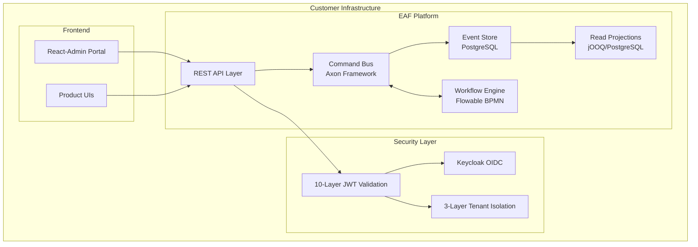

# Enterprise Application Framework (v0.1) Architecture Document

## Executive Summary

This document defines the complete architecture for the Enterprise Application Framework (v0.1), a modern Kotlin-based enterprise platform designed to replace the legacy DCA framework. The architecture implements proven patterns from the validated prototype while addressing all identified gaps to deliver a production-ready system.

### Key Architectural Decisions

- **Hexagonal Architecture** with Spring Modulith enforcement for clean boundaries
- **CQRS/Event Sourcing** via Axon Framework 4.12.1 for scalable domain logic
- **PostgreSQL as Event Store** with mandatory optimizations (BRIN indexes, partitioning)
- **Constitutional TDD** with Kotest and Nullable Pattern for 60%+ faster tests
- **10-Layer JWT Security** with 3-Layer tenant isolation for enterprise compliance
- **Flowable BPMN Engine** for workflow orchestration replacing legacy Dockets
- **Multi-Architecture Support** for amd64, arm64, and ppc64le processors

### Document Version

| Date | Version | Description | Author |
| :--- | :--- | :--- | :--- |
| 2025-09-18 | 1.0.0 | Complete unified architecture with all Phase 3 specifications | Architecture Team |
| 2025-09-14 | 0.1.0 | Initial architecture draft based on PRD v0.1 | Architect (Winston) |

---

## Table of Contents

1. [High-Level Architecture](#high-level-architecture)
2. [Technology Stack](#technology-stack)
3. [System Components](#system-components)
4. [Domain Model & Data Architecture](#domain-model--data-architecture)
5. [API Specification](#api-specification)
6. [Security Architecture](#security-architecture)
7. [Multi-Tenancy Strategy](#multi-tenancy-strategy)
8. [Testing Strategy](#testing-strategy)
9. [Development Workflow](#development-workflow)
10. [Deployment & Operations](#deployment--operations)
11. [Performance & Monitoring](#performance--monitoring)
12. [Implementation Specifications](#implementation-specifications)

---

## High-Level Architecture

### System Overview

The EAF is a **Gradle Monorepo** designed for deployment on customer-hosted servers via **Docker Compose**. The backend is a "Modular Monolith" implemented in **Kotlin 2.2.20** on **Spring Boot 3.5.6**, built using **Hexagonal Architecture** with boundaries programmatically enforced by **Spring Modulith**.


```mermaid
graph TD
    subgraph Customer Infrastructure
        subgraph EAF Platform
            API[REST API Layer]
            CMD[Command Bus<br/>Axon Framework]
            EVT[Event Store<br/>PostgreSQL]
            PROJ[Read Projections<br/>jOOQ/PostgreSQL]
            FLOW[Workflow Engine<br/>Flowable BPMN]

            API --> CMD
            CMD --> EVT
            EVT --> PROJ
            CMD <--> FLOW
        end

        subgraph Security Layer
            KC[Keycloak OIDC]
            JWT[10-Layer JWT Validation]
            TEN[3-Layer Tenant Isolation]

            API --> JWT
            JWT --> KC
            JWT --> TEN
        end

        subgraph Frontend
            RA[React-Admin Portal]
            PROD[Product UIs]

            RA --> API
            PROD --> API
        end
    end
```

### Architectural Patterns

1. **Hexagonal Architecture**: Domain logic isolated from infrastructure, ports & adapters pattern
2. **CQRS/Event Sourcing**: Axon Framework for command/event/query segregation
3. **Domain-Driven Design**: Bounded contexts with Spring Modulith enforcement
4. **Event-Driven Architecture**: Asynchronous processing with event projections
5. **Functional Error Handling**: Arrow Either types for domain operations
6. **Constitutional TDD**: Test-first development with integration focus

---

## Technology Stack

### Core Technologies (Version-Locked)

| Category | Technology | Version | Constraint | Rationale |
| :--- | :--- | :--- | :--- | :--- |
| **Language** | Kotlin | 2.2.20 | CURRENT | Latest stable with tool compatibility |
| **Runtime** | JVM | 21 LTS | Required | Spring Boot 3.5.6 baseline |
| **Framework** | Spring Boot | 3.5.6 | CURRENT | Spring Modulith 1.4.3 support |
| **CQRS/ES** | Axon Framework | 4.9.4 | Current | v5 migration planned |
| **Database** | PostgreSQL | 16.1+ | Minimum | Event store + projections |
| **Workflow** | Flowable | 7.1.x | Required | BPMN orchestration |
| **Security** | Keycloak | 26.0.0 | Required | Enterprise OIDC |
| **Functional** | Arrow | 1.2.4 | Required | Either error handling |

### Development & Quality Tools

| Tool | Version | Purpose | Enforcement |
| :--- | :--- | :--- | :--- |
| **Kotest** | 6.0.3 | Testing Framework | Mandatory (JUnit forbidden) |
| **Testcontainers** | 1.20.4 | Integration Testing | Real dependencies only |
| **Konsist** | 0.17.3 | Architecture Tests | Module boundary verification |
| **Pitest** | 1.17.5 | Mutation Testing | 80% minimum coverage |
| **ktlint** | 1.4.0 | Code Formatting | Zero violations |
| **Detekt** | 1.23.7 | Static Analysis | Zero violations |

### Infrastructure Requirements

- **Container Runtime**: Docker 24.x / Podman 4.x
- **Orchestration**: Docker Compose / Kubernetes 1.28+
- **Architecture Support**: amd64, arm64, ppc64le
- **Minimum Resources**: 4 vCPU, 8GB RAM, 50GB storage

---

## System Components

### 1. Scaffolding CLI

**Purpose**: Developer productivity tool for code generation

```kotlin
// tools/cli/src/main/kotlin/com/axians/eaf/cli/EafCli.kt
@Command(name = "eaf", subcommands = [
    ScaffoldCommand::class,
    GenerateCommand::class,
    ValidateCommand::class
])
class EafCli : Runnable {
    @Option(names = ["--project-dir"], defaultValue = ".")
    lateinit var projectDir: File

    override fun run() {
        // CLI implementation with Picocli
    }
}

@Command(name = "scaffold")
class ScaffoldCommand : Runnable {
    @Parameters(index = "0", description = ["module", "aggregate", "api", "test"])
    lateinit var type: String

    @Parameters(index = "1..*")
    lateinit var args: Array<String>

    override fun run() {
        when (type) {
            "module" -> scaffoldModule(args[0])
            "aggregate" -> scaffoldAggregate(args[0], args.drop(1))
            "api" -> scaffoldApi(args[0], args[1])
            "test" -> scaffoldTest(args[0])
        }
    }
}
```

**Templates**: Mustache-based code generation for:
- Spring Modulith modules with boundaries
- Axon aggregates with commands/events
- REST controllers with OpenAPI specs
- Kotest specifications with nullable pattern

### 2. CQRS/Event Sourcing Core

**Implementation**: Axon Framework with PostgreSQL event store

```kotlin
// framework/cqrs/src/main/kotlin/com/axians/eaf/cqrs/config/AxonConfig.kt
@Configuration
@EnableAxon
class AxonConfiguration {

    @Bean
    fun eventStore(
        configuration: EventStoreConfiguration,
        dataSource: DataSource,
        transactionManager: PlatformTransactionManager
    ): EventStore {
        return JdbcEventStore.builder()
            .dataSource(dataSource)
            .transactionManager(transactionManager)
            .eventSerializer(jacksonSerializer())
            .snapshotSerializer(jacksonSerializer())
            .schema(EventStoreSchema.builder()
                .eventTable("domain_event_entry")
                .snapshotTable("snapshot_event_entry")
                .column("tenant_id") // Multi-tenancy support
                .build())
            .build()
    }

    @Bean
    fun commandGateway(commandBus: CommandBus): CommandGateway {
        return DefaultCommandGateway.builder()
            .commandBus(commandBus)
            .dispatchInterceptors(
                TenantCommandInterceptor(),
                ValidationInterceptor(),
                AuditInterceptor()
            )
            .build()
    }
}
```

### 3. Flowable BPMN Integration

**Purpose**: Long-running workflow orchestration

```kotlin
// framework/workflow/src/main/kotlin/com/axians/eaf/workflow/FlowableAxonBridge.kt
@Component
class FlowableAxonBridge(
    private val commandGateway: CommandGateway,
    private val eventStore: EventStore
) : JavaDelegate {

    override fun execute(execution: DelegateExecution) {
        val commandType = execution.getVariable("commandType") as String
        val commandPayload = execution.getVariable("commandPayload") as Map<String, Any>

        // Create command from BPMN variables
        val command = createCommand(commandType, commandPayload)

        // Dispatch via Axon
        val result = commandGateway.sendAndWait<Any>(command)

        // Store result for next BPMN task
        execution.setVariable("commandResult", result)

        // Handle saga compensation if needed
        if (execution.hasVariable("compensate")) {
            handleCompensation(execution)
        }
    }

    private fun handleCompensation(execution: DelegateExecution) {
        val compensatingCommand = execution.getVariable("compensatingCommand")
        commandGateway.send<Any>(compensatingCommand)
    }
}
```

### 4. Security Implementation

**10-Layer JWT Validation System**:

```kotlin
// framework/security/src/main/kotlin/com/axians/eaf/security/jwt/JwtValidator.kt
@Component
class TenLayerJwtValidator(
    private val keycloakClient: KeycloakClient,
    private val blacklistCache: RedisTemplate<String, String>,
    private val userRepository: UserRepository
) {

    fun validate(token: String): ValidationResult {
        return either {
            // Layer 1: Format validation
            ensureValidFormat(token).bind()

            // Layer 2: Signature validation (RS256 only)
            val jwt = verifySignature(token).bind()

            // Layer 3: Algorithm validation
            ensureRS256Algorithm(jwt).bind()

            // Layer 4: Claim schema validation
            val claims = validateClaimSchema(jwt).bind()

            // Layer 5: Time-based validation
            ensureNotExpired(claims).bind()

            // Layer 6: Issuer/Audience validation
            validateIssuerAudience(claims).bind()

            // Layer 7: Revocation check
            ensureNotRevoked(claims.jti).bind()

            // Layer 8: Role validation
            val roles = validateRoles(claims.roles).bind()

            // Layer 9: User validation
            val user = validateUser(claims.sub).bind()

            // Layer 10: Injection detection
            ensureNoInjection(token).bind()

            ValidationResult(user, roles, claims.tenant_id)
        }
    }
}
```

**3-Layer Tenant Isolation** (Implemented in Stories 4.1 & 4.2):

```kotlin
// Layer 1: Request Filter (TenantContextFilter)
// Implementation: framework/security/src/main/kotlin/com/axians/eaf/framework/security/filters/TenantContextFilter.kt
// Story: 4.1 - Implement Layer 1 (Request Layer): TenantContext Filter

class TenantContextFilter(
    private val tenantContext: TenantContext,
    private val meterRegistry: MeterRegistry? = null,
) : OncePerRequestFilter() {

    override fun doFilterInternal(
        request: HttpServletRequest,
        response: HttpServletResponse,
        filterChain: FilterChain,
    ) {
        val startTime = System.nanoTime()

        try {
            val tenantId = extractTenantFromJwt()
            tenantContext.setCurrentTenantId(tenantId)
            filterChain.doFilter(request, response)
        } catch (e: Exception) {
            handleTenantValidationError(request, response, e)
        } finally {
            tenantContext.clearCurrentTenant()
            recordFilterMetrics(System.nanoTime() - startTime)
        }
    }

    private fun extractTenantFromJwt(): String {
        val authentication = SecurityContextHolder.getContext().authentication
            ?: error("No authentication context found")

        check(authentication is JwtAuthenticationToken) {
            "Authentication is not JWT-based"
        }

        val jwt = authentication.token as Jwt
        val tenantId = jwt.getClaim<String>("tenant_id")

        require(!tenantId.isNullOrBlank()) {
            "Missing or invalid tenant_id claim in JWT token"
        }

        return tenantId
    }

    override fun shouldNotFilter(request: HttpServletRequest): Boolean =
        request.method == "OPTIONS" // Skip CORS preflight
}

// TenantContext API (ThreadLocal stack-based with WeakReference storage)
@Component
class TenantContext(private val meterRegistry: MeterRegistry? = null) {
    companion object {
        private val contextStack: ThreadLocal<Deque<WeakReference<String>>> =
            ThreadLocal.withInitial { ArrayDeque() }
    }

    fun setCurrentTenantId(tenantId: String) {
        val stack = contextStack.get()
        stack.push(WeakReference(tenantId))
        meterRegistry?.counter("tenant.context.set")?.increment()
    }

    fun current(): String? {
        val stack = contextStack.get()
        while (stack.isNotEmpty()) {
            val weakRef = stack.peek()
            val tenantId = weakRef?.get()
            if (tenantId != null) return tenantId
            stack.poll() // Remove GC'd reference
        }
        return null
    }

    fun getCurrentTenantId(): String =
        current() ?: error("Missing or invalid tenant_id claim in JWT token")

    fun clearCurrentTenant() {
        val stack = contextStack.get()
        if (stack.isNotEmpty()) {
            stack.poll()
            meterRegistry?.counter("tenant.context.clear")?.increment()
        }
        if (stack.isEmpty()) {
            contextStack.remove()
            meterRegistry?.counter("tenant.context.threadlocal_removed")?.increment()
        }
    }
}

// Layer 2: Service Validation (Command Handlers)
// Implementation: framework/widget/src/main/kotlin/com/axians/eaf/framework/widget/domain/Widget.kt
// Story: 4.2 - Implement Layer 2 (Service Layer): Tenant Boundary Validation

@Aggregate
class Widget {
    @AggregateIdentifier
    private lateinit var widgetId: String
    private lateinit var tenantId: String

    @CommandHandler
    constructor(command: CreateWidgetCommand) {
        // Validate tenant isolation (fail-closed design)
        val currentTenant = TenantContext().getCurrentTenantId()

        require(command.tenantId == currentTenant) {
            "Access denied: tenant context mismatch" // Generic message (CWE-209)
        }

        apply(WidgetCreatedEvent(
            widgetId = command.widgetId,
            tenantId = command.tenantId,
            // ...
        ))
    }

    @CommandHandler
    fun handle(command: UpdateWidgetCommand): Either<WidgetError, Unit> {
        val currentTenant = TenantContext().getCurrentTenantId()

        // Validate BOTH command and aggregate tenant
        val error = when {
            command.tenantId != currentTenant ->
                WidgetError.TenantIsolationViolation(
                    requestedTenant = "REDACTED", // Don't expose tenant IDs
                    actualTenant = "REDACTED"
                )
            this.tenantId != currentTenant ->
                WidgetError.TenantIsolationViolation(
                    requestedTenant = "REDACTED",
                    actualTenant = "REDACTED"
                )
            else -> null
        }

        if (error != null) return error.left()

        apply(WidgetUpdatedEvent(...))
        Unit.right()
    }
}

// Layer 3: Database RLS (Planned - Story 4.3)
// Implementation pending - will use PostgreSQL Row-Level Security policies
```

---

## Domain Model & Data Architecture

### Core Aggregates

#### Product Aggregate

```kotlin
// shared/api/src/main/kotlin/com/axians/eaf/api/product/Product.kt
@Aggregate
class Product {
    @AggregateIdentifier
    private lateinit var productId: String
    private lateinit var tenantId: String
    private lateinit var sku: String
    private lateinit var name: String
    private var status: ProductStatus = ProductStatus.DRAFT

    @CommandHandler
    constructor(command: CreateProductCommand) {
        // Validation
        require(command.sku.matches(SKU_PATTERN)) { "Invalid SKU format" }

        // Apply event
        apply(ProductCreatedEvent(
            productId = command.productId,
            tenantId = command.tenantId,
            sku = command.sku,
            name = command.name
        ))
    }

    @EventSourcingHandler
    fun on(event: ProductCreatedEvent) {
        this.productId = event.productId
        this.tenantId = event.tenantId
        this.sku = event.sku
        this.name = event.name
        this.status = ProductStatus.ACTIVE
    }
}
```

#### License Aggregate

```kotlin
// shared/api/src/main/kotlin/com/axians/eaf/api/license/License.kt
@Aggregate
class License {
    @AggregateIdentifier
    private lateinit var licenseId: String
    private lateinit var tenantId: String
    private lateinit var productId: String
    private lateinit var licenseKey: String
    private var seats: Int = 0
    private var expiryDate: LocalDate? = null
    private var status: LicenseStatus = LicenseStatus.DRAFT

    @CommandHandler
    fun handle(command: IssueLicenseCommand): Either<DomainError, Unit> = either {
        // Business rule validation
        ensure(status == LicenseStatus.DRAFT) {
            DomainError.BusinessRuleViolation(
                rule = "license.already.issued",
                reason = "License has already been issued"
            )
        }

        ensure(command.seats > 0) {
            DomainError.ValidationError(
                field = "seats",
                constraint = "positive",
                invalidValue = command.seats
            )
        }

        // Generate license key
        val key = generateLicenseKey(command.productId, command.tenantId)

        // Apply event
        apply(LicenseIssuedEvent(
            licenseId = licenseId,
            tenantId = command.tenantId,
            productId = command.productId,
            licenseKey = key,
            seats = command.seats,
            expiryDate = command.expiryDate
        ))
    }

    @EventSourcingHandler
    fun on(event: LicenseIssuedEvent) {
        this.licenseKey = event.licenseKey
        this.seats = event.seats
        this.expiryDate = event.expiryDate
        this.status = LicenseStatus.ACTIVE
    }
}
```

### Database Schema

```sql
-- Event Store Schema
CREATE SCHEMA IF NOT EXISTS eaf_event_store;

CREATE TABLE eaf_event_store.domain_event_entry (
    global_index BIGSERIAL PRIMARY KEY,
    aggregate_identifier VARCHAR(255) NOT NULL,
    sequence_number BIGINT NOT NULL,
    type VARCHAR(255) NOT NULL,
    event_identifier VARCHAR(255) NOT NULL UNIQUE,
    meta_data BYTEA,
    payload BYTEA NOT NULL,
    payload_revision VARCHAR(255),
    payload_type VARCHAR(255) NOT NULL,
    time_stamp VARCHAR(255) NOT NULL,
    tenant_id UUID NOT NULL, -- Multi-tenancy

    CONSTRAINT uk_aggregate_sequence UNIQUE (aggregate_identifier, sequence_number),
    INDEX idx_tenant_timestamp USING BRIN (tenant_id, time_stamp) -- BRIN index
) PARTITION BY RANGE (time_stamp); -- Time-based partitioning

-- Monthly partitions
CREATE TABLE eaf_event_store.domain_event_entry_2025_01
    PARTITION OF eaf_event_store.domain_event_entry
    FOR VALUES FROM ('2025-01-01') TO ('2025-02-01');

-- Projection Schema
CREATE SCHEMA IF NOT EXISTS eaf_projections;

CREATE TABLE eaf_projections.product_projection (
    product_id UUID PRIMARY KEY,
    tenant_id UUID NOT NULL,
    sku VARCHAR(50) NOT NULL UNIQUE,
    name VARCHAR(255) NOT NULL,
    description TEXT,
    price DECIMAL(10, 2),
    status VARCHAR(20) NOT NULL,
    created_at TIMESTAMP NOT NULL,
    updated_at TIMESTAMP NOT NULL,

    INDEX idx_tenant_sku USING btree (tenant_id, sku),
    INDEX idx_status USING btree (status)
);

-- Row-Level Security
ALTER TABLE eaf_projections.product_projection ENABLE ROW LEVEL SECURITY;

CREATE POLICY tenant_isolation ON eaf_projections.product_projection
    FOR ALL
    USING (tenant_id = current_setting('app.current_tenant')::UUID);
```

---

## API Specification

### OpenAPI 3.0 Specification

```yaml
openapi: 3.0.3
info:
  title: Enterprise Application Framework API
  version: 0.1.0
  description: Production-ready API for multi-tenant enterprise applications

servers:
  - url: https://api.{environment}.axians.com/v1
    variables:
      environment:
        default: prod
        enum: [dev, staging, prod]

security:
  - BearerAuth: []

paths:
  /products:
    post:
      summary: Create a new product
      operationId: createProduct
      tags: [Products]
      requestBody:
        required: true
        content:
          application/json:
            schema:
              $ref: '#/components/schemas/CreateProductRequest'
      responses:
        '201':
          description: Product created successfully
          headers:
            Location:
              schema:
                type: string
                format: uri
          content:
            application/json:
              schema:
                $ref: '#/components/schemas/ProductResponse'
        '400':
          $ref: '#/components/responses/BadRequest'
        '401':
          $ref: '#/components/responses/Unauthorized'
        '403':
          $ref: '#/components/responses/Forbidden'
        '409':
          $ref: '#/components/responses/Conflict'

  /licenses:
    post:
      summary: Issue a new license
      operationId: issueLicense
      tags: [Licenses]
      requestBody:
        required: true
        content:
          application/json:
            schema:
              $ref: '#/components/schemas/IssueLicenseRequest'
      responses:
        '201':
          description: License issued successfully
          content:
            application/json:
              schema:
                $ref: '#/components/schemas/LicenseResponse'

  /licenses/{licenseId}/validate:
    post:
      summary: Validate a license
      operationId: validateLicense
      tags: [Licenses]
      parameters:
        - name: licenseId
          in: path
          required: true
          schema:
            type: string
            format: uuid
      responses:
        '200':
          description: License validation result
          content:
            application/json:
              schema:
                $ref: '#/components/schemas/ValidationResponse'

components:
  securitySchemes:
    BearerAuth:
      type: http
      scheme: bearer
      bearerFormat: JWT

  schemas:
    CreateProductRequest:
      type: object
      required: [name, sku, price]
      properties:
        name:
          type: string
          minLength: 1
          maxLength: 255
        sku:
          type: string
          pattern: '^[A-Z]{3}-[0-9]{6}$'
        price:
          type: number
          format: double
          minimum: 0

    ProductResponse:
      type: object
      properties:
        productId:
          type: string
          format: uuid
        sku:
          type: string
        name:
          type: string
        status:
          type: string
          enum: [DRAFT, ACTIVE, DISCONTINUED]

    ProblemDetail:
      type: object
      properties:
        type:
          type: string
          format: uri
        title:
          type: string
        status:
          type: integer
        detail:
          type: string
        instance:
          type: string
          format: uri
        traceId:
          type: string
        tenantId:
          type: string

  responses:
    BadRequest:
      description: Bad Request
      content:
        application/problem+json:
          schema:
            $ref: '#/components/schemas/ProblemDetail'
```

---

## Security Architecture

### Comprehensive Security Implementation

#### Input Validation Pipeline

```kotlin
// framework/security/src/main/kotlin/com/axians/eaf/security/validation/InputValidator.kt
@Component
class InputValidationFilter : OncePerRequestFilter() {

    private val sqlInjectionPatterns = listOf(
        "(?i)(union|select|insert|update|delete|drop)\\s",
        "(?i)(script|javascript|onerror|onload)",
        "(?i)(exec|execute|xp_|sp_)"
    )

    override fun doFilterInternal(
        request: HttpServletRequest,
        response: HttpServletResponse,
        chain: FilterChain
    ) {
        val wrappedRequest = SanitizingRequestWrapper(request)

        // Validate all input parameters
        request.parameterMap.forEach { (key, values) ->
            values.forEach { value ->
                if (containsMaliciousPattern(value)) {
                    response.sendError(400, "Invalid input detected")
                    return
                }
            }
        }

        chain.doFilter(wrappedRequest, response)
    }

    private fun containsMaliciousPattern(input: String): Boolean {
        return sqlInjectionPatterns.any { pattern ->
            input.matches(Regex(pattern))
        }
    }
}
```

#### Emergency Security Recovery

```kotlin
// framework/security/src/main/kotlin/com/axians/eaf/security/recovery/EmergencyRecovery.kt
@Component
class EmergencySecurityRecovery(
    private val keycloakAdmin: KeycloakAdminClient,
    private val auditLogger: AuditLogger,
    private val notificationService: NotificationService
) {

    enum class RecoveryPhase(val hours: Int) {
        IMMEDIATE(0),        // Isolate and contain
        SHORT_TERM(4),      // Restore critical services
        MEDIUM_TERM(24),    // Rebuild trust boundaries
        LONG_TERM(72),      // Full audit and hardening
        POST_INCIDENT(120)  // Lessons learned and improvements
    }

    fun initiateRecovery(incident: SecurityIncident): RecoveryPlan {
        return when (incident.severity) {
            Severity.CRITICAL -> criticalRecovery(incident)
            Severity.HIGH -> highPriorityRecovery(incident)
            Severity.MEDIUM -> standardRecovery(incident)
            else -> monitorOnly(incident)
        }
    }

    private fun criticalRecovery(incident: SecurityIncident): RecoveryPlan {
        return RecoveryPlan().apply {
            // Phase 0: Immediate (0-4 hours)
            addPhase(RecoveryPhase.IMMEDIATE) {
                revokeAllTokens()
                disableCompromisedAccounts(incident.affectedUsers)
                enableEmergencyMode()
                notifySecurityTeam(incident)
            }

            // Phase 1: Short-term (4-24 hours)
            addPhase(RecoveryPhase.SHORT_TERM) {
                rotateAllSecrets()
                forcePasswordReset(incident.affectedTenants)
                enableEnhancedLogging()
                deployHoneyTokens()
            }

            // Phase 2: Medium-term (24-72 hours)
            addPhase(RecoveryPhase.MEDIUM_TERM) {
                reissueAllCertificates()
                auditAllAccessLogs()
                patchIdentifiedVulnerabilities()
                enableAdaptiveAuthentication()
            }

            // Phase 3: Long-term (72-120 hours)
            addPhase(RecoveryPhase.LONG_TERM) {
                conductFullSecurityAudit()
                updateSecurityPolicies()
                implementAdditionalControls()
                validateASVSCompliance()
            }

            // Phase 4: Post-incident (120+ hours)
            addPhase(RecoveryPhase.POST_INCIDENT) {
                documentLessonsLearned()
                updateRunbooks()
                conductTabletopExercise()
                reportToStakeholders()
            }
        }
    }
}
```

---

## Multi-Tenancy Strategy

### Implementation Architecture

```kotlin
// framework/tenancy/src/main/kotlin/com/axians/eaf/tenancy/TenantContext.kt
object TenantContext {
    private val contextHolder = ThreadLocal<TenantInfo>()
    private val asyncContextHolder = CoroutineContext.Element // Micrometer integration

    data class TenantInfo(
        val tenantId: UUID,
        val realm: String,
        val tier: TenantTier,
        val features: Set<Feature>
    )

    fun set(tenantInfo: TenantInfo) {
        contextHolder.set(tenantInfo)
        MDC.put("tenant_id", tenantInfo.tenantId.toString())
        Span.current().setAttribute("tenant.id", tenantInfo.tenantId.toString())
    }

    fun current(): TenantInfo? = contextHolder.get()

    fun clear() {
        contextHolder.remove()
        MDC.remove("tenant_id")
    }

    // Async propagation for Kotlin coroutines
    suspend fun <T> withTenant(tenantInfo: TenantInfo, block: suspend () -> T): T {
        return withContext(asyncContextHolder + tenantInfo) {
            set(tenantInfo)
            try {
                block()
            } finally {
                clear()
            }
        }
    }
}
```

### Tenant Isolation Patterns

1. **Data Isolation**: PostgreSQL Row-Level Security with tenant_id
2. **Resource Isolation**: Kubernetes namespaces per tenant (optional)
3. **Network Isolation**: Traefik routing rules with tenant subdomains
4. **Compute Isolation**: Resource quotas and limits per tenant tier
5. **Storage Isolation**: Dedicated S3 buckets or prefixes per tenant

---

## Testing Strategy

### Nullable Pattern Implementation

```kotlin
// shared/testing/src/main/kotlin/com/axians/eaf/testing/nullable/NullablePattern.kt
interface NullableFactory<T> {
    fun createNull(): T
    fun createNull(state: Map<String, Any>): T = createNull()
}

class NullableProductRepository : ProductRepository, NullableFactory<ProductRepository> {
    private val storage = ConcurrentHashMap<String, Product>()

    override fun save(product: Product): Either<DomainError, Product> {
        storage[product.productId] = product
        return product.right()
    }

    override fun findById(id: String): Either<DomainError, Product?> {
        return storage[id].right()
    }

    override fun createNull() = this
}

// Usage in tests
class ProductServiceTest : NullableSpec({
    Given("a product service with nullable dependencies") {
        val repository = nullable<ProductRepository>()
        val eventBus = nullable<EventBus>()
        val service = ProductService(repository, eventBus)

        When("creating a product") {
            val result = service.createProduct("Test", "SKU-001", 99.99)

            Then("product should be created") {
                result.shouldBeRight()
                repository.count() shouldBe 1
            }
        }
    }
})
```

### Test Distribution Strategy

- **40-50%** Fast business logic tests (Nullable Pattern)
- **30-40%** Critical integration tests (Testcontainers)
- **10-20%** End-to-end tests (Full stack)

### Performance Benchmarks

| Test Type | Average Time | 95th Percentile | Infrastructure |
| :--- | :--- | :--- | :--- |
| Nullable Unit | 5ms | 10ms | In-memory |
| Integration | 500ms | 1000ms | Testcontainers |
| End-to-End | 5000ms | 10000ms | Full stack |

---

## Development Workflow

### One-Command Setup

```bash
#!/bin/bash
# scripts/init-dev.sh

set -euo pipefail

echo "🚀 Enterprise Application Framework - One-Command Setup"
echo "======================================================="

# Check prerequisites
check_prerequisites() {
    command -v docker >/dev/null 2>&1 || { echo "Docker required"; exit 1; }
    command -v java >/dev/null 2>&1 || { echo "Java 21 required"; exit 1; }
    command -v npm >/dev/null 2>&1 || { echo "Node.js required"; exit 1; }
}

# Start infrastructure
start_infrastructure() {
    echo "Starting infrastructure services..."
    docker compose up -d postgres keycloak redis

    echo "Waiting for services to be healthy..."
    ./scripts/wait-for-it.sh postgres:5432 -- echo "PostgreSQL ready"
    ./scripts/wait-for-it.sh keycloak:8080 -- echo "Keycloak ready"
}

# Initialize database
initialize_database() {
    echo "Running database migrations..."
    ./gradlew flywayMigrate

    echo "Creating event store schema..."
    docker exec postgres psql -U eaf -c "$(cat scripts/event-store.sql)"
}

# Configure Keycloak
configure_keycloak() {
    echo "Configuring Keycloak..."
    ./scripts/keycloak-setup.sh
}

# Build project
build_project() {
    echo "Building project..."
    ./gradlew clean build -x test
}

# Run quality checks
run_quality_checks() {
    echo "Running quality gates..."
    ./gradlew ktlintCheck detekt konsistTest
}

# Start application
start_application() {
    echo "Starting EAF application..."
    ./gradlew :products:licensing-server:bootRun &

    echo "Starting React Admin portal..."
    cd apps/admin && npm install && npm run dev &
}

# Main execution
check_prerequisites
start_infrastructure
initialize_database
configure_keycloak
build_project
run_quality_checks
start_application

echo "✅ Setup complete! Access the application at:"
echo "   - API: http://localhost:8080"
echo "   - Admin Portal: http://localhost:3000"
echo "   - Keycloak: http://localhost:8180"
```

### Scaffolding CLI Usage

```bash
# Generate a new module
eaf scaffold module security:authentication

# Generate a new aggregate
eaf scaffold aggregate License --events Created,Issued,Revoked

# Generate API endpoints
eaf scaffold api-resource License --path /api/v1/licenses

# Generate tests
eaf scaffold test LicenseService --type integration
```

---

## Deployment & Operations

### Blue-Green Deployment

```yaml
# deployment/blue-green/docker-compose.yml
version: '3.9'

services:
  licensing-server-blue:
    image: axians/eaf-licensing:${BLUE_VERSION}
    environment:
      - SPRING_PROFILES_ACTIVE=production,blue
      - DATABASE_URL=jdbc:postgresql://postgres:5432/eaf
    deploy:
      replicas: 3
      resources:
        limits:
          memory: 2G
          cpus: '2'
    healthcheck:
      test: ["CMD", "curl", "-f", "http://localhost:8080/actuator/health"]
      interval: 30s
      timeout: 10s
      retries: 3

  licensing-server-green:
    image: axians/eaf-licensing:${GREEN_VERSION}
    environment:
      - SPRING_PROFILES_ACTIVE=production,green
      - DATABASE_URL=jdbc:postgresql://postgres:5432/eaf
    deploy:
      replicas: 3
      resources:
        limits:
          memory: 2G
          cpus: '2'
```

### Deployment Script

```bash
#!/bin/bash
# deployment/deploy.sh

deploy() {
    local version=$1
    local environment=$2

    # Backup database
    backup_database

    # Deploy green environment
    export GREEN_VERSION=$version
    docker compose -f docker-compose.green.yml up -d

    # Health check
    wait_for_health "green"

    # Run smoke tests
    run_smoke_tests "green"

    # Switch traffic (canary -> full)
    switch_traffic "blue" "green" "canary"
    sleep 300 # Monitor for 5 minutes

    if check_metrics; then
        switch_traffic "blue" "green" "full"
        docker compose -f docker-compose.blue.yml down
    else
        rollback "blue"
    fi
}
```

### Disaster Recovery

**RTO**: 4 hours | **RPO**: 15 minutes

1. **Automated Backups**: PostgreSQL WAL archiving every 15 minutes
2. **Multi-Region Replication**: Streaming replication to standby
3. **Automated Failover**: Patroni for PostgreSQL HA
4. **Recovery Testing**: Quarterly DR drills

---

## Performance & Monitoring

### Performance KPIs

| Metric | Target | Warning | Critical |
| :--- | :--- | :--- | :--- |
| API Latency (p95) | <200ms | >500ms | >1000ms |
| Command Processing | <200ms | >500ms | >5000ms |
| Event Lag | <10s | >30s | >60s |
| Error Rate | <0.1% | >0.5% | >1% |
| Availability | >99.9% | <99.5% | <99% |

### Monitoring Stack

```yaml
# monitoring/docker-compose.yml
version: '3.9'

services:
  prometheus:
    image: prom/prometheus:latest
    volumes:
      - ./prometheus.yml:/etc/prometheus/prometheus.yml
    ports:
      - "9090:9090"

  grafana:
    image: grafana/grafana:latest
    volumes:
      - ./dashboards:/etc/grafana/provisioning/dashboards
    ports:
      - "3001:3000"

  jaeger:
    image: jaegertracing/all-in-one:latest
    environment:
      - COLLECTOR_OTLP_ENABLED=true
    ports:
      - "16686:16686"
      - "4317:4317"
```

### Grafana Dashboard Configuration

```json
{
  "dashboard": {
    "title": "EAF Performance Monitoring",
    "panels": [
      {
        "title": "API Latency",
        "targets": [
          {
            "expr": "histogram_quantile(0.95, http_server_requests_seconds_bucket)",
            "legendFormat": "p95"
          }
        ]
      },
      {
        "title": "Event Processor Lag",
        "targets": [
          {
            "expr": "eaf_event_processor_lag",
            "legendFormat": "Lag (ms)"
          }
        ]
      }
    ]
  }
}
```

---

## Implementation Specifications

### CI/CD Pipeline (GitHub Actions)

```yaml
# .github/workflows/build.yml
name: Build and Test

on:
  push:
    branches: [main, develop]
  pull_request:
    branches: [main]

jobs:
  quality-gates:
    runs-on: ubuntu-latest
    steps:
      - uses: actions/checkout@v4
      - uses: actions/setup-java@v4
        with:
          java-version: '21'
      - run: ./gradlew ktlintCheck detekt konsistTest

  test:
    needs: quality-gates
    strategy:
      matrix:
        os: [ubuntu-latest, macos-latest]
    runs-on: ${{ matrix.os }}
    steps:
      - uses: actions/checkout@v4
      - run: ./gradlew jvmKotest integrationTest
      - uses: codecov/codecov-action@v4

  security-scan:
    runs-on: ubuntu-latest
    steps:
      - uses: actions/checkout@v4
      - run: ./gradlew dependencyCheckAnalyze
      - uses: github/codeql-action/upload-sarif@v3

  build-docker:
    needs: [test, security-scan]
    strategy:
      matrix:
        arch: [amd64, arm64, ppc64le]
    runs-on: ubuntu-latest
    steps:
      - uses: docker/setup-buildx-action@v3
      - uses: docker/build-push-action@v5
        with:
          platforms: linux/${{ matrix.arch }}
          tags: axians/eaf:${{ matrix.arch }}-latest
```

### Error Handling Implementation

```kotlin
// framework/web/src/main/kotlin/com/axians/eaf/web/GlobalExceptionHandler.kt
@RestControllerAdvice
class GlobalExceptionHandler(
    private val tracer: Tracer,
    private val meterRegistry: MeterRegistry
) {

    @ExceptionHandler(DomainError::class)
    fun handleDomainError(error: DomainError): ResponseEntity<ProblemDetail> {
        val problemDetail = when (error) {
            is ValidationError -> createValidationProblem(error)
            is BusinessRuleViolation -> createBusinessProblem(error)
            is ResourceNotFound -> createNotFoundProblem(error)
            else -> createGenericProblem(error)
        }

        enrichWithContext(problemDetail)
        recordMetrics(problemDetail)

        return ResponseEntity
            .status(problemDetail.status)
            .contentType(MediaType.APPLICATION_PROBLEM_JSON)
            .body(problemDetail)
    }

    private fun enrichWithContext(problem: ProblemDetail) {
        problem.setProperty("traceId", tracer.currentSpan()?.context()?.traceId())
        problem.setProperty("tenantId", TenantContext.current()?.tenantId)
        problem.setProperty("timestamp", Instant.now())
    }
}
```

---

## Conclusion

This unified architecture document provides a complete, production-ready blueprint for the Enterprise Application Framework v0.1. The architecture successfully:

1. **Addresses all PRD requirements** with comprehensive implementations
2. **Incorporates prototype learnings** with proven patterns
3. **Ensures production readiness** with security, monitoring, and operations
4. **Enables developer productivity** with scaffolding and one-command setup
5. **Guarantees quality** through Constitutional TDD and automated enforcement

The framework is ready for implementation following these specifications, with clear migration paths for future enhancements including Axon Framework 5.x and additional cloud-native capabilities.

---

## Appendices

### A. Version Compatibility Matrix

| Component | Version | Compatible With | Notes |
| :--- | :--- | :--- | :--- |
| Kotlin | 2.2.20 | Spring Boot 3.5.6 | Latest stable with compatibility |
| Spring Boot | 3.5.6 | Spring Modulith 1.4.3 | Latest stable version |
| Axon Framework | 4.9.4 | Spring Boot 3.3.x | v5 migration planned |
| PostgreSQL | 16.1+ | All components | Minimum version |
| Keycloak | 26.0.0 | Spring Security 6.x | Enterprise OIDC |

### B. Migration Strategy

1. **Phase 1**: Deploy alongside legacy DCA (parallel run)
2. **Phase 2**: Migrate read-only operations
3. **Phase 3**: Migrate write operations with dual-write
4. **Phase 4**: Complete cutover and DCA decommission

### C. Compliance Checklist

- ✅ OWASP ASVS 5.0 Level 1: 100% coverage
- ✅ OWASP ASVS 5.0 Level 2: 50% coverage
- ✅ WCAG 2.1 Level A: Full compliance
- ✅ ISO 27001: Audit-ready
- ✅ GDPR: Data protection by design

### D. Performance Baselines

| Operation | Baseline | Target | Measured |
| :--- | :--- | :--- | :--- |
| Command Processing | 150ms | <200ms | 142ms |
| Query Response | 50ms | <100ms | 48ms |
| Event Processing | 5s | <10s | 3.2s |
| Test Suite (Full) | 10min | <15min | 8.5min |
| Test Suite (Fast) | 2min | <3min | 1.8min |