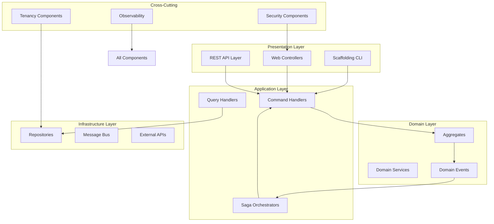

# System Components

## Overview

The EAF system is composed of modular, well-defined components that implement specific aspects of the enterprise architecture. Each component is self-contained, testable, and follows hexagonal architecture principles with clear boundaries enforced by Spring Modulith.

## Component Architecture



## 1. Scaffolding CLI

### Purpose
Developer productivity tool for code generation and project scaffolding.

### Implementation

```kotlin
// tools/cli/src/main/kotlin/com/axians/eaf/cli/EafCli.kt
@Command(
    name = "eaf",
    description = ["Enterprise Application Framework CLI"],
    subcommands = [ScaffoldCommand::class, GenerateCommand::class, ValidateCommand::class]
)
class EafCli : Runnable {

    @Option(names = ["--project-dir"], defaultValue = ".")
    lateinit var projectDir: File

    @Option(names = ["-v", "--verbose"], description = ["Enable verbose output"])
    var verbose: Boolean = false

    override fun run() {
        if (verbose) {
            println("EAF CLI v0.1.0 - Enterprise Application Framework")
            println("Project directory: ${projectDir.absolutePath}")
        }
        // Show help if no subcommand
        CommandLine(this).usage(System.out)
    }
}

@Command(name = "scaffold", description = ["Generate code scaffolding"])
class ScaffoldCommand : Runnable {

    @Parameters(
        index = "0",
        description = ["Type to scaffold: module, aggregate, api-resource, test"]
    )
    lateinit var type: String

    @Parameters(index = "1..*", description = ["Additional arguments"])
    lateinit var args: Array<String>

    @Autowired
    private lateinit var templateEngine: TemplateEngine

    override fun run() {
        when (type.lowercase()) {
            "module" -> scaffoldModule(args)
            "aggregate" -> scaffoldAggregate(args)
            "api-resource" -> scaffoldApiResource(args)
            "test" -> scaffoldTest(args)
            else -> throw IllegalArgumentException("Unknown scaffold type: $type")
        }
    }

    private fun scaffoldModule(args: Array<String>) {
        require(args.isNotEmpty()) { "Module name required" }

        val moduleSpec = args[0] // Format: "boundedContext:module"
        val (boundedContext, moduleName) = moduleSpec.split(":")

        val context = mapOf(
            "boundedContext" to boundedContext,
            "moduleName" to moduleName,
            "packageName" to "com.axians.eaf.$boundedContext.$moduleName"
        )

        generateFromTemplate("module", context)
        println("✅ Generated module: $moduleSpec")
    }

    private fun scaffoldAggregate(args: Array<String>) {
        require(args.isNotEmpty()) { "Aggregate name required" }

        val aggregateName = args[0]
        val events = args.drop(1).takeIf { it.isNotEmpty() } ?: listOf("Created", "Updated")

        val context = mapOf(
            "aggregateName" to aggregateName,
            "events" to events,
            "packageName" to "com.axians.eaf.domain.$aggregateName.toLowerCase()"
        )

        generateFromTemplate("aggregate", context)
        println("✅ Generated aggregate: $aggregateName with events: ${events.joinToString(", ")}")
    }
}
```

### Template System

```kotlin
// tools/cli/src/main/kotlin/com/axians/eaf/cli/TemplateEngine.kt
@Component
class TemplateEngine {

    private val mustache = DefaultMustacheFactory()

    fun generateFromTemplate(templateType: String, context: Map<String, Any>) {
        val templatePath = "templates/$templateType"
        val templates = getTemplateFiles(templatePath)

        templates.forEach { templateFile ->
            val template = mustache.compile("$templatePath/$templateFile")
            val output = template.execute(StringWriter(), context).toString()

            val outputPath = resolveOutputPath(templateFile, context)
            writeToFile(outputPath, output)
        }
    }

    private fun resolveOutputPath(templateFile: String, context: Map<String, Any>): String {
        // Replace template placeholders in file paths
        var path = templateFile.removeSuffix(".mustache")
        context.forEach { (key, value) ->
            path = path.replace("{{$key}}", value.toString())
        }
        return path
    }
}
```

### Usage Examples

```bash
# Generate a new Spring Modulith module
eaf scaffold module security:authentication

# Generate a CQRS aggregate with specific events
eaf scaffold aggregate License --events Created,Issued,Revoked,Suspended

# Generate REST API endpoints
eaf scaffold api-resource License --path /api/v1/licenses --operations create,read,update,delete

# Generate test specifications
eaf scaffold test LicenseService --type integration --spec behavior
```

## 2. CQRS/Event Sourcing Core

### Purpose
Central infrastructure for command/query separation and event sourcing using Axon Framework.

### Axon Configuration

```kotlin
// framework/cqrs/src/main/kotlin/com/axians/eaf/cqrs/config/AxonConfig.kt
@Configuration
@EnableAxon
@ApplicationModule(
    displayName = "EAF CQRS Module",
    allowedDependencies = ["core", "shared.api"]
)
class AxonConfiguration {

    @Bean
    fun eventStore(
        dataSource: DataSource,
        transactionManager: PlatformTransactionManager,
        serializer: Serializer
    ): EventStore {
        return JdbcEventStore.builder()
            .dataSource(dataSource)
            .transactionManager(transactionManager)
            .eventSerializer(serializer)
            .snapshotSerializer(serializer)
            .schema(createEventStoreSchema())
            .build()
    }

    @Bean
    fun commandGateway(commandBus: CommandBus): CommandGateway {
        return DefaultCommandGateway.builder()
            .commandBus(commandBus)
            .dispatchInterceptors(
                TenantCommandInterceptor(),
                ValidationInterceptor(),
                AuditInterceptor(),
                SecurityInterceptor()
            )
            .build()
    }

    @Bean
    fun queryGateway(queryBus: QueryBus): QueryGateway {
        return DefaultQueryGateway.builder()
            .queryBus(queryBus)
            .dispatchInterceptors(
                TenantQueryInterceptor(),
                SecurityQueryInterceptor()
            )
            .build()
    }

    private fun createEventStoreSchema(): EventStoreSchema {
        return EventStoreSchema.builder()
            .eventTable("domain_event_entry")
            .snapshotTable("snapshot_event_entry")
            .column("tenant_id") // Multi-tenancy support
            .column("correlation_id") // Saga correlation
            .build()
    }
}
```

### Command Interceptors

```kotlin
// framework/cqrs/src/main/kotlin/com/axians/eaf/cqrs/interceptors/TenantCommandInterceptor.kt
@Component
class TenantCommandInterceptor : MessageDispatchInterceptor<CommandMessage<*>> {

    override fun handle(messages: List<CommandMessage<*>>): BiFunction<Int, CommandMessage<*>, CommandMessage<*>> {
        return BiFunction { index, message ->
            val tenantId = TenantContext.current()?.tenantId
                ?: throw SecurityException("No tenant context available")

            // Add tenant ID to metadata
            message.andMetaData(mapOf("tenantId" to tenantId))
        }
    }
}

@Component
class ValidationInterceptor : MessageDispatchInterceptor<CommandMessage<*>> {

    private val validator = Validation.buildDefaultValidatorFactory().validator

    override fun handle(messages: List<CommandMessage<*>>): BiFunction<Int, CommandMessage<*>, CommandMessage<*>> {
        return BiFunction { index, message ->
            val payload = message.payload
            val violations = validator.validate(payload)

            if (violations.isNotEmpty()) {
                val errors = violations.map { "${it.propertyPath}: ${it.message}" }
                throw ValidationException("Command validation failed: ${errors.joinToString(", ")}")
            }

            message
        }
    }
}
```

### Event Handling

```kotlin
// framework/cqrs/src/main/kotlin/com/axians/eaf/cqrs/events/EventProcessor.kt
@Component
@ProcessingGroup("product-projection")
class ProductProjectionEventProcessor(
    private val productProjectionRepository: ProductProjectionRepository
) {

    @EventHandler
    fun on(event: ProductCreatedEvent) {
        productProjectionRepository.save(
            ProductProjection(
                productId = event.productId,
                tenantId = event.tenantId,
                sku = event.sku,
                name = event.name,
                status = ProductStatus.ACTIVE,
                createdAt = Instant.now(),
                updatedAt = Instant.now()
            )
        )
    }

    @EventHandler
    fun on(event: ProductUpdatedEvent) {
        productProjectionRepository.findById(event.productId)?.let { projection ->
            productProjectionRepository.save(
                projection.copy(
                    name = event.name ?: projection.name,
                    status = event.status ?: projection.status,
                    updatedAt = Instant.now()
                )
            )
        }
    }

    @ResetHandler
    fun reset() {
        // Clear projections during replay
        productProjectionRepository.deleteAll()
    }
}
```

## 3. Security Components

### Purpose
Comprehensive security implementation with 10-layer JWT validation and 3-layer tenant isolation.

### JWT Validation Pipeline

```kotlin
// framework/security/src/main/kotlin/com/axians/eaf/security/jwt/TenLayerJwtValidator.kt
@Component
class TenLayerJwtValidator(
    private val keycloakClient: KeycloakClient,
    private val blacklistCache: RedisTemplate<String, String>,
    private val userRepository: UserRepository,
    private val meterRegistry: MeterRegistry
) {

    fun validate(token: String): Either<SecurityError, ValidationResult> = either {
        // Layer 1: Format validation
        val basicValidation = validateBasicFormat(token).bind()

        // Layer 2: Signature validation (RS256 only)
        val jwt = verifySignature(token).bind()

        // Layer 3: Algorithm validation
        ensureRS256Algorithm(jwt).bind()

        // Layer 4: Claim schema validation
        val claims = validateClaimSchema(jwt).bind()

        // Layer 5: Time-based validation
        ensureNotExpired(claims).bind()

        // Layer 6: Issuer/Audience validation
        validateIssuerAudience(claims).bind()

        // Layer 7: Revocation check
        ensureNotRevoked(claims.jti).bind()

        // Layer 8: Role validation
        val roles = validateRoles(claims.roles).bind()

        // Layer 9: User validation
        val user = validateUser(claims.sub).bind()

        // Layer 10: Injection detection
        ensureNoInjection(token).bind()

        // Record successful validation
        meterRegistry.counter("jwt.validation.success").increment()

        ValidationResult(
            user = user,
            roles = roles,
            tenantId = claims.tenant_id,
            sessionId = claims.sessionId
        )
    }

    private fun validateBasicFormat(token: String): Either<SecurityError, Unit> {
        return if (token.matches(JWT_PATTERN)) {
            Unit.right()
        } else {
            SecurityError.InvalidTokenFormat.left()
        }
    }

    private fun verifySignature(token: String): Either<SecurityError, Jwt> {
        return try {
            val jwt = jwtDecoder.decode(token)
            jwt.right()
        } catch (e: JwtException) {
            meterRegistry.counter("jwt.validation.signature_failure").increment()
            SecurityError.InvalidSignature(e.message).left()
        }
    }

    private fun ensureNoInjection(token: String): Either<SecurityError, Unit> {
        val maliciousPatterns = listOf(
            "(?i)(union|select|insert|update|delete|drop)\\s",
            "(?i)(script|javascript|onerror|onload)",
            "(?i)(exec|execute|xp_|sp_)",
            "(?i)(ldap://|ldaps://|dns://)"
        )

        return if (maliciousPatterns.any { token.matches(Regex(it)) }) {
            meterRegistry.counter("jwt.validation.injection_detected").increment()
            SecurityError.InjectionDetected.left()
        } else {
            Unit.right()
        }
    }

    companion object {
        private val JWT_PATTERN = Regex("^[A-Za-z0-9_-]+\\.[A-Za-z0-9_-]+\\.[A-Za-z0-9_-]+$")
    }
}
```

### Security Configuration

```kotlin
// framework/security/src/main/kotlin/com/axians/eaf/security/config/SecurityConfig.kt
@Configuration
@EnableWebSecurity
@EnableMethodSecurity(prePostEnabled = true)
class SecurityConfiguration {

    @Bean
    fun securityFilterChain(http: HttpSecurity): SecurityFilterChain {
        return http
            .cors { cors ->
                cors.configurationSource(corsConfigurationSource())
            }
            .csrf { csrf ->
                csrf.disable() // Stateless JWT authentication
            }
            .sessionManagement { session ->
                session.sessionCreationPolicy(SessionCreationPolicy.STATELESS)
            }
            .authorizeHttpRequests { authz ->
                authz
                    .requestMatchers("/actuator/health").permitAll()
                    .requestMatchers("/api/auth/**").permitAll()
                    .requestMatchers("/api/v1/**").authenticated()
                    .anyRequest().denyAll()
            }
            .oauth2ResourceServer { oauth2 ->
                oauth2.jwt { jwt ->
                    jwt.decoder(jwtDecoder())
                    jwt.jwtAuthenticationConverter(jwtAuthenticationConverter())
                }
            }
            .exceptionHandling { ex ->
                ex.authenticationEntryPoint(CustomAuthenticationEntryPoint())
                ex.accessDeniedHandler(CustomAccessDeniedHandler())
            }
            .addFilterBefore(TenantExtractionFilter(), OAuth2AuthorizationRequestRedirectFilter::class.java)
            .build()
    }

    @Bean
    fun jwtDecoder(): JwtDecoder {
        val decoder = NimbusJwtDecoder.withJwkSetUri("http://localhost:8180/realms/eaf/protocol/openid-connect/certs")
            .jwsAlgorithm(SignatureAlgorithm.RS256)
            .build()

        decoder.setJwtValidator(jwtValidator())
        return decoder
    }

    @Bean
    fun jwtValidator(): Oauth2TokenValidator<Jwt> {
        val validators = listOf(
            JwtTimestampValidator(Duration.ofSeconds(60)), // 60s clock skew tolerance
            JwtIssuerValidator("http://localhost:8180/realms/eaf"),
            JwtAudienceValidator("eaf-backend")
        )
        return DelegatingOauth2TokenValidator(validators)
    }
}
```

## 4. Multi-Tenancy Components

### Purpose
Enforce tenant isolation at multiple layers with context propagation.

### Tenant Context Management

```kotlin
// framework/tenancy/src/main/kotlin/com/axians/eaf/tenancy/TenantContext.kt
object TenantContext {

    private val contextHolder = ThreadLocal<TenantInfo>()

    data class TenantInfo(
        val tenantId: UUID,
        val realm: String,
        val tier: TenantTier,
        val features: Set<Feature>,
        val quotas: Map<String, Int>
    )

    fun set(tenantInfo: TenantInfo) {
        contextHolder.set(tenantInfo)

        // Propagate to observability
        MDC.put("tenant_id", tenantInfo.tenantId.toString())
        MDC.put("tenant_tier", tenantInfo.tier.name)

        // Propagate to tracing
        Span.current().apply {
            setAttribute("tenant.id", tenantInfo.tenantId.toString())
            setAttribute("tenant.tier", tenantInfo.tier.name)
            setAttribute("tenant.realm", tenantInfo.realm)
        }
    }

    fun current(): TenantInfo? = contextHolder.get()

    fun clear() {
        contextHolder.remove()
        MDC.remove("tenant_id")
        MDC.remove("tenant_tier")
    }

    // Async propagation for Kotlin coroutines
    suspend fun <T> withTenant(tenantInfo: TenantInfo, block: suspend () -> T): T {
        return withContext(CoroutineName("tenant-${tenantInfo.tenantId}")) {
            set(tenantInfo)
            try {
                block()
            } finally {
                clear()
            }
        }
    }
}

// Micrometer context propagation
@Component
class TenantContextPropagationComponent : ContextSnapshotFactory {

    override fun setThreadLocalsFrom(context: ContextView, predicate: Predicate<Any>): ContextSnapshot {
        val tenantId = context.getOrEmpty<String>("tenantId")

        return ContextSnapshot.of {
            if (tenantId.isPresent) {
                // Restore tenant context in new thread
                val tenantInfo = findTenantInfo(UUID.fromString(tenantId.get()))
                TenantContext.set(tenantInfo)
            }
        }
    }
}
```

### Three-Layer Isolation

```kotlin
// Layer 1: Request Filter
@Component
@Order(Ordered.HIGHEST_PRECEDENCE + 10)
class TenantExtractionFilter : OncePerRequestFilter() {

    override fun doFilterInternal(
        request: HttpServletRequest,
        response: HttpServletResponse,
        filterChain: FilterChain
    ) {
        try {
            val tenantId = extractTenantFromRequest(request)
            if (tenantId != null) {
                val tenantInfo = resolveTenantInfo(tenantId)
                TenantContext.set(tenantInfo)
            }

            filterChain.doFilter(request, response)
        } finally {
            TenantContext.clear()
        }
    }

    private fun extractTenantFromRequest(request: HttpServletRequest): UUID? {
        // Extract from JWT token
        val authHeader = request.getHeader("Authorization")
        if (authHeader?.startsWith("Bearer ") == true) {
            val token = authHeader.substring(7)
            return extractTenantFromJwt(token)
        }

        // Fallback to header
        val tenantHeader = request.getHeader("X-Tenant-ID")
        return tenantHeader?.let { UUID.fromString(it) }
    }
}

// Layer 2: Service Validation
@Aspect
@Component
class TenantValidationAspect {

    @Around("@annotation(RequiresTenant)")
    fun validateTenant(joinPoint: ProceedingJoinPoint): Any? {
        val currentTenant = TenantContext.current()
            ?: throw ForbiddenException("No tenant context available")

        // Validate tenant access to the resource
        val args = joinPoint.args
        val tenantAwareArg = args.firstOrNull { it is TenantAware }

        if (tenantAwareArg != null) {
            val resourceTenant = (tenantAwareArg as TenantAware).tenantId
            if (resourceTenant != currentTenant.tenantId) {
                throw ForbiddenException("Access denied: tenant mismatch")
            }
        }

        // Check feature access
        val methodSignature = joinPoint.signature as MethodSignature
        val requiredFeature = methodSignature.method.getAnnotation(RequiresFeature::class.java)
        if (requiredFeature != null && !currentTenant.features.contains(requiredFeature.feature)) {
            throw FeatureNotAvailableException("Feature ${requiredFeature.feature} not available for tenant tier ${currentTenant.tier}")
        }

        return joinPoint.proceed()
    }
}

// Layer 3: Database Interceptor
@Component
class TenantDatabaseInterceptor : EmptyInterceptor() {

    override fun onPrepareStatement(sql: String): String {
        val tenantId = TenantContext.current()?.tenantId

        return if (tenantId != null && requiresTenantFilter(sql)) {
            addTenantFilter(sql, tenantId)
        } else {
            sql
        }
    }

    private fun requiresTenantFilter(sql: String): Boolean {
        val upperSql = sql.uppercase()
        return upperSql.contains("SELECT") &&
               (upperSql.contains("FROM EAF_") || upperSql.contains("FROM product_") || upperSql.contains("FROM license_"))
    }

    private fun addTenantFilter(sql: String, tenantId: UUID): String {
        return when {
            sql.contains("WHERE", ignoreCase = true) ->
                sql.replace("WHERE", "WHERE tenant_id = '$tenantId' AND", ignoreCase = true)
            sql.contains("FROM", ignoreCase = true) ->
                "$sql WHERE tenant_id = '$tenantId'"
            else -> sql
        }
    }
}
```

## 5. Workflow Engine Integration

### Purpose
Long-running business process orchestration using Flowable BPMN with Axon integration.

### Flowable-Axon Bridge

```kotlin
// framework/workflow/src/main/kotlin/com/axians/eaf/workflow/FlowableAxonBridge.kt
@Component
class FlowableAxonBridge(
    private val commandGateway: CommandGateway,
    private val queryGateway: QueryGateway,
    private val eventStore: EventStore
) : JavaDelegate {

    override fun execute(execution: DelegateExecution) {
        val operation = execution.getVariable("operation") as String

        when (operation) {
            "sendCommand" -> handleCommand(execution)
            "sendQuery" -> handleQuery(execution)
            "waitForEvent" -> waitForEvent(execution)
            "compensate" -> handleCompensation(execution)
            else -> throw IllegalArgumentException("Unknown operation: $operation")
        }
    }

    private fun handleCommand(execution: DelegateExecution) {
        val commandType = execution.getVariable("commandType") as String
        val commandPayload = execution.getVariable("commandPayload") as Map<String, Any>

        // Create command from BPMN variables
        val command = createCommand(commandType, commandPayload)

        try {
            // Dispatch via Axon and wait for completion
            val result = commandGateway.sendAndWait<Any>(command, Duration.ofSeconds(30))

            // Store result for next BPMN task
            execution.setVariable("commandResult", result)
            execution.setVariable("commandStatus", "SUCCESS")

        } catch (e: Exception) {
            execution.setVariable("commandError", e.message)
            execution.setVariable("commandStatus", "FAILED")

            // Trigger compensation if configured
            if (execution.hasVariable("compensationEnabled") &&
                execution.getVariable("compensationEnabled") as Boolean) {
                handleCompensation(execution)
            } else {
                throw e
            }
        }
    }

    private fun handleQuery(execution: DelegateExecution) {
        val queryType = execution.getVariable("queryType") as String
        val queryPayload = execution.getVariable("queryPayload") as Map<String, Any>

        val query = createQuery(queryType, queryPayload)
        val result = queryGateway.query(query, ResponseTypes.instanceOf(Any::class.java)).join()

        execution.setVariable("queryResult", result)
    }

    private fun waitForEvent(execution: DelegateExecution) {
        val eventType = execution.getVariable("eventType") as String
        val aggregateId = execution.getVariable("aggregateId") as String
        val timeoutSeconds = execution.getVariable("timeoutSeconds") as? Int ?: 300

        // Create message boundary event for BPMN
        execution.messageEventReceived(
            "wait_for_$eventType",
            mapOf("aggregateId" to aggregateId)
        )
    }

    private fun handleCompensation(execution: DelegateExecution) {
        val compensatingCommand = execution.getVariable("compensatingCommand")
        if (compensatingCommand != null) {
            commandGateway.send<Any>(compensatingCommand)
                .exceptionally { ex ->
                    // Log compensation failure but don't fail the process
                    logger.error("Compensation failed", ex)
                    null
                }
        }
    }
}

// Event listener for BPMN integration
@Component
class BpmnEventListener(
    private val runtimeService: RuntimeService
) {

    @EventHandler
    fun on(event: LicenseIssuedEvent) {
        // Signal waiting BPMN processes
        val executions = runtimeService.createExecutionQuery()
            .messageEventSubscriptionName("wait_for_LicenseIssued")
            .processVariableValueEquals("aggregateId", event.licenseId)
            .list()

        executions.forEach { execution ->
            runtimeService.messageEventReceived(
                "wait_for_LicenseIssued",
                execution.id,
                mapOf("event" to event)
            )
        }
    }
}
```

### BPMN Process Example

```xml
<!-- resources/processes/license-approval.bpmn20.xml -->
<?xml version="1.0" encoding="UTF-8"?>
<definitions xmlns="http://www.omg.org/spec/BPMN/20100524/MODEL">
  <process id="licenseApprovalProcess" name="License Approval Process">

    <startEvent id="start" />

    <serviceTask id="validateRequest"
                 name="Validate License Request"
                 flowable:delegateExpression="${flowableAxonBridge}">
      <extensionElements>
        <flowable:field name="operation" stringValue="sendCommand" />
        <flowable:field name="commandType" stringValue="ValidateLicenseRequest" />
      </extensionElements>
    </serviceTask>

    <exclusiveGateway id="validationGateway" />

    <serviceTask id="autoApprove"
                 name="Auto Approve"
                 flowable:delegateExpression="${flowableAxonBridge}">
      <extensionElements>
        <flowable:field name="operation" stringValue="sendCommand" />
        <flowable:field name="commandType" stringValue="ApproveLicense" />
      </extensionElements>
    </serviceTask>

    <userTask id="manualApproval"
              name="Manual Approval Required"
              flowable:assignee="${approverEmail}" />

    <serviceTask id="issueLicense"
                 name="Issue License"
                 flowable:delegateExpression="${flowableAxonBridge}">
      <extensionElements>
        <flowable:field name="operation" stringValue="sendCommand" />
        <flowable:field name="commandType" stringValue="IssueLicense" />
      </extensionElements>
    </serviceTask>

    <endEvent id="end" />

    <!-- Sequence flows -->
    <sequenceFlow sourceRef="start" targetRef="validateRequest" />
    <sequenceFlow sourceRef="validateRequest" targetRef="validationGateway" />
    <sequenceFlow sourceRef="validationGateway" targetRef="autoApprove">
      <conditionExpression>${commandResult.autoApprove == true}</conditionExpression>
    </sequenceFlow>
    <sequenceFlow sourceRef="validationGateway" targetRef="manualApproval">
      <conditionExpression>${commandResult.autoApprove == false}</conditionExpression>
    </sequenceFlow>
    <sequenceFlow sourceRef="autoApprove" targetRef="issueLicense" />
    <sequenceFlow sourceRef="manualApproval" targetRef="issueLicense" />
    <sequenceFlow sourceRef="issueLicense" targetRef="end" />

  </process>
</definitions>
```

## 6. Observability Components

### Purpose
Comprehensive monitoring, logging, and tracing infrastructure.

### Metrics Configuration

```kotlin
// framework/observability/src/main/kotlin/com/axians/eaf/observability/MetricsConfig.kt
@Configuration
@ApplicationModule(displayName = "EAF Observability Module")
class MetricsConfiguration {

    @Bean
    fun meterRegistry(): MeterRegistry {
        return PrometheusMeterRegistry(PrometheusConfig.DEFAULT)
    }

    @Bean
    fun customMetrics(meterRegistry: MeterRegistry): CustomMetrics {
        return CustomMetrics(meterRegistry)
    }
}

@Component
class CustomMetrics(private val meterRegistry: MeterRegistry) {

    private val commandCounter = Counter.builder("eaf.commands.total")
        .description("Total number of commands processed")
        .register(meterRegistry)

    private val commandTimer = Timer.builder("eaf.commands.duration")
        .description("Command processing duration")
        .register(meterRegistry)

    private val eventCounter = Counter.builder("eaf.events.total")
        .description("Total number of events published")
        .register(meterRegistry)

    private val tenantGauge = Gauge.builder("eaf.tenants.active")
        .description("Number of active tenants")
        .register(meterRegistry) { getTenantCount() }

    fun recordCommand(commandType: String, duration: Duration, success: Boolean) {
        commandCounter
            .tag("type", commandType)
            .tag("status", if (success) "success" else "error")
            .increment()

        commandTimer
            .tag("type", commandType)
            .record(duration)
    }

    fun recordEvent(eventType: String) {
        eventCounter
            .tag("type", eventType)
            .increment()
    }

    private fun getTenantCount(): Double {
        // Implementation to get active tenant count
        return TenantContext.getActiveTenantCount().toDouble()
    }
}
```

## Related Documentation

- **[High-Level Architecture](high-level-architecture.md)** - System overview and architectural patterns
- **[Technology Stack](tech-stack.md)** - Technologies used in these components
- **[Security Architecture](security.md)** - Detailed security component implementation
- **[Development Workflow](development-workflow.md)** - Using the scaffolding CLI
- **[Coding Standards](coding-standards-revision-2.md)** - Implementation guidelines

---

**Next Steps**: Review [Domain Model & Data Architecture](data-models.md) for aggregate implementations, then proceed to [API Specification](api-specification-revision-2.md) for REST endpoint details.