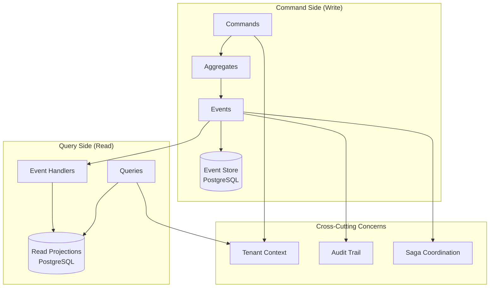

# Domain Model & Data Architecture

## Overview

The EAF data architecture implements Domain-Driven Design principles with CQRS/Event Sourcing patterns. The system separates write operations (commands) from read operations (queries) using event-driven projections for optimal performance and scalability.

## Architecture Overview



## Core Domain Aggregates

### 1. Product Aggregate

The Product aggregate manages product catalog information and lifecycle.

```kotlin
// shared/api/src/main/kotlin/com/axians/eaf/api/product/Product.kt
@Aggregate
class Product {

    @AggregateIdentifier
    private lateinit var productId: String
    private lateinit var tenantId: String
    private lateinit var sku: String
    private lateinit var name: String
    private lateinit var description: String
    private var price: BigDecimal = BigDecimal.ZERO
    private var status: ProductStatus = ProductStatus.DRAFT
    private var features: Set<ProductFeature> = emptySet()
    private var metadata: Map<String, String> = emptyMap()

    // Creation constructor
    @CommandHandler
    constructor(command: CreateProductCommand) {
        // Business rule validation
        require(command.sku.matches(SKU_PATTERN)) { "Invalid SKU format: ${command.sku}" }
        require(command.price >= BigDecimal.ZERO) { "Price cannot be negative" }
        require(command.name.isNotBlank()) { "Product name cannot be blank" }

        // Apply creation event
        apply(ProductCreatedEvent(
            productId = command.productId,
            tenantId = command.tenantId,
            sku = command.sku,
            name = command.name,
            description = command.description,
            price = command.price,
            features = command.features,
            metadata = command.metadata
        ))
    }

    @CommandHandler
    fun handle(command: UpdateProductCommand): Either<DomainError, Unit> = either {
        // Validate state
        ensure(status != ProductStatus.DISCONTINUED) {
            DomainError.BusinessRuleViolation(
                rule = "product.cannot.update.discontinued",
                message = "Cannot update discontinued product",
                aggregateId = productId
            )
        }

        // Validate price change
        if (command.price != null && command.price < BigDecimal.ZERO) {
            DomainError.ValidationError(
                field = "price",
                constraint = "non-negative",
                invalidValue = command.price,
                aggregateId = productId
            ).left().bind<Unit>()
        }

        // Apply update event
        apply(ProductUpdatedEvent(
            productId = productId,
            tenantId = tenantId,
            name = command.name,
            description = command.description,
            price = command.price,
            features = command.features,
            metadata = command.metadata
        ))
    }

    @CommandHandler
    fun handle(command: DiscontinueProductCommand): Either<DomainError, Unit> = either {
        ensure(status == ProductStatus.ACTIVE) {
            DomainError.BusinessRuleViolation(
                rule = "product.must.be.active.to.discontinue",
                message = "Only active products can be discontinued",
                aggregateId = productId
            )
        }

        apply(ProductDiscontinuedEvent(
            productId = productId,
            tenantId = tenantId,
            reason = command.reason,
            discontinuedAt = Instant.now()
        ))
    }

    // Event sourcing handlers
    @EventSourcingHandler
    fun on(event: ProductCreatedEvent) {
        this.productId = event.productId
        this.tenantId = event.tenantId
        this.sku = event.sku
        this.name = event.name
        this.description = event.description
        this.price = event.price
        this.status = ProductStatus.ACTIVE
        this.features = event.features
        this.metadata = event.metadata
    }

    @EventSourcingHandler
    fun on(event: ProductUpdatedEvent) {
        event.name?.let { this.name = it }
        event.description?.let { this.description = it }
        event.price?.let { this.price = it }
        event.features?.let { this.features = it }
        event.metadata?.let { this.metadata = this.metadata + it }
    }

    @EventSourcingHandler
    fun on(event: ProductDiscontinuedEvent) {
        this.status = ProductStatus.DISCONTINUED
    }

    companion object {
        private val SKU_PATTERN = Regex("^[A-Z]{3}-[0-9]{6}$")
    }
}

// Domain objects
enum class ProductStatus {
    DRAFT,
    ACTIVE,
    DISCONTINUED
}

data class ProductFeature(
    val name: String,
    val enabled: Boolean,
    val configuration: Map<String, Any> = emptyMap()
)
```

### 2. License Aggregate

The License aggregate manages software license issuance, validation, and lifecycle.

```kotlin
// shared/api/src/main/kotlin/com/axians/eaf/api/license/License.kt
@Aggregate
class License {

    @AggregateIdentifier
    private lateinit var licenseId: String
    private lateinit var tenantId: String
    private lateinit var productId: String
    private lateinit var customerId: String
    private lateinit var licenseKey: String
    private var seats: Int = 0
    private var maxSeats: Int = 0
    private var expiryDate: LocalDate? = null
    private var status: LicenseStatus = LicenseStatus.DRAFT
    private var features: Set<LicenseFeature> = emptySet()
    private var usageMetrics: Map<String, Any> = emptyMap()
    private var issueDate: Instant? = null

    @CommandHandler
    constructor(command: CreateLicenseCommand) {
        // Validation
        require(command.seats > 0) { "License must have at least 1 seat" }
        require(command.maxSeats >= command.seats) { "Max seats must be >= initial seats" }

        apply(LicenseCreatedEvent(
            licenseId = command.licenseId,
            tenantId = command.tenantId,
            productId = command.productId,
            customerId = command.customerId,
            seats = command.seats,
            maxSeats = command.maxSeats,
            expiryDate = command.expiryDate,
            features = command.features
        ))
    }

    @CommandHandler
    fun handle(command: IssueLicenseCommand): Either<DomainError, Unit> = either {
        // Business rules validation
        ensure(status == LicenseStatus.DRAFT) {
            DomainError.BusinessRuleViolation(
                rule = "license.already.issued",
                message = "License has already been issued",
                aggregateId = licenseId
            )
        }

        ensure(command.seats > 0) {
            DomainError.ValidationError(
                field = "seats",
                constraint = "positive",
                invalidValue = command.seats,
                aggregateId = licenseId
            )
        }

        // Generate license key
        val key = generateLicenseKey(productId, tenantId, licenseId)

        // Apply issued event
        apply(LicenseIssuedEvent(
            licenseId = licenseId,
            tenantId = tenantId,
            productId = productId,
            customerId = customerId,
            licenseKey = key,
            seats = command.seats,
            expiryDate = command.expiryDate,
            features = command.features,
            issuedAt = Instant.now()
        ))
    }

    @CommandHandler
    fun handle(command: ValidateLicenseCommand): Either<DomainError, ValidationResult> = either {
        // Check license status
        ensure(status == LicenseStatus.ACTIVE) {
            DomainError.BusinessRuleViolation(
                rule = "license.not.active",
                message = "License is not active",
                aggregateId = licenseId
            )
        }

        // Check expiry
        val now = LocalDate.now()
        ensure(expiryDate == null || expiryDate!!.isAfter(now)) {
            DomainError.BusinessRuleViolation(
                rule = "license.expired",
                message = "License has expired",
                aggregateId = licenseId
            )
        }

        // Check seat usage
        val currentUsage = getCurrentSeatUsage()
        ensure(currentUsage < seats) {
            DomainError.BusinessRuleViolation(
                rule = "license.seats.exceeded",
                message = "License seat limit exceeded",
                aggregateId = licenseId
            )
        }

        // Record validation
        apply(LicenseValidatedEvent(
            licenseId = licenseId,
            tenantId = tenantId,
            validatedAt = Instant.now(),
            usageCount = currentUsage
        ))

        ValidationResult(
            valid = true,
            licenseId = licenseId,
            remainingSeats = seats - currentUsage,
            expiryDate = expiryDate,
            features = features
        )
    }

    @CommandHandler
    fun handle(command: RevokeLicenseCommand): Either<DomainError, Unit> = either {
        ensure(status == LicenseStatus.ACTIVE) {
            DomainError.BusinessRuleViolation(
                rule = "license.not.active",
                message = "Only active licenses can be revoked",
                aggregateId = licenseId
            )
        }

        apply(LicenseRevokedEvent(
            licenseId = licenseId,
            tenantId = tenantId,
            reason = command.reason,
            revokedAt = Instant.now(),
            revokedBy = command.revokedBy
        ))
    }

    // Event sourcing handlers
    @EventSourcingHandler
    fun on(event: LicenseCreatedEvent) {
        this.licenseId = event.licenseId
        this.tenantId = event.tenantId
        this.productId = event.productId
        this.customerId = event.customerId
        this.seats = event.seats
        this.maxSeats = event.maxSeats
        this.expiryDate = event.expiryDate
        this.features = event.features
        this.status = LicenseStatus.DRAFT
    }

    @EventSourcingHandler
    fun on(event: LicenseIssuedEvent) {
        this.licenseKey = event.licenseKey
        this.seats = event.seats
        this.expiryDate = event.expiryDate
        this.features = event.features
        this.status = LicenseStatus.ACTIVE
        this.issueDate = event.issuedAt
    }

    @EventSourcingHandler
    fun on(event: LicenseValidatedEvent) {
        // Update usage metrics
        this.usageMetrics = this.usageMetrics + mapOf(
            "lastValidated" to event.validatedAt,
            "usageCount" to event.usageCount
        )
    }

    @EventSourcingHandler
    fun on(event: LicenseRevokedEvent) {
        this.status = LicenseStatus.REVOKED
    }

    private fun generateLicenseKey(productId: String, tenantId: String, licenseId: String): String {
        // Generate cryptographically secure license key
        val payload = "$productId:$tenantId:$licenseId:${Instant.now().epochSecond}"
        val hash = MessageDigest.getInstance("SHA-256").digest(payload.toByteArray())
        return Base64.getEncoder().encodeToString(hash).take(32)
    }

    private fun getCurrentSeatUsage(): Int {
        // This would typically query current usage from external systems
        return usageMetrics["currentUsage"] as? Int ?: 0
    }
}

// Domain objects
enum class LicenseStatus {
    DRAFT,
    ACTIVE,
    EXPIRED,
    REVOKED,
    SUSPENDED
}

data class LicenseFeature(
    val name: String,
    val enabled: Boolean,
    val limits: Map<String, Int> = emptyMap()
)

data class ValidationResult(
    val valid: Boolean,
    val licenseId: String,
    val remainingSeats: Int,
    val expiryDate: LocalDate?,
    val features: Set<LicenseFeature>
)
```

### 3. Customer Aggregate

The Customer aggregate manages customer information and relationships.

```kotlin
// shared/api/src/main/kotlin/com/axians/eaf/api/customer/Customer.kt
@Aggregate
class Customer {

    @AggregateIdentifier
    private lateinit var customerId: String
    private lateinit var tenantId: String
    private lateinit var name: String
    private lateinit var email: String
    private lateinit var contactInfo: ContactInfo
    private var status: CustomerStatus = CustomerStatus.ACTIVE
    private var tier: CustomerTier = CustomerTier.STANDARD
    private var metadata: Map<String, String> = emptyMap()
    private var createdAt: Instant? = null

    @CommandHandler
    constructor(command: CreateCustomerCommand) {
        // Validation
        require(command.name.isNotBlank()) { "Customer name cannot be blank" }
        require(command.email.matches(EMAIL_PATTERN)) { "Invalid email format" }

        apply(CustomerCreatedEvent(
            customerId = command.customerId,
            tenantId = command.tenantId,
            name = command.name,
            email = command.email,
            contactInfo = command.contactInfo,
            tier = command.tier,
            metadata = command.metadata
        ))
    }

    @CommandHandler
    fun handle(command: UpdateCustomerCommand): Either<DomainError, Unit> = either {
        ensure(status == CustomerStatus.ACTIVE) {
            DomainError.BusinessRuleViolation(
                rule = "customer.not.active",
                message = "Cannot update inactive customer",
                aggregateId = customerId
            )
        }

        if (command.email != null && !command.email.matches(EMAIL_PATTERN)) {
            DomainError.ValidationError(
                field = "email",
                constraint = "valid_email",
                invalidValue = command.email,
                aggregateId = customerId
            ).left().bind<Unit>()
        }

        apply(CustomerUpdatedEvent(
            customerId = customerId,
            tenantId = tenantId,
            name = command.name,
            email = command.email,
            contactInfo = command.contactInfo,
            tier = command.tier,
            metadata = command.metadata
        ))
    }

    // Event sourcing handlers
    @EventSourcingHandler
    fun on(event: CustomerCreatedEvent) {
        this.customerId = event.customerId
        this.tenantId = event.tenantId
        this.name = event.name
        this.email = event.email
        this.contactInfo = event.contactInfo
        this.tier = event.tier
        this.metadata = event.metadata
        this.status = CustomerStatus.ACTIVE
        this.createdAt = Instant.now()
    }

    @EventSourcingHandler
    fun on(event: CustomerUpdatedEvent) {
        event.name?.let { this.name = it }
        event.email?.let { this.email = it }
        event.contactInfo?.let { this.contactInfo = it }
        event.tier?.let { this.tier = it }
        event.metadata?.let { this.metadata = this.metadata + it }
    }

    companion object {
        private val EMAIL_PATTERN = Regex("^[A-Za-z0-9+_.-]+@[A-Za-z0-9.-]+\\.[A-Za-z]{2,}$")
    }
}

// Domain objects
enum class CustomerStatus {
    ACTIVE,
    INACTIVE,
    SUSPENDED
}

enum class CustomerTier {
    BASIC,
    STANDARD,
    PREMIUM,
    ENTERPRISE
}

data class ContactInfo(
    val phone: String?,
    val address: Address?,
    val website: String?
)

data class Address(
    val street: String,
    val city: String,
    val state: String?,
    val postalCode: String,
    val country: String
)
```

## Domain Events

### Product Events

```kotlin
// shared/api/src/main/kotlin/com/axians/eaf/api/product/events/ProductEvents.kt

data class ProductCreatedEvent(
    val productId: String,
    val tenantId: String,
    val sku: String,
    val name: String,
    val description: String,
    val price: BigDecimal,
    val features: Set<ProductFeature>,
    val metadata: Map<String, String>
) : DomainEvent

data class ProductUpdatedEvent(
    val productId: String,
    val tenantId: String,
    val name: String?,
    val description: String?,
    val price: BigDecimal?,
    val features: Set<ProductFeature>?,
    val metadata: Map<String, String>?
) : DomainEvent

data class ProductDiscontinuedEvent(
    val productId: String,
    val tenantId: String,
    val reason: String,
    val discontinuedAt: Instant
) : DomainEvent
```

### License Events

```kotlin
// shared/api/src/main/kotlin/com/axians/eaf/api/license/events/LicenseEvents.kt

data class LicenseCreatedEvent(
    val licenseId: String,
    val tenantId: String,
    val productId: String,
    val customerId: String,
    val seats: Int,
    val maxSeats: Int,
    val expiryDate: LocalDate?,
    val features: Set<LicenseFeature>
) : DomainEvent

data class LicenseIssuedEvent(
    val licenseId: String,
    val tenantId: String,
    val productId: String,
    val customerId: String,
    val licenseKey: String,
    val seats: Int,
    val expiryDate: LocalDate?,
    val features: Set<LicenseFeature>,
    val issuedAt: Instant
) : DomainEvent

data class LicenseValidatedEvent(
    val licenseId: String,
    val tenantId: String,
    val validatedAt: Instant,
    val usageCount: Int
) : DomainEvent

data class LicenseRevokedEvent(
    val licenseId: String,
    val tenantId: String,
    val reason: String,
    val revokedAt: Instant,
    val revokedBy: String
) : DomainEvent
```

## Read Projections

### Product Projection

```kotlin
// framework/persistence/src/main/kotlin/com/axians/eaf/persistence/projections/ProductProjection.kt
@Entity
@Table(name = "product_projection")
data class ProductProjection(
    @Id
    val productId: String,

    @Column(name = "tenant_id", nullable = false)
    val tenantId: String,

    @Column(name = "sku", nullable = false, unique = true)
    val sku: String,

    @Column(name = "name", nullable = false)
    val name: String,

    @Column(name = "description")
    val description: String?,

    @Column(name = "price", nullable = false)
    val price: BigDecimal,

    @Enumerated(EnumType.STRING)
    @Column(name = "status", nullable = false)
    val status: ProductStatus,

    @Column(name = "features", columnDefinition = "jsonb")
    @Convert(converter = ProductFeaturesConverter::class)
    val features: Set<ProductFeature>,

    @Column(name = "metadata", columnDefinition = "jsonb")
    @Convert(converter = MetadataConverter::class)
    val metadata: Map<String, String>,

    @Column(name = "created_at", nullable = false)
    val createdAt: Instant,

    @Column(name = "updated_at", nullable = false)
    val updatedAt: Instant
) : TenantAware {
    override fun getTenantId(): String = tenantId
}

// Event handler for projection updates
@Component
@ProcessingGroup("product-projection")
class ProductProjectionEventHandler(
    private val repository: ProductProjectionRepository
) {

    @EventHandler
    fun on(event: ProductCreatedEvent) {
        val projection = ProductProjection(
            productId = event.productId,
            tenantId = event.tenantId,
            sku = event.sku,
            name = event.name,
            description = event.description,
            price = event.price,
            status = ProductStatus.ACTIVE,
            features = event.features,
            metadata = event.metadata,
            createdAt = Instant.now(),
            updatedAt = Instant.now()
        )
        repository.save(projection)
    }

    @EventHandler
    fun on(event: ProductUpdatedEvent) {
        repository.findById(event.productId)?.let { existing ->
            val updated = existing.copy(
                name = event.name ?: existing.name,
                description = event.description ?: existing.description,
                price = event.price ?: existing.price,
                features = event.features ?: existing.features,
                metadata = existing.metadata + (event.metadata ?: emptyMap()),
                updatedAt = Instant.now()
            )
            repository.save(updated)
        }
    }

    @EventHandler
    fun on(event: ProductDiscontinuedEvent) {
        repository.findById(event.productId)?.let { existing ->
            val updated = existing.copy(
                status = ProductStatus.DISCONTINUED,
                updatedAt = Instant.now()
            )
            repository.save(updated)
        }
    }
}
```

### Widget Projection (jOOQ Read Model)

```kotlin
// products/widget-demo/src/main/kotlin/com/axians/eaf/products/widgetdemo/entities/WidgetProjection.kt
data class WidgetProjection(
    val widgetId: String,
    val tenantId: String,
    val name: String,
    val description: String?,
    val value: BigDecimal,
    val category: String,
    val metadata: String?,
    val createdAt: Instant,
    val updatedAt: Instant,
) : TenantAware {
    override fun getTenantId(): String = tenantId
}

// products/widget-demo/src/main/kotlin/com/axians/eaf/products/widgetdemo/repositories/JooqWidgetProjectionRepository.kt
override fun getCategorySummaryByTenantId(tenantId: String): List<WidgetCategorySummary> =
    dsl.select(WIDGET_PROJECTION.CATEGORY, COUNT_FIELD, AVG_FIELD, SUM_FIELD)
        .from(WIDGET_PROJECTION)
        .where(WIDGET_PROJECTION.TENANT_ID.eq(tenantId))
        .groupBy(WIDGET_PROJECTION.CATEGORY)
        .orderBy(WIDGET_PROJECTION.CATEGORY.asc())
        .fetch { record ->
            WidgetCategorySummary(
                category = record.get(WIDGET_PROJECTION.CATEGORY)!!,
                count = record.get(COUNT_FIELD) ?: 0L,
                averageValue = record.get(AVG_FIELD) ?: BigDecimal.ZERO,
                totalValue = record.get(SUM_FIELD) ?: BigDecimal.ZERO,
            )
        }
```

> **Story 8.3 Migration Highlights**
> - Spring Data JPA repository replaced with a jOOQ-powered implementation (`DSLContext`).
> - Projection schema defined via `products/widget-demo/src/main/resources/db/jooq/widget_projection.ddl` and generated with `./gradlew :products:widget-demo:jooqCodegen`.
> - Nullable in-memory repository updated to mirror the new contract for Kotest specs without mocking frameworks.

### License Projection

```kotlin
// framework/persistence/src/main/kotlin/com/axians/eaf/persistence/projections/LicenseProjection.kt
@Entity
@Table(name = "license_projection")
data class LicenseProjection(
    @Id
    val licenseId: String,

    @Column(name = "tenant_id", nullable = false)
    val tenantId: String,

    @Column(name = "product_id", nullable = false)
    val productId: String,

    @Column(name = "customer_id", nullable = false)
    val customerId: String,

    @Column(name = "license_key")
    val licenseKey: String?,

    @Column(name = "seats", nullable = false)
    val seats: Int,

    @Column(name = "max_seats", nullable = false)
    val maxSeats: Int,

    @Column(name = "expiry_date")
    val expiryDate: LocalDate?,

    @Enumerated(EnumType.STRING)
    @Column(name = "status", nullable = false)
    val status: LicenseStatus,

    @Column(name = "features", columnDefinition = "jsonb")
    @Convert(converter = LicenseFeaturesConverter::class)
    val features: Set<LicenseFeature>,

    @Column(name = "usage_metrics", columnDefinition = "jsonb")
    @Convert(converter = UsageMetricsConverter::class)
    val usageMetrics: Map<String, Any>,

    @Column(name = "created_at", nullable = false)
    val createdAt: Instant,

    @Column(name = "issued_at")
    val issuedAt: Instant?,

    @Column(name = "updated_at", nullable = false)
    val updatedAt: Instant
) : TenantAware {
    override fun getTenantId(): String = tenantId
}
```

## Query Handlers

### Product Queries

```kotlin
// products/licensing-server/src/main/kotlin/com/axians/eaf/products/licensing/query/ProductQueryHandler.kt
@Component
class ProductQueryHandler(
    private val productRepository: ProductProjectionRepository
) {

    @QueryHandler
    fun handle(query: FindProductByIdQuery): ProductProjection? {
        return productRepository.findByIdAndTenantId(query.productId, query.tenantId)
    }

    @QueryHandler
    fun handle(query: FindProductsBySkuQuery): List<ProductProjection> {
        return productRepository.findBySkuContainingAndTenantId(query.skuPattern, query.tenantId)
    }

    @QueryHandler
    fun handle(query: FindActiveProductsQuery): Page<ProductProjection> {
        val pageable = PageRequest.of(query.page, query.size)
        return productRepository.findByStatusAndTenantId(
            ProductStatus.ACTIVE,
            query.tenantId,
            pageable
        )
    }

    @QueryHandler
    fun handle(query: ProductSearchQuery): Page<ProductProjection> {
        val pageable = PageRequest.of(query.page, query.size)
        return productRepository.searchProducts(
            query.searchTerm,
            query.tenantId,
            query.status,
            pageable
        )
    }
}
```

### License Queries

```kotlin
// products/licensing-server/src/main/kotlin/com/axians/eaf/products/licensing/query/LicenseQueryHandler.kt
@Component
class LicenseQueryHandler(
    private val licenseRepository: LicenseProjectionRepository
) {

    @QueryHandler
    fun handle(query: FindLicenseByIdQuery): LicenseProjection? {
        return licenseRepository.findByIdAndTenantId(query.licenseId, query.tenantId)
    }

    @QueryHandler
    fun handle(query: FindLicenseByKeyQuery): LicenseProjection? {
        return licenseRepository.findByLicenseKeyAndTenantId(query.licenseKey, query.tenantId)
    }

    @QueryHandler
    fun handle(query: FindLicensesByCustomerQuery): List<LicenseProjection> {
        return licenseRepository.findByCustomerIdAndTenantId(query.customerId, query.tenantId)
    }

    @QueryHandler
    fun handle(query: FindExpiringLicensesQuery): List<LicenseProjection> {
        val expiryThreshold = LocalDate.now().plusDays(query.daysUntilExpiry.toLong())
        return licenseRepository.findExpiringLicenses(query.tenantId, expiryThreshold)
    }
}
```

## Repository Interfaces

### Using jOOQ for Type-Safe Queries (Story 8.3 - Widget Reference Implementation)

```kotlin
// products/widget-demo/src/main/kotlin/com/axians/eaf/products/widgetdemo/repositories/WidgetProjectionRepository.kt
@Repository
class JooqWidgetProjectionRepository(
    private val dsl: DSLContext
) : WidgetProjectionRepository {

    override fun save(projection: WidgetProjection): WidgetProjection {
        val record = projection.toRecord()

        val saved = dsl
            .insertInto(WidgetProjectionTable.WIDGET_PROJECTION)
            .set(record)
            .onConflict(WidgetProjectionTable.WIDGET_PROJECTION.WIDGET_ID)
            .doUpdate()
            .set(WidgetProjectionTable.WIDGET_PROJECTION.TENANT_ID, record.tenantId)
            .set(WidgetProjectionTable.WIDGET_PROJECTION.NAME, record.name)
            .set(WidgetProjectionTable.WIDGET_PROJECTION.VALUE, record.value)
            .set(WidgetProjectionTable.WIDGET_PROJECTION.CATEGORY, record.category)
            .set(WidgetProjectionTable.WIDGET_PROJECTION.METADATA, record.metadata)
            .set(WidgetProjectionTable.WIDGET_PROJECTION.UPDATED_AT, record.updatedAt)
            .where(WidgetProjectionTable.WIDGET_PROJECTION.TENANT_ID.eq(record.tenantId)) // CRITICAL: Tenant isolation on UPDATE
            .returning()
            .fetchOne() ?: error("Failed to persist widget projection ${projection.widgetId}")

        return saved.toDomain()
    }

    override fun findByWidgetIdAndTenantId(widgetId: String, tenantId: String): WidgetProjection? =
        dsl.selectFrom(WidgetProjectionTable.WIDGET_PROJECTION)
            .where(
                WidgetProjectionTable.WIDGET_PROJECTION.WIDGET_ID.eq(widgetId.toUuid())
                    .and(WidgetProjectionTable.WIDGET_PROJECTION.TENANT_ID.eq(tenantId.toUuid()))
            )
            .fetchOne()
            ?.toDomain()

    override fun search(criteria: WidgetSearchCriteria): WidgetPage {
        val baseCondition = WidgetProjectionTable.WIDGET_PROJECTION.TENANT_ID.eq(criteria.tenantId.toUuid())
        val filters = mutableListOf<Condition>(baseCondition)

        criteria.category?.takeIf { it.isNotBlank() }?.let {
            filters += WidgetProjectionTable.WIDGET_PROJECTION.CATEGORY.eq(it)
        }
        criteria.search?.takeIf { it.isNotBlank() }?.let {
            filters += WidgetProjectionTable.WIDGET_PROJECTION.NAME.containsIgnoreCase(it.trim())
        }

        val whereCondition = filters.reduce { acc, condition -> acc.and(condition) }
        val orderBy = resolveSort(criteria.sort)

        val items = dsl.selectFrom(WidgetProjectionTable.WIDGET_PROJECTION)
            .where(whereCondition)
            .orderBy(orderBy)
            .limit(criteria.size)
            .offset(criteria.page * criteria.size)
            .fetch()
            .map { it.toDomain() }

        val total = dsl.fetchCount(WidgetProjectionTable.WIDGET_PROJECTION, whereCondition).toLong()
        return WidgetPage(items = items, total = total)
    }
}
```

**Key Features (Story 8.3)**:
- **Type-Safe Queries**: Compile-time validation of SQL queries
- **Tenant Isolation**: All queries include `TENANT_ID` in WHERE clause
- **Security-Hardened save()**: UPDATE clause includes tenant validation to prevent cross-tenant corruption
- **Performance**: Direct SQL generation without JPA overhead
- **Kotlin Extensions**: Native Kotlin DSL for clean query syntax

---

### Future: Product Projection Repository Pattern

```kotlin
// Future implementation pattern for licensing-server product
@Repository
class ProductProjectionRepository(
    private val dsl: DSLContext
) {

    fun save(projection: ProductProjection): ProductProjection {
        dsl.insertInto(PRODUCT_PROJECTION)
            .set(PRODUCT_PROJECTION.PRODUCT_ID, projection.productId)
            .set(PRODUCT_PROJECTION.TENANT_ID, projection.tenantId)
            .set(PRODUCT_PROJECTION.SKU, projection.sku)
            .set(PRODUCT_PROJECTION.NAME, projection.name)
            .set(PRODUCT_PROJECTION.DESCRIPTION, projection.description)
            .set(PRODUCT_PROJECTION.PRICE, projection.price)
            .set(PRODUCT_PROJECTION.STATUS, projection.status.name)
            .set(PRODUCT_PROJECTION.FEATURES, JSON.valueOf(objectMapper.writeValueAsString(projection.features)))
            .set(PRODUCT_PROJECTION.METADATA, JSON.valueOf(objectMapper.writeValueAsString(projection.metadata)))
            .set(PRODUCT_PROJECTION.CREATED_AT, projection.createdAt)
            .set(PRODUCT_PROJECTION.UPDATED_AT, projection.updatedAt)
            .onConflict(PRODUCT_PROJECTION.PRODUCT_ID)
            .doUpdate()
            .set(PRODUCT_PROJECTION.NAME, projection.name)
            .set(PRODUCT_PROJECTION.DESCRIPTION, projection.description)
            .set(PRODUCT_PROJECTION.PRICE, projection.price)
            .set(PRODUCT_PROJECTION.STATUS, projection.status.name)
            .set(PRODUCT_PROJECTION.FEATURES, JSON.valueOf(objectMapper.writeValueAsString(projection.features)))
            .set(PRODUCT_PROJECTION.METADATA, JSON.valueOf(objectMapper.writeValueAsString(projection.metadata)))
            .set(PRODUCT_PROJECTION.UPDATED_AT, projection.updatedAt)
            .where(PRODUCT_PROJECTION.TENANT_ID.eq(projection.tenantId)) // Tenant isolation
            .execute()

        return projection
    }

    fun findByIdAndTenantId(productId: String, tenantId: String): ProductProjection? {
        return dsl.select()
            .from(PRODUCT_PROJECTION)
            .where(PRODUCT_PROJECTION.PRODUCT_ID.eq(productId))
            .and(PRODUCT_PROJECTION.TENANT_ID.eq(tenantId))
            .fetchOneInto(ProductProjection::class.java)
    }

    fun searchProducts(
        searchTerm: String,
        tenantId: String,
        status: ProductStatus?,
        pageable: Pageable
    ): Page<ProductProjection> {
        val baseQuery = dsl.select()
            .from(PRODUCT_PROJECTION)
            .where(PRODUCT_PROJECTION.TENANT_ID.eq(tenantId))
            .and(
                PRODUCT_PROJECTION.NAME.containsIgnoreCase(searchTerm)
                    .or(PRODUCT_PROJECTION.SKU.containsIgnoreCase(searchTerm))
                    .or(PRODUCT_PROJECTION.DESCRIPTION.containsIgnoreCase(searchTerm))
            )

        if (status != null) {
            baseQuery.and(PRODUCT_PROJECTION.STATUS.eq(status.name))
        }

        val totalCount = dsl.selectCount()
            .from(baseQuery)
            .fetchOne(0, Int::class.java) ?: 0

        val results = baseQuery
            .orderBy(PRODUCT_PROJECTION.NAME.asc())
            .limit(pageable.pageSize)
            .offset(pageable.offset.toInt())
            .fetchInto(ProductProjection::class.java)

        return PageImpl(results, pageable, totalCount.toLong())
    }
}
```

## Error Handling

### Domain Errors

```kotlin
// shared/api/src/main/kotlin/com/axians/eaf/api/errors/DomainError.kt
sealed class DomainError {
    abstract val message: String
    abstract val aggregateId: String?

    data class ValidationError(
        val field: String,
        val constraint: String,
        val invalidValue: Any?,
        override val aggregateId: String? = null
    ) : DomainError() {
        override val message: String = "Validation failed for field '$field': $constraint"
    }

    data class BusinessRuleViolation(
        val rule: String,
        override val message: String,
        override val aggregateId: String? = null,
        val context: Map<String, Any> = emptyMap()
    ) : DomainError()

    data class ResourceNotFound(
        val resourceType: String,
        val resourceId: String,
        override val aggregateId: String? = null
    ) : DomainError() {
        override val message: String = "$resourceType with ID '$resourceId' not found"
    }

    data class ConcurrencyConflict(
        val expectedVersion: Long,
        val actualVersion: Long,
        override val aggregateId: String
    ) : DomainError() {
        override val message: String = "Concurrency conflict: expected version $expectedVersion, but was $actualVersion"
    }
}
```

## Related Documentation

- **[Database Schema](database-schema.md)** - Complete database structure and optimizations
- **[API Specification](api-specification-revision-2.md)** - REST endpoints for these domain models
- **[System Components](components.md)** - CQRS infrastructure implementation
- **[Security Architecture](security.md)** - Tenant isolation in data access
- **[Testing Strategy](test-strategy-and-standards-revision-3.md)** - Domain model testing patterns

---

**Next Steps**: Review [Database Schema](database-schema.md) for the complete database structure, then proceed to [API Specification](api-specification-revision-2.md) for REST endpoint implementations.