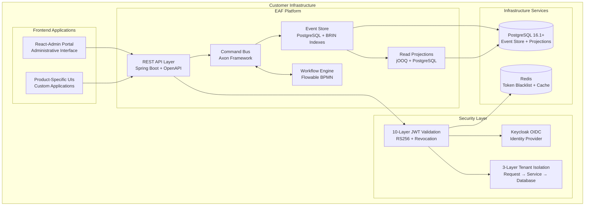
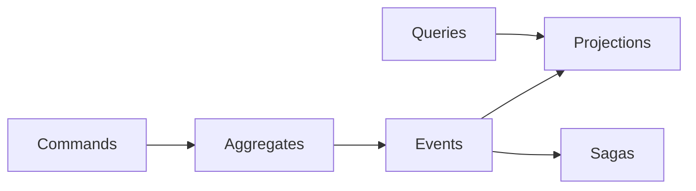
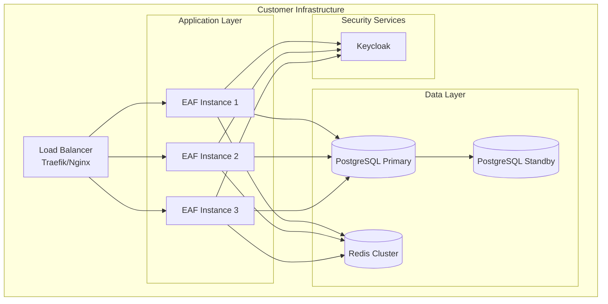
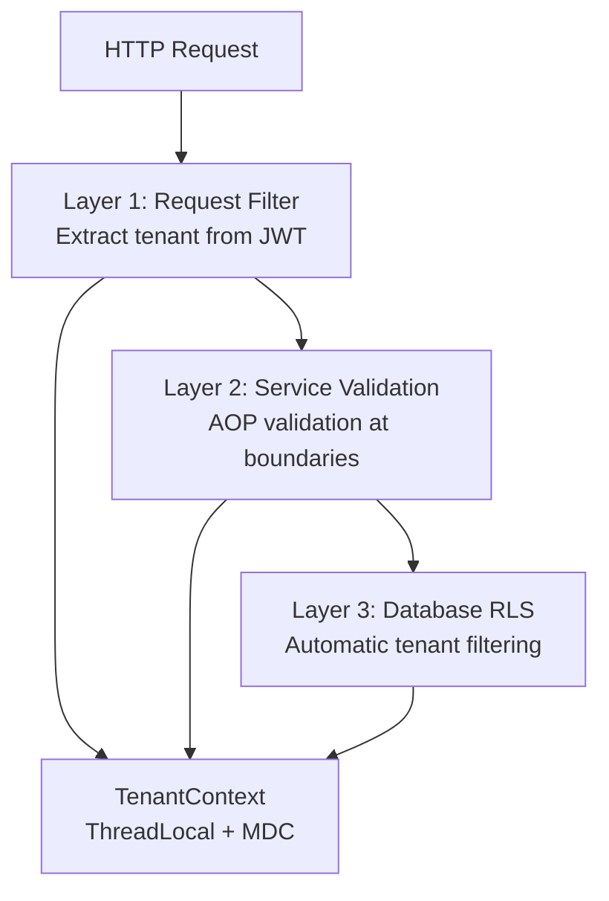
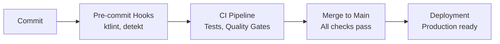

# High-Level Architecture

## Overview

The Enterprise Application Framework (EAF) v0.1 is a modern, Kotlin-based enterprise platform designed to replace legacy DCA framework components. Built as a **Modular Monolith** using **Hexagonal Architecture** principles, the system provides a scalable, maintainable foundation for multi-tenant enterprise applications.

### Executive Summary

- **Architecture Pattern**: Hexagonal + Spring Modulith for enforced boundaries
- **Domain Logic**: CQRS/Event Sourcing via Axon Framework 4.9.4
- **Deployment Model**: Docker Compose on customer-hosted infrastructure
- **Security**: 10-layer JWT validation with 3-layer tenant isolation
- **Development**: Constitutional TDD with Nullable Pattern for 60%+ faster tests

## System Architecture



## Architectural Patterns

### 1. Hexagonal Architecture (Ports & Adapters)

The system implements clean separation between business logic and infrastructure concerns:

```kotlin
// Domain core (no external dependencies)
interface ProductRepository {
    fun save(product: Product): Either<DomainError, Product>
    fun findById(id: String): Either<DomainError, Product?>
}

// Infrastructure adapter
@Repository
class JpaProductRepository(
    private val jpaRepository: JpaProductRepository
) : ProductRepository {
    override fun save(product: Product): Either<DomainError, Product> {
        return try {
            jpaRepository.save(product).right()
        } catch (e: DataIntegrityViolationException) {
            DomainError.Conflict("Product already exists").left()
        }
    }
}
```

**Benefits**:
- Domain logic is infrastructure-agnostic
- Easy testing with nullable implementations
- Clear dependency direction (infrastructure depends on domain)

### 2. CQRS/Event Sourcing

Separates read and write operations with event-driven architecture:



**Implementation**:
- **Commands**: Mutate aggregate state
- **Events**: Immutable facts about what happened
- **Queries**: Read from optimized projections
- **Sagas**: Coordinate long-running processes

### 3. Domain-Driven Design

Organized around bounded contexts with Spring Modulith enforcement:

```
framework/
├── core/           # Shared domain patterns
├── security/       # Identity & access management
├── cqrs/          # Command/Query infrastructure
├── tenancy/       # Multi-tenant patterns
└── workflow/      # Business process management
```

#### Project Structure Guide

The Gradle monorepo follows a single canonical layout that replaces the retired `unified-project-structure.md` shard. This directory map preserves Spring Modulith boundaries and keeps every layer aligned with the architecture responsibilities.

```
eaf-monorepo/
├── build-logic/                 # Convention plugins (Kotlin, Spring Boot, testing, quality gates)
├── framework/                   # Shared Kotlin modules consumed by all products
│   ├── core/                    # Domain primitives, Either helpers, Nullable pattern contracts
│   ├── security/                # 10-layer JWT validation and emergency recovery
│   ├── cqrs/                    # Axon command/event/query infrastructure
│   ├── tenancy/                 # Tenant context propagation utilities
│   ├── workflow/                # Flowable BPMN integration points
│   ├── observability/           # Metrics, tracing, and structured logging
│   ├── persistence/             # jOOQ projections and Axon repositories
│   └── web/                     # REST adapters and ProblemDetails handling
├── products/                    # Deployable Spring Boot applications (e.g., licensing-server)
├── shared/                      # Cross-cutting API contracts and generated types
│   ├── shared-api/              # Commands, events, queries shared across services
│   ├── shared-types/            # Generated TypeScript schemas for frontend clients
│   └── testing/                 # Nullable pattern helpers + Testcontainers scaffolding
├── apps/
│   └── admin/                   # React-Admin operator portal workspace
├── scripts/                     # Developer automation (`init-dev.sh`, database utilities)
├── gradle/
│   └── libs.versions.toml       # Single source of truth for dependency versions
└── compose.yml                  # Local Docker stack (PostgreSQL, Keycloak, Redis, etc.)
```

Implementation notes:
- All Kotlin modules must apply convention plugins from `build-logic/` to enforce JVM 21, ktlint, Detekt, Konsist, and Pitest gating.
- Spring Modulith `ModuleMetadata.kt` files live within each `framework/*` submodule to codify allowed dependencies.
- Product applications can depend on `framework/*` and `shared/*` modules only; cross-product coupling is prohibited.
- Frontend workspaces under `apps/` consume the published `shared-types` package to stay schema-aligned with backend contracts.
- Automation scripts and Compose assets remain at the repo root to keep CI and local workflows using identical entry points.

### 4. Event-Driven Architecture

Asynchronous processing with event projections for scalability:

```kotlin
@EventSourcingHandler
class ProductProjectionHandler {
    fun on(event: ProductCreatedEvent) {
        productProjectionRepository.save(
            ProductProjection(
                productId = event.productId,
                name = event.name,
                sku = event.sku,
                tenantId = event.tenantId
            )
        )
    }
}
```

## Core Design Principles

### 1. Modular Monolith with Spring Modulith

Enforces module boundaries programmatically:

```kotlin
@ApplicationModule(
    displayName = "EAF Security Module",
    allowedDependencies = ["core", "shared.api", "shared.testing"]
)
class SecurityModule

// Architecture tests verify boundaries
@Test
fun `modules should respect dependency rules`() {
    SpringModulith.of(EafApplication::class.java)
        .verify()
}
```

### 2. Functional Error Handling

Uses Arrow Either types for explicit error handling:

```kotlin
fun createProduct(command: CreateProductCommand): Either<DomainError, Product> = either {
    // Validation
    ensure(command.sku.matches(SKU_PATTERN)) {
        DomainError.ValidationError("sku", "invalid_format", command.sku)
    }

    // Business logic
    val product = Product.create(command).bind()
    repository.save(product).bind()
}
```

### 3. Constitutional TDD

Test-first development with integration focus:

```kotlin
class ProductServiceTest : BehaviorSpec({
    Given("a product service") {
        val service = ProductService(
            repository = nullable<ProductRepository>(),
            eventBus = nullable<EventBus>()
        )

        When("creating a valid product") {
            val result = service.createProduct(validCommand)

            Then("product should be created") {
                result.shouldBeRight()
            }
        }
    }
})
```

## Technology Decisions

### Core Technology Stack

| Component | Technology | Version | Rationale |
|-----------|------------|---------|-----------|
| **Language** | Kotlin | 2.0.10 | Type safety, null safety, interop |
| **Framework** | Spring Boot | 3.3.5 | Enterprise patterns, ecosystem |
| **CQRS/ES** | Axon Framework | 4.9.4 | Proven event sourcing platform |
| **Database** | PostgreSQL | 16.1+ | ACID compliance, performance |
| **Security** | Keycloak | 26.0.0 | Enterprise identity management |

🔗 **See also**: [Technology Stack](tech-stack.md) for complete technology matrix

### Key Architectural Constraints

1. **Version Pinning**: Kotlin 2.0.10 (PINNED for tool compatibility)
2. **Spring Boot Lock**: 3.3.5 (LOCKED for Spring Modulith 1.3.0)
3. **No Wildcard Imports**: Explicit imports required
4. **Kotest Only**: JUnit explicitly forbidden
5. **PostgreSQL Only**: H2 and other databases forbidden

## Deployment Architecture

### Single-Tenant Deployment

Each customer receives their own isolated deployment:



### Multi-Architecture Support

Supports customer hardware diversity:

- **amd64**: Standard x86_64 servers
- **arm64**: Apple Silicon, AWS Graviton
- **ppc64le**: IBM Power systems

🔗 **See also**: [Deployment Architecture](deployment-architecture-revision-2.md) for detailed deployment procedures

## Security Architecture Overview

### Defense in Depth

Multiple security layers provide comprehensive protection:

1. **Network Layer**: TLS 1.3, certificate pinning
2. **Application Layer**: 10-layer JWT validation
3. **Service Layer**: 3-layer tenant isolation
4. **Data Layer**: PostgreSQL RLS, encryption at rest
5. **Infrastructure Layer**: Container isolation, secrets management

### 10-Layer JWT Validation

Comprehensive token validation pipeline:

1. Format validation (JWT structure)
2. Signature validation (RS256 cryptographic verification)
3. Algorithm validation (prevent algorithm confusion)
4. Claim schema validation (required claims)
5. Time-based validation (exp/iat/nbf with clock skew)
6. Issuer/Audience validation (trust boundaries)
7. Token revocation check (Redis blacklist)
8. Role validation (role whitelist, privilege escalation detection)
9. User validation (user existence, active status)
10. Injection detection (SQL injection, XSS, JNDI patterns)

🔗 **See also**: [Security Architecture](security.md) for complete security implementation

## Multi-Tenancy Strategy

### 3-Layer Tenant Isolation

Defense-in-depth approach to tenant isolation:



**Implementation**:
- **Layer 1**: Request filter extracts tenant ID from JWT
- **Layer 2**: Service-level validation with AOP
- **Layer 3**: Database-level Row Level Security (RLS)

🔗 **See also**: [Multi-Tenancy Strategy](multi-tenancy-strategy.md) for implementation details

## Testing Strategy Overview

### Constitutional TDD

Test-first development with three testing levels:

- **40-50%**: Fast business logic tests (Nullable Pattern)
- **30-40%**: Critical integration tests (Testcontainers)
- **10-20%**: End-to-end tests (Full stack)

### Nullable Design Pattern

Fast infrastructure substitutes for business logic testing:

```kotlin
interface ProductRepository {
    fun save(product: Product): Either<DomainError, Product>
}

class NullableProductRepository : ProductRepository, NullableFactory<ProductRepository> {
    private val storage = ConcurrentHashMap<String, Product>()

    override fun save(product: Product): Either<DomainError, Product> {
        storage[product.id] = product
        return product.right()
    }

    override fun createNull() = this
}
```

**Performance Impact**: 61.6% faster execution than integration tests

🔗 **See also**: [Testing Strategy](test-strategy-and-standards-revision-3.md) for complete testing approach

## Development Experience

### One-Command Onboarding

Complete development environment setup:

```bash
git clone <repository>
cd eaf-monorepo
./scripts/init-dev.sh
```

This single command:
1. Starts infrastructure services (PostgreSQL, Keycloak, Redis)
2. Runs database migrations
3. Configures Keycloak realms
4. Builds the project
5. Runs quality checks
6. Starts the application

### Scaffolding CLI

Code generation for rapid development:

```bash
# Generate new module
eaf scaffold module security:authentication

# Generate new aggregate
eaf scaffold aggregate License --events Created,Issued,Revoked

# Generate API endpoints
eaf scaffold api-resource License --path /api/v1/licenses
```

🔗 **See also**: [Development Workflow](development-workflow.md) for complete development procedures

## Performance & Scalability

### Performance Targets

| Metric | Target | Warning | Critical |
|--------|--------|---------|----------|
| API Latency (p95) | <200ms | >500ms | >1000ms |
| Command Processing | <200ms | >500ms | >5000ms |
| Event Processor Lag | <10s | >30s | >60s |
| Concurrent Users | 1000+ | N/A | N/A |

### Scalability Patterns

1. **Horizontal Scaling**: Multiple application instances
2. **Database Optimization**: BRIN indexes, partitioning
3. **Caching Strategy**: Redis for frequent reads
4. **Async Processing**: Event-driven architecture
5. **Resource Isolation**: Multi-tenancy with quotas

🔗 **See also**: [Performance & Monitoring](performance-monitoring.md) for detailed performance strategy

## Quality Assurance

### Zero-Violations Policy

All code must pass quality gates:

- **ktlint**: Code formatting (zero violations)
- **Detekt**: Static analysis (zero violations)
- **Konsist**: Architecture tests (zero violations)
- **Pitest**: 80% minimum mutation coverage
- **Test Coverage**: 85% minimum line coverage

### Continuous Quality

Quality enforced at every stage:



## Future Considerations

### Planned Enhancements

1. **Axon Framework 5.x Migration**: Planned after initial implementation
2. **Kubernetes Support**: Optional orchestration for larger deployments
3. **GraphQL Gateway**: Post-MVP API enhancement
4. **Advanced Analytics**: Enhanced monitoring and business intelligence

### Migration Strategy

Phased approach from legacy DCA framework:

1. **Phase 1**: Deploy alongside legacy (parallel run)
2. **Phase 2**: Migrate read-only operations
3. **Phase 3**: Migrate write operations with dual-write
4. **Phase 4**: Complete cutover and legacy decommission

## Related Documentation

- **[Technology Stack](tech-stack.md)** - Complete technology matrix and constraints
- **[System Components](components.md)** - Detailed component implementations
- **[Security Architecture](security.md)** - Comprehensive security implementation
- **[Development Workflow](development-workflow.md)** - Development procedures and tooling
- **[Unified Architecture](../architecture.md)** - Complete reference document

---

**Next Steps**: Review the [Technology Stack](tech-stack.md) for detailed technology choices and version constraints, then proceed to [System Components](components.md) for implementation-ready code examples.