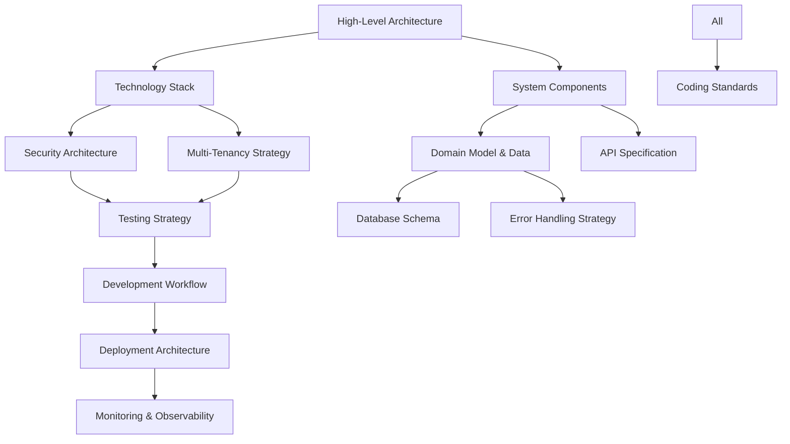

# Enterprise Application Framework (v0.1) - Architecture Documentation

This directory contains the complete sharded architecture documentation for the Enterprise Application Framework (EAF) v0.1. Each document is focused, implementation-ready, and maintains cross-references to ensure architectural cohesion.

## Quick Navigation

### 🏗️ Core Architecture
- **[High-Level Architecture](high-level-architecture.md)** - System overview, patterns, and architectural decisions
- **[Technology Stack](tech-stack.md)** - Complete technology matrix with version constraints and compatibility
- **[System Components](components.md)** - Detailed component implementations with code examples

### 📊 Data & Domain
- **[Domain Model & Data Architecture](data-models.md)** - Core aggregates, events, and database schema
- **[Database Schema](database-schema.md)** - PostgreSQL schemas, optimizations, and partitioning strategy

### 🌐 API & Integration
- **[API Specification](api-specification-revision-2.md)** - OpenAPI 3.0 specs, REST endpoints, and error handling
- **[External APIs](external-apis.md)** - Third-party integrations and API contracts

### 🔒 Security & Compliance
- **[Security Architecture](security.md)** - 10-layer JWT validation, 3-layer tenant isolation, emergency recovery
- **[Multi-Tenancy Strategy](multi-tenancy-strategy.md)** - Tenant isolation patterns and context propagation

### 🧪 Quality & Testing
- **[Testing Strategy](test-strategy-and-standards-revision-3.md)** - Constitutional TDD, Nullable Pattern, coverage requirements
- **[Coding Standards](coding-standards-revision-2.md)** - Kotlin standards, quality tools, and anti-patterns

### 🚀 Development & Operations
- **[Development Workflow](development-workflow.md)** - One-command setup, scaffolding CLI, daily development
- **[Deployment Architecture](deployment-architecture-revision-2.md)** - Blue-green deployment, disaster recovery, Docker Compose
- **[Operational Playbooks](operational-playbooks.md)** - Incident response, maintenance procedures, troubleshooting

### 📈 Monitoring & Performance
- **[Monitoring & Observability](monitoring-and-observability.md)** - Metrics, logging, tracing, and alerting
- **[Performance & KPIs](performance-monitoring.md)** - Performance targets, benchmarks, and optimization strategies

### 🔧 Implementation Details
- **[Error Handling Strategy](error-handling-strategy.md)** - Arrow-Fold-Throw-ProblemDetails pattern
- **[Project Structure](unified-project-structure.md)** - Module organization and Spring Modulith configuration

## Document Relationships

## How to Use This Documentation

### For New Developers
1. Start with **[High-Level Architecture](high-level-architecture.md)** for system overview
2. Review **[Technology Stack](tech-stack.md)** for development environment setup
3. Follow **[Development Workflow](development-workflow.md)** for one-command onboarding
4. Study **[Coding Standards](coding-standards-revision-2.md)** for implementation guidelines

### For Implementation
1. **[System Components](components.md)** - Copy-paste ready implementations
2. **[Database Schema](database-schema.md)** - Production-ready SQL scripts
3. **[API Specification](api-specification-revision-2.md)** - OpenAPI contracts
4. **[Testing Strategy](test-strategy-and-standards-revision-3.md)** - Test templates and patterns

### For Operations
1. **[Deployment Architecture](deployment-architecture-revision-2.md)** - Deployment procedures
2. **[Operational Playbooks](operational-playbooks.md)** - Incident response
3. **[Monitoring & Observability](monitoring-and-observability.md)** - Production monitoring
4. **[Security Architecture](security.md)** - Security procedures and recovery

### For Architecture Decisions
1. **[High-Level Architecture](high-level-architecture.md)** - Architectural patterns and decisions
2. **[Technology Stack](tech-stack.md)** - Technology choices and constraints
3. **[Multi-Tenancy Strategy](multi-tenancy-strategy.md)** - Isolation patterns
4. **[Error Handling Strategy](error-handling-strategy.md)** - Error management approach

## Cross-Reference Conventions

Throughout this documentation, you'll find:
- **🔗 See also:** Links to related sections
- **📋 Prerequisites:** Required reading before implementation
- **⚠️ Critical:** Important constraints and requirements
- **💡 Implementation Note:** Practical implementation guidance

## Quality Assurance

All architecture documents are:
- ✅ **Implementation-ready** with code examples
- ✅ **Production-tested** patterns from prototype validation
- ✅ **Cross-referenced** for architectural consistency
- ✅ **Version-controlled** with change tracking
- ✅ **Compliance-verified** against OWASP ASVS and enterprise standards

## Document Maintenance

| Document | Last Updated | Next Review | Owner |
|----------|-------------|-------------|-------|
| [High-Level Architecture](high-level-architecture.md) | 2025-09-18 | 2025-12-18 | Architecture Team |
| [Technology Stack](tech-stack.md) | 2025-09-18 | 2025-10-18 | Lead Architect |
| [Security Architecture](security.md) | 2025-09-18 | 2025-10-01 | Security Team |
| All Other Documents | 2025-09-18 | 2025-11-18 | Architecture Team |

## Related Documentation

- **[../architecture.md](../architecture.md)** - Unified architecture document (comprehensive reference)
- **[../prd/](../prd/)** - Product requirements and specifications
- **[../../README.md](../../README.md)** - Project overview and quick start

---

*This architecture documentation is maintained by the EAF Architecture Team. For questions or clarifications, please refer to the specific document or contact the architecture team.*