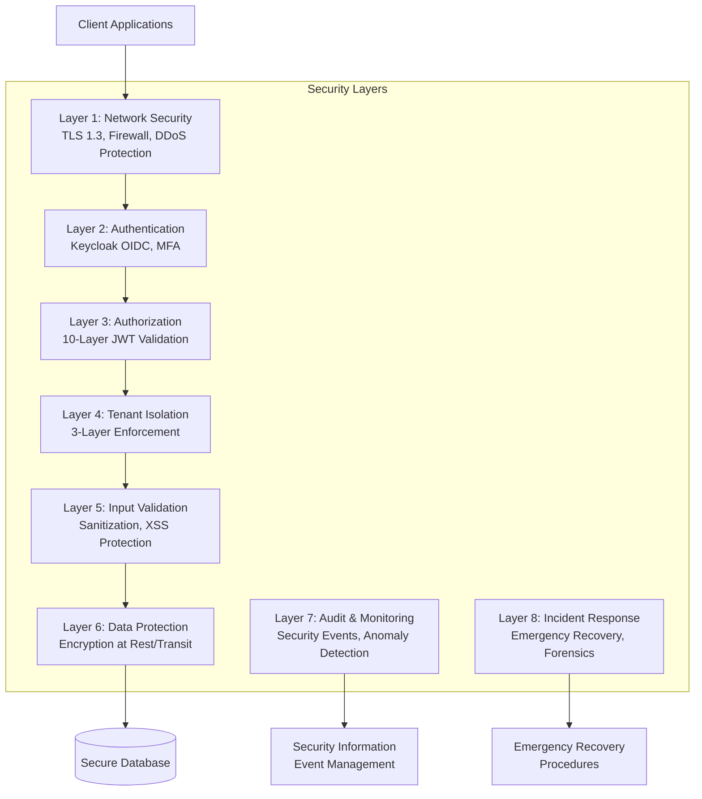
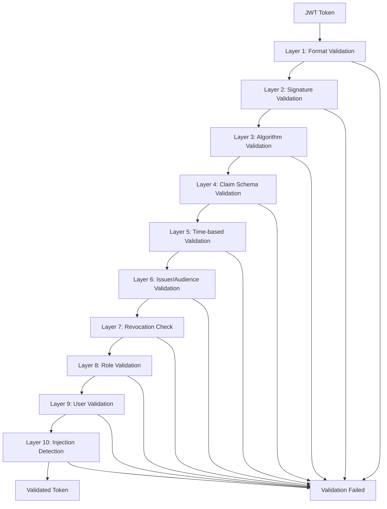

# Security Architecture

## Overview

The EAF security architecture implements defense-in-depth with enterprise-grade protection across multiple layers. The core security strategy includes 10-layer JWT validation, 3-layer tenant isolation, and comprehensive emergency recovery procedures.

## Security Architecture Overview



## 10-Layer JWT Validation System

### Architecture

The JWT validation system implements comprehensive security through ten distinct validation layers, each addressing specific attack vectors and security concerns.



### Implementation

```kotlin
// framework/security/src/main/kotlin/com/axians/eaf/security/jwt/TenLayerJwtValidator.kt
@Component
class TenLayerJwtValidator(
    private val keycloakClient: KeycloakClient,
    private val blacklistCache: RedisTemplate<String, String>,
    private val userRepository: UserRepository,
    private val roleRepository: RoleRepository,
    private val meterRegistry: MeterRegistry,
    private val auditLogger: AuditLogger
) {

    companion object {
        private val JWT_PATTERN = Regex("^[A-Za-z0-9_-]+\\.[A-Za-z0-9_-]+\\.[A-Za-z0-9_-]+$")
        private val INJECTION_PATTERNS = listOf(
            "(?i)(union|select|insert|update|delete|drop)\\s",
            "(?i)(script|javascript|onerror|onload)",
            "(?i)(exec|execute|xp_|sp_)",
            "(?i)(ldap://|ldaps://|dns://)",
            "(?i)(<script|<iframe|<object|<embed)"
        )
        private const val CLOCK_SKEW_TOLERANCE_SECONDS = 60L
    }

    fun validate(token: String): Either<SecurityError, ValidationResult> = either {
        val startTime = System.nanoTime()

        try {
            // Layer 1: Format Validation
            validateBasicFormat(token).bind()
            recordLayerSuccess(1)

            // Layer 2: Signature Validation (RS256 only)
            val jwt = verifySignature(token).bind()
            recordLayerSuccess(2)

            // Layer 3: Algorithm Validation
            ensureRS256Algorithm(jwt).bind()
            recordLayerSuccess(3)

            // Layer 4: Claim Schema Validation
            val claims = validateClaimSchema(jwt).bind()
            recordLayerSuccess(4)

            // Layer 5: Time-based Validation
            ensureNotExpired(claims).bind()
            recordLayerSuccess(5)

            // Layer 6: Issuer/Audience Validation
            validateIssuerAudience(claims).bind()
            recordLayerSuccess(6)

            // Layer 7: Revocation Check
            ensureNotRevoked(claims.jti).bind()
            recordLayerSuccess(7)

            // Layer 8: Role Validation
            val roles = validateRoles(claims.roles).bind()
            recordLayerSuccess(8)

            // Layer 9: User Validation
            val user = validateUser(claims.sub).bind()
            recordLayerSuccess(9)

            // Layer 10: Injection Detection
            ensureNoInjection(token).bind()
            recordLayerSuccess(10)

            val validationResult = ValidationResult(
                user = user,
                roles = roles,
                tenantId = claims.tenant_id,
                sessionId = claims.sessionId,
                issuer = claims.iss,
                audience = claims.aud,
                expiresAt = Instant.ofEpochSecond(claims.exp),
                issuedAt = Instant.ofEpochSecond(claims.iat)
            )

            // Record successful validation
            val duration = Duration.ofNanos(System.nanoTime() - startTime)
            meterRegistry.timer("jwt.validation.success")
                .record(duration)

            auditLogger.logSecurityEvent(
                event = "JWT_VALIDATION_SUCCESS",
                userId = user.id,
                tenantId = claims.tenant_id,
                details = mapOf(
                    "duration_ms" to duration.toMillis(),
                    "layers_passed" to 10,
                    "session_id" to claims.sessionId
                )
            )

            validationResult
        } catch (e: SecurityError) {
            recordValidationFailure(e, startTime)
            e.left().bind<ValidationResult>()
        }
    }

    // Layer 1: Format Validation
    private fun validateBasicFormat(token: String): Either<SecurityError, Unit> {
        return when {
            token.isBlank() -> SecurityError.EmptyToken.left()
            !token.matches(JWT_PATTERN) -> SecurityError.InvalidTokenFormat.left()
            token.length > 8192 -> SecurityError.TokenTooLarge.left()
            token.split(".").size != 3 -> SecurityError.InvalidJwtStructure.left()
            else -> Unit.right()
        }
    }

    // Layer 2: Signature Validation
    private fun verifySignature(token: String): Either<SecurityError, Jwt> {
        return try {
            val jwt = jwtDecoder.decode(token)

            // Additional signature verification
            if (!verifySignatureWithKeycloak(token)) {
                meterRegistry.counter("jwt.validation.signature_mismatch").increment()
                SecurityError.SignatureMismatch.left()
            } else {
                jwt.right()
            }
        } catch (e: JwtException) {
            meterRegistry.counter("jwt.validation.signature_failure").increment()
            SecurityError.InvalidSignature(e.message ?: "Unknown signature error").left()
        }
    }

    // Layer 3: Algorithm Validation
    private fun ensureRS256Algorithm(jwt: Jwt): Either<SecurityError, Unit> {
        val algorithm = jwt.headers["alg"] as? String
        return if (algorithm == "RS256") {
            Unit.right()
        } else {
            meterRegistry.counter("jwt.validation.algorithm_mismatch")
                .tag("algorithm", algorithm ?: "null")
                .increment()
            SecurityError.UnsupportedAlgorithm(algorithm).left()
        }
    }

    // Layer 4: Claim Schema Validation
    private fun validateClaimSchema(jwt: Jwt): Either<SecurityError, JwtClaims> {
        return try {
            val claims = JwtClaims(
                sub = jwt.getClaimAsString("sub")
                    ?: return SecurityError.MissingClaim("sub").left(),
                iss = jwt.getClaimAsString("iss")
                    ?: return SecurityError.MissingClaim("iss").left(),
                aud = jwt.audience?.firstOrNull()
                    ?: return SecurityError.MissingClaim("aud").left(),
                exp = jwt.expiresAt?.epochSecond
                    ?: return SecurityError.MissingClaim("exp").left(),
                iat = jwt.issuedAt?.epochSecond
                    ?: return SecurityError.MissingClaim("iat").left(),
                jti = jwt.getClaimAsString("jti")
                    ?: return SecurityError.MissingClaim("jti").left(),
                tenant_id = jwt.getClaimAsString("tenant_id")
                    ?: return SecurityError.MissingClaim("tenant_id").left(),
                roles = jwt.getClaimAsStringList("realm_access.roles") ?: emptyList(),
                sessionId = jwt.getClaimAsString("session_state")
            )

            // Validate claim formats
            if (!isValidUUID(claims.tenant_id)) {
                return SecurityError.InvalidClaimFormat("tenant_id", claims.tenant_id).left()
            }

            if (!isValidUUID(claims.sub)) {
                return SecurityError.InvalidClaimFormat("sub", claims.sub).left()
            }

            claims.right()
        } catch (e: Exception) {
            SecurityError.ClaimExtractionError(e.message ?: "Unknown error").left()
        }
    }

    // Layer 5: Time-based Validation
    private fun ensureNotExpired(claims: JwtClaims): Either<SecurityError, Unit> {
        val now = Instant.now()
        val expiry = Instant.ofEpochSecond(claims.exp)
        val issued = Instant.ofEpochSecond(claims.iat)

        return when {
            // Check expiration with clock skew tolerance
            now.isAfter(expiry.plusSeconds(CLOCK_SKEW_TOLERANCE_SECONDS)) -> {
                meterRegistry.counter("jwt.validation.expired").increment()
                SecurityError.TokenExpired(expiry, now).left()
            }
            // Check issued-at time (prevent future tokens)
            issued.isAfter(now.plusSeconds(CLOCK_SKEW_TOLERANCE_SECONDS)) -> {
                meterRegistry.counter("jwt.validation.future_token").increment()
                SecurityError.FutureToken(issued, now).left()
            }
            // Check token age (prevent very old tokens)
            Duration.between(issued, now).toHours() > 24 -> {
                meterRegistry.counter("jwt.validation.token_too_old").increment()
                SecurityError.TokenTooOld(issued, now).left()
            }
            else -> Unit.right()
        }
    }

    // Layer 6: Issuer/Audience Validation
    private fun validateIssuerAudience(claims: JwtClaims): Either<SecurityError, Unit> {
        val expectedIssuer = "http://localhost:8180/realms/eaf"
        val expectedAudience = "eaf-backend"

        return when {
            claims.iss != expectedIssuer -> {
                meterRegistry.counter("jwt.validation.invalid_issuer")
                    .tag("issuer", claims.iss)
                    .increment()
                SecurityError.InvalidIssuer(claims.iss, expectedIssuer).left()
            }
            claims.aud != expectedAudience -> {
                meterRegistry.counter("jwt.validation.invalid_audience")
                    .tag("audience", claims.aud)
                    .increment()
                SecurityError.InvalidAudience(claims.aud, expectedAudience).left()
            }
            else -> Unit.right()
        }
    }

    // Layer 7: Revocation Check
    private fun ensureNotRevoked(jti: String): Either<SecurityError, Unit> {
        return try {
            val isRevoked = blacklistCache.hasKey("revoked:$jti")
            if (isRevoked) {
                meterRegistry.counter("jwt.validation.revoked").increment()
                SecurityError.TokenRevoked(jti).left()
            } else {
                Unit.right()
            }
        } catch (e: Exception) {
            // If Redis is unavailable, fail securely
            meterRegistry.counter("jwt.validation.revocation_check_failed").increment()
            SecurityError.RevocationCheckFailed(e.message ?: "Redis unavailable").left()
        }
    }

    // Layer 8: Role Validation
    private fun validateRoles(roleNames: List<String>): Either<SecurityError, Set<Role>> {
        return try {
            if (roleNames.isEmpty()) {
                meterRegistry.counter("jwt.validation.no_roles").increment()
                return SecurityError.NoRolesAssigned.left()
            }

            val validRoles = roleRepository.findByNamesIn(roleNames)
            val validRoleNames = validRoles.map { it.name }.toSet()
            val invalidRoles = roleNames.toSet() - validRoleNames

            if (invalidRoles.isNotEmpty()) {
                meterRegistry.counter("jwt.validation.invalid_roles")
                    .tag("invalid_count", invalidRoles.size.toString())
                    .increment()
                SecurityError.InvalidRoles(invalidRoles).left()
            } else {
                // Check for privilege escalation attempts
                val suspiciousRoles = validRoles.filter { it.name.contains("admin", ignoreCase = true) }
                if (suspiciousRoles.isNotEmpty()) {
                    auditLogger.logSecurityEvent(
                        event = "PRIVILEGE_ESCALATION_ATTEMPT",
                        details = mapOf("roles" to suspiciousRoles.map { it.name })
                    )
                }

                validRoles.toSet().right()
            }
        } catch (e: Exception) {
            SecurityError.RoleValidationError(e.message ?: "Unknown error").left()
        }
    }

    // Layer 9: User Validation
    private fun validateUser(userId: String): Either<SecurityError, User> {
        return try {
            val user = userRepository.findById(userId)
                ?: return SecurityError.UserNotFound(userId).left()

            when {
                !user.isActive -> {
                    meterRegistry.counter("jwt.validation.inactive_user").increment()
                    SecurityError.UserInactive(userId).left()
                }
                user.isLocked -> {
                    meterRegistry.counter("jwt.validation.locked_user").increment()
                    SecurityError.UserLocked(userId).left()
                }
                user.isExpired -> {
                    meterRegistry.counter("jwt.validation.expired_user").increment()
                    SecurityError.UserExpired(userId).left()
                }
                else -> user.right()
            }
        } catch (e: Exception) {
            SecurityError.UserValidationError(e.message ?: "Unknown error").left()
        }
    }

    // Layer 10: Injection Detection
    private fun ensureNoInjection(token: String): Either<SecurityError, Unit> {
        return try {
            // Decode token parts for injection scanning
            val parts = token.split(".")
            val header = String(Base64.getUrlDecoder().decode(parts[0]))
            val payload = String(Base64.getUrlDecoder().decode(parts[1]))
            val fullContent = "$header$payload"

            val detectedPatterns = INJECTION_PATTERNS.filter { pattern ->
                fullContent.matches(Regex(pattern))
            }

            if (detectedPatterns.isNotEmpty()) {
                meterRegistry.counter("jwt.validation.injection_detected")
                    .tag("patterns", detectedPatterns.size.toString())
                    .increment()

                auditLogger.logSecurityEvent(
                    event = "INJECTION_ATTEMPT_DETECTED",
                    severity = SecuritySeverity.CRITICAL,
                    details = mapOf(
                        "patterns" to detectedPatterns,
                        "token_hash" to token.take(20).hashCode()
                    )
                )

                SecurityError.InjectionDetected(detectedPatterns).left()
            } else {
                Unit.right()
            }
        } catch (e: Exception) {
            // If injection detection fails, fail securely
            SecurityError.InjectionCheckFailed(e.message ?: "Unknown error").left()
        }
    }

    private fun recordLayerSuccess(layer: Int) {
        meterRegistry.counter("jwt.validation.layer.success")
            .tag("layer", layer.toString())
            .increment()
    }

    private fun recordValidationFailure(error: SecurityError, startTime: Long) {
        val duration = Duration.ofNanos(System.nanoTime() - startTime)

        meterRegistry.counter("jwt.validation.failure")
            .tag("error_type", error::class.simpleName ?: "Unknown")
            .increment()

        meterRegistry.timer("jwt.validation.failure_duration")
            .record(duration)

        auditLogger.logSecurityEvent(
            event = "JWT_VALIDATION_FAILED",
            severity = SecuritySeverity.HIGH,
            details = mapOf(
                "error_type" to error::class.simpleName,
                "error_message" to error.message,
                "duration_ms" to duration.toMillis()
            )
        )
    }
}

// Supporting data classes
data class JwtClaims(
    val sub: String,
    val iss: String,
    val aud: String,
    val exp: Long,
    val iat: Long,
    val jti: String,
    val tenant_id: String,
    val roles: List<String>,
    val sessionId: String?
)

data class ValidationResult(
    val user: User,
    val roles: Set<Role>,
    val tenantId: String,
    val sessionId: String?,
    val issuer: String,
    val audience: String,
    val expiresAt: Instant,
    val issuedAt: Instant
)
```

### Security Error Types

```kotlin
// framework/security/src/main/kotlin/com/axians/eaf/security/errors/SecurityError.kt
sealed class SecurityError(override val message: String) : Exception(message) {

    // Layer 1: Format Validation Errors
    object EmptyToken : SecurityError("JWT token is empty")
    object InvalidTokenFormat : SecurityError("JWT token format is invalid")
    object TokenTooLarge : SecurityError("JWT token exceeds maximum size")
    object InvalidJwtStructure : SecurityError("JWT token does not have 3 parts")

    // Layer 2: Signature Validation Errors
    data class InvalidSignature(val details: String) : SecurityError("Invalid JWT signature: $details")
    object SignatureMismatch : SecurityError("JWT signature verification failed")

    // Layer 3: Algorithm Validation Errors
    data class UnsupportedAlgorithm(val algorithm: String?) : SecurityError("Unsupported algorithm: ${algorithm ?: "null"}")

    // Layer 4: Claim Schema Validation Errors
    data class MissingClaim(val claimName: String) : SecurityError("Required claim missing: $claimName")
    data class InvalidClaimFormat(val claimName: String, val value: String) : SecurityError("Invalid format for claim $claimName: $value")
    data class ClaimExtractionError(val details: String) : SecurityError("Failed to extract claims: $details")

    // Layer 5: Time-based Validation Errors
    data class TokenExpired(val expiredAt: Instant, val now: Instant) : SecurityError("Token expired at $expiredAt, current time $now")
    data class FutureToken(val issuedAt: Instant, val now: Instant) : SecurityError("Token issued in future: $issuedAt, current time $now")
    data class TokenTooOld(val issuedAt: Instant, val now: Instant) : SecurityError("Token too old: issued $issuedAt, current time $now")

    // Layer 6: Issuer/Audience Validation Errors
    data class InvalidIssuer(val actual: String, val expected: String) : SecurityError("Invalid issuer: expected $expected, got $actual")
    data class InvalidAudience(val actual: String, val expected: String) : SecurityError("Invalid audience: expected $expected, got $actual")

    // Layer 7: Revocation Check Errors
    data class TokenRevoked(val jti: String) : SecurityError("Token has been revoked: $jti")
    data class RevocationCheckFailed(val details: String) : SecurityError("Failed to check token revocation: $details")

    // Layer 8: Role Validation Errors
    object NoRolesAssigned : SecurityError("No roles assigned to user")
    data class InvalidRoles(val invalidRoles: Set<String>) : SecurityError("Invalid roles: ${invalidRoles.joinToString(", ")}")
    data class RoleValidationError(val details: String) : SecurityError("Role validation failed: $details")

    // Layer 9: User Validation Errors
    data class UserNotFound(val userId: String) : SecurityError("User not found: $userId")
    data class UserInactive(val userId: String) : SecurityError("User is inactive: $userId")
    data class UserLocked(val userId: String) : SecurityError("User is locked: $userId")
    data class UserExpired(val userId: String) : SecurityError("User account expired: $userId")
    data class UserValidationError(val details: String) : SecurityError("User validation failed: $details")

    // Layer 10: Injection Detection Errors
    data class InjectionDetected(val patterns: List<String>) : SecurityError("Malicious patterns detected: ${patterns.joinToString(", ")}")
    data class InjectionCheckFailed(val details: String) : SecurityError("Injection detection failed: $details")
}
```

## Emergency Security Recovery

### 5-Phase Recovery Process

```kotlin
// framework/security/src/main/kotlin/com/axians/eaf/security/recovery/EmergencySecurityRecovery.kt
@Component
class EmergencySecurityRecovery(
    private val keycloakAdmin: KeycloakAdminClient,
    private val redisTemplate: RedisTemplate<String, String>,
    private val auditLogger: AuditLogger,
    private val notificationService: NotificationService,
    private val meterRegistry: MeterRegistry
) {

    enum class RecoveryPhase(val hours: Int, val description: String) {
        IMMEDIATE(0, "Isolate and contain"),
        SHORT_TERM(4, "Restore critical services"),
        MEDIUM_TERM(24, "Rebuild trust boundaries"),
        LONG_TERM(72, "Full audit and hardening"),
        POST_INCIDENT(120, "Lessons learned and improvements")
    }

    enum class Severity { LOW, MEDIUM, HIGH, CRITICAL }

    fun initiateRecovery(incident: SecurityIncident): RecoveryPlan {
        auditLogger.logSecurityEvent(
            event = "EMERGENCY_RECOVERY_INITIATED",
            severity = SecuritySeverity.CRITICAL,
            details = mapOf(
                "incident_id" to incident.id,
                "incident_type" to incident.type,
                "severity" to incident.severity.name
            )
        )

        return when (incident.severity) {
            Severity.CRITICAL -> criticalRecovery(incident)
            Severity.HIGH -> highPriorityRecovery(incident)
            Severity.MEDIUM -> standardRecovery(incident)
            Severity.LOW -> monitorOnly(incident)
        }
    }

    private fun criticalRecovery(incident: SecurityIncident): RecoveryPlan {
        return RecoveryPlan(incident).apply {
            // Phase 0: Immediate (0-4 hours)
            addPhase(RecoveryPhase.IMMEDIATE) {
                // Immediate containment
                revokeAllTokens()
                disableCompromisedAccounts(incident.affectedUsers)
                enableEmergencyMode()
                blockSuspiciousIPs(incident.sourceIPs)

                // Alert stakeholders
                notifySecurityTeam(incident)
                notifyExecutiveTeam(incident)

                // Activate incident response team
                activateIncidentResponse()
            }

            // Phase 1: Short-term (4-24 hours)
            addPhase(RecoveryPhase.SHORT_TERM) {
                // Security hardening
                rotateAllSecrets()
                forcePasswordReset(incident.affectedTenants)
                enableEnhancedLogging()
                deployHoneyTokens()

                // Service restoration
                restoreCriticalServices()
                implementTemporaryControls()

                // Evidence preservation
                preserveForensicEvidence(incident)
            }

            // Phase 2: Medium-term (24-72 hours)
            addPhase(RecoveryPhase.MEDIUM_TERM) {
                // Trust boundary rebuilding
                reissueAllCertificates()
                recreateServiceAccounts()
                auditAllAccessLogs()

                // Vulnerability remediation
                patchIdentifiedVulnerabilities()
                updateSecurityPolicies()
                implementAdditionalControls()

                // Enhanced monitoring
                enableAdaptiveAuthentication()
                deployAdvancedThreatDetection()
            }

            // Phase 3: Long-term (72-120 hours)
            addPhase(RecoveryPhase.LONG_TERM) {
                // Comprehensive audit
                conductFullSecurityAudit()
                validateSecurityControls()
                testIncidentResponse()

                // Compliance restoration
                validateASVSCompliance()
                auditDataProtectionControls()
                verifyEncryptionStandards()

                // System hardening
                implementZeroTrustPrinciples()
                enhanceMonitoring()
            }

            // Phase 4: Post-incident (120+ hours)
            addPhase(RecoveryPhase.POST_INCIDENT) {
                // Documentation and learning
                documentLessonsLearned()
                updateRunbooks()
                updateSecurityTraining()

                // Process improvement
                conductTabletopExercise()
                updateIncidentResponsePlan()

                // Stakeholder communication
                reportToStakeholders()
                submitComplianceReports()
            }
        }
    }

    private fun revokeAllTokens() {
        try {
            // Revoke all active sessions in Keycloak
            keycloakAdmin.realm("eaf").users().list().forEach { user ->
                keycloakAdmin.realm("eaf").users().get(user.id).logout()
            }

            // Add all current JTIs to blacklist
            val activeTokens = getCurrentActiveTokens()
            activeTokens.forEach { jti ->
                redisTemplate.opsForValue().set("revoked:$jti", "emergency_revocation", Duration.ofDays(30))
            }

            meterRegistry.counter("security.emergency.tokens_revoked")
                .increment(activeTokens.size.toDouble())

            auditLogger.logSecurityEvent(
                event = "EMERGENCY_TOKEN_REVOCATION",
                severity = SecuritySeverity.CRITICAL,
                details = mapOf("tokens_revoked" to activeTokens.size)
            )
        } catch (e: Exception) {
            auditLogger.logSecurityEvent(
                event = "EMERGENCY_TOKEN_REVOCATION_FAILED",
                severity = SecuritySeverity.CRITICAL,
                details = mapOf("error" to e.message)
            )
            throw SecurityRecoveryException("Failed to revoke tokens", e)
        }
    }

    private fun enableEmergencyMode() {
        // Switch to emergency authentication mode
        redisTemplate.opsForValue().set("system:emergency_mode", "true", Duration.ofHours(24))

        // Enable additional security controls
        redisTemplate.opsForValue().set("security:enhanced_validation", "true", Duration.ofHours(24))
        redisTemplate.opsForValue().set("security:require_mfa", "true", Duration.ofHours(24))

        auditLogger.logSecurityEvent(
            event = "EMERGENCY_MODE_ENABLED",
            severity = SecuritySeverity.CRITICAL,
            details = mapOf("enabled_at" to Instant.now())
        )
    }

    private fun rotateAllSecrets() {
        try {
            // Rotate database passwords
            rotateDatabaseCredentials()

            // Rotate API keys
            rotateAPIKeys()

            // Rotate encryption keys
            rotateEncryptionKeys()

            // Rotate service-to-service secrets
            rotateServiceSecrets()

            auditLogger.logSecurityEvent(
                event = "EMERGENCY_SECRET_ROTATION",
                severity = SecuritySeverity.HIGH,
                details = mapOf("completed_at" to Instant.now())
            )
        } catch (e: Exception) {
            throw SecurityRecoveryException("Failed to rotate secrets", e)
        }
    }
}

data class SecurityIncident(
    val id: String,
    val type: String,
    val severity: EmergencySecurityRecovery.Severity,
    val description: String,
    val affectedUsers: Set<String>,
    val affectedTenants: Set<String>,
    val sourceIPs: Set<String>,
    val detectedAt: Instant,
    val evidence: Map<String, Any>
)

class RecoveryPlan(private val incident: SecurityIncident) {
    private val phases = mutableListOf<RecoveryPhaseExecution>()

    fun addPhase(phase: RecoveryPhase, actions: () -> Unit) {
        phases.add(RecoveryPhaseExecution(phase, actions))
    }

    suspend fun execute() {
        phases.forEach { phaseExecution ->
            try {
                phaseExecution.actions()
                auditLogger.logSecurityEvent(
                    event = "RECOVERY_PHASE_COMPLETED",
                    details = mapOf(
                        "phase" to phaseExecution.phase.name,
                        "incident_id" to incident.id
                    )
                )
            } catch (e: Exception) {
                auditLogger.logSecurityEvent(
                    event = "RECOVERY_PHASE_FAILED",
                    severity = SecuritySeverity.HIGH,
                    details = mapOf(
                        "phase" to phaseExecution.phase.name,
                        "incident_id" to incident.id,
                        "error" to e.message
                    )
                )
                throw e
            }
        }
    }
}

data class RecoveryPhaseExecution(
    val phase: RecoveryPhase,
    val actions: () -> Unit
)

class SecurityRecoveryException(message: String, cause: Throwable? = null) : Exception(message, cause)
```

## Security Testing

### Security-Lite Profile

For fast development and testing, a security-lite profile provides 65% faster execution while maintaining essential security validation.

```kotlin
// framework/security/src/main/kotlin/com/axians/eaf/security/config/SecurityLiteConfig.kt
@Configuration
@Profile("security-lite")
class SecurityLiteConfiguration {

    @Bean
    @Primary
    fun securityLiteJwtValidator(): JwtValidator {
        return SecurityLiteJwtValidator()
    }

    @Bean
    @Primary
    fun mockKeycloakClient(): KeycloakClient {
        return MockKeycloakClient()
    }
}

@Component
@Profile("security-lite")
class SecurityLiteJwtValidator : JwtValidator {

    override fun validate(token: String): Either<SecurityError, ValidationResult> = either {
        // Simplified validation for testing
        val claims = parseTokenClaims(token).bind()

        // Only essential validations
        validateTokenFormat(token).bind()
        validateRequiredClaims(claims).bind()
        validateTokenExpiry(claims).bind()

        ValidationResult(
            user = createTestUser(claims.sub),
            roles = createTestRoles(claims.roles),
            tenantId = claims.tenant_id,
            sessionId = claims.sessionId,
            issuer = claims.iss,
            audience = claims.aud,
            expiresAt = Instant.ofEpochSecond(claims.exp),
            issuedAt = Instant.ofEpochSecond(claims.iat)
        )
    }
}
```

## PostgreSQL Row-Level Security (RLS) Implementation

### Overview

PostgreSQL Row-Level Security (RLS) provides database-level tenant isolation as Layer 3 of the defense-in-depth system. RLS policies enforce tenant boundaries at the database layer, protecting against SQL injection, application bypass, and upper-layer failures.

**Story Reference**: Story 4.3 - Implement Layer 3 (Database Layer) PostgreSQL RLS
**Research**: docs/prototypes/4.3-sec-002-research-synthesis.md

### Critical Security Pattern: NULLIF Wrapper

**CRITICAL**: All RLS policies using session variables MUST use the `NULLIF()` wrapper pattern to prevent fail-open vulnerabilities.

**Why NULLIF is Required**:
PostgreSQL custom GUC variables, once initialized via `SET LOCAL`, become permanently registered for the session with an **empty string default** rather than reverting to `NULL` after transaction commit/rollback. The `NULLIF()` wrapper ensures fail-closed semantics by treating empty string and NULL equivalently.

**Root Cause**: Tom Lane (PostgreSQL core developer): "Undocumented, unsupported abuse of behavior meant for loadable extensions" - confirmed by PostgreSQL Bug #15646 (2018) and Bug #18544 (2024).

### ✅ SECURE RLS Policy Pattern

```sql
-- REQUIRED PATTERN: NULLIF wrapper for fail-closed security
CREATE POLICY tenant_isolation_policy ON sensitive_table
FOR ALL TO application_user
USING (
    tenant_id = NULLIF(current_setting('app.current_tenant', true), '')::UUID
)
WITH CHECK (
    tenant_id = NULLIF(current_setting('app.current_tenant', true), '')::UUID
);
```

**How It Works**:
- `NULLIF(value, '')` returns `NULL` if value equals empty string, otherwise returns value
- `NULL = NULL` evaluates to `UNKNOWN` (falsy) → No rows returned (fail-closed)
- `NULL = '<valid-uuid>'` evaluates to `UNKNOWN` → No rows returned (fail-closed)
- `'<tenant-uuid>' = '<tenant-uuid>'` evaluates to `TRUE` → Tenant's rows returned

**Performance**: 0% overhead - `NULLIF` is an inline function executed at query plan time

**Industry Validation**: PostgREST, Ruby on Rails, AWS SaaS Factory, Crunchy Data, Hibernate

### ❌ INSECURE Pattern (DO NOT USE)

```sql
-- VULNERABLE: Missing NULLIF wrapper creates fail-open vulnerability
CREATE POLICY tenant_isolation_policy ON sensitive_table
USING (tenant_id = current_setting('app.current_tenant')::UUID);  -- DO NOT USE

-- PROBLEMS:
-- 1. Empty string after commit may bypass security check
-- 2. Missing 'true' parameter causes error if variable not set (but wrong error mode)
-- 3. No defense against PostgreSQL GUC lifecycle behavior
```

### RLS Policy Template for All Tables

```sql
-- Standard multi-tenant RLS policy (copy this template)

-- Enable RLS on table
ALTER TABLE your_table ENABLE ROW LEVEL SECURITY;

-- Policy: SELECT - Only return rows for current tenant
CREATE POLICY your_table_select_policy ON your_table
    FOR SELECT
    USING (tenant_id = NULLIF(current_setting('app.current_tenant', true), '')::UUID);

-- Policy: INSERT - Only allow inserts for current tenant
CREATE POLICY your_table_insert_policy ON your_table
    FOR INSERT
    WITH CHECK (tenant_id = NULLIF(current_setting('app.current_tenant', true), '')::UUID);

-- Policy: UPDATE - Only allow updates for current tenant
CREATE POLICY your_table_update_policy ON your_table
    FOR UPDATE
    USING (tenant_id = NULLIF(current_setting('app.current_tenant', true), '')::UUID)
    WITH CHECK (tenant_id = NULLIF(current_setting('app.current_tenant', true), '')::UUID);

-- Policy: DELETE - Only allow deletes for current tenant
CREATE POLICY your_table_delete_policy ON your_table
    FOR DELETE
    USING (tenant_id = NULLIF(current_setting('app.current_tenant', true), '')::UUID);

-- Verification queries
SELECT tablename, rowsecurity FROM pg_tables
WHERE schemaname = 'public' AND tablename = 'your_table';

SELECT schemaname, tablename, policyname, cmd
FROM pg_policies WHERE tablename = 'your_table';
```

### Session Variable Management

**Primary Defense**: NULLIF wrapper in RLS policies (database-enforced)
**Secondary Defense**: Spring AOP aspect for session cleanup (application-enforced)

#### Session Variable Interceptor

```kotlin
// framework/security/src/main/kotlin/.../tenant/TenantSessionCleanupAspect.kt
@Aspect
@Component
@Order(1000)  // Runs AFTER transaction management
class TenantSessionCleanupAspect(private val dataSource: DataSource) {

    @AfterReturning("@annotation(Transactional)")
    fun cleanupAfterCommit() {
        dataSource.connection.use { conn ->
            conn.createStatement().execute("RESET app.current_tenant")
        }
    }

    @AfterThrowing("@annotation(Transactional)")
    fun cleanupAfterRollback() {
        dataSource.connection.use { conn ->
            conn.createStatement().execute("RESET app.current_tenant")
        }
    }
}
```

**Configuration**:
```kotlin
@Configuration
@EnableAspectJAutoProxy
class SecurityConfiguration {
    // Existing configuration...
}
```

### PostgreSQL Session Variable Lifecycle

Understanding PostgreSQL's custom GUC variable lifecycle is critical for secure RLS implementation:

| State | Behavior | `current_setting()` Result | Security Status |
|-------|----------|----------------------------|-----------------|
| **1. Undefined** | Fresh session, variable never set | `NULL` | ✅ Safe |
| **2. Initialized** | After first `SET LOCAL` in any transaction | Variable registered with `''` default | ⚠️ Transitional |
| **3. Cleared** | After `COMMIT` or `ROLLBACK` | `''` (empty string) | ❌ **UNSAFE without NULLIF** |
| **4. Session End** | Connection closed | Returns to undefined (`NULL`) | ✅ Safe |

**Critical Insight**: Custom GUC variables can NEVER return to undefined state within the same session. Only session termination or explicit `DISCARD ALL` can achieve this.

### Performance Considerations

**RLS Overhead**:
- NULLIF wrapper: **0% overhead** (inline function)
- Explicit RESET: **<1% overhead** (single SQL statement per transaction)
- Overall RLS impact: Measured at <5% for properly indexed tables

**Optimization Requirements**:
- All RLS-enabled tables MUST include `tenant_id` in relevant indexes
- Example: `CREATE INDEX idx_table_tenant_status ON table(tenant_id, status);`
- Use `EXPLAIN ANALYZE` to verify RLS doesn't cause sequential scans

### Edge Cases

#### Nested Transactions (Savepoints)
```sql
BEGIN;
SET LOCAL app.current_tenant = 'tenant-a';
SAVEPOINT sp1;
SET LOCAL app.current_tenant = 'tenant-b';
ROLLBACK TO SAVEPOINT sp1;
-- Variable reverts to 'tenant-a' (value before savepoint)
```

**Recommendation**: Avoid tenant context changes within savepoints. Set once at transaction start.

#### Connection Pool Saturation
- HikariCP does NOT automatically reset session variables
- Connections may be reused with "dirty" session state (empty string)
- AOP cleanup aspect provides defense-in-depth protection

#### Database Crash/Recovery
- All sessions terminated on crash → Fresh sessions have no custom GUCs
- RLS policies enforce security on all new connections
- No tenant context leakage across recovery events

### Testing Requirements

**Integration tests MUST**:
1. Validate RLS blocks access when session variable is `NULL`
2. Validate RLS blocks access when session variable is `''` (empty string)
3. Validate RLS allows access with correct tenant ID
4. Validate connection reuse doesn't leak tenant context
5. Use PostgreSQL Testcontainers (H2 forbidden - cannot test RLS)

**Example Test**:
```kotlin
`when`("session variable is empty string after previous transaction") {
    then("RLS policy with NULLIF should block all queries") {
        connection.autoCommit = false
        setSessionVariableLocal(connection, TENANT_A)
        connection.commit()

        // PostgreSQL returns empty string after commit
        val rawValue = verifySessionVariableRaw(connection)
        rawValue shouldBe ""

        // RLS with NULLIF treats empty as NULL (fail-closed)
        val results = queryTable(connection)
        results.shouldBeEmpty()
    }
}
```

### References

**PostgreSQL Documentation**:
- Bug Report #15646 (2018): Session variable lifecycle
- Bug Report #18544 (2024): Custom GUC behavior
- Tom Lane mailing list (2024-10-19): Core developer explanation

**Industry Implementations**:
- PostgREST: Issues #953, #990
- pgAnalyze: Ruby on Rails + PostgreSQL RLS
- AWS: Multi-tenant data isolation with RLS
- Crunchy Data: Row-level security implementation guide

**EAF Prototype Validation**:
- Research Synthesis: docs/prototypes/4.3-sec-002-research-synthesis.md (PRIMARY)
- Test Suite: framework/persistence/.../RlsPrototypeIntegrationTest.kt (22 scenarios)

## Security Best Practices for Multi-Tenant Systems

### Information Disclosure Prevention (CWE-209)

**Vulnerability**: Exposing tenant IDs in error messages enables tenant enumeration attacks.

**❌ INSECURE - Exposes Tenant IDs**:
```kotlin
require(command.tenantId == currentTenant) {
    "Tenant isolation violation: command=${command.tenantId}, context=$currentTenant"
}
// Error message reveals actual tenant IDs to attacker
```

**✅ SECURE - Generic Error Messages**:
```kotlin
require(command.tenantId == currentTenant) {
    "Access denied: tenant context mismatch"
}
// Generic message prevents tenant enumeration
```

**Exception Handler Pattern**:
```kotlin
@ExceptionHandler(IllegalArgumentException::class)
fun handleValidationError(ex: IllegalArgumentException): ResponseEntity<ProblemDetail> {
    val message = if (ex.message?.contains("tenant context mismatch") == true) {
        "Access denied" // Generic for tenant violations
    } else {
        ex.message ?: "Validation failed"
    }

    val status = if (ex.message?.contains("tenant context mismatch") == true) {
        HttpStatus.FORBIDDEN
    } else {
        HttpStatus.BAD_REQUEST
    }

    return ResponseEntity.status(status).body(
        ProblemDetail.forStatusAndDetail(status, message)
    )
}
```

**Security Impact**:
- Prevents tenant enumeration through error analysis
- Maintains tenant anonymity principle
- Complies with OWASP ASVS V8.3.4 (error message security)
- Tenant IDs still available in secured audit logs for forensics

**Implementation**: Stories 4.1 & 4.2 (Security vulnerability VULN-1 fixed)

---

## Related Documentation

- **[Multi-Tenancy Strategy](multi-tenancy-strategy.md)** - Tenant isolation implementation
- **[System Components](components.md)** - Security component implementations
- **[API Specification](api-specification-revision-2.md)** - Security requirements for APIs
- **[Testing Strategy](test-strategy-and-standards-revision-3.md)** - Security testing approaches
- **[Operational Playbooks](operational-playbooks.md)** - Security incident response procedures

---

**Next Steps**: Review [Multi-Tenancy Strategy](multi-tenancy-strategy.md) for tenant isolation details, then proceed to [Testing Strategy](test-strategy-and-standards-revision-3.md) for security testing patterns.