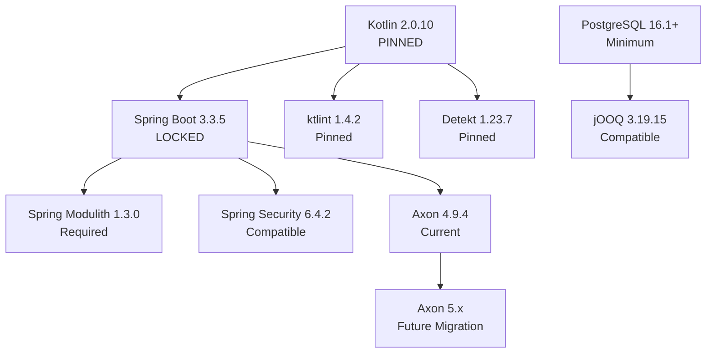

# Technology Stack

## Overview

The EAF technology stack is carefully curated to deliver enterprise-grade reliability, developer productivity, and long-term maintainability. All technology choices are production-tested and version-locked to ensure compatibility and stability.

## Critical Version Constraints

⚠️ **CRITICAL**: These version constraints are MANDATORY and must not be changed without architecture review:

| Technology | Version | Constraint Type | Rationale |
|------------|---------|----------------|-----------|
| **Kotlin** | 2.0.10 | PINNED | Tool compatibility (ktlint 1.4.2, detekt 1.23.7) |
| **Spring Boot** | 3.3.5 | LOCKED | Spring Modulith 1.3.0 compatibility requirement |
| **JVM** | 21 LTS | Required | Spring Boot 3.3.5 baseline requirement |

## Core Technologies

### Language & Runtime

```kotlin
// gradle/libs.versions.toml
[versions]
kotlin = "2.0.10"          # PINNED - Do not change
java = "21"                # LTS requirement
```

**Kotlin 2.0.10 Features Used**:
- Null safety for reduced runtime errors
- Data classes for immutable domain objects
- Coroutines for async processing
- Extension functions for clean APIs
- Sealed classes for domain modeling

**JVM 21 LTS Benefits**:
- Virtual threads for improved concurrency
- Pattern matching (preview features)
- Enhanced garbage collection
- Security improvements
- Long-term support until 2031

### Framework Stack

```kotlin
// Spring Boot 3.3.5 (LOCKED)
[versions]
spring-boot = "3.3.5"     # LOCKED for Spring Modulith
spring-modulith = "1.3.0" # Module boundary enforcement
axon = "4.9.4"            # CQRS/Event Sourcing
arrow = "1.2.4"           # Functional programming
```

#### Spring Boot 3.3.5 (LOCKED)

**Why This Version**:
- Required for Spring Modulith 1.3.0 compatibility
- Stable foundation for enterprise applications
- Complete Jakarta EE 9+ migration
- Native compilation ready (GraalVM)

**Key Dependencies**:
```kotlin
dependencies {
    implementation(libs.spring.boot.starter.web)
    implementation(libs.spring.boot.starter.data.jpa)
    implementation(libs.spring.boot.starter.security)
    implementation(libs.spring.boot.starter.actuator)
    implementation(libs.spring.boot.starter.validation)
    implementation(libs.spring.modulith.starter.core)
}
```

#### Axon Framework 4.9.4

**CQRS/Event Sourcing Implementation**:
```kotlin
[versions]
axon = "4.9.4"

[libraries]
axon-spring-boot-starter = { module = "org.axonframework:axon-spring-boot-starter", version.ref = "axon" }
axon-test = { module = "org.axonframework:axon-test", version.ref = "axon" }

[bundles]
axon-framework = ["axon-spring-boot-starter"]
```

**Migration Path**: Axon 5.x migration planned after initial implementation
- Current: 4.9.4 (stable, production-tested)
- Target: 5.x (improved performance, modern APIs)
- Timeline: Post-MVP implementation

#### Arrow 1.2.4 (Functional Programming)

**Either Types for Error Handling**:
```kotlin
[versions]
arrow = "1.2.4"

[libraries]
arrow-core = { module = "io.arrow-kt:arrow-core", version.ref = "arrow" }
arrow-fx = { module = "io.arrow-kt:arrow-fx-coroutines", version.ref = "arrow" }
```

**Usage Pattern**:
```kotlin
fun createProduct(command: CreateProductCommand): Either<DomainError, Product> = either {
    // Validation and business logic
    val validatedCommand = validateCommand(command).bind()
    val product = Product.create(validatedCommand).bind()
    repository.save(product).bind()
}
```

### Database Stack

#### PostgreSQL 16.1+ (Primary Database)

**Version Requirements**:
```yaml
# docker-compose.yml
services:
  postgres:
    image: postgres:16.1-alpine
    environment:
      POSTGRES_VERSION: "16.1"  # Minimum version
```

**Mandatory Optimizations**:
```sql
-- BRIN Indexes for time-series event data
CREATE INDEX CONCURRENTLY idx_events_timestamp_brin
ON domain_event_entry USING BRIN (time_stamp, tenant_id);

-- Time-based partitioning
CREATE TABLE domain_event_entry_2025_01
PARTITION OF domain_event_entry
FOR VALUES FROM ('2025-01-01') TO ('2025-02-01');

-- Connection pooling settings
max_connections = 200
shared_buffers = 256MB
effective_cache_size = 1GB
```

**Prohibited Alternatives**:
- ❌ H2 Database (forbidden in all environments)
- ❌ MySQL (limited event sourcing support)
- ❌ SQLite (not enterprise-grade)

#### jOOQ (Type-Safe SQL)

**Read Projection Queries**:
```kotlin
[versions]
jooq = "3.19.15"

[libraries]
jooq = { module = "org.jooq:jooq", version.ref = "jooq" }
jooq-codegen = { module = "org.jooq:jooq-codegen", version.ref = "jooq" }
```

**Code Generation**:
```kotlin
// Generated type-safe queries
val products = dsl.select()
    .from(PRODUCT_PROJECTION)
    .where(PRODUCT_PROJECTION.TENANT_ID.eq(tenantId))
    .and(PRODUCT_PROJECTION.STATUS.eq(ProductStatus.ACTIVE))
    .fetchInto(ProductProjection::class.java)
```

### Security Stack

#### Keycloak 26.0.0 (Identity Provider)

```yaml
# docker-compose.yml
services:
  keycloak:
    image: quay.io/keycloak/keycloak:26.0.0
    command: start-dev
    environment:
      KEYCLOAK_ADMIN: admin
      KEYCLOAK_ADMIN_PASSWORD: admin
```

**Features Used**:
- OpenID Connect / OAuth 2.0
- Multi-realm tenant isolation
- Role-based access control
- Token revocation support
- Admin REST API

#### Spring Security 6.x

```kotlin
[libraries]
spring-security-oauth2-jose = { module = "org.springframework.security:spring-security-oauth2-jose" }
spring-security-oauth2-client = { module = "org.springframework.security:spring-security-oauth2-client" }
```

**JWT Validation Configuration**:
```kotlin
@Configuration
class SecurityConfig {
    @Bean
    fun jwtDecoder(): JwtDecoder {
        return JwtDecoders.fromOidcIssuerLocation("http://localhost:8180/realms/eaf")
    }
}
```

### Workflow Engine

#### Flowable 7.1.x (BPMN)

```kotlin
[versions]
flowable = "7.1.0"

[libraries]
flowable-spring-boot-starter = { module = "org.flowable:flowable-spring-boot-starter", version.ref = "flowable" }
```

**Integration with Axon**:
```kotlin
@Component
class FlowableAxonBridge(
    private val commandGateway: CommandGateway
) : JavaDelegate {
    override fun execute(execution: DelegateExecution) {
        val command = createCommandFromExecution(execution)
        commandGateway.sendAndWait<Any>(command)
    }
}
```

## Development & Quality Tools

### Testing Framework (Kotest ONLY)

⚠️ **CRITICAL**: JUnit is explicitly FORBIDDEN. Use Kotest exclusively.

```kotlin
[versions]
kotest = "5.9.1"
testcontainers = "1.20.4"

[libraries]
kotest-runner-junit5 = { module = "io.kotest:kotest-runner-junit5", version.ref = "kotest" }
kotest-assertions-core = { module = "io.kotest:kotest-assertions-core", version.ref = "kotest" }
kotest-property = { module = "io.kotest:kotest-property", version.ref = "kotest" }
kotest-extensions-spring = { module = "io.kotest:kotest-extensions-spring", version.ref = "kotest" }
testcontainers-postgresql = { module = "org.testcontainers:postgresql", version.ref = "testcontainers" }
```

**Test Structure**:
```kotlin
class ProductServiceTest : BehaviorSpec({
    Given("a product service") {
        When("creating a product") {
            Then("product should be saved") {
                // Test implementation
            }
        }
    }
})
```

**❌ PROHIBITED JUnit Usage**:
```kotlin
// NEVER USE THESE
@Test            // JUnit annotation - FORBIDDEN
@Disabled        // JUnit annotation - IGNORED by Kotest
@BeforeEach      // JUnit annotation - FORBIDDEN
```

### Code Quality Tools

#### ktlint 1.4.2 (Code Formatting)

```kotlin
[versions]
ktlint = "1.4.2"  # Pinned for Kotlin 2.0.10 compatibility

[plugins]
ktlint = { id = "org.jlleitschuh.gradle.ktlint", version = "12.1.1" }
```

**Configuration**:
```kotlin
ktlint {
    version.set(libs.versions.ktlint)
    verbose.set(true)
    android.set(false)
    outputToConsole.set(true)
    reporters {
        reporter(ReporterType.CHECKSTYLE)
        reporter(ReporterType.JSON)
    }
}
```

**Zero Violations Policy**: All code must pass ktlint without warnings

#### Detekt 1.23.7 (Static Analysis)

```kotlin
[versions]
detekt = "1.23.7"  # Pinned for Kotlin 2.0.10 compatibility

[plugins]
detekt = { id = "io.gitlab.arturbosch.detekt", version.ref = "detekt" }
```

**Configuration (detekt.yml)**:
```yaml
style:
  WildcardImport:
    active: true
    excludeImports: []  # No wildcard imports allowed

complexity:
  ComplexMethod:
    active: true
    threshold: 15
```

#### Konsist 0.18.0 (Architecture Testing)

```kotlin
[versions]
konsist = "0.18.0"

[libraries]
konsist = { module = "com.lemonappdev:konsist", version.ref = "konsist" }
```

**Module Boundary Verification**:
```kotlin
@Test
fun `modules should not have circular dependencies`() {
    Konsist.scopeFromProject()
        .modules()
        .assertDoesNotHaveCircularDependencies()
}
```

#### Pitest 1.17.5 (Mutation Testing)

```kotlin
[plugins]
pitest = { id = "info.solidsoft.pitest", version = "1.15.0" }

// Configuration
pitest {
    targetClasses.set(setOf("com.axians.eaf.*"))
    excludedClasses.set(setOf("*Test*", "*Spec*"))
    mutationThreshold.set(80) // Minimum 80% mutation coverage
}
```

### Build System

#### Gradle 8.14 (Build Tool)

```properties
# gradle/wrapper/gradle-wrapper.properties
distributionUrl=https\://services.gradle.org/distributions/gradle-8.14-bin.zip
```

**Version Catalog (gradle/libs.versions.toml)**:
```toml
[versions]
# Core (Version Locked)
kotlin = "2.0.10"
spring-boot = "3.3.5"
java = "21"

# Framework
axon = "4.9.4"
spring-modulith = "1.3.0"
arrow = "1.2.4"

# Database
postgresql = "42.7.4"
jooq = "3.19.15"

# Security
spring-security = "6.4.2"

# Testing (Kotest only)
kotest = "5.9.1"
testcontainers = "1.20.4"

# Quality
ktlint = "1.4.2"
detekt = "1.23.7"
konsist = "0.18.0"

# Workflow
flowable = "7.1.0"

# Documentation
dokka = "1.9.10"
```

**Convention Plugins**:
```kotlin
// build-logic/src/main/kotlin/eaf.kotlin-common.gradle.kts
plugins {
    kotlin("jvm")
    id("org.jlleitschuh.gradle.ktlint")
    id("io.gitlab.arturbosch.detekt")
}

kotlin {
    jvmToolchain(21)
    compilerOptions {
        allWarningsAsErrors.set(true)
        freeCompilerArgs.add("-Xjsr305=strict")
    }
}
```

## Infrastructure Requirements

### Container Runtime

**Supported Platforms**:
```dockerfile
# Multi-architecture support
FROM openjdk:21-jdk-slim

# Platform support
ARG TARGETPLATFORM
ARG BUILDPLATFORM

# Supported: linux/amd64, linux/arm64, linux/ppc64le
```

**Requirements**:
- Docker 24.x / Podman 4.x
- Multi-architecture image support
- Resource limits enforcement

### Minimum System Requirements

| Environment | vCPU | Memory | Storage | Notes |
|-------------|------|---------|---------|-------|
| **Development** | 2 | 4GB | 20GB | Local development |
| **Testing** | 4 | 8GB | 50GB | CI/CD pipelines |
| **Staging** | 4 | 8GB | 100GB | Pre-production |
| **Production** | 8+ | 16GB+ | 500GB+ | Customer hosting |

### Network Requirements

```yaml
# Required ports
ports:
  - "8080:8080"    # Application
  - "5432:5432"    # PostgreSQL
  - "8180:8180"    # Keycloak
  - "6379:6379"    # Redis
  - "9090:9090"    # Prometheus (monitoring)
  - "3000:3000"    # React Admin
```

## Compatibility Matrix

### Supported Architectures

| Architecture | Status | Target Platform | Notes |
|--------------|--------|-----------------|-------|
| **linux/amd64** | ✅ Primary | Intel/AMD x86_64 | Most common deployment |
| **linux/arm64** | ✅ Supported | Apple Silicon, AWS Graviton | Growing adoption |
| **linux/ppc64le** | ✅ Supported | IBM Power Systems | Enterprise requirement |

### Version Compatibility



## Quality Gate Configuration

### CI/CD Pipeline Tools

```yaml
# .github/workflows/quality.yml
jobs:
  formatting:
    runs-on: ubuntu-latest
    steps:
      - run: ./gradlew ktlintCheck  # Zero violations required

  static-analysis:
    runs-on: ubuntu-latest
    steps:
      - run: ./gradlew detekt      # Zero violations required

  architecture:
    runs-on: ubuntu-latest
    steps:
      - run: ./gradlew konsistTest # Architecture compliance

  mutation-testing:
    runs-on: ubuntu-latest
    steps:
      - run: ./gradlew pitest      # 80% minimum coverage
```

### Quality Enforcement

All quality gates are enforced with **zero violations policy**:

1. **ktlint**: Code formatting must be perfect
2. **Detekt**: No static analysis violations
3. **Konsist**: Architecture rules must pass
4. **Pitest**: 80% minimum mutation coverage
5. **Test Coverage**: 85% minimum line coverage

## Migration Considerations

### Axon Framework 5.x Migration

**Current State**: Axon 4.9.4 (stable)
**Target State**: Axon 5.x (planned)

**Migration Timeline**:
1. Complete initial implementation on 4.9.4
2. Evaluate 5.x stability and features
3. Plan migration during maintenance window
4. Implement migration with backward compatibility

**Breaking Changes to Expect**:
- Event upcasting improvements
- Configuration simplification
- Performance optimizations
- API modernization

### Spring Boot Upgrades

**Current Lock**: 3.3.5 (required for Spring Modulith 1.3.0)
**Future Considerations**: Monitor Spring Modulith compatibility

## Tool Integration

### IDE Requirements

**IntelliJ IDEA** (Recommended):
```kotlin
// .editorconfig
[*.kt]
ij_kotlin_imports_layout = *
ij_kotlin_code_style_defaults = KOTLIN_OFFICIAL
```

**VS Code** (Supported):
- Kotlin Language Server
- Gradle extension
- Test runner integration

### Local Development Tools

```bash
# Required tools
java -version      # Java 21
docker --version   # Docker 24.x
gradle --version   # Gradle 8.14
kotlin -version    # Kotlin 2.0.10

# Optional but recommended
helm version       # Kubernetes deployments
kubectl version    # Kubernetes management
```

## Performance Considerations

### JVM Tuning

```bash
# Production JVM flags
JAVA_OPTS="-Xmx2g -Xms2g \
  -XX:+UseG1GC \
  -XX:MaxGCPauseMillis=200 \
  -XX:+UseStringDeduplication \
  -XX:+EnableJVMCI"
```

### Database Optimization

```sql
-- PostgreSQL configuration
shared_preload_libraries = 'pg_stat_statements'
max_connections = 200
shared_buffers = 256MB
effective_cache_size = 1GB
random_page_cost = 1.1
```

## Related Documentation

- **[High-Level Architecture](high-level-architecture.md)** - System overview and patterns
- **[System Components](components.md)** - Implementation using these technologies
- **[Development Workflow](development-workflow.md)** - Setup procedures and tooling
- **[Coding Standards](coding-standards-revision-2.md)** - Implementation guidelines

---

**Next Steps**: Review [System Components](components.md) for implementation examples using this technology stack, then proceed to [Development Workflow](development-workflow.md) for setup procedures.