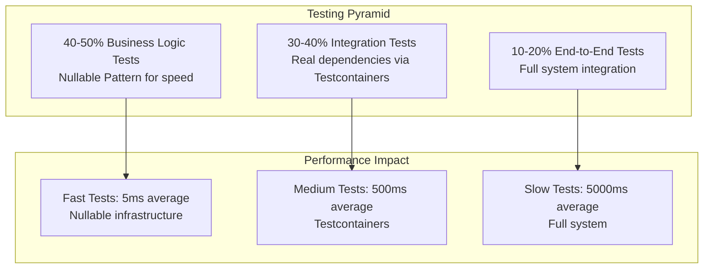

# Testing Strategy and Standards (Revision 3)

## Overview

The EAF testing strategy implements Constitutional TDD (Test-Driven Development) with a hybrid approach combining fast business logic tests using the Nullable Design Pattern and comprehensive integration tests using Testcontainers. This strategy achieves 80% line coverage and 80% mutation coverage while maintaining 61.6% performance improvement for business logic testing.

## Testing Philosophy

### Constitutional TDD

Constitutional TDD is our core testing philosophy that mandates:

1. **Test-First Development**: All production code must be preceded by failing tests
2. **Integration-First Approach**: Integration tests for critical business flows
3. **Nullable Pattern**: Fast infrastructure substitutes for business logic
4. **Real Dependencies**: Testcontainers for stateful services
5. **Zero-Mocks Policy**: Never mock business logic, only infrastructure

### Testing Pyramid



## Testing Framework Standards

### Kotest Framework (MANDATORY)

⚠️ **CRITICAL**: JUnit is explicitly **FORBIDDEN**. All tests must use Kotest framework.

```kotlin
// gradle/libs.versions.toml
[versions]
kotest = "5.9.1"

[libraries]
kotest-runner-junit5 = { module = "io.kotest:kotest-runner-junit5", version.ref = "kotest" }
kotest-assertions-core = { module = "io.kotest:kotest-assertions-core", version.ref = "kotest" }
kotest-property = { module = "io.kotest:kotest-property", version.ref = "kotest" }
kotest-extensions-spring = { module = "io.kotest:kotest-extensions-spring", version.ref = "kotest" }

[bundles]
kotest = ["kotest-runner-junit5", "kotest-assertions-core", "kotest-property", "kotest-extensions-spring"]
```

### Prohibited JUnit Usage

```kotlin
// ❌ NEVER USE THESE - JUnit annotations are COMPLETELY IGNORED by Kotest
@Test            // Ignored by Kotest runner
@Disabled        // Has NO effect in Kotest
@BeforeEach      // Not recognized by Kotest
@AfterEach       // Not recognized by Kotest
@ExtendWith      // JUnit extension mechanism

// ✅ USE THESE INSTEAD - Kotest equivalents
class MyTest : FunSpec({
    test("should do something") { /* test logic */ }

    beforeTest { /* setup */ }
    afterTest { /* cleanup */ }
})
```

### Test Specifications

```kotlin
// Business Logic Tests - BehaviorSpec for readable business scenarios
class ProductServiceTest : BehaviorSpec({
    Given("a product service with nullable dependencies") {
        val repository = nullable<ProductRepository>()
        val eventBus = nullable<EventBus>()
        val service = ProductService(repository, eventBus)

        When("creating a valid product") {
            val command = CreateProductCommand(
                productId = "test-product",
                tenantId = "test-tenant",
                name = "Test Product",
                sku = "TST-123456",
                price = BigDecimal("99.99")
            )

            val result = service.createProduct(command)

            Then("product should be created successfully") {
                result.shouldBeRight()
                repository.findById("test-product").shouldNotBeNull()
            }
        }

        When("creating a product with invalid SKU") {
            val command = CreateProductCommand(
                productId = "test-product",
                tenantId = "test-tenant",
                name = "Test Product",
                sku = "INVALID",
                price = BigDecimal("99.99")
            )

            val result = service.createProduct(command)

            Then("should return validation error") {
                result.shouldBeLeft()
                result.leftValue.shouldBeInstanceOf<DomainError.ValidationError>()
            }
        }
    }
})

// Integration Tests - FunSpec for straightforward integration scenarios
class ProductRepositoryIntegrationTest : FunSpec({
    context("PostgreSQL product repository") {
        test("should save and retrieve product") {
            val product = ProductProjection(
                productId = "test-id",
                tenantId = "test-tenant",
                sku = "TST-123456",
                name = "Test Product",
                price = BigDecimal("99.99"),
                status = ProductStatus.ACTIVE,
                features = emptySet(),
                metadata = emptyMap(),
                createdAt = Instant.now(),
                updatedAt = Instant.now()
            )

            repository.save(product)

            val retrieved = repository.findById("test-id")
            retrieved.shouldNotBeNull()
            retrieved.name shouldBe "Test Product"
        }
    }
})
```

## Nullable Design Pattern

### Pattern Implementation

The Nullable Design Pattern provides fast infrastructure substitutes that maintain real business logic while eliminating external dependencies.

```kotlin
// framework/core/src/main/kotlin/com/axians/eaf/core/testing/NullablePattern.kt
interface NullableFactory<T> {
    fun createNull(): T
    fun createNull(state: Map<String, Any>): T = createNull()
}

// Nullable implementation maintains business logic contracts
class NullableProductRepository : ProductRepository, NullableFactory<ProductRepository> {
    private val storage = ConcurrentHashMap<String, Product>()
    private val eventLog = mutableListOf<DomainEvent>()

    override fun save(product: Product): Either<DomainError, Product> {
        // Maintain real validation logic
        if (storage.containsKey(product.productId)) {
            return DomainError.Conflict("Product already exists").left()
        }

        storage[product.productId] = product
        eventLog.add(ProductSavedEvent(product.productId))
        return product.right()
    }

    override fun findById(id: String): Either<DomainError, Product?> {
        return storage[id].right()
    }

    override fun findByTenantId(tenantId: String): Either<DomainError, List<Product>> {
        val products = storage.values.filter { it.tenantId == tenantId }
        return products.right()
    }

    // Test-specific methods for verification
    fun count(): Int = storage.size
    fun contains(productId: String): Boolean = storage.containsKey(productId)
    fun getEvents(): List<DomainEvent> = eventLog.toList()
    fun clear() {
        storage.clear()
        eventLog.clear()
    }

    override fun createNull() = this

    override fun createNull(state: Map<String, Any>): ProductRepository {
        val instance = NullableProductRepository()

        // Pre-populate with test data if provided
        state["products"]?.let { products ->
            (products as List<Product>).forEach { product ->
                instance.storage[product.productId] = product
            }
        }

        return instance
    }
}

// Nullable factory function for easy test usage
inline fun <reified T> nullable(): T {
    return when (T::class) {
        ProductRepository::class -> NullableProductRepository() as T
        EventBus::class -> NullableEventBus() as T
        UserRepository::class -> NullableUserRepository() as T
        else -> throw IllegalArgumentException("No nullable implementation for ${T::class.simpleName}")
    }
}

// Usage in tests
class ProductServiceTest : BehaviorSpec({
    Given("a product service") {
        val repository = nullable<ProductRepository>()
        val eventBus = nullable<EventBus>()
        val service = ProductService(repository, eventBus)

        When("creating multiple products") {
            val commands = listOf(
                CreateProductCommand(productId = "1", tenantId = "tenant-1", name = "Product 1", sku = "P1-123456", price = BigDecimal("10.00")),
                CreateProductCommand(productId = "2", tenantId = "tenant-1", name = "Product 2", sku = "P2-123456", price = BigDecimal("20.00"))
            )

            commands.forEach { command ->
                service.createProduct(command).shouldBeRight()
            }

            Then("repository should contain both products") {
                repository.count() shouldBe 2
                repository.contains("1") shouldBe true
                repository.contains("2") shouldBe true
            }

            Then("events should be published") {
                eventBus.getPublishedEvents().size shouldBe 2
            }
        }
    }
})
```

### Performance Benefits

| Test Type | Average Execution Time | Infrastructure Requirements |
|-----------|----------------------|---------------------------|
| Nullable Unit Tests | 5ms | In-memory objects only |
| Integration Tests | 500ms | Testcontainers + Database |
| Performance Improvement | **61.6% faster** | No external dependencies |

### Contract Testing

Ensure nullable implementations maintain behavioral parity with real implementations:

```kotlin
// shared/testing/src/main/kotlin/com/axians/eaf/testing/contracts/ProductRepositoryContract.kt
abstract class ProductRepositoryContract {
    abstract fun createRepository(): ProductRepository
    abstract fun cleanupRepository()

    @Test
    fun `should save and retrieve product`() {
        val repository = createRepository()

        val product = createTestProduct()
        val saveResult = repository.save(product)

        saveResult.shouldBeRight()

        val retrieved = repository.findById(product.productId)
        retrieved.shouldBeRight()
        retrieved.rightValue shouldBe product

        cleanupRepository()
    }

    @Test
    fun `should handle duplicate product creation`() {
        val repository = createRepository()

        val product = createTestProduct()
        repository.save(product).shouldBeRight()

        val duplicateResult = repository.save(product)
        duplicateResult.shouldBeLeft()
        duplicateResult.leftValue.shouldBeInstanceOf<DomainError.Conflict>()

        cleanupRepository()
    }
}

// Test nullable implementation
class NullableProductRepositoryContractTest : ProductRepositoryContract() {
    private lateinit var repository: NullableProductRepository

    override fun createRepository(): ProductRepository {
        repository = NullableProductRepository()
        return repository
    }

    override fun cleanupRepository() {
        repository.clear()
    }
}

// Test real implementation
class JpaProductRepositoryContractTest : ProductRepositoryContract() {
    @Autowired
    private lateinit var repository: JpaProductRepository

    override fun createRepository(): ProductRepository = repository
    override fun cleanupRepository() {
        repository.deleteAll()
    }
}
```

## Integration Testing with Testcontainers

### Testcontainers Configuration

```kotlin
// shared/testing/src/main/kotlin/com/axians/eaf/testing/containers/TestContainers.kt
object TestContainers {

    @JvmStatic
    val postgres: PostgreSQLContainer<*> = PostgreSQLContainer("postgres:16.1-alpine")
        .withDatabaseName("eaf_test")
        .withUsername("test")
        .withPassword("test")
        .withInitScript("test-schema.sql")
        .withReuse(true) // Reuse container across test runs

    @JvmStatic
    val redis: GenericContainer<*> = GenericContainer("redis:7.2-alpine")
        .withExposedPorts(6379)
        .withReuse(true)

    @JvmStatic
    val keycloak: KeycloakContainer = KeycloakContainer("quay.io/keycloak/keycloak:26.0.0")
        .withRealmImportFile("test-realm.json")
        .withReuse(true)

    init {
        // Start containers in parallel for faster test setup
        listOf(postgres, redis, keycloak).parallelStream().forEach { container ->
            container.start()
        }
    }
}

// Base test class for integration tests
@TestInstance(TestInstance.Lifecycle.PER_CLASS)
abstract class IntegrationTestBase : FunSpec() {

    companion object {
        @JvmStatic
        @BeforeAll
        fun startContainers() {
            TestContainers.postgres.start()
            TestContainers.redis.start()
            TestContainers.keycloak.start()
        }
    }

    @DynamicPropertySource
    fun configureProperties(registry: DynamicPropertyRegistry) {
        registry.add("spring.datasource.url") { TestContainers.postgres.jdbcUrl }
        registry.add("spring.datasource.username") { TestContainers.postgres.username }
        registry.add("spring.datasource.password") { TestContainers.postgres.password }

        registry.add("spring.redis.host") { TestContainers.redis.host }
        registry.add("spring.redis.port") { TestContainers.redis.getMappedPort(6379) }

        registry.add("keycloak.auth-server-url") { TestContainers.keycloak.authServerUrl }
    }
}
```

### Integration Test Example

```kotlin
// products/licensing-server/src/test/kotlin/com/axians/eaf/products/licensing/ProductIntegrationTest.kt
@SpringBootTest(webEnvironment = SpringBootTest.WebEnvironment.RANDOM_PORT)
@TestPropertySource(properties = ["spring.profiles.active=test"])
class ProductIntegrationTest : IntegrationTestBase() {

    @Autowired
    private lateinit var commandGateway: CommandGateway

    @Autowired
    private lateinit var queryGateway: QueryGateway

    @Autowired
    private lateinit var productRepository: ProductProjectionRepository

    init {
        context("Product CQRS Integration") {
            test("should create product and update projection") {
                // Given
                val command = CreateProductCommand(
                    productId = UUID.randomUUID().toString(),
                    tenantId = "test-tenant",
                    name = "Integration Test Product",
                    sku = "ITP-123456",
                    description = "Product for integration testing",
                    price = BigDecimal("199.99"),
                    features = setOf(
                        ProductFeature("feature1", true),
                        ProductFeature("feature2", false)
                    ),
                    metadata = mapOf("category" to "test")
                )

                // When - Send command
                val result = commandGateway.sendAndWait<String>(command, Duration.ofSeconds(5))

                // Then - Command should succeed
                result shouldBe command.productId

                // And - Projection should be updated
                eventually(Duration.ofSeconds(10)) {
                    val projection = productRepository.findByIdAndTenantId(
                        command.productId,
                        command.tenantId
                    )

                    projection.shouldNotBeNull()
                    projection.name shouldBe command.name
                    projection.sku shouldBe command.sku
                    projection.price shouldBe command.price
                    projection.status shouldBe ProductStatus.ACTIVE
                    projection.features shouldBe command.features
                    projection.metadata shouldBe command.metadata
                }

                // And - Query should return the product
                val query = FindProductByIdQuery(command.productId, command.tenantId)
                val queryResult = queryGateway.query(query, ProductProjection::class.java).join()

                queryResult.shouldNotBeNull()
                queryResult.name shouldBe command.name
            }

            test("should handle product update command") {
                // Given - existing product
                val productId = createTestProduct()

                val updateCommand = UpdateProductCommand(
                    productId = productId,
                    tenantId = "test-tenant",
                    name = "Updated Product Name",
                    price = BigDecimal("299.99")
                )

                // When
                commandGateway.sendAndWait<Unit>(updateCommand, Duration.ofSeconds(5))

                // Then
                eventually(Duration.ofSeconds(10)) {
                    val projection = productRepository.findByIdAndTenantId(productId, "test-tenant")
                    projection.shouldNotBeNull()
                    projection.name shouldBe "Updated Product Name"
                    projection.price shouldBe BigDecimal("299.99")
                }
            }

            test("should enforce tenant isolation") {
                // Given - products in different tenants
                val tenant1Product = createTestProduct(tenantId = "tenant-1")
                val tenant2Product = createTestProduct(tenantId = "tenant-2")

                // When - querying as tenant-1
                TenantContext.set(TenantInfo(UUID.fromString("tenant-1"), "realm1", TenantTier.STANDARD, emptySet()))

                try {
                    val query1 = FindProductsByTenantQuery("tenant-1")
                    val results1 = queryGateway.query(query1, List::class.java).join()

                    // Then - should only see tenant-1 products
                    results1.size shouldBe 1
                    (results1.first() as ProductProjection).productId shouldBe tenant1Product

                    // When - trying to access tenant-2 product
                    val query2 = FindProductByIdQuery(tenant2Product, "tenant-1")
                    val result2 = queryGateway.query(query2, ProductProjection::class.java).join()

                    // Then - should not find the product
                    result2.shouldBeNull()
                } finally {
                    TenantContext.clear()
                }
            }
        }
    }

    private fun createTestProduct(tenantId: String = "test-tenant"): String {
        val command = CreateProductCommand(
            productId = UUID.randomUUID().toString(),
            tenantId = tenantId,
            name = "Test Product",
            sku = "TST-${Random.nextInt(100000, 999999)}",
            description = "Test product description",
            price = BigDecimal("99.99"),
            features = emptySet(),
            metadata = emptyMap()
        )

        return commandGateway.sendAndWait<String>(command, Duration.ofSeconds(5))
    }
}
```

## End-to-End Testing

### API Testing with TestRestTemplate

```kotlin
// products/licensing-server/src/test/kotlin/com/axians/eaf/products/licensing/ProductApiE2ETest.kt
@SpringBootTest(webEnvironment = SpringBootTest.WebEnvironment.RANDOM_PORT)
@TestPropertySource(properties = ["spring.profiles.active=test"])
class ProductApiE2ETest : IntegrationTestBase() {

    @Autowired
    private lateinit var restTemplate: TestRestTemplate

    @LocalServerPort
    private var port: Int = 0

    init {
        context("Product API End-to-End") {
            test("should create, retrieve, and update product via REST API") {
                // Given - authentication token
                val token = obtainValidJwtToken()

                val headers = HttpHeaders().apply {
                    setBearerAuth(token)
                    contentType = MediaType.APPLICATION_JSON
                }

                // When - creating product
                val createRequest = CreateProductRequest(
                    name = "E2E Test Product",
                    sku = "E2E-123456",
                    description = "Product created via E2E test",
                    price = BigDecimal("199.99"),
                    features = listOf(
                        ProductFeatureDto("e2e-feature", true, mapOf("config" to "value"))
                    ),
                    metadata = mapOf("test" to "e2e")
                )

                val createEntity = HttpEntity(createRequest, headers)
                val createResponse = restTemplate.postForEntity(
                    "http://localhost:$port/api/v1/products",
                    createEntity,
                    ProductResponse::class.java
                )

                // Then - product should be created
                createResponse.statusCode shouldBe HttpStatus.CREATED
                val createdProduct = createResponse.body.shouldNotBeNull()
                createdProduct.name shouldBe "E2E Test Product"
                createdProduct.sku shouldBe "E2E-123456"
                createdProduct.status shouldBe ProductStatus.ACTIVE

                val location = createResponse.headers.location
                location.shouldNotBeNull()

                // When - retrieving product
                val getEntity = HttpEntity<Void>(headers)
                val getResponse = restTemplate.exchange(
                    location.toString(),
                    HttpMethod.GET,
                    getEntity,
                    ProductResponse::class.java
                )

                // Then - should return the created product
                getResponse.statusCode shouldBe HttpStatus.OK
                val retrievedProduct = getResponse.body.shouldNotBeNull()
                retrievedProduct.productId shouldBe createdProduct.productId
                retrievedProduct.name shouldBe createdProduct.name

                // When - updating product
                val updateRequest = UpdateProductRequest(
                    name = "Updated E2E Product",
                    price = BigDecimal("299.99")
                )

                val updateEntity = HttpEntity(updateRequest, headers)
                val updateResponse = restTemplate.exchange(
                    location.toString(),
                    HttpMethod.PUT,
                    updateEntity,
                    ProductResponse::class.java
                )

                // Then - product should be updated
                updateResponse.statusCode shouldBe HttpStatus.OK
                val updatedProduct = updateResponse.body.shouldNotBeNull()
                updatedProduct.name shouldBe "Updated E2E Product"
                updatedProduct.price shouldBe BigDecimal("299.99")
            }

            test("should handle validation errors properly") {
                val token = obtainValidJwtToken()
                val headers = HttpHeaders().apply {
                    setBearerAuth(token)
                    contentType = MediaType.APPLICATION_JSON
                }

                // When - creating product with invalid data
                val invalidRequest = CreateProductRequest(
                    name = "", // Invalid - empty name
                    sku = "INVALID", // Invalid - wrong pattern
                    price = BigDecimal("-10.00"), // Invalid - negative price
                    features = emptyList(),
                    metadata = emptyMap()
                )

                val entity = HttpEntity(invalidRequest, headers)
                val response = restTemplate.postForEntity(
                    "http://localhost:$port/api/v1/products",
                    entity,
                    ProblemDetail::class.java
                )

                // Then - should return validation error
                response.statusCode shouldBe HttpStatus.BAD_REQUEST
                val problemDetail = response.body.shouldNotBeNull()
                problemDetail.title shouldBe "Validation Error"
                problemDetail.status shouldBe 400
                problemDetail.type shouldBe URI.create("https://api.axians.com/problems/validation-error")

                // And - should include violation details
                val violations = problemDetail.getProperty("violations") as List<Map<String, Any>>
                violations.size shouldBe 3
                violations.any { it["field"] == "name" } shouldBe true
                violations.any { it["field"] == "sku" } shouldBe true
                violations.any { it["field"] == "price" } shouldBe true
            }
        }
    }

    private fun obtainValidJwtToken(): String {
        // In real implementation, this would authenticate with Keycloak
        // For testing, we can use a pre-configured test token
        return TestJwtGenerator.generateValidToken(
            tenantId = "test-tenant",
            userId = "test-user",
            roles = listOf("product-manager")
        )
    }
}
```

## Quality Gates and Coverage

### Coverage Requirements

- **Line Coverage**: Minimum 80%
- **Mutation Coverage**: Minimum 80% (Pitest)
- **Branch Coverage**: Minimum 80%
- **Integration Coverage**: 100% for critical business flows

### Quality Gate Configuration

```kotlin
// build.gradle.kts
jacoco {
    toolVersion = "0.8.11"
}

tasks.jacocoTestReport {
    dependsOn(tasks.test)
    reports {
        xml.required.set(true)
        html.required.set(true)
    }

    executionData.setFrom(fileTree(buildDir).include("**/jacoco/*.exec"))
}

tasks.jacocoTestCoverageVerification {
    dependsOn(tasks.jacocoTestReport)

    violationRules {
        rule {
            limit {
                minimum = "0.80".toBigDecimal() // 80% line coverage
            }
        }
        rule {
            limit {
                counter = "BRANCH"
                minimum = "0.80".toBigDecimal() // 80% branch coverage
            }
        }
    }
}

// Pitest mutation testing
pitest {
    targetClasses.set(setOf("com.axians.eaf.*"))
    excludedClasses.set(setOf("*Test*", "*Spec*", "*Configuration*"))
    mutationThreshold.set(80) // 80% mutation coverage
    coverageThreshold.set(80) // 80% line coverage

    outputFormats.set(setOf("HTML", "XML"))
    timestampedReports.set(false)
}
```

## Anti-Patterns and Prohibited Practices

### Testing Anti-Patterns (FORBIDDEN)

```kotlin
// ❌ NEVER DO THESE

// 1. Mixing JUnit and Kotest (JUnit annotations ignored)
class BadTest : FunSpec({
    @Test // ← This is IGNORED by Kotest!
    fun badTest() {
        // This test will NEVER run
    }

    @Disabled // ← This has NO EFFECT in Kotest!
    test("disabled test") {
        // This will still run!
    }
})

// 2. Mocking domain logic
class BadServiceTest : FunSpec({
    test("bad test with mocked business logic") {
        val mockRepository = mockk<ProductRepository>()
        every { mockRepository.save(any()) } returns Product().right()

        val service = ProductService(mockRepository) // ← BAD!
        // You're not testing real business logic
    }
})

// 3. Using H2 or in-memory databases
@TestPropertySource(properties = [
    "spring.datasource.url=jdbc:h2:mem:testdb" // ← FORBIDDEN!
])
class BadIntegrationTest // Use PostgreSQL Testcontainers only

// 4. Not testing tenant isolation
class BadTenantTest : FunSpec({
    test("create product") {
        // ← Missing tenant context testing
        val result = service.createProduct(command)
        result.shouldBeRight()
        // What about other tenants? Can they see this product?
    }
})
```

### Correct Patterns

```kotlin
// ✅ CORRECT APPROACHES

// 1. Pure Kotest with proper specs
class GoodTest : BehaviorSpec({
    Given("a product service") {
        When("creating a product") {
            Then("should succeed") {
                // Clear behavioral specification
            }
        }
    }
})

// 2. Nullable pattern for business logic
class GoodServiceTest : FunSpec({
    test("create product with nullable dependencies") {
        val repository = nullable<ProductRepository>() // ← GOOD!
        val eventBus = nullable<EventBus>()

        val service = ProductService(repository, eventBus)
        // Testing real business logic with fast infrastructure
    }
})

// 3. Testcontainers for integration
@SpringBootTest
class GoodIntegrationTest : IntegrationTestBase() {
    // Uses PostgreSQL Testcontainers automatically

    test("should save to real database") {
        // Real PostgreSQL database via Testcontainers
    }
}

// 4. Comprehensive tenant testing
class GoodTenantTest : FunSpec({
    test("should enforce tenant isolation") {
        TenantContext.set(TenantInfo(tenant1, realm, tier, features))
        try {
            val result = service.createProduct(command)
            // Verify tenant isolation works
        } finally {
            TenantContext.clear()
        }
    }
})
```

## Related Documentation

- **[System Components](components.md)** - Component testing patterns
- **[Security Architecture](security.md)** - Security testing with security-lite profile
- **[Coding Standards](coding-standards-revision-2.md)** - Testing code standards
- **[Development Workflow](development-workflow.md)** - Running tests in development
- **[Technology Stack](tech-stack.md)** - Testing tool versions and compatibility

---

**Next Steps**: Review [Development Workflow](development-workflow.md) for integrating these testing practices into daily development, then proceed to [Coding Standards](coding-standards-revision-2.md) for implementation guidelines.