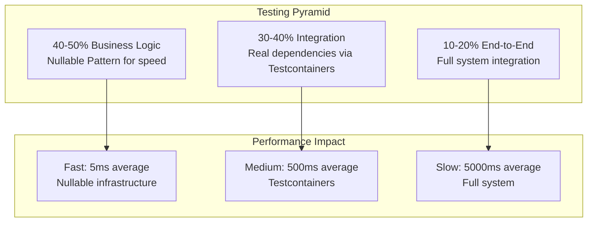

# Testing Strategy and Standards

**Enterprise Application Framework (EAF) v1.0**
**Last Updated:** 2025-11-20
**Framework:** JUnit 6.0.1 + AssertJ 3.27.3 (MANDATORY)
**Coverage Targets:** 85% line coverage (Kover), 60-70% mutation coverage (Pitest)

**Migration Note (2025-11-20):** This project has migrated from Kotest 6.0.4 to JUnit 6.0.1 + AssertJ 3.27.3. All 28 test files (~252 tests) have been successfully converted. Code examples in this document may still reference Kotest patterns and should be interpreted as conceptual guidance. See `docs/JUNIT-6-MIGRATION-GUIDE.md` for JUnit 6 equivalent patterns.

---

## Overview

The EAF v1.0 testing strategy implements **Constitutional TDD** (Test-Driven Development) with a 7-layer defense-in-depth approach combining fast business logic tests using the Nullable Design Pattern and comprehensive integration tests using Testcontainers. This strategy achieves enterprise-grade quality while maintaining developer velocity.

**Related Documents:**
- [Architecture Document](../architecture.md) - Testing decisions and 7-layer strategy
- [Coding Standards](coding-standards.md) - Code quality and standards enforcement
- [Tech Spec](../tech-spec.md) - Testing infrastructure implementation (Epic 8)

---

## Testing Philosophy

### Constitutional TDD

**Definition**: Test-Driven Development is constitutionally mandated - not optional, not negotiable. All production code MUST be preceded by failing tests.

**Core Principles:**

1. **Test-First Development** - All production code must be preceded by failing tests (Red-Green-Refactor cycle)
2. **Integration-First Approach** - Integration tests for critical business flows
3. **Nullable Pattern** - Fast infrastructure substitutes for business logic (100-1000x speedup)
4. **Real Dependencies** - Testcontainers for stateful services (PostgreSQL, Keycloak, Redis)
5. **Zero-Mocks Policy** - Never mock business logic, only infrastructure

**Enforcement:**
- Git hooks reject commits without tests (Story 1.10)
- CI/CD pipeline requires 85%+ coverage (Story 1.9)
- Code review checklist validates test-first discipline
- Pitest mutation testing validates test effectiveness (60-70% target)

**Reference**: Architecture (Constitutional TDD), Story 8.8 (TDD Compliance Validation)

---

### 7-Layer Testing Defense

**Architecture Mandate**: Defense-in-depth testing strategy with 7 layers of quality assurance.

| Layer | Type | Tools | Execution | Coverage Target |
|-------|------|-------|-----------|----------------|
| **1. Static Analysis** | Code quality | ktlint 1.7.1, Detekt 1.23.8, Konsist 0.17.3 | Pre-commit, CI | 100% (zero violations) |
| **2. Unit Tests** | Business logic | JUnit 6.0.1 + AssertJ + Nullable Pattern | Local, CI | 40-50% of test suite |
| **3. Integration Tests** | System integration | JUnit 6 + AssertJ + Testcontainers 1.21.3 | Local, CI | 30-40% of test suite |
| **4. Property-Based Tests** | Invariant validation | JUnit 6 compatible property testing | Nightly CI | Selected invariants |
| **5. Fuzz Testing** | Security vulnerabilities | Jazzer 0.25.1 | Nightly CI | 7 targets × 5 min |
| **6. Concurrency Tests** | Race conditions | LitmusKt | Epic 8, Nightly | Critical paths |
| **7. Mutation Testing** | Test effectiveness | Pitest 1.19.0 | Nightly CI | 60-70% mutation score |

**Execution Strategy:**
- **Layers 1-3**: Every commit (fast feedback <3min)
- **Layers 4-7**: Nightly CI (~2.5 hours for comprehensive validation)

**Reference**: Architecture (7-Layer Testing Strategy), Story 8.4-8.7 (Advanced Testing Implementation)

---

### Testing Pyramid

**Distribution Target:**
- **40-50% Business Logic Tests** - Nullable Pattern for speed (5ms average)
- **30-40% Integration Tests** - Testcontainers for realism (500ms average)
- **10-20% End-to-End Tests** - Full system validation (5000ms average)



**Performance Targets:**
- Full test suite: <15 minutes (NFR001)
- Unit tests: <30 seconds
- Integration tests: <3 minutes
- Build + test: <3 minutes (fast feedback)

**Reference**: Architecture (Performance Budgets), PRD NFR001

---

## JUnit 6.0.1 + AssertJ 3.27.3 Framework (MANDATORY)

### Framework Overview

**Primary Testing Stack:**
- **JUnit 6.0.1**: Modern testing framework with native Kotlin suspend support (released 2025-09-30)
- **AssertJ 3.27.3**: Fluent assertion library with Kotlin-friendly API
- **AssertJ-Kotlin 0.2.1**: Kotlin-specific AssertJ extensions
- **MockK 1.13.14**: Kotlin-native mocking framework (use sparingly per Zero-Mocks Policy)

### JUnit 6 Critical Features & Requirements

**NEW in JUnit 6 (vs JUnit 5):**
- **Native Kotlin Suspend Support**: Test and lifecycle methods can use `suspend fun` directly without runBlocking/runTest wrappers
- **@TestInstance(PER_CLASS) REQUIRED**: MUST add to classes using `suspend fun` with `@Nested` inner classes for stable coroutine continuations
- **Deterministic @Nested Ordering**: @Nested classes have consistent discovery order (not alphabetical, but stable across runs)
- **@TestMethodOrder Inheritance**: Ordering annotations on parent classes are inherited by @Nested inner classes recursively
- **Java 17 Baseline**: Minimum Java version raised from 8 to 17 (EAF uses Java 21 ✅)
- **Kotlin 2.2 Baseline**: Minimum Kotlin version raised to 2.2 (EAF uses 2.2.21 ✅)

**Breaking Changes from JUnit 5:**
- Kotlin assertTimeout contract changed from EXACTLY_ONCE to AT_MOST_ONCE (may cause compilation errors)
- junit-platform-runner module removed
- CSV parsing migrated to FastCSV (stricter validation)

**Example - Suspend Functions:**
```kotlin
@TestInstance(TestInstance.Lifecycle.PER_CLASS)  // REQUIRED for suspend + @Nested
@SpringBootTest
class AsyncIntegrationTest {
    @Test
    suspend fun `native suspend support`() {
        val result = suspendingService.fetchData()
        assertThat(result).isNotNull()
    }

    @Nested
    inner class `Async Scenarios` {
        @Test
        suspend fun `nested suspend test`() {
            // JUnit 6 handles coroutines automatically
        }
    }
}
```

### Core Test Structure

```kotlin
class WidgetServiceTest {
    @Test
    fun `should create widget with valid data`() {
        // Given
        val command = CreateWidgetCommand(name = "Test Widget")

        // When
        val result = service.createWidget(command)

        // Then
        assertThat(result.isRight()).isTrue()
        assertThat(result.getOrNull()?.name).isEqualTo("Test Widget")
    }
}
```

### Test Lifecycle Hooks

```kotlin
class WidgetTest {
    @BeforeEach
    fun beforeEach() {
        // Runs before each test
    }

    @AfterEach
    fun afterEach() {
        // Runs after each test
    }

    companion object {
        @BeforeAll
        @JvmStatic
        fun beforeAll() {
            // Runs once before all tests
        }

        @AfterAll
        @JvmStatic
        fun afterAll() {
            // Runs once after all tests
        }
    }
}
```

**Reference**: Coding Standards (Testing Standards), JUNIT-6-MIGRATION-GUIDE.md

---

### AssertJ Assertion Patterns

**Core Assertions:**

```kotlin
// Equality assertions
assertThat(widget.name).isEqualTo("Test Widget")
assertThat(widget.published).isFalse()

// Collection assertions
assertThat(events).hasSize(3)
assertThat(events).contains(event1, event2)
assertThat(events).extracting("message").containsExactly("Event 1", "Event 2")

// Null assertions
assertThat(result).isNotNull()
assertThat(optionalValue).isNull()

// Exception assertions
assertThrows<DomainException> {
    service.invalidOperation()
}

// Arrow Either assertions
assertThat(result.isRight()).isTrue()
assertThat(result.isLeft()).isTrue()
assertThat(result.getOrNull()).isEqualTo(expectedValue)

// Numeric assertions
assertThat(price.amount).isGreaterThan(BigDecimal.ZERO)
assertThat(quantity).isBetween(1, 100)

// String assertions
assertThat(name).isNotBlank()
assertThat(id).startsWith("widget-")
assertThat(message).contains("success")
```

**BDD-Style Test Organization:**

```kotlin
class WidgetServiceTest {
    @Test
    fun `given valid command when creating widget then widget is created`() {
        // Given
        val command = CreateWidgetCommand(name = "Test")

        // When
        val result = service.createWidget(command)

        // Then
        assertThat(result.isRight()).isTrue()
    }
}
```

**Nested Test Classes (Optional):**

```kotlin
class WidgetServiceTest {
    @Nested
    @DisplayName("Widget Creation")
    inner class WidgetCreation {
        @Test
        fun `should create widget with valid data`() {
            // Test logic
        }

        @Test
        fun `should reject widget with blank name`() {
            // Test logic
        }
    }
}
```

---

### Spring Boot Integration Test Pattern (MANDATORY)

**Rule**: Use `@Autowired` field injection with JUnit 6 for @SpringBootTest.

**Story 4.6 Critical Lessons - Plugin Order Matters:**

```kotlin
// products/widget-demo/build.gradle.kts
// CRITICAL: Plugin order prevents TestingConventionPlugin conflicts
plugins {
    id("eaf.testing")     // FIRST - Establishes testing framework
    id("eaf.spring-boot") // SECOND - After testing setup complete
    id("eaf.quality-gates")
}
```

**Root Cause**: Multiple TestingConventionPlugin applications corrupt integrationTest source set:
- eaf.spring-boot → eaf.kotlin-common → TestingConventionPlugin (1st)
- eaf.testing → TestingConventionPlugin (2nd - duplicate)
- eaf.quality-gates → eaf.kotlin-common → TestingConventionPlugin (3rd - triple)

**Framework Modules**: Unaffected (use eaf.kotlin-common only)

---

**Correct Pattern:**

```kotlin
// ✅ CORRECT - @Autowired field injection with JUnit 6
@SpringBootTest(webEnvironment = SpringBootTest.WebEnvironment.RANDOM_PORT)
@ActiveProfiles("test")
class WidgetIntegrationTest {

    @Autowired
    private lateinit var commandGateway: CommandGateway

    @Autowired
    private lateinit var queryGateway: QueryGateway

    @Autowired
    private lateinit var mockMvc: MockMvc

    @Test
    fun `should create widget via command gateway`() {
        // Given
        val command = CreateWidgetCommand(
            widgetId = UUID.randomUUID().toString(),
            tenantId = "test-tenant",
            name = "Integration Test Widget",
            category = WidgetCategory.PREMIUM
        )

        // When
        val result = commandGateway.sendAndWait<String>(command, Duration.ofSeconds(5))

        // Then
        assertThat(result).isEqualTo(command.widgetId)

        // And projection should be updated (eventual consistency)
        await().atMost(Duration.ofSeconds(10)).untilAsserted {
            val query = FindWidgetByIdQuery(command.widgetId, command.tenantId)
            val widget = queryGateway.query(query, WidgetProjection::class.java).join()

            assertThat(widget).isNotNull()
            assertThat(widget.name).isEqualTo(command.name)
            assertThat(widget.category).isEqualTo(command.category)
            assertThat(widget.tenantId).isEqualTo(command.tenantId)
        }
    }

    @Test
    fun `should expose widget via REST API`() {
        // Given
        val jwtToken = TestJwtBuilder()
            .withTenantId("test-tenant")
            .withRole("USER")
            .build()

        // When/Then
        mockMvc.perform(
            post("/api/v1/widgets")
                .contentType(MediaType.APPLICATION_JSON)
                .content("""{"name":"API Test Widget","category":"STANDARD"}""")
                .header("Authorization", "Bearer $jwtToken")
        )
            .andExpect(status().isCreated())
            .andExpect(jsonPath("$.name").value("API Test Widget"))
            .andExpect(jsonPath("$.category").value("STANDARD"))
    }

    companion object {
        @DynamicPropertySource
        @JvmStatic
        fun configureProperties(registry: DynamicPropertyRegistry) {
            // Start all required Testcontainers
            PostgresTestContainer.start()
            KeycloakTestContainer.start()
            RedisTestContainer.start()

            // Configure Spring Boot properties
            registry.add("spring.datasource.url") { PostgresTestContainer.jdbcUrl }
            registry.add("spring.datasource.username") { PostgresTestContainer.username }
            registry.add("spring.datasource.password") { PostgresTestContainer.password }

            registry.add("spring.security.oauth2.resourceserver.jwt.issuer-uri") {
                KeycloakTestContainer.issuerUri
            }
            registry.add("spring.security.oauth2.resourceserver.jwt.jwk-set-uri") {
                KeycloakTestContainer.jwksUri
            }

            registry.add("spring.data.redis.host") { RedisTestContainer.host }
            registry.add("spring.data.redis.port") { RedisTestContainer.port }
        }
    }
}
```

**Best Practices:**

```kotlin
// ✅ Use @BeforeEach for test-specific setup
@BeforeEach
fun setUp() {
    // Setup code that runs before each test
}

// ✅ Use companion object for static setup
companion object {
    @BeforeAll
    @JvmStatic
    fun setUpClass() {
        // One-time setup for all tests
    }
}

// ✅ Use Awaitility for async assertions (eventual consistency)
await().atMost(Duration.ofSeconds(10)).untilAsserted {
    assertThat(condition).isTrue()
}
```

**Reference**: Story 4.6 (Multi-Tenant Widget Demo Integration Tests), JUNIT-6-MIGRATION-GUIDE.md

---

## Nullable Design Pattern

### Pattern Overview

**Purpose**: Fast infrastructure substitutes that maintain real business logic while eliminating external dependencies.

**Benefits:**
- **100-1000x Performance Improvement**: 5ms average vs. 500ms-5000ms with Testcontainers
- **Real Business Logic**: Maintains actual validation, business rules, and behavior
- **Fast Feedback**: Immediate test execution for TDD Red-Green-Refactor cycle
- **Deterministic**: No network, no containers, no external state

**When to Use:**
- ✅ Business logic unit tests (domain services, aggregates)
- ✅ TDD Red-Green-Refactor cycles (fast feedback)
- ✅ Command/query handler business logic validation
- ✅ Error handling and validation logic

**When NOT to Use:**
- ❌ Integration tests (use Testcontainers)
- ❌ End-to-end tests (use full system)
- ❌ Security testing (use real JWT validation)
- ❌ Multi-tenancy isolation (use PostgreSQL RLS + Testcontainers)

---

### Nullable Pattern Implementation

```kotlin
// Interface definition for nullable factory
interface NullableFactory<T> {
    fun createNull(): T
    fun createNull(state: Map<String, Any>): T = createNull()
}

// Nullable implementation maintains business logic
class NullableWidgetRepository : WidgetRepository, NullableFactory<WidgetRepository> {
    private val storage = ConcurrentHashMap<String, Widget>()
    private val events = mutableListOf<DomainEvent>()

    override fun save(widget: Widget): Either<DomainError, Widget> {
        // Maintain REAL validation logic (not mocked)
        val existing = storage.values.find {
            it.name == widget.name && it.tenantId == widget.tenantId
        }
        if (existing != null) {
            return DomainError.BusinessRuleViolation(
                rule = "widget.name.unique",
                reason = "Widget with name already exists for tenant"
            ).left()
        }

        storage[widget.widgetId] = widget
        events.add(WidgetSavedEvent(widget.widgetId))
        return widget.right()
    }

    override fun findById(id: String, tenantId: String): Either<DomainError, Widget?> {
        val widget = storage[id]

        // Maintain tenant isolation logic
        if (widget != null && widget.tenantId != tenantId) {
            return DomainError.TenantIsolationViolation(
                requestedTenant = tenantId,
                actualTenant = widget.tenantId
            ).left()
        }

        return widget.right()
    }

    override fun findByTenantId(tenantId: String): Either<DomainError, List<Widget>> {
        val widgets = storage.values.filter { it.tenantId == tenantId }
        return widgets.toList().right()
    }

    // Test utilities
    fun count(): Int = storage.size
    fun contains(widgetId: String): Boolean = storage.containsKey(widgetId)
    fun getEvents(): List<DomainEvent> = events.toList()
    fun clear() {
        storage.clear()
        events.clear()
    }

    override fun createNull(): WidgetRepository = this

    override fun createNull(state: Map<String, Any>): WidgetRepository {
        val instance = NullableWidgetRepository()
        state["widgets"]?.let { widgets ->
            (widgets as List<Widget>).forEach { widget ->
                instance.storage[widget.widgetId] = widget
            }
        }
        return instance
    }
}

// Factory function for easy test usage
inline fun <reified T> nullable(): T {
    return when (T::class) {
        WidgetRepository::class -> NullableWidgetRepository() as T
        EventBus::class -> NullableEventBus() as T
        TenantContext::class -> NullableTenantContext() as T
        else -> throw IllegalArgumentException("No nullable implementation for ${T::class.simpleName}")
    }
}
```

**Usage in Tests:**

```kotlin
class WidgetServiceTest : BehaviorSpec({
    Given("a widget service with nullable dependencies") {
        val repository = nullable<WidgetRepository>()
        val eventBus = nullable<EventBus>()
        val tenantContext = nullable<TenantContext>()
        val service = WidgetService(repository, eventBus, tenantContext)

        When("creating a valid widget") {
            tenantContext.setCurrentTenantId("test-tenant")

            val command = CreateWidgetCommand(
                widgetId = "widget-1",
                tenantId = "test-tenant",
                name = "Test Widget",
                category = WidgetCategory.STANDARD
            )

            val result = service.createWidget(command)

            Then("widget should be created successfully") {
                result.shouldBeRight()
                repository.count() shouldBe 1
                repository.contains("widget-1") shouldBe true
            }

            Then("event should be published") {
                eventBus.getPublishedEvents().shouldHaveSize(1)
                eventBus.getPublishedEvents().first().shouldBeInstanceOf<WidgetCreatedEvent>()
            }
        }

        When("creating widget with duplicate name") {
            // Pre-populate repository
            val existing = Widget.create(CreateWidgetCommand(...))
            repository.save(existing)

            val duplicate = CreateWidgetCommand(
                widgetId = "widget-2",
                tenantId = "test-tenant",
                name = "Test Widget",  // Same name
                category = WidgetCategory.PREMIUM
            )

            val result = service.createWidget(duplicate)

            Then("should return business rule violation") {
                result.shouldBeLeft()
                result.leftValue.shouldBeInstanceOf<DomainError.BusinessRuleViolation>()
            }
        }
    }
})
```

**Performance**: 5ms average execution (vs. 500ms with Testcontainers)

**Reference**: Architecture (Nullable Pattern), Epic 10 (Nullables Pattern Performance Benchmarking)

---

### Contract Testing for Nullable Implementations

**Rule**: All nullable implementations must have behavioral parity tests to ensure they maintain real business logic.

```kotlin
// Contract test validates nullable maintains same behavior as real implementation
class WidgetRepositoryContractTest : FunSpec({
    listOf(
        "Real Repository" to RealWidgetRepository(dslContext),
        "Nullable Repository" to NullableWidgetRepository()
    ).forEach { (name, repository) ->

        context("$name") {
            beforeEach {
                repository.clear()  // Common cleanup
            }

            test("should enforce unique widget names per tenant") {
                val widget1 = Widget.create(CreateWidgetCommand(..., name = "Widget A", tenantId = "tenant-1"))
                repository.save(widget1).shouldBeRight()

                val widget2 = Widget.create(CreateWidgetCommand(..., name = "Widget A", tenantId = "tenant-1"))
                val result = repository.save(widget2)

                result.shouldBeLeft()
                result.leftValue.shouldBeInstanceOf<DomainError.BusinessRuleViolation>()
            }

            test("should allow same name in different tenants") {
                val widget1 = Widget.create(CreateWidgetCommand(..., name = "Widget A", tenantId = "tenant-1"))
                val widget2 = Widget.create(CreateWidgetCommand(..., name = "Widget A", tenantId = "tenant-2"))

                repository.save(widget1).shouldBeRight()
                repository.save(widget2).shouldBeRight()  // Should succeed - different tenants
            }

            test("should enforce tenant isolation in queries") {
                val widget1 = Widget.create(CreateWidgetCommand(..., tenantId = "tenant-1"))
                val widget2 = Widget.create(CreateWidgetCommand(..., tenantId = "tenant-2"))

                repository.save(widget1)
                repository.save(widget2)

                val tenant1Widgets = repository.findByTenantId("tenant-1").getOrNull()
                tenant1Widgets.shouldHaveSize(1)
                tenant1Widgets.first().widgetId shouldBe widget1.widgetId
            }
        }
    }
})
```

**Reference**: Architecture (Nullable Pattern Testing), Epic 10 Story 10.11 (Nullables Benchmarking)

---

## Integration Testing with Testcontainers

### Testcontainer Configuration

**Rule**: Use Testcontainers 1.21.3 for all stateful dependencies. H2 is explicitly forbidden.

```kotlin
// shared/testing/src/integrationTest/kotlin/com/axians/eaf/testing/containers/TestContainers.kt
object TestContainers {

    val postgres: PostgreSQLContainer<*> = PostgreSQLContainer("postgres:16.10")
        .withDatabaseName("eaf_test")
        .withUsername("eaf_test")
        .withPassword("eaf_test")
        .withReuse(true)  // Reuse across tests for performance

    val keycloak: KeycloakContainer = KeycloakContainer("keycloak/keycloak:26.4.2")
        .withRealmImportFile("keycloak-realm-test.json")
        .withReuse(true)

    val redis: GenericContainer<*> = GenericContainer("redis:7.2-alpine")
        .withExposedPorts(6379)
        .withReuse(true)

    fun startAll() {
        postgres.start()
        keycloak.start()
        redis.start()
    }

    fun stopAll() {
        postgres.stop()
        keycloak.stop()
        redis.stop()
    }
}
```

**Usage in Integration Tests:**

```kotlin
@SpringBootTest(webEnvironment = SpringBootTest.WebEnvironment.RANDOM_PORT)
@ActiveProfiles("test")
class WidgetEndToEndTest : FunSpec() {

    @Autowired
    private lateinit var mockMvc: MockMvc

    init {
        extension(SpringExtension())

        test("2.11-E2E-001: complete widget lifecycle end-to-end") {
            val jwt = createTestJwt(tenantId = "test-tenant", roles = listOf("USER"))

            // Create widget
            val createResponse = mockMvc.perform(
                post("/api/v1/widgets")
                    .contentType(MediaType.APPLICATION_JSON)
                    .content("""{"name":"E2E Widget","category":"PREMIUM"}""")
                    .header("Authorization", "Bearer $jwt")
            )
                .andExpect(status().isCreated())
                .andExpect(jsonPath("$.name").value("E2E Widget"))
                .andReturn()

            val widgetId = JsonPath.read<String>(createResponse.response.contentAsString, "$.widgetId")

            // Wait for projection update (eventual consistency)
            eventually(Duration.ofSeconds(10)) {
                mockMvc.perform(
                    get("/api/v1/widgets/$widgetId")
                        .header("Authorization", "Bearer $jwt")
                )
                    .andExpect(status().isOk())
                    .andExpect(jsonPath("$.name").value("E2E Widget"))
            }

            // Update widget
            mockMvc.perform(
                put("/api/v1/widgets/$widgetId")
                    .contentType(MediaType.APPLICATION_JSON)
                    .content("""{"name":"Updated Widget"}""")
                    .header("Authorization", "Bearer $jwt")
            )
                .andExpect(status().isOk())

            // Verify update in projection
            eventually(Duration.ofSeconds(10)) {
                mockMvc.perform(
                    get("/api/v1/widgets/$widgetId")
                        .header("Authorization", "Bearer $jwt")
                )
                    .andExpect(jsonPath("$.name").value("Updated Widget"))
            }
        }
    }

    companion object {
        @DynamicPropertySource
        @JvmStatic
        fun configureProperties(registry: DynamicPropertyRegistry) {
            TestContainers.startAll()

            registry.add("spring.datasource.url") { TestContainers.postgres.jdbcUrl }
            registry.add("spring.datasource.username") { TestContainers.postgres.username }
            registry.add("spring.datasource.password") { TestContainers.postgres.password }

            registry.add("spring.security.oauth2.resourceserver.jwt.issuer-uri") {
                TestContainers.keycloak.authServerUrl + "/realms/eaf-test"
            }

            registry.add("spring.data.redis.host") { TestContainers.redis.host }
            registry.add("spring.data.redis.port") { TestContainers.redis.getMappedPort(6379) }
        }
    }
}
```

**Reference**: Story 2.11 (End-to-End Integration Test), Story 3.10 (Testcontainers Keycloak)

---

### Async Testing with Eventually

**Rule**: Use `eventually` polling pattern for asynchronous event processing tests.

```kotlin
import io.kotest.assertions.timing.eventually
import kotlin.time.Duration.Companion.seconds

test("should process event asynchronously") {
    // Given
    val command = CreateWidgetCommand(...)

    // When
    commandGateway.sendAndWait<String>(command, Duration.ofSeconds(5))

    // Then - Wait for async projection update (eventual consistency)
    eventually(10.seconds) {
        val query = FindWidgetByIdQuery(command.widgetId, command.tenantId)
        val widget = queryGateway.query(query, WidgetProjection::class.java).join()

        widget.shouldNotBeNull()
        widget.name shouldBe command.name
    }
}
```

**Configuration:**
- Default timeout: 10 seconds
- Poll interval: 100ms (default)
- Failure: Throws AssertionError with last failure message

**Reference**: Story 2.7 (Widget Projection Handler), Story 4.5 (Async Context Propagation)

---

## Test Case Naming Convention (MANDATORY)

**Rule**: All test cases MUST include story references for traceability.

**Pattern**: `{EPIC}.{STORY}-{TYPE}-{SEQ}: {Description}`

- **{EPIC}.{STORY}**: Story reference (e.g., "2.4", "4.6", "8.1")
- **{TYPE}**: Test type
  - `UNIT`: Business logic / domain tests
  - `INT`: Integration tests (with Testcontainers)
  - `E2E`: End-to-end / system tests
- **{SEQ}**: Sequential number within story (001, 002, 003)
- **{Description}**: Clear description of what is being tested

**Examples:**

```kotlin
class WidgetAggregateTest : BehaviorSpec({
    Given("a widget aggregate") {
        val widget = Widget()

        When("creating widget with valid command") {
            val command = CreateWidgetCommand(...)

            test("2.5-UNIT-001: should apply WidgetCreatedEvent") {
                // Test logic - validates Story 2.5 AC1
            }

            test("2.5-UNIT-002: should initialize widget with ACTIVE status") {
                // Test logic - validates Story 2.5 AC2
            }
        }

        When("updating widget with mismatched tenant") {
            test("4.2-UNIT-003: should return TenantIsolationViolation error") {
                // Test logic - validates Story 4.2 tenant validation
            }
        }
    }
})

class WidgetIntegrationTest : FunSpec() {
    test("2.11-INT-001: complete CQRS flow from command to projection") {
        // Integration test with Testcontainers
    }

    test("4.7-INT-002: tenant isolation prevents cross-tenant access") {
        // Multi-tenancy integration test
    }
}

class WidgetE2ETest : FunSpec() {
    test("10.7-E2E-001: widget CRUD via REST API with JWT authentication") {
        // Full system end-to-end test
    }
}
```

**Enforcement:**
- Konsist rule validates test naming pattern
- CI pipeline fails if violations detected
- Pre-commit hook warns about missing story references

**Reference**: Story 8.1 (Architecture Deviation Audit), Story 8.8 (TDD Compliance Validation)

---

## Advanced Testing Techniques

### Property-Based Testing

**Tool**: Kotest Property (included in Kotest 6.0.4)

**Purpose**: Validate invariants across random input spaces.

```kotlin
class WidgetPropertyTest : FunSpec({
    test("widget creation should be idempotent") {
        checkAll<String, String>(iterations = 100) { widgetId, name ->
            val command = CreateWidgetCommand(
                widgetId = widgetId,
                tenantId = "test-tenant",
                name = name.take(255),  // Bound to valid range
                category = WidgetCategory.entries.random()
            )

            val widget1 = Widget.create(command)
            val widget2 = Widget.create(command)  // Idempotent

            widget1.getOrNull() shouldBe widget2.getOrNull()
        }
    }

    test("tenant isolation should be preserved across all operations") {
        checkAll<String, String>(iterations = 100) { tenant1, tenant2 ->
            assume(tenant1 != tenant2)  // Ensure different tenants

            val repository = NullableWidgetRepository()

            val widget1 = Widget.create(CreateWidgetCommand(..., tenantId = tenant1))
            val widget2 = Widget.create(CreateWidgetCommand(..., tenantId = tenant2))

            repository.save(widget1.getOrNull()!!)
            repository.save(widget2.getOrNull()!!)

            val tenant1Widgets = repository.findByTenantId(tenant1).getOrNull()
            val tenant2Widgets = repository.findByTenantId(tenant2).getOrNull()

            tenant1Widgets.shouldHaveSize(1)
            tenant2Widgets.shouldHaveSize(1)
            tenant1Widgets.first().tenantId shouldBe tenant1
            tenant2Widgets.first().tenantId shouldBe tenant2
        }
    }
})
```

**Execution**: Nightly CI (Story 8.5)

**Reference**: Architecture (Property-Based Testing), Story 8.5 (Concurrency and Property Tests)

---

### Fuzz Testing

**Tool**: Jazzer 0.25.1 (OSS-Fuzz standard)

**Purpose**: Discover crashes, DoS vulnerabilities, and edge cases via coverage-guided fuzzing.

**Targets** (7 total, 5 minutes each in nightly CI):
1. JWT token parsing
2. Role normalization
3. Tenant ID extraction
4. SKU validation
5. Input sanitization
6. JSON deserialization
7. SQL query parameter binding

```kotlin
// Example fuzz target
class JwtParsingFuzzTest {
    @FuzzTest
    fun fuzzJwtParsing(data: ByteArray) {
        val jwtString = String(data, Charsets.UTF_8)

        // Should never throw uncaught exception or cause DoS
        assertDoesNotThrow {
            jwtValidator.parse(jwtString)
        }
    }
}
```

**Execution**: Nightly CI (Story 3.12, Story 8.6)

**Reference**: Architecture (Fuzz Testing), Story 3.12 (Security Fuzz Testing)

---

### Concurrency Testing

**Tool**: LitmusKt (JetBrains Research)

**Purpose**: Detect race conditions, memory model violations, and thread safety issues.

**Critical Test Areas:**
1. TenantContext ThreadLocal propagation
2. Axon event processor multi-threading
3. PostgreSQL connection pool
4. Redis cache concurrent access
5. Command/event handler concurrency

```kotlin
class TenantContextConcurrencyTest : FunSpec({
    test("4.10-CONC-001: TenantContext should be thread-safe") {
        // LitmusKt test for ThreadLocal isolation
        val outcomes = lincheckTest {
            operation(::setTenant1)
            operation(::setTenant2)
            operation(::getTenant)
        }

        // Validate no cross-thread contamination
        outcomes.shouldNotContain(Outcome.INVALID)
    }
})
```

**Execution**: Epic 8, Nightly CI (Story 4.10, Story 8.5)

**Reference**: Architecture (LitmusKt Concurrency Testing), Story 4.10 (LitmusKt Framework), Story 8.5 (Concurrency Tests)

---

### Mutation Testing

**Tool**: Pitest 1.19.0

**Purpose**: Validate test effectiveness by introducing code mutations and ensuring tests fail.

**Target**: 60-70% mutation coverage (realistic for deprecated Kotlin plugin)

```kotlin
// build.gradle.kts configuration
plugins {
    id("info.solidsoft.pitest") version "1.19.0"
}

pitest {
    targetClasses.set(listOf("com.axians.eaf.*"))
    targetTests.set(listOf("com.axians.eaf.*"))
    outputFormats.set(listOf("HTML", "XML"))
    mutators.set(listOf("DEFAULTS"))
    threads.set(4)
    timeoutConstant.set(10000)
}
```

**Execution**: Nightly CI (Story 8.6)

**Reference**: Architecture (Mutation Testing), Story 8.6 (Pitest Configuration)

---

## Test Organization

### Source Set Structure

```
framework/widget/
├── src/
│   ├── main/kotlin/           # Production code
│   ├── test/kotlin/           # Unit tests (Nullable Pattern)
│   ├── integrationTest/kotlin/ # Integration tests (Testcontainers)
│   └── konsistTest/kotlin/    # Architecture tests (Konsist)
└── build.gradle.kts
```

**Test Execution Commands:**

```bash
./gradlew test                 # Unit tests only (<30s)
./gradlew integrationTest      # Integration tests (<3min)
./gradlew konsistTest          # Architecture tests (<10s)
./gradlew check                # All tests + quality gates (<15min)
```

**Reference**: Story 1.2 (Multi-Module Structure), Architecture (Project Structure)

---

## Coverage Requirements

### Line Coverage (Kover 0.9.3)

**Target**: 85% minimum line coverage (NFR001)

```kotlin
// build.gradle.kts
plugins {
    id("org.jetbrains.kotlinx.kover") version "0.9.3"
}

kover {
    reports {
        filters {
            excludes {
                classes("*Test", "*Spec", "*Configuration")
                packages("com.axians.eaf.*.config")
            }
        }
    }

    verify {
        rule {
            minBound(85)  // Minimum 85% coverage
        }
    }
}
```

**Execution**: CI/CD pipeline (Story 1.9), enforced on merge

---

### Mutation Coverage (Pitest 1.19.0)

**Target**: 60-70% mutation score (realistic for deprecated Kotlin plugin)

**Mutation Operators:**
- Conditionals boundary mutations
- Negate conditionals
- Math mutations
- Return value mutations
- Inline constant mutations

**Exclusions:**
- Property-based tests (high computational cost)
- Infrastructure interceptors (observability code)
- Configuration classes

**Execution**: Nightly CI (~1 hour for full mutation testing)

**Reference**: Architecture (Mutation Testing), Story 8.6 (Pitest Mutation Testing)

---

## Anti-Patterns (PROHIBITED)

### Testing Anti-Patterns

**1. JUnit/Kotest Mixing** (FORBIDDEN)

```kotlin
// ❌ FORBIDDEN - JUnit annotations completely ignored
class BadTest : FunSpec({
    @Test  // ← Ignored by Kotest
    fun badTest() {
        // Will NEVER execute
    }

    @Disabled  // ← Has NO EFFECT
    test("will still run") {
        // Runs despite @Disabled
    }
})
```

**2. Domain Logic Mocking** (FORBIDDEN)

```kotlin
// ❌ FORBIDDEN - Mocking business logic
class BadTest : FunSpec({
    test("bad test") {
        val mockService = mockk<WidgetService>()
        every { mockService.createWidget(any()) } returns Widget().right()

        // You're not testing real business logic!
    }
})

// ✅ CORRECT - Use Nullable Pattern
class GoodTest : FunSpec({
    test("good test") {
        val repository = nullable<WidgetRepository>()
        val service = WidgetService(repository)  // Real service

        val result = service.createWidget(command)  // Real business logic
        result.shouldBeRight()
    }
})
```

**3. H2 Database Usage** (FORBIDDEN)

```kotlin
// ❌ FORBIDDEN - H2 is explicitly prohibited
@SpringBootTest
@TestPropertySource(properties = [
    "spring.datasource.url=jdbc:h2:mem:testdb"  // FORBIDDEN
])
class BadIntegrationTest

// ✅ CORRECT - PostgreSQL Testcontainers only
@SpringBootTest
class GoodIntegrationTest : FunSpec() {
    companion object {
        @DynamicPropertySource
        @JvmStatic
        fun configureProperties(registry: DynamicPropertyRegistry) {
            TestContainers.postgres.start()
            registry.add("spring.datasource.url") { TestContainers.postgres.jdbcUrl }
        }
    }
}
```

**4. Security Mocking** (FORBIDDEN)

```kotlin
// ❌ FORBIDDEN - Never mock JWT validation
@MockBean
private lateinit var jwtValidator: JwtValidator

// ✅ CORRECT - Use real Keycloak Testcontainer
companion object {
    @DynamicPropertySource
    @JvmStatic
    fun configureProperties(registry: DynamicPropertyRegistry) {
        TestContainers.keycloak.start()
        registry.add("spring.security.oauth2.resourceserver.jwt.issuer-uri") {
            TestContainers.keycloak.authServerUrl + "/realms/eaf-test"
        }
    }
}
```

**5. Constructor Injection + @SpringBootTest** (FORBIDDEN)

```kotlin
// ❌ FORBIDDEN - Causes lifecycle timing conflict
@SpringBootTest
class BadTest(
    private val dependency: SomeDependency  // ← Compilation fails
) : FunSpec({})

// ✅ CORRECT - Field injection + init block
@SpringBootTest
class GoodTest : FunSpec() {
    @Autowired
    private lateinit var dependency: SomeDependency

    init {
        extension(SpringExtension())
        test("works correctly") { /* dependency available */ }
    }
}
```

---

## Test Execution Strategy

### Fast Feedback Cycle (TDD Red-Green-Refactor)

**Target**: <30 seconds for unit tests

```bash
# Run unit tests only (with Nullable Pattern)
./gradlew test

# Run specific module tests
./gradlew :framework:cqrs:test

# Fast feedback - skip integration tests
./gradlew test --tests "*WidgetServiceTest"
```

---

### Full Quality Gate (Pre-Push)

**Target**: <15 minutes for complete validation

```bash
# Full quality check (all tests + static analysis)
./gradlew clean build

# This executes:
# 1. ktlint (code formatting)
# 2. Detekt (static analysis)
# 3. Konsist (architecture tests)
# 4. Unit tests (Nullable Pattern)
# 5. Integration tests (Testcontainers)
# 6. Kover (coverage check: 85%+)
```

---

### Nightly CI (Comprehensive)

**Target**: ~2.5 hours for deep validation

```bash
# Nightly pipeline includes:
./gradlew clean build                    # Full build + tests
./gradlew propertyTest                   # Property-based tests
./gradlew fuzzTest                       # Fuzzing (7 targets × 5 min)
./gradlew concurrencyTest                # LitmusKt race condition detection
./gradlew pitest                         # Mutation testing (~1 hour)
./gradlew dependencyCheckAnalyze         # OWASP security scan
```

**Reference**: Story 1.9 (CI/CD Pipeline), Architecture (Testing Strategy)

---

## Coverage Metrics and Reporting

### Line Coverage (Kover)

**Minimum**: 85% line coverage
**Measurement**: Kover 0.9.3 (Kotlin-native, better than JaCoCo)
**Exclusions**: Configuration classes, test code, generated code

### Mutation Coverage (Pitest)

**Target**: 60-70% mutation score
**Rationale**: Deprecated Kotlin plugin limits achievable score
**Exclusions**: Property-based tests, infrastructure code

### Story Coverage Traceability

**Test Naming Convention** enables automatic story coverage reports:
- Epic 1: Stories 1.1-1.11 → X% test coverage
- Epic 2: Stories 2.1-2.13 → Y% test coverage
- Per-story acceptance criteria test count

**Reference**: Story 8.10 (Quality Metrics Dashboard)

---

## Specialized Testing Patterns

### Testcontainer Startup Optimization

**Pattern**: Use companion object with explicit start() to control container lifecycle.

```kotlin
// ✅ CORRECT - Explicit container startup
@SpringBootTest
class WidgetIntegrationTest : FunSpec() {
    init {
        extension(SpringExtension())

        test("integration test") {
            // Test logic
        }
    }

    companion object {
        init {
            // Explicit container startup BEFORE Spring context
            TestContainers.postgres.start()
            TestContainers.keycloak.start()
        }

        @DynamicPropertySource
        @JvmStatic
        fun configureProperties(registry: DynamicPropertyRegistry) {
            // Containers already running
            registry.add("spring.datasource.url") { TestContainers.postgres.jdbcUrl }
        }
    }
}
```

---

### Profile-Based Test Isolation

**Pattern**: Use `@Profile("!test")` to exclude production configurations with external dependencies.

```kotlin
// Production configuration excluded during tests
@Configuration
@Profile("!test")
class ProductionSecurityConfiguration {
    // Real Keycloak OIDC configuration
    // External dependencies not needed in tests
}

// Test configuration
@TestConfiguration
@Profile("test")
class TestSecurityConfiguration {
    // Testcontainer-based Keycloak
    // Simplified security for testing
}
```

**Usage in Tests:**

```kotlin
@SpringBootTest
@ActiveProfiles("test")  // Activates test profile, excludes @Profile("!test") beans
class WidgetSecurityTest : FunSpec() {
    // Test runs with test configuration only
}
```

**Reference**: Test Strategy (Test Isolation), Story 3.10 (Testcontainers Keycloak)

---

### Axon Test Fixtures

**Tool**: Axon Test Fixtures (included in axon-test 4.12.1)

**Purpose**: Test aggregates with Given-When-Then DSL.

```kotlin
class WidgetAggregateTest : FunSpec({
    test("2.5-UNIT-001: should create widget with WidgetCreatedEvent") {
        val command = CreateWidgetCommand(
            widgetId = "widget-1",
            tenantId = "test-tenant",
            name = "Test Widget",
            category = WidgetCategory.STANDARD
        )

        fixture<Widget>()
            .givenNoPriorActivity()
            .`when`(command)
            .expectSuccessfulHandlerExecution()
            .expectEvents(
                WidgetCreatedEvent(
                    widgetId = "widget-1",
                    tenantId = "test-tenant",
                    name = "Test Widget",
                    category = WidgetCategory.STANDARD
                )
            )
    }

    test("2.5-UNIT-002: should reject update for inactive widget") {
        val createEvent = WidgetCreatedEvent(...)
        val deactivateEvent = WidgetDeactivatedEvent(...)
        val updateCommand = UpdateWidgetCommand(...)

        fixture<Widget>()
            .given(createEvent, deactivateEvent)
            .`when`(updateCommand)
            .expectException(WidgetNotActiveException::class.java)
            .expectNoEvents()
    }
})
```

**Reference**: Story 2.5 (Widget Aggregate), Architecture (Axon Testing)

---

## Quality Gate Enforcement

### Pre-Commit Hooks (Story 1.10)

**Enforced Checks:**
1. ktlint code formatting
2. Detekt static analysis (zero violations)
3. Konsist architecture rules
4. Unit tests pass
5. No @Disabled tests (except explicitly documented)

**Configuration**: `.git/hooks/pre-commit`

---

### CI/CD Pipeline (Story 1.9)

**Fast Feedback Pipeline** (<15 minutes):
```yaml
# .github/workflows/ci.yml
- ktlint check
- Detekt analysis
- Konsist architecture tests
- Unit tests (Nullable Pattern)
- Integration tests (Testcontainers)
- Kover coverage check (85%+)
```

**Nightly Pipeline** (~2.5 hours):
```yaml
# .github/workflows/nightly.yml
- All fast feedback checks
- Property-based tests (Kotest Property)
- Fuzz testing (Jazzer, 7 targets × 5 min)
- Concurrency tests (LitmusKt)
- Mutation testing (Pitest ~1 hour)
- OWASP dependency scan
```

**Reference**: Story 1.9 (CI/CD Pipeline), Architecture (Quality Gates)

---

## Performance Benchmarking

### Test Performance Targets

| Test Category | Target | Measured |
|---------------|--------|----------|
| Unit tests (Nullable) | <30s | ~5ms average per test |
| Integration tests (Testcontainers) | <3min | ~500ms average per test |
| Full test suite | <15min | TBD in Epic 2 baseline |
| Nightly pipeline | <3h | ~2.5h estimated |

### Nullable Pattern Performance

**Benchmark Target**: 100-1000x speedup vs. Testcontainers for business logic tests.

**Measurement**: Epic 10, Story 10.11 (Nullables Pattern Performance Benchmarking)

```kotlin
class NullablePerformanceBenchmark : FunSpec({
    test("benchmark nullable vs testcontainer performance") {
        // Nullable Pattern test
        val nullableTime = measureTime {
            repeat(1000) {
                val repository = nullable<WidgetRepository>()
                val service = WidgetService(repository)
                service.createWidget(CreateWidgetCommand(...))
            }
        }

        // Testcontainer test
        val integrationTime = measureTime {
            repeat(1000) {
                // Same test with real PostgreSQL
            }
        }

        val speedup = integrationTime / nullableTime
        speedup shouldBeGreaterThan 100.0  // Minimum 100x speedup
    }
})
```

---

## Related Documentation

- **[Architecture Document](../architecture.md)** - Constitutional TDD mandate, 7-layer strategy
- **[Coding Standards](coding-standards.md)** - Kotest patterns, anti-patterns
- **[Tech Spec](../tech-spec.md)** - Epic 8 testing implementation details
- **[Stories](../sprint-artifacts/epic-8/)** - Epic 8: Comprehensive Testing Strategy (10 stories)

---

**Next Steps**: Review all Epic 8 stories (8.1-8.10) for testing infrastructure implementation, then apply these patterns throughout Epic 1-10 development.
