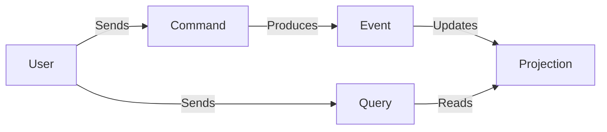

# Commands, Events, and Queries

**The vocabulary of our architecture.**

In DCM, we don't just "call functions." We exchange messages. Understanding the three types of messages is key to understanding our CQRS architecture.

---

## 1. Command ("Do This")

A **Command** is an intent to change the state of the system. It is imperative (an order).

*   **Naming:** Verb + Noun. `CreateVmRequest`, `ApproveRequest`, `ProvisionVm`.
*   **Target:** Directed at a specific Aggregate or Handler.
*   **Behavior:**
    * **Can Fail:** It can be rejected (e.g., "Quota Exceeded", "Invalid Name").
    * **Side Effects:** Yes (it changes data).
    * **Return Value:** Minimal (usually just the ID of the created entity, or `Unit`).

```kotlin
data class SubmitVmRequest(
    val requestId: UUID,
    val userId: UUID
) : Command
```

## 2. Event ("This Happened")

An **Event** is a fact describing something that has already occurred. It is immutable history.

*   **Naming:** Noun + Past-Tense Verb. `VmRequestCreated`, `RequestApproved`, `VmProvisioned`.
*   **Target:** Broadcast to anyone listening (0 to N listeners).
*   **Behavior:**
    * **Cannot Fail:** You cannot reject history. The listener must handle it or fail itself.
    * **Side Effects:** No (it describes a past change).
    * **Return Value:** None (`void`).

```kotlin
data class VmRequestSubmitted(
    val requestId: UUID,
    val submittedAt: Instant
) : DomainEvent
```

## 3. Query ("Tell Me This")

A **Query** is a request for information. It never changes state.

*   **Naming:** Get/List + Noun. `GetVmRequest`, `ListPendingApprovals`.
*   **Target:** Directed at a specific Read Model / Projection.
*   **Behavior:**
    * **No Side Effects:** Executing a query 100 times changes nothing.
    * **Return Value:** A DTO (Data Transfer Object) optimized for the view.

```kotlin
data class GetVmRequest(
    val requestId: UUID
) : Query<VmRequestDto>
```

---

## The Cycle of Life

1.  **User** sends a **Command** via the API.
2.  **System** validates Command, updates state, and emits **Events**.
3.  **Projections** listen to Events and update the Read DB.
4.  **User** sends a **Query** to see the updated data.


