# Docket Policy Engine

**Intelligent automation for approvals.**

The "Docket" system is DCM's policy engine. It allows IT Admins to define rules that automatically approve or reject VM requests based on criteria like size, cost, or project budget. This moves the system from "manual bottleneck" to "governance by exception."

---

## The Core Concept

Instead of a human reviewing every single request, we run each request through a series of **Policy Rules**.

*   **Safe requests:** Auto-approved automatically.
*   **Risky requests:** Flagged for manual review.
*   **Invalid requests:** Auto-rejected.

```mermaid
flowchart LR
    Request[VM Request] --> Engine{Docket Engine}
    Engine -->|Matches Policy| AutoApprove[✅ Auto-Approved]
    Engine -->|Violates Policy| AutoReject[❌ Auto-Rejected]
    Engine -->|No Match| Manual[👀 Manual Review]
```



## How It Works

### 1. The Policy Rule

A policy is a set of conditions and an action.

*   **Conditions:** Logic to evaluate against the request (e.g., `vm.ram <= 16GB`).
*   **Action:** What to do if the conditions are met (`APPROVE`, `REJECT`, `FLAG`).

### Example: "Dev Environment Auto-Approval"
> If the Project is "Development" AND the VM size is "Small", automatically approve.

### 2. The Evaluation Process

When a user submits a VM request (`SubmitVmRequestCommand`), the `VmRequestAggregate` doesn't just go straight to `PENDING_APPROVAL`. It asks the **Docket Service** to evaluate the request.

```kotlin
// In VmRequestAggregate
fun submit(policyEngine: DocketPolicyEngine) {
    val decision = policyEngine.evaluate(this)
    
    when (decision) {
        ApprovalDecision.APPROVE -> {
            applyEvent(VmRequestAutoApproved(...))
            applyEvent(VmProvisioningStarted(...)) 
        }
        ApprovalDecision.REJECT -> {
            applyEvent(VmRequestAutoRejected(...))
        }
        ApprovalDecision.MANUAL_REVIEW -> {
            applyEvent(VmRequestSubmitted(...)) // Goes to Admin Queue
        }
    }
}
```

## Structure of a Policy

Policies are defined in the database (or code for MVP) and look something like this:

```json
{
  "id": "policy-dev-small",
  "name": "Auto-Approve Small Dev VMs",
  "priority": 10,
  "conditions": [
    { "field": "project.type", "operator": "EQUALS", "value": "DEVELOPMENT" },
    { "field": "vm.size", "operator": "EQUALS", "value": "SMALL" }
  ],
  "action": "APPROVE"
}
```

## Benefits

1.  **Speed:** Users get VMs instantly if they follow the rules.
2.  **Focus:** Admins only spend time on "exceptional" requests (e.g., huge servers).
3.  **Consistency:** Rules are applied fairly to everyone, every time.

## Future Growth

In the Growth phase, we will add:
*   **Visual Builder:** A UI for admins to create rules without writing JSON.
*   **Complex Logic:** Support for `OR`, nested conditions, and external data (e.g., "Budget remaining > Cost").
*   **Simulation:** "Test this policy against last month's requests" to see what would have happened.
