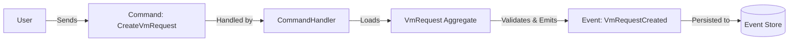
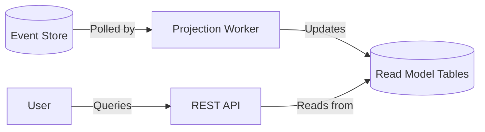

# Event Sourcing in DVMM

**How we store *what happened* instead of just *what is*.**

In traditional databases, you overwrite data. If a VM's status changes from `PROVISIONING` to `ACTIVE`, the old state is lost forever. In DVMM, we use **Event Sourcing**, which means we store every state change as an immutable event. The current state is simply the sum of all past events.

This approach provides a complete, tamper-evident audit trail—a critical requirement for our ISO 27001 compliance.

---

## Core Concepts

### 1. The Write Side (Command Handling)

When a user wants to do something (e.g., "Create VM"), they send a **Command**. The system validates this command and, if successful, produces **Domain Events**.

*   **Command:** An intent to change state (e.g., `CreateVmRequest`). It can be rejected.
*   **Aggregate:** The consistency boundary (e.g., `VmRequestAggregate`). It receives the command, checks business rules (invariants), and generates events.
*   **Domain Event:** A fact that *has happened* (e.g., `VmRequestCreated`). It cannot be rejected because it is already history.



### 2. The Event Store

We use PostgreSQL as our Event Store. It serves as the single source of truth.

*   **Append-Only:** Events are never modified or deleted.
*   **Immutable:** History cannot be rewritten.
*   **Optimistic Locking:** We use a `version` number to prevent concurrent modifications. If two users try to change the same aggregate simultaneously, the one with the stale version fails.

### 3. The Read Side (Projections)

Events are great for writing and auditing, but terrible for querying (imagine replaying 1 million events just to find VMs named "web-01").

We solve this with **Projections**. A projection listens to events and updates a standard "Read Model" database table designed for fast queries.



This pattern is called **CQRS** (Command Query Responsibility Segregation).

---

## How It Works in Code

### Step 1: Defining the Event

Events are simple data classes in `dvmm-domain`. They capture the data relevant to the change.

```kotlin
data class VmRequestCreated(
    val requestId: VmRequestId,
    val projectId: ProjectId,
    val name: String,
    val vmSize: VmSize,
    override val metadata: EventMetadata
) : DomainEvent
```

### Step 2: The Aggregate Logic

The Aggregate accepts the command and applies the event to itself to update its internal state.

```kotlin
class VmRequestAggregate(val id: VmRequestId) : AggregateRoot<VmRequestId>() {
    // Internal state
    var status: VmRequestStatus = VmRequestStatus.DRAFT

    // Command Handler Method
    fun create(command: CreateVmRequestCommand) {
        // 1. Validate
        if (command.name.isBlank()) throw ValidationException("Name required")

        // 2. Emit Event
        applyEvent(VmRequestCreated(id, command.projectId, ...))
    }

    // Event Sourcing Handler (Replay Logic)
    override fun applyEvent(event: DomainEvent) {
        when (event) {
            is VmRequestCreated -> this.status = VmRequestStatus.DRAFT
            is VmRequestApproved -> this.status = VmRequestStatus.APPROVED
        }
    }
}
```

### Step 3: The Projection (jOOQ)

The projection handler listens for the event and executes a SQL `INSERT` or `UPDATE` to keep the read model in sync.

```kotlin
@Component
class VmRequestProjectionHandler(private val dsl: DSLContext) {

    @EventHandler
    fun on(event: VmRequestCreated) {
        dsl.insertInto(VM_REQUESTS)
           .set(VM_REQUESTS.ID, event.requestId.value)
           .set(VM_REQUESTS.STATUS, "DRAFT")
           .execute()
    }

    @EventHandler
    fun on(event: VmRequestApproved) {
        dsl.update(VM_REQUESTS)
           .set(VM_REQUESTS.STATUS, "APPROVED")
           .where(VM_REQUESTS.ID.eq(event.requestId.value))
           .execute()
    }
}
```

---

## Why This Matters for You

1.  **Auditing is Free:** We don't write separate audit logs. The event stream *is* the audit log.
2.  **Debuggability:** We can replay events locally to reproduce a bug exactly as it happened in production.
3.  **Scalability:** The read side (queries) can scale independently from the write side (commands).
4.  **Flexibility:** If we need a new report (e.g., "Monthly VM Usage"), we can create a new projection and replay old events to populate it instantly.

## Key Takeaways

*   **Command:** Request to change state (can fail).
*   **Event:** Fact that happened (immutable).
*   **Aggregate:** Consistency boundary, emits events.
*   **Projection:** Read-optimized view of the data.
*   **Source of Truth:** The Event Store, not the read tables.
