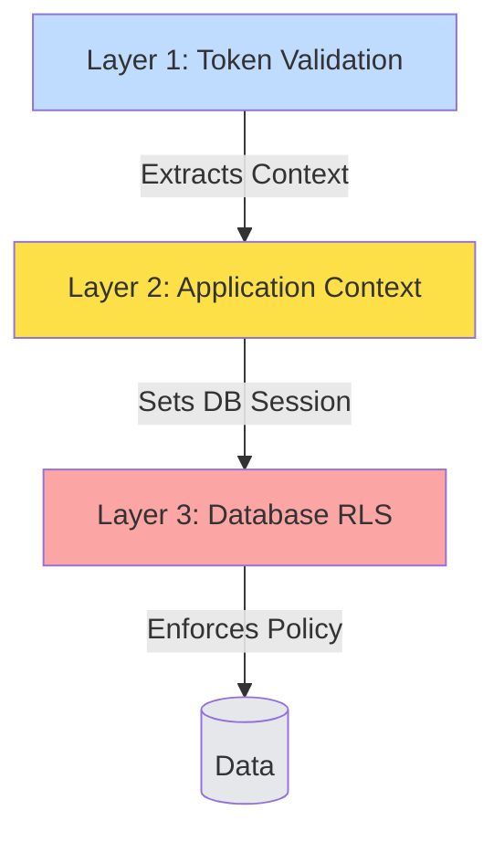

# Multi-Tenancy in DCM

**Three layers of defense to keep tenant data completely isolated.**

DCM is a multi-tenant SaaS platform. This means multiple organizations (Tenants) use the same running application and database. However, it is **critical** that Tenant A never sees Tenant B's data.

We don't rely on developers remembering to add `WHERE tenant_id = ?` to every query. Instead, we enforce isolation at three distinct architectural layers.

---

## The 3-Layer Defense Strategy



### Layer 1: Token Validation (The Gatekeeper)

Every request to the API must carry a JWT (JSON Web Token) from Keycloak. This token *must* contain a `tenant_id` claim.

*   **Mechanism:** Spring Security Filter Chain.
*   **Action:** If the token is valid, the `tenant_id` is extracted.
*   **Fail-Safe:** If the token has no `tenant_id`, the request is rejected immediately with `404 Not Found`.

### Layer 2: Application Context (The Carrier)

Once inside the application, we need to pass this `tenant_id` around without cluttering every function signature. Since we use **Kotlin Coroutines** (not Threads), `ThreadLocal` storage doesn't work.

*   **Mechanism:** `CoroutineContext` element (`TenantContextElement`).
*   **Action:** The `tenant_id` is stored in the coroutine context. It automatically propagates to child coroutines (e.g., when launching parallel jobs).
*   **Usage:**
    ```kotlin
    // Accessing the current tenant safely
    val currentTenant = currentTenant() // Throws IllegalStateException if tenant is missing
    // Handle this exception if you expect the tenant context might be absent
    ```

### Layer 3: Database RLS (The Enforcer)

This is our strongest defense. Even if a developer writes `SELECT * FROM vm_requests`, the database itself will silently filter the results to only show the current tenant's data.

*   **Mechanism:** PostgreSQL Row-Level Security (RLS).
*   **Setup:** Before every query, the application executes `SET LOCAL app.tenant_id = '...'`.
*   **Policy:**
    ```sql
    CREATE POLICY tenant_isolation ON vm_requests
    USING (tenant_id = current_setting('app.tenant_id', true)::UUID);
    ```

**Fail-Closed Design:**
If the application forgets to set `app.tenant_id`, the `current_setting` function returns NULL, and the RLS policy returns **zero rows**. It fails safely (showing nothing) rather than dangerously (showing everything).

---

## Developer Guidelines

1.  **Never Bypass RLS:** Do not use the `superuser` database role for the application connection. Use a restricted role (`dcm_app`) that is subject to RLS policies.
2.  **Context is Automatic:** You rarely need to handle `tenant_id` manually in business logic. The framework handles it.
3.  **Testing:** We have mandatory architecture tests that attempt to cross tenant boundaries. If you can read Tenant B's data while logged in as Tenant A, the build fails.

## Why This Matters

*   **Security:** Prevents accidental data leaks.
*   **Simplicity:** Developers write simple queries (`findAll()`) without worrying about filtering.
*   **Compliance:** Meets strict ISO 27001 data segregation requirements.
