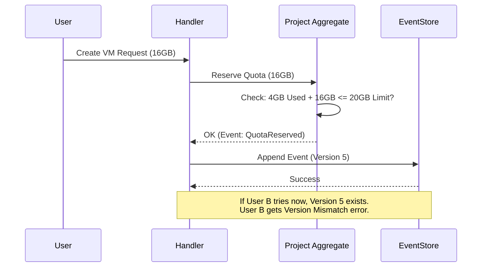

# Quota Management in CQRS

**Solving the "Check-Then-Act" problem in an eventually consistent system.**

In a standard system, checking a quota is easy: lock the row, check the value, update it. But DCM uses **CQRS** (Command Query Responsibility Segregation), where the "Write Side" (Events) is separate from the "Read Side" (Projections).

This creates a race condition risk: Two users might request a large VM at the same millisecond. Both checks pass against the *old* read model, but together they exceed the quota.

---

## The Challenge

1.  **User A** requests 16GB RAM. (Available: 20GB). Check passes.
2.  **User B** requests 16GB RAM. (Available: 20GB). Check passes.
3.  **Both** events are saved.
4.  **Total Used:** 32GB. **Quota:** 20GB. **Result:** Over-provisioning!

## The Solution: Synchronous Validation

We cannot rely on the asynchronous Read Model (Projections) for quota enforcement because it might be a few milliseconds out of date. We need a **Synchronous Gatekeeper**.

### Strategy: Optimistic Locking on the Aggregate

We treat the `ProjectAggregate` (which holds the quota) as the authority.

1.  **The Command:** `CreateVmRequestCommand` is sent.
2.  **The Handler:**
    *   Loads the `ProjectAggregate`.
    *   Calls `project.reserveQuota(vmSize)`.
3.  **The Logic:**
    *   The Aggregate checks its internal state (which is rebuilt from *all* past events, so it is 100% up-to-date).
    *   If `used + requested > limit`, it throws a `QuotaExceededException`.
    *   If valid, it emits `QuotaReserved` event.
4.  **The Concurrency Check:**
    *   When saving the events, the Event Store checks the `version`.
    *   If User A and User B tried this simultaneously, one of them will fail with an `OptimisticLockingFailure`.
    *   The loser retries, sees the new `used` value, and fails the quota check properly.

## Why Not Just Query the DB?

Because in Event Sourcing, the "DB" (Read Model) is a *projection* of the past. It is updated asynchronously. The only source of truth for "right now" is the Event Stream itself, accessed via the Aggregate.

## Key Takeaways

*   **Quotas are strict constraints.** We cannot allow eventual consistency here.
*   **The Aggregate is the Guard.** It holds the true current state.
*   **Optimistic Locking handles races.** It ensures strict serialization of concurrent requests.
