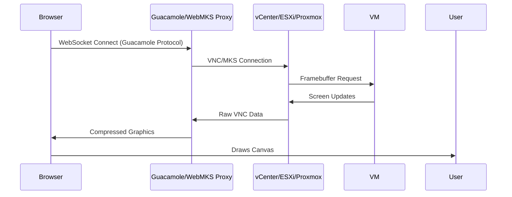

# Remote Console Access

**Seeing the screen when the network is down.**

Sometimes, you can't SSH or RDP into a VM (e.g., boot errors, firewall misconfiguration). In these cases, users need "Console Access"—a view of the actual monitor plugged into the virtual machine.

We deliver this via the browser using **HTML5 VNC/RDP proxies**.

---

## The Architecture

We use **Apache Guacamole** (or a similar protocol gateway) as the bridge between the browser and the hypervisor.

## Solution 1: WebMKS (VMware Only)

VMware provides a proprietary SDK called **WebMKS**.
*   **Pros:** Native performance, supports USB pass-through, no extra proxy server (direct to ESXi).
*   **Cons:** **VMware only.** Does not work for Proxmox or Hyper-V. Closed source.

## Solution 2: Apache Guacamole (Universal)

Guacamole is an open-source gateway that speaks VNC, RDP, and SSH.
*   **Pros:** Hypervisor-agnostic. We just need an endpoint (IP:Port) for VNC/RDP.
*   **Cons:** Requires a dedicated "Guacamole Server" component (Docker container).

## Our Strategy: The Hybrid Approach

To support our "Multi-Hypervisor" vision, we prioritize **Guacamole**.

1.  **Request Console:** User clicks "Open Console".
2.  **Get Ticket:** Backend asks Hypervisor: "Give me a one-time URL/Ticket for console access."
    *   *VMware:* Returns a `mks://` ticket.
    *   *Proxmox:* Returns a VNC port + password.
3.  **Proxy:** Backend configures the Guacamole container to tunnel this connection.
4.  **Connect:** Frontend connects to Guacamole via WebSocket.

## Security Considerations

Console access is dangerous. It bypasses OS-level security (like passwords, if auto-login is on, or BIOS passwords).

*   **One-Time Tokens:** The connection URL is valid for only 60 seconds.
*   **Auth Proxy:** Users never connect directly to the hypervisor. All traffic goes through our Authenticated Proxy.
*   **Audit:** "Console Opened" is logged as a high-severity audit event.

## Why this matters

It's the "Emergency Cord." When everything else fails, Console Access allows the admin to fix the broken firewall rule or see the Blue Screen of Death.
