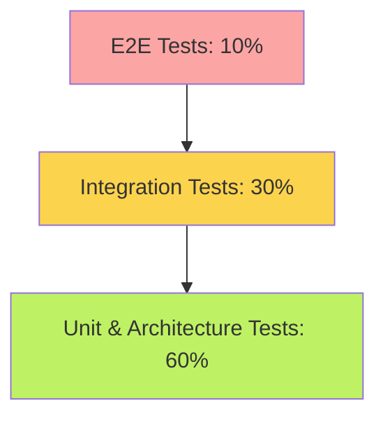

# Testing Strategy

**Our safety net: How we ensure quality, stability, and speed.**

In DVMM, testing isn't an afterthought—it's the foundation. We follow a "Tests First" philosophy, meaning we often write the test that fails before we write the code that passes. We prioritize integration tests because they give us the highest confidence that the system actually works.

---

## The Test Pyramid

We structure our tests to balance speed, cost, and confidence.



### 1. Unit Tests (JUnit 5 + MockK)
* **Focus:** Individual classes, domain logic, aggregates.
* **Speed:** Blazing fast (milliseconds).
* **Dependencies:** All mocked. No database, no network.
* **Example:** "Does the `VmRequestAggregate` switch to `APPROVED` status when the `Approve` command is applied?"

### 2. Integration Tests (Testcontainers)
* **Focus:** Components working together, database interactions, API endpoints.
* **Speed:** Moderate (seconds).
* **Dependencies:** Real services in Docker containers (PostgreSQL, Keycloak).
* **Example:** "Can the `VmRequestController` save a request to the DB and read it back via the API?"

### 3. End-to-End (E2E) Tests (Playwright)
* **Focus:** Critical user journeys from the browser.
* **Speed:** Slow (minutes).
* **Dependencies:** Full running system (Frontend + Backend + DB + Auth).
* **Example:** "Can a user log in, fill out the VM form, and see it appear in the dashboard?"

---

## Quality Gates

Our CI pipeline enforces strict quality standards. If you don't meet these, you cannot merge your code.

### 1. Code Coverage (Kover)
* **Tool:** Kover (Kotlin Coverage).
* **Rule:** Every module must have at least **70% line coverage**.
* **Why:** Ensures we aren't leaving large chunks of code untested.

### 2. Mutation Testing (Pitest)
* **Tool:** Pitest.
* **Rule:** We must achieve a **70% mutation score**.
* **Concept:** Pitest deliberately breaks your code (e.g., changes `if (a > b)` to `if (a < b)`). If your tests still pass, it means your tests are weak. We want tests that fail when the code is broken.

### 3. Architecture Tests (Konsist)
* **Tool:** Konsist.
* **Rule:** 100% pass.
* **Concept:** These tests check our code structure.
    * "Domain classes must not import Spring."
    * "Controllers must reside in the `api` package."
    * "All public classes must have KDoc."

---

## Tooling & Helpers

We've built a dedicated module, `eaf-testing`, to make testing easier.

### `Testcontainers`
We don't mock the database in integration tests. Instead, we spin up a **real PostgreSQL instance** in a Docker container. This ensures that if our SQL is wrong, the test fails.

### `InMemoryEventStore`
For unit testing aggregates, we use an in-memory event store. It behaves like the real one but runs instantly in RAM.

### `TestClock`
Time is tricky in tests. We use a `TestClock` that lets us freeze time or move it forward deterministically. Never use `Instant.now()` in domain logic; inject `Clock` instead.

---

## Writing a Good Test

1.  **Arrange:** Set up the state (e.g., "Given an approved VM request").
2.  **Act:** Perform the action (e.g., "When the Provision command is sent").
3.  **Assert:** Verify the result (e.g., "Then a `VmProvisioned` event is emitted").

**Anti-Pattern:**
Don't use `Thread.sleep()` in tests. It makes tests slow and flaky. Use **Awaitility** or our polling helpers to wait for async events.

```kotlin
// Bad
Thread.sleep(5000)

// Good
await().atMost(5, SECONDS).untilAsserted {
    assertThat(repo.findById(id)).isNotNull()
}
```

## Running Tests

*   **Run All:** `./gradlew test`
*   **Run Specific:** `./gradlew :dvmm:dvmm-domain:test`
*   **Check Coverage:** `./gradlew koverVerify`
*   **Mutation Test:** `./gradlew pitest`
