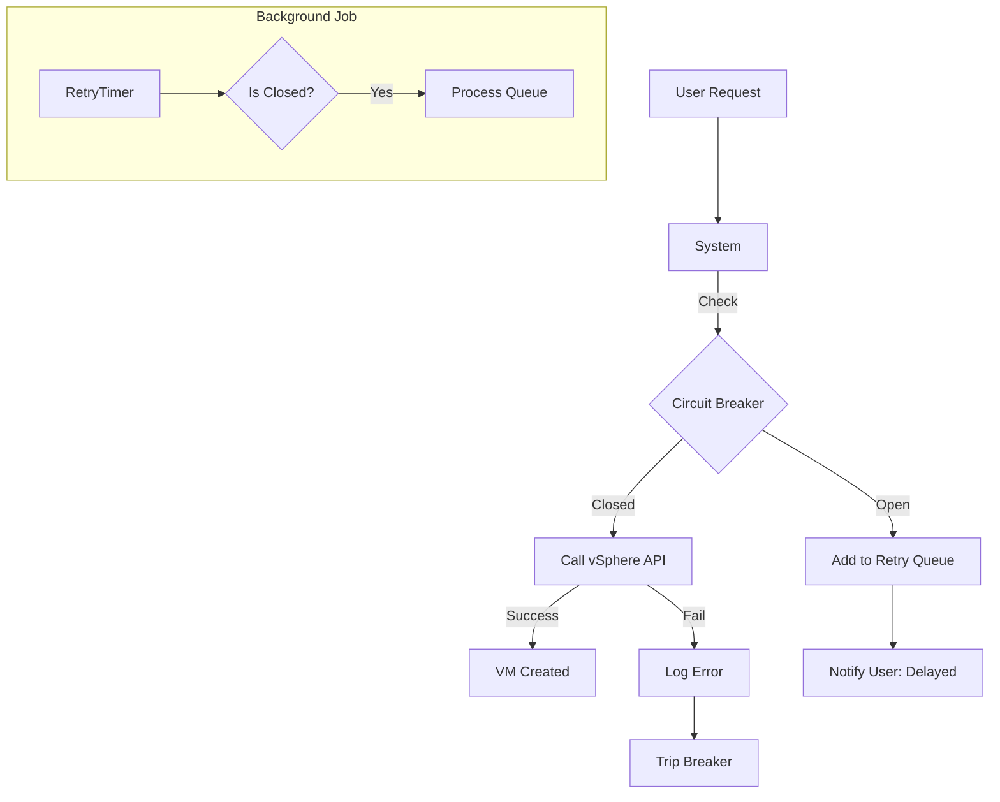

# VMware Integration & Resilience

**Handling the instability of the real world.**

DCM automates VM provisioning by talking to the **VMware vSphere API**. However, external APIs are unpredictable. They go down, they get slow, and they change. Our architecture is designed to handle this "weather" without crashing the entire platform.

---

## 1. Ports and Adapters (Isolation)

We strictly separate *what* we want to do from *how* we do it.

*   **Port (Interface):** `HypervisorPort` (in `dcm-application`). Defines generic intent: `provisionVm(spec)`.
*   **Adapter (Implementation):** `VsphereAdapter` (in `dcm-infrastructure`). Knows how to talk to VMware using the VCF SDK 9.0.

This means the core business logic doesn't know "VMware" exists. It just knows "Hypervisor". If we switch to Proxmox later, we just swap the adapter.

## 2. VCF SDK 9.0 Implementation

We use the official **VMware Cloud Foundation (VCF) SDK 9.0**.

*   **Strict Typing:** We map VMware's complex, deeply nested objects (like `VirtualMachineConfigSpec`) to our simple, clean Domain Value Objects.
*   **Property Collector:** Instead of fetching full objects (heavy), we use the `PropertyCollector` to fetch *only* the specific fields we need (e.g., `summary.config.memorySizeMB`). This makes our calls significantly faster.

## 3. Resilience Patterns

What happens when vCenter is down?

### Circuit Breaker
We wrap all calls to vCenter in a **Circuit Breaker** pattern.
1.  **Closed (Normal):** Calls go through.
2.  **Open (Broken):** If 5 calls fail in a row, the breaker "trips" (opens).
3.  **Fast Failure:** Subsequent calls fail *immediately* without waiting for a timeout. This protects our system threads from hanging.
4.  **Half-Open (Recovery):** After a cooldown (e.g., 30s), we let one "scout" request through. If it succeeds, we close the breaker (resume normal ops).

### Graceful Degradation (Request Queuing)
If the Circuit Breaker is open, we don't just show an error page to the user.

1.  **User submits request.**
2.  System detects vCenter is down.
3.  **Action:** We accept the request but mark it as `QUEUED_FOR_PROVISIONING`.
4.  **Feedback:** User sees "Request accepted. Provisioning will start when the hypervisor is online."
5.  **Recovery:** A background job retries queued requests when the circuit breaker closes.

## Testing VMware Integration

How do we test this without a real $50,000 vCenter server?

1.  **Contract Tests (Pact):** We define the "contract" (expected request/response).
2.  **VCSIM (vCenter Simulator):** We run the official `vmware/vcsim` Docker image. It mimics a real vCenter API perfectly but runs in memory. Our integration tests talk to this simulator.

This gives us confidence that our code works against the real API, including all the weird edge cases.
