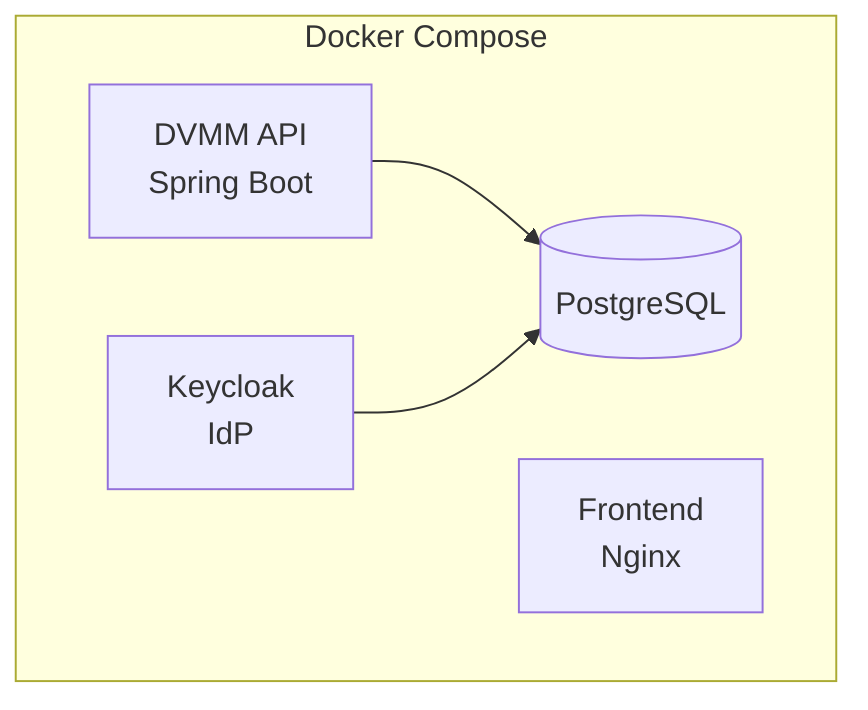
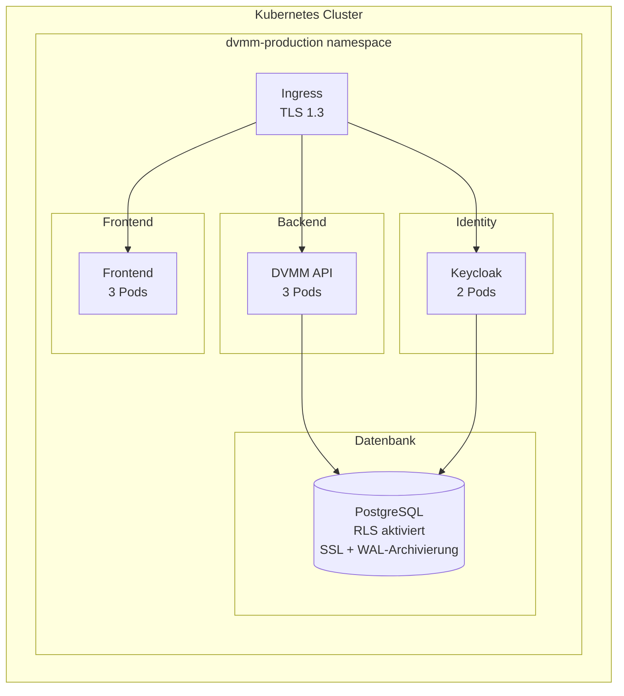
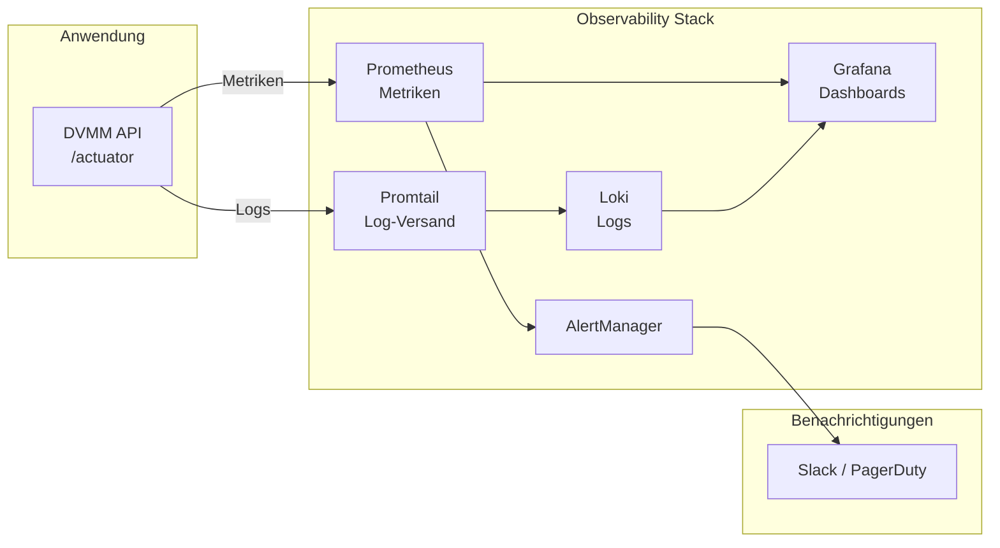

# DVMM Infrastruktur-Briefing

**Für:** Infrastruktur-Team (Ansible, OpenShift, Kubernetes-Experten)
**Datum:** 2025-11-30
**Zweck:** Beratung und Unterstützung für die DVMM/EAF Deployment-Strategie

---

## Was ihr wissen müsst

### ZEWSSP-Nachfolger: DVMM

Ihr kennt ZEWSSP - das VM-Provisionierungssystem. **DVMM (Dynamic Virtual Machine Manager)** ist der Nachfolger, komplett neu entwickelt, um die bisherigen Einschränkungen zu überwinden:

| Problem (ZEWSSP) | Lösung (DVMM) |
|------------------|---------------|
| Nur Single-Tenant | Multi-Tenant mit PostgreSQL Row-Level Security |
| Keine Compliance-Fähigkeit | ISO 27001 / DSGVO-ready von Anfang an |
| Monolithischer Legacy-Code | Moderne modulare Architektur |
| Manuelle Deployments | Container-basiert, CI/CD-automatisiert |

### Was DVMM macht

**Kern-Workflow:** Benutzer beantragt VM → Genehmigungsworkflow → Automatische Provisionierung auf VMware vSphere → Benachrichtigung

Dies ist eine Webanwendung für mehrere Mandanten (Kunden), die Self-Service VM-Provisionierung mit konfigurierbaren Genehmigungsworkflows ermöglicht.

---

## Technischer Stack Überblick

### Backend
- **Kotlin 2.2** + **Spring Boot 3.5** (WebFlux/Coroutines)
- **PostgreSQL 16** mit Row-Level Security für Mandantentrennung
- **Keycloak** für Authentifizierung (OIDC/JWT)
- Event Sourcing Architektur (alle Zustandsänderungen als unveränderliche Events gespeichert)

### Frontend
- **React 19** + TypeScript + Vite
- Tailwind CSS mit shadcn/ui Komponenten

### Integrationen
- **VMware vSphere API** für VM-Provisionierung
- **E-Mail (SMTP)** für Benachrichtigungen

---

## Deployment-Architektur

### Aktueller Stand (Entwicklung)



### Zielzustand (Produktion)



---

## Container Images

| Image | Basis | Ports | Health Endpoints |
|-------|-------|-------|------------------|
| `dvmm/api` | Eclipse Temurin 21 | 8080 | `/actuator/health/liveness`, `/actuator/health/readiness` |
| `dvmm/frontend` | Nginx Alpine | 80 | `/` (statisch) |

### Ressourcenanforderungen (pro Pod)

| Komponente | CPU Request | CPU Limit | Memory Request | Memory Limit |
|------------|-------------|-----------|----------------|--------------|
| DVMM API | 250m | 1000m | 512Mi | 1Gi |
| Frontend | 50m | 200m | 64Mi | 128Mi |

---

## Konfigurationsanforderungen

### Umgebungsvariablen (API)

```yaml
# Datenbank
DB_HOST: postgres.dvmm.svc.cluster.local
DB_PORT: 5432
DB_NAME: dvmm
DB_USER: dvmm
DB_PASSWORD: <aus-secret>

# Keycloak
KEYCLOAK_URL: https://auth.example.com
KEYCLOAK_REALM: dvmm
KEYCLOAK_CLIENT_ID: dvmm-api

# VMware (pro Mandant, in DB gespeichert)
# Zugangsdaten werden über die Anwendung verwaltet, nicht über Env-Vars

# Spring
SPRING_PROFILES_ACTIVE: production
```

### Benötigte Secrets

| Secret | Inhalt | Hinweise |
|--------|--------|----------|
| `dvmm-db-credentials` | username, password | PostgreSQL-Zugang |
| `dvmm-keycloak-client` | client-secret | OIDC Client Credentials |

---

## Observability Stack

Wir planen den Standard Grafana + Prometheus + Loki Stack:



### Wichtige Metriken

| Metrik | Ziel | Alarm-Schwelle |
|--------|------|----------------|
| API Verfügbarkeit | 99,5% | < 99% |
| API P95 Latenz | < 500ms | > 1s |
| Fehlerrate | < 1% | > 5% |
| DB-Verbindungen | < 80% | > 90% |

---

## Deployment-Strategie

### Blue-Green Deployments

Für unterbrechungsfreie Releases wollen wir Blue-Green Deployments implementieren:

1. Neue Version in "Green"-Umgebung deployen
2. Smoke Tests gegen Green ausführen
3. Ingress/Load Balancer auf Green umschalten
4. Blue für sofortiges Rollback verfügbar halten

**Rollback-Zielzeit:** < 5 Minuten

### Datenbank-Migrationen

Wir nutzen **Flyway** für Schema-Migrationen mit diesen Regeln:
- Nur rückwärtskompatible Änderungen
- Kein DROP/RENAME in Produktions-Releases
- Migrationen laufen automatisch beim Anwendungsstart

---

## Nicht-funktionale Anforderungen

| Anforderung | Ziel |
|-------------|------|
| Verfügbarkeit | 99,5% Uptime |
| RTO (Recovery Time Objective) | < 4 Stunden |
| RPO (Recovery Point Objective) | < 1 Stunde |
| Gleichzeitige Benutzer | 100+ |
| Mandanten | 50+ |
| VMs pro Mandant | 1000+ |

---

## Wozu wir euren Input brauchen

### 1. Kubernetes/OpenShift Deployment

- Sollten wir Vanilla Kubernetes Manifeste oder Helm Charts verwenden?
- OpenShift-spezifische Überlegungen?
- Namespace-Strategie für Multi-Environment (Dev/Staging/Prod)?
- Network Policies für Mandantentrennung?

### 2. Configuration Management

- Ansible für Infrastruktur-Provisionierung?
- Wie verwalten wir umgebungsspezifische Konfigurationen?
- Secrets Management (Vault? Sealed Secrets? OpenShift Secrets?)

### 3. Datenbank-Betrieb

- PostgreSQL Operator Empfehlungen?
- Backup-Strategie für WAL-Archivierung?
- Connection Pooling (PgBouncer?) Überlegungen?

### 4. Observability

- Vorhandene Prometheus/Grafana-Infrastruktur, die wir nutzen können?
- Log-Aggregations-Patterns im Einsatz?
- Alerting Best Practices?

### 5. CI/CD Integration

- GitOps-Ansatz (ArgoCD? Flux?)?
- Image Registry Strategie?
- Deployment-Genehmigungsworkflows?

### 6. Sicherheit

- Zertifikatsverwaltung (cert-manager)?
- Ingress Controller Präferenzen?
- Pod Security Policies / Standards?

---

## EAF: Das größere Bild

DVMM ist das erste Produkt, das auf unserem neuen **Enterprise Application Framework (EAF)** aufbaut. Das Framework bietet:

- Multi-Tenancy mit PostgreSQL RLS
- Event Sourcing Infrastruktur
- Authentifizierungs-Abstraktionen (IdP-agnostisch)
- Observability Tooling

Zukünftige Produkte werden ebenfalls EAF nutzen, daher werden die Deployment-Patterns, die wir jetzt etablieren, wiederverwendet. Euer Input hilft uns, eine Grundlage zu schaffen, die skaliert.

---

## Nächste Schritte

1. **Dieses Meeting:** Deployment-Strategie diskutieren und eure Empfehlungen einholen
2. **Follow-up:** Wir teilen spezifische Deployment-Manifeste zur Prüfung
3. **Pilot:** Deployment in einer Testumgebung mit eurer Unterstützung

---

**Fragen?** Wir wollen von eurer Erfahrung lernen. Was funktioniert gut bei euren Deployments? Was sollten wir vermeiden?
