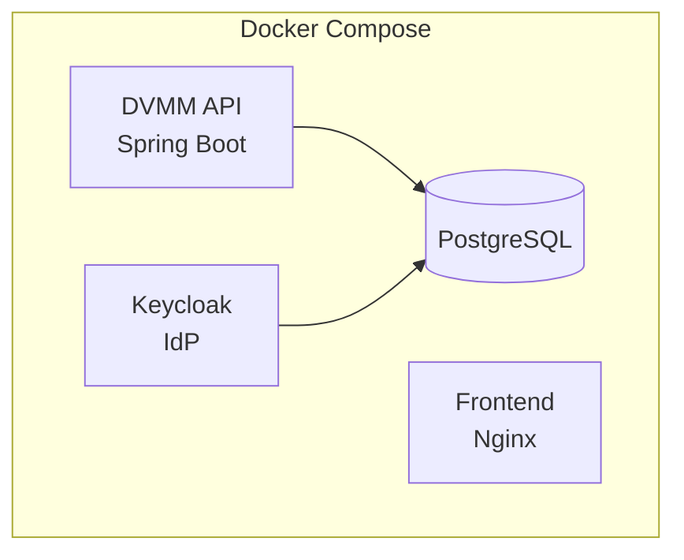
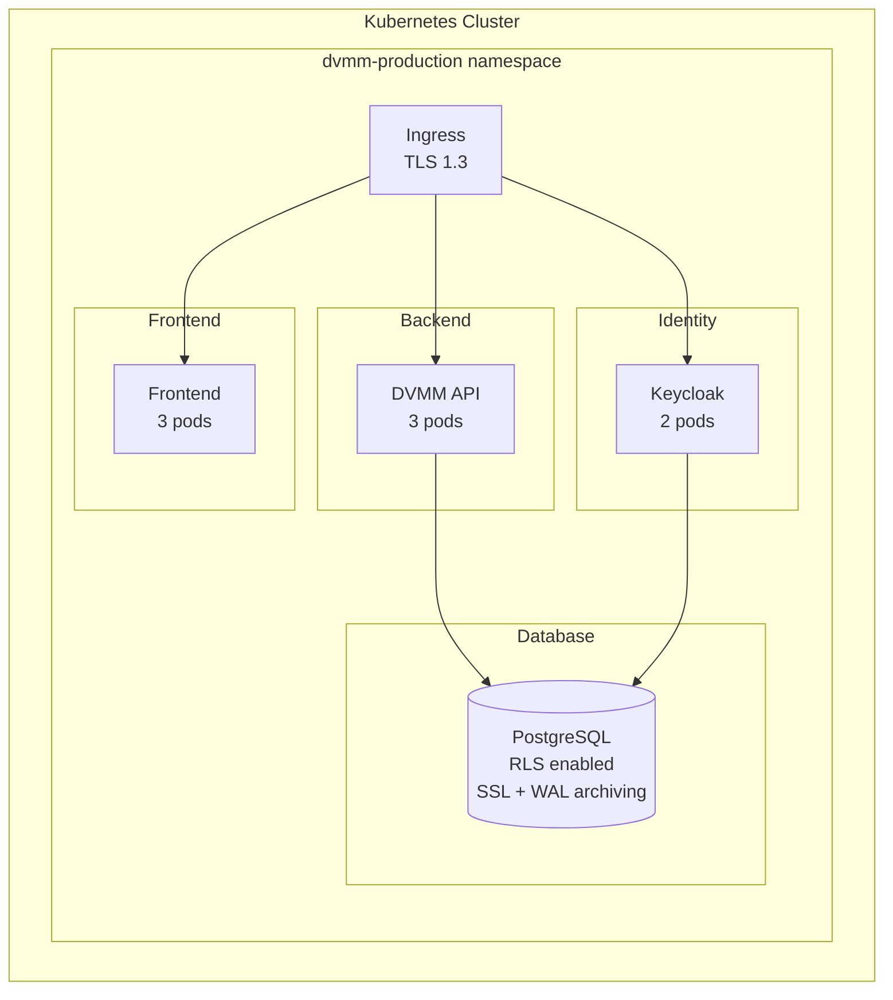
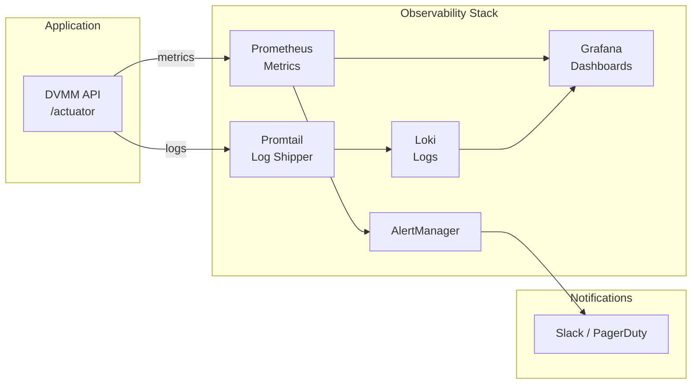

# DVMM Infrastructure Briefing

**For:** Infrastructure Team (Ansible, OpenShift, Kubernetes Experts)
**Date:** 2025-11-30
**Purpose:** Seeking advice and support for DVMM/EAF deployment strategy

---

## What You Need to Know

### ZEWSSP Successor: DVMM

You know ZEWSSP - the VM provisioning system. **DVMM (Dynamic Virtual Machine Manager)** is its successor, built from scratch to address the limitations that have held us back:

| Problem (ZEWSSP) | Solution (DVMM) |
|------------------|-----------------|
| Single-tenant only | Multi-tenant with PostgreSQL Row-Level Security |
| No compliance capability | ISO 27001 / GDPR ready from day one |
| Monolithic legacy code | Modern modular architecture |
| Manual deployments | Container-based, CI/CD automated |

### What DVMM Does

**Core workflow:** User requests VM → Approval workflow → Automated provisioning on VMware vSphere → Notification

This is a web application serving multiple tenants (customers) who can self-service VM provisioning with configurable approval workflows.

---

## Technical Stack Overview

### Backend
- **Kotlin 2.2** + **Spring Boot 3.5** (WebFlux/Coroutines)
- **PostgreSQL 16** with Row-Level Security for tenant isolation
- **Keycloak** for authentication (OIDC/JWT)
- Event Sourcing architecture (all state changes stored as immutable events)

### Frontend
- **React 19** + TypeScript + Vite
- Tailwind CSS with shadcn/ui components

### Integrations
- **VMware vSphere API** for VM provisioning
- **Email (SMTP)** for notifications

---

## Deployment Architecture

### Current State (Development)



### Target State (Production)



---

## Container Images

| Image | Base | Exposed Ports | Health Endpoints |
|-------|------|---------------|------------------|
| `dvmm/api` | Eclipse Temurin 21 | 8080 | `/actuator/health/liveness`, `/actuator/health/readiness` |
| `dvmm/frontend` | Nginx Alpine | 80 | `/` (static) |

### Resource Requirements (per Pod)

| Component | CPU Request | CPU Limit | Memory Request | Memory Limit |
|-----------|-------------|-----------|----------------|--------------|
| DVMM API | 250m | 1000m | 512Mi | 1Gi |
| Frontend | 50m | 200m | 64Mi | 128Mi |

---

## Configuration Requirements

### Environment Variables (API)

```yaml
# Database
DB_HOST: postgres.dvmm.svc.cluster.local
DB_PORT: 5432
DB_NAME: dvmm
DB_USER: dvmm
DB_PASSWORD: <from-secret>

# Keycloak
KEYCLOAK_URL: https://auth.example.com
KEYCLOAK_REALM: dvmm
KEYCLOAK_CLIENT_ID: dvmm-api

# VMware (per-tenant, stored in DB)
# Credentials managed via application, not env vars

# Spring
SPRING_PROFILES_ACTIVE: production
```

### Secrets Required

| Secret | Contents | Notes |
|--------|----------|-------|
| `dvmm-db-credentials` | username, password | PostgreSQL access |
| `dvmm-keycloak-client` | client-secret | OIDC client credentials |

---

## Observability Stack

We plan to use the standard Grafana + Prometheus + Loki stack:



### Key Metrics

| Metric | Target | Alert Threshold |
|--------|--------|-----------------|
| API Uptime | 99.5% | < 99% |
| API P95 Latency | < 500ms | > 1s |
| Error Rate | < 1% | > 5% |
| DB Connections | < 80% | > 90% |

---

## Deployment Strategy

### Blue-Green Deployments

For zero-downtime releases, we want to implement blue-green deployments:

1. Deploy new version to "green" environment
2. Run smoke tests against green
3. Switch ingress/load balancer to green
4. Keep blue available for instant rollback

**Rollback time target:** < 5 minutes

### Database Migrations

We use **Flyway** for schema migrations with these rules:
- Only backward-compatible changes
- No DROP/RENAME in production releases
- Migrations run automatically on application startup

---

## Non-Functional Requirements

| Requirement | Target |
|-------------|--------|
| Availability | 99.5% uptime |
| RTO (Recovery Time Objective) | < 4 hours |
| RPO (Recovery Point Objective) | < 1 hour |
| Concurrent Users | 100+ |
| Tenants | 50+ |
| VMs per Tenant | 1000+ |

---

## What We Need Your Input On

### 1. Kubernetes/OpenShift Deployment

- Should we use vanilla Kubernetes manifests or Helm charts?
- OpenShift-specific considerations?
- Namespace strategy for multi-environment (dev/staging/prod)?
- Network policies for tenant isolation?

### 2. Configuration Management

- Ansible for infrastructure provisioning?
- How to manage per-environment configurations?
- Secrets management (Vault? Sealed Secrets? OpenShift secrets?)

### 3. Database Operations

- PostgreSQL operator recommendations?
- Backup strategy for WAL archiving?
- Connection pooling (PgBouncer?) considerations?

### 4. Observability

- Existing Prometheus/Grafana infrastructure we can leverage?
- Log aggregation patterns in use?
- Alerting best practices?

### 5. CI/CD Integration

- GitOps approach (ArgoCD? Flux?)?
- Image registry strategy?
- Deployment approval workflows?

### 6. Security

- Certificate management (cert-manager)?
- Ingress controller preferences?
- Pod security policies / standards?

---

## EAF: The Bigger Picture

DVMM is the first product built on our new **Enterprise Application Framework (EAF)**. The framework provides:

- Multi-tenancy with PostgreSQL RLS
- Event Sourcing infrastructure
- Authentication abstractions (IdP-agnostic)
- Observability tooling

Future products will also use EAF, so deployment patterns we establish now will be reused. Your input helps us build a foundation that scales.

---

## Next Steps

1. **This meeting:** Discuss deployment strategy and get your recommendations
2. **Follow-up:** We'll share specific deployment manifests for review
3. **Pilot:** Deploy to a test environment with your guidance

---

**Questions?** We're here to learn from your experience. What works well in your deployments? What should we avoid?
