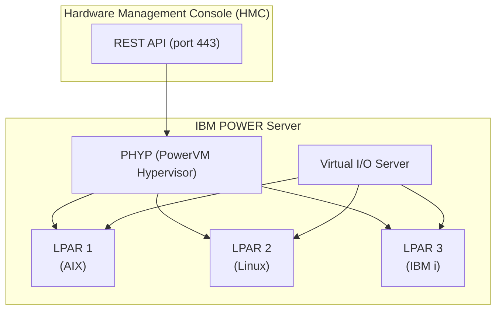
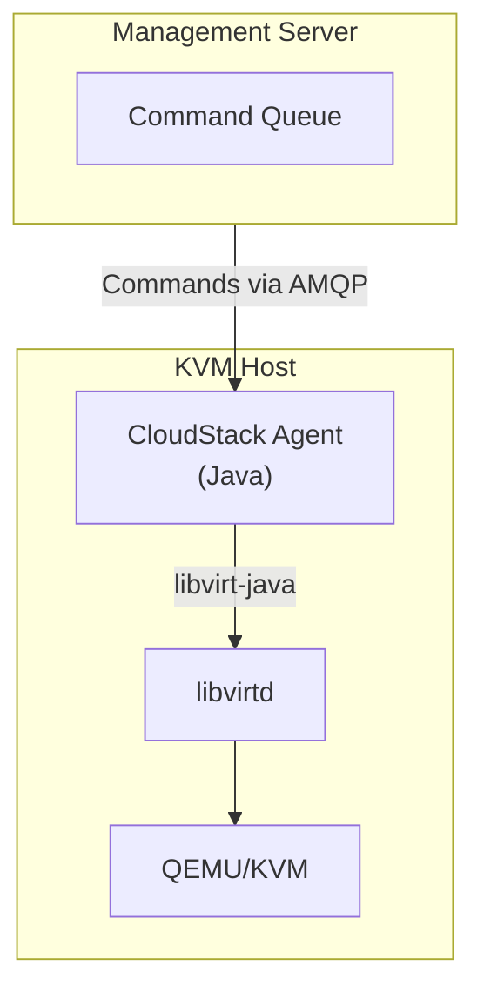

# Multi-Hypervisor Support Research for DCM

**Author:** Claude (Research Agent)
**Date:** 2025-12-09
**Status:** Research Complete
**Version:** 2.0

---

## Executive Summary

This document provides exhaustive research on extending DCM to support multiple hypervisors beyond VMware vSphere. We analyze four primary platforms: **Proxmox VE**, **Microsoft Hyper-V**, **IBM PowerVM**, and **Apache CloudStack/OpenNebula** as reference architectures. Additionally, we examine the seismic market shift caused by **Broadcom's VMware acquisition**, which has fundamentally altered the DACH virtualization landscape.

**Key Findings:**

1. **Proxmox VE** offers the lowest integration effort with a clean REST API and mature Java SDK (cv4pve-api-java v9.0.0 on Maven Central)
2. **Microsoft Hyper-V** requires Windows-specific tooling (WinRM/WMI) with fragmented Java library support—the HLSolutions fork of winrm4j is required for modern JDK 17+/Jakarta EE compatibility
3. **IBM PowerVM** serves enterprise banking/government segments in DACH but requires custom Java client development (Python SDK only)
4. **No unified Java library exists** for multi-hypervisor management—a custom abstraction layer is mandatory
5. **Market disruption**: 98% of VMware customers are evaluating alternatives post-Broadcom acquisition, with price increases of 150-1500%

**Recommendation:** Support multi-hypervisor architecture **after MVP**, starting with Proxmox VE as the second hypervisor. The current `VspherePort` abstraction pattern is well-suited for extension.

---

## Table of Contents

1. [Market Context: The Broadcom Effect](#1-market-context-the-broadcom-effect)
2. [Current Architecture Analysis](#2-current-architecture-analysis)
3. [Proxmox VE Research](#3-proxmox-ve-research)
4. [Microsoft Hyper-V Research](#4-microsoft-hyper-v-research)
5. [IBM PowerVM Research](#5-ibm-powervm-research)
6. [Additional Platforms Reference](#6-additional-platforms-reference)
7. [Java SDK Landscape Comparison](#7-java-sdk-landscape-comparison)
8. [Architectural Patterns for Multi-Hypervisor Support](#8-architectural-patterns-for-multi-hypervisor-support)
9. [Security Considerations](#9-security-considerations)
10. [Integration Effort Analysis](#10-integration-effort-analysis)
11. [MVP Timing Recommendation](#11-mvp-timing-recommendation)
12. [Risk Assessment](#12-risk-assessment)
13. [Sources](#13-sources)

---

## 1. Market Context: The Broadcom Effect

The November 2023 Broadcom acquisition of VMware triggered the most significant enterprise virtualization disruption in a decade, with profound implications for the DACH market.

### Market Impact Assessment

| Metric | Impact |
|--------|--------|
| **Customers evaluating alternatives** | 98% (late-2024 surveys) |
| **Price increases reported** | 150% to 1,500% depending on deployment size |
| **Product consolidation** | 56+ SKUs reduced to 4 editions (VVS, VVP, VVF, VCF) |
| **Minimum purchase requirements** | Increased from 16 to 72 cores |
| **Licensing model** | Perpetual licenses eliminated—subscription-only |

### Regulatory Response

- **VOICE** (German IT association representing 3,000+ companies) filed formal EU complaints
- **European Cloud Competition Observatory** issued a **"RED" status rating** indicating potential EU competition regulation breaches
- **EU Commission** sent formal requests for information to Broadcom (April 2024)

### Proxmox Adoption Acceleration

| Metric | Value |
|--------|-------|
| **Global deployments** | 1.5+ million hosts |
| **Growth** | 650% (2018-2025) |
| **Global market mindshare** | 16.1% (PeerSpot 2025) |
| **Headquarters** | Vienna, Austria (GDPR/data sovereignty advantage) |

**Public sector momentum**: Germany's Schleswig-Holstein state initiative targets migration of 25,000 government workplaces to open-source solutions.

### DACH Proxmox Partner Ecosystem

| Partner Type | Organizations |
|--------------|---------------|
| **Gold Partners (Germany)** | inett GmbH, Thomas-Krenn.AG, primeLine Solutions, croit GmbH |
| **Infrastructure** | Hetzner, partimus GmbH (ISO 27001/Tier 3) |
| **Switzerland** | Andeo |

---

## 2. Current Architecture Analysis

### Existing VMware Integration Pattern

DCM implements a **clean port/adapter pattern** for hypervisor integration:

```text
dcm-application/
└── vmware/
    └── VspherePort.kt          # Interface (Port)

dcm-infrastructure/
└── vmware/
    ├── VcenterAdapter.kt       # Production implementation
    ├── VcsimAdapter.kt         # Test simulator implementation
    └── VsphereClient.kt        # Low-level SDK wrapper
```

**Key Interface (`VspherePort.kt`):**

```kotlin
public interface VspherePort {
    suspend fun testConnection(params: VcenterConnectionParams, password: String): Result<ConnectionInfo, ConnectionError>
    suspend fun listDatacenters(): Result<List<Datacenter>, VsphereError>
    suspend fun listClusters(datacenter: Datacenter): Result<List<Cluster>, VsphereError>
    suspend fun listDatastores(cluster: Cluster): Result<List<Datastore>, VsphereError>
    suspend fun listNetworks(datacenter: Datacenter): Result<List<Network>, VsphereError>
    suspend fun listResourcePools(cluster: Cluster): Result<List<ResourcePool>, VsphereError>
    suspend fun createVm(spec: VmSpec): Result<VmProvisioningResult, VsphereError>
    suspend fun getVm(vmId: VmId): Result<VmInfo, VsphereError>
    suspend fun deleteVm(vmId: VmId): Result<Unit, VsphereError>
}
```

### Strengths for Multi-Hypervisor Extension

- Clean separation between interface and implementation
- Spring Profile-based adapter selection (`@Profile("!vcsim")`)
- Async/suspend functions using Kotlin coroutines
- Result type for error handling
- Test adapter (VcsimAdapter) validates the pattern works

### Changes Required for Multi-Hypervisor

- Rename `VspherePort` to `HypervisorPort` (or create abstraction layer)
- Define hypervisor-agnostic value objects (`VmProvisionSpec`, `VmInfo`, etc.)
- Implement tenant-level hypervisor configuration selection
- Create adapter factory for dynamic hypervisor selection

---

## 3. Proxmox VE Research

### Platform Overview

| Aspect | Details |
|--------|---------|
| **Vendor** | Proxmox Server Solutions GmbH (Vienna, Austria) |
| **Type** | Type 1 hypervisor (KVM/LXC-based) |
| **Target Market** | SMB, education, budget-conscious enterprises, VMware refugees |
| **License** | AGPLv3 (open source), optional paid support subscriptions |
| **Current Version** | 9.1.0 (November 2025) based on Debian Trixie, Linux 6.17 kernel |
| **API** | REST (`/api2/json/`), JSON with JSON Schema definitions |

### Version History and Breaking Changes

| Version | Release | Key Changes |
|---------|---------|-------------|
| **PVE 9.1.0** | November 2025 | Debian Trixie base, Linux 6.17 |
| **PVE 9.0** | 2025 | **Breaking**: `VM.Monitor` privilege removed; requires `Sys.Audit` for QEMU HMP monitor |
| **PVE 8.4** | April 2025 | External Backup Provider API, virtiofs support |
| **PVE 8.3** | 2024 | Webhook notification targets for event-driven architectures |
| **PVE 8.1** | 2024 | **VMware ESXi Import Wizard** (live-import from ESXi 6.5-8.0) |

### API Architecture

- **Base URL:** `https://{host}:8006/api2/json/`
- **Authentication:** Username/password tickets or API tokens (recommended)
- **Protocol:** HTTPS with certificate validation
- **Format:** JSON request/response bodies with formal JSON Schema

### Java SDK Options

#### Option A: cv4pve-api-java (Recommended)

| Attribute | Value |
|-----------|-------|
| **Repository** | [Corsinvest/cv4pve-api-java](https://github.com/Corsinvest/cv4pve-api-java) |
| **Group ID** | `it.corsinvest.proxmoxve` |
| **Artifact ID** | `cv4pve-api-java` |
| **Version** | 9.0.0 (October 2025) |
| **License** | Apache-2.0 (on Maven Central) |
| **Maven Central** | Available |
| **Maintenance** | Active, aligned with Proxmox releases |

**Maven Dependency:**

```xml
<dependency>
    <groupId>it.corsinvest.proxmoxve</groupId>
    <artifactId>cv4pve-api-java</artifactId>
    <version>9.0.0</version>
</dependency>
```

**Key Features:**

- Fluent API mirroring Proxmox hierarchy (`client.nodes["pve1"].qemu["100"].clone()`)
- Unified `Result` class for deterministic error handling
- Built-in task monitoring with `waitForTaskToFinish()`
- API token authentication support
- Two-Factor Authentication (2FA/OTP) support
- Minimal dependencies (`org.json` only)

**Usage Example:**

```kotlin
val client = PveClient("proxmox.example.com", 8006)
if (client.login("root@pam", "password")) {
    // List all nodes
    val nodes = client.nodes.index().response.getJSONArray("data")

    // Clone VM from template
    val result = client.nodes["pve1"].qemu["100"]
        .clone(newVmId = 200, name = "web-server-01")

    // Wait for clone task
    client.waitForTaskToFinish("pve1", result.response.getString("data"))

    // Start VM
    client.nodes["pve1"].qemu[200].status.start()
}
```

#### Option B: Fit2Cloud Proxmox Wrapper

| Attribute | Value |
|-----------|-------|
| **Group ID** | `com.fit2cloud` |
| **Artifact ID** | `proxmox-api-java-wrapper` |
| **Version** | 1.7.0 (August 2023) |
| **Repository** | Maven Central |
| **Status** | Less actively maintained |

#### Option C: Custom Client via LUMASERV OpenAPI

The [LUMASERV/proxmox-ve-openapi](https://github.com/LUMASERV/proxmox-ve-openapi) specification enables generating Kotlin-native clients using OpenAPI Generator, providing maximum control over error handling and resilience patterns.

#### Option D: libvirt-java (Low-Level KVM)

For direct KVM control without Proxmox API (host-by-host management):

| Attribute | Value |
|-----------|-------|
| **Group ID** | `org.libvirt` |
| **Artifact ID** | `libvirt` |
| **Version** | 0.5.x+ |
| **Repository** | Custom (`download.libvirt.org/maven2`) |
| **Binding** | JNA-based |

### Key API Endpoints

| Operation | Endpoint | Method |
|-----------|----------|--------|
| Authentication | `/access/ticket` | POST |
| List nodes | `/nodes` | GET |
| List VMs | `/nodes/{node}/qemu` | GET |
| Create VM | `/nodes/{node}/qemu` | POST |
| Clone template | `/nodes/{node}/qemu/{vmid}/clone` | POST |
| Start VM | `/nodes/{node}/qemu/{vmid}/status/start` | POST |
| Get VM status | `/nodes/{node}/qemu/{vmid}/status/current` | GET |
| Get VM config | `/nodes/{node}/qemu/{vmid}/config` | GET |
| Delete VM | `/nodes/{node}/qemu/{vmid}` | DELETE |
| List networks | `/nodes/{node}/network` | GET |
| List storage | `/nodes/{node}/storage` | GET |

### Concept Mapping to DCM

| DCM Concept | Proxmox Equivalent |
|--------------|-------------------|
| Datacenter | Proxmox Cluster |
| Cluster | Node (single host) or Node Group |
| Datastore | Storage (local, NFS, Ceph, ZFS) |
| Network | Bridge (vmbr0, vmbr1, etc.) |
| Template | VM with "template" flag |
| VM | QEMU/KVM VM (type: qemu) |

### Integration Complexity Assessment

| Aspect | Rating | Notes |
|--------|--------|-------|
| SDK Maturity | ⭐⭐⭐⭐ | cv4pve v9.0.0 actively maintained, on Maven Central |
| API Design | ⭐⭐⭐⭐⭐ | Clean REST, JSON Schema documented |
| Authentication | ⭐⭐⭐⭐⭐ | API tokens, standard HTTPS |
| Documentation | ⭐⭐⭐⭐ | Good API viewer, community resources |
| **Overall Effort** | **LOW** | Most straightforward alternative |

---

## 4. Microsoft Hyper-V Research

### Platform Overview

| Aspect | Details |
|--------|---------|
| **Vendor** | Microsoft |
| **Type** | Type 1 hypervisor (bare-metal on Windows Server) |
| **Target Market** | Windows Server environments, Azure Stack HCI |
| **License** | Included with Windows Server, free Hyper-V Server edition |
| **Current Versions** | Windows Server 2025, 2022, 2019, Azure Local 2311.2+ |
| **Management** | PowerShell/WinRM, WMI, no REST API |

### Windows Server 2025 Hyper-V Enhancements

| Feature | Specification |
|---------|--------------|
| **Generation 2 VMs** | Now default |
| **Max vCPUs** | 2,048 (vs 64 for Gen1) |
| **Max RAM** | 240 TB |
| **GPU Partitioning (GPU-P)** | Supported with live migration |
| **Primary Interface** | WMI v2 namespace (`root\virtualization\v2`) |

### Available APIs

Microsoft provides **no REST API** for on-premises Hyper-V. Available interfaces:

1. **Hyper-V WMI Provider (V2)**
   - Namespace: `root\virtualization\v2`
   - High-level workflow-oriented API
   - Manages VMs, virtual networks, virtual hard disks

2. **Host Compute System (HCS) APIs**
   - Low-level, granular access
   - Used for containers, WSL2, custom virtualization solutions

3. **Windows Hypervisor Platform (WHP)**
   - Third-party virtualization stack support
   - Hypervisor-level partition management

4. **PowerShell Cmdlets**
   - `New-VM`, `Get-VM`, `Set-VM`, `Start-VM`, `Stop-VM`, `Remove-VM`
   - Primary interface for automation

### Java/Kotlin Integration Options

#### Option A: winrm4j (Original - Caution Required)

| Attribute | Value |
|-----------|-------|
| **Repository** | [cloudsoft/winrm4j](https://github.com/cloudsoft/winrm4j) |
| **Group ID** | `io.cloudsoft.windows` |
| **Artifact ID** | `winrm4j` |
| **Version** | 0.12.3 (August 2021) |
| **License** | Apache-2.0 |
| **Status** | **Effectively unmaintained** |

**Critical Warning:** The original repository has not released since August 2021. The `0.13.0-SNAPSHOT` exists but no official release. This library is incompatible with JDK 17+ and Jakarta EE 9+ due to `javax.*` namespace dependencies.

#### Option B: HLSolutions winrm4j Fork (Recommended for Modern Java)

| Attribute | Value |
|-----------|-------|
| **Repository** | [hlsolutions/winrm4j](https://github.com/hlsolutions/winrm4j) |
| **Status** | Active maintenance for Jakarta EE compliance |
| **JDK Support** | JDK 17+ |
| **Key Branch** | `jdk17_jakarta_psrp` |

**Key Modernizations:**

- Jakarta EE migration (Apache CXF v4)
- PSRP (PowerShell Remoting Protocol) support in development
- Compatible with Spring Boot 3+

#### Option C: MetricsHub winrm-java (Newest Alternative)

| Attribute | Value |
|-----------|-------|
| **Group ID** | `org.metricshub` |
| **Artifact ID** | `winrm-java` |
| **Version** | 1.1.02 (April 2025) |
| **Focus** | Optimized for WQL (WMI Query Language) execution |

```xml
<dependency>
    <groupId>org.metricshub</groupId>
    <artifactId>winrm-java</artifactId>
    <version>1.1.02</version>
</dependency>
```

This library excels for Hyper-V management scenarios requiring direct WMI queries against `root\virtualization\v2` namespace.

#### Option D: Overthere Framework (Unified Abstraction)

| Attribute | Value |
|-----------|-------|
| **Repository** | [xebialabs/overthere](https://github.com/xebialabs/overthere) |
| **Group ID** | `com.xebialabs.overthere` |
| **Artifact ID** | `overthere` |
| **Version** | 5.7.1 |
| **License** | Apache-2.0 |
| **Used By** | Digital.ai XL Deploy, XL Release |

Overthere provides a **unified interface** for remote file manipulation and process execution across both Unix (SSH) and Windows (WinRM). It abstracts connection protocols behind generic `OverthereFile` and `OverthereProcess` interfaces.

**Connection Types:**

- `WINRM_NATIVE` / `WINRM_INTERNAL`: WinRM protocol
- `SFTP_CYGWIN` / `SFTP_WINSSHD`: SSH to Windows hosts

#### Option E: J-Interop / JACOB (Direct WMI)

For direct WMI access without PowerShell:

- **J-Interop**: Pure-Java COM bridge (DCOM protocol, port 135)
- **JACOB**: JNI-based COM bridge (Windows-only, requires native DLLs)

**Pros:** Strong typing of WMI objects, direct access
**Cons:** Windows-only, complex setup, DCOM firewall rules, limited documentation

#### Option F: SSH-based PowerShell (Cleanest Cross-Platform)

For Windows Server 2019+ with PowerShell Core 7+:

```xml
<dependency>
    <groupId>org.apache.sshd</groupId>
    <artifactId>sshd-core</artifactId>
    <version>2.12.1</version>
</dependency>
```

Eliminates WinRM protocol complexity entirely by using standard SSH.

### Key PowerShell Cmdlets

| Operation | PowerShell Cmdlet |
|-----------|-------------------|
| Create VM | `New-VM -Name "..." -MemoryStartupBytes 4GB -Generation 2` |
| Clone from Template | `Export-VM` + `Import-VM` or differential disk |
| Configure CPU | `Set-VMProcessor -VMName "..." -Count 4` |
| Attach Network | `Add-VMNetworkAdapter -VMName "..." -SwitchName "..."` |
| Start VM | `Start-VM -Name "..."` |
| Get IP Address | `Get-VMNetworkAdapter -VMName "..." \| Select IPAddresses` |
| Get VM State | `Get-VM -Name "..." \| Select State` |
| Delete VM | `Remove-VM -Name "..." -Force` |

### Configuration Architectures

Unlike vSphere's centralized vCenter, Hyper-V deployments can be:

1. **Standalone hosts** - Direct management per host (via WinRM)
2. **System Center VMM** - Centralized management (requires SCVMM license)
3. **Windows Admin Center** - Web-based management
4. **Azure Stack HCI** - Azure-integrated management

For DCM integration, targeting **standalone hosts via WinRM** is most practical for MVP.

### Integration Complexity Assessment

| Aspect | Rating | Notes |
|--------|--------|-------|
| SDK Maturity | ⭐⭐ | winrm4j unmaintained; MetricsHub newer but less proven |
| API Design | ⭐⭐ | SOAP/WinRM, not REST; requires PowerShell output parsing |
| Authentication | ⭐⭐⭐ | NTLM, Kerberos, CredSSP (complex) |
| Documentation | ⭐⭐⭐ | Microsoft docs good; Java integration docs sparse |
| **Overall Effort** | **HIGH** | WinRM complexity, library fragmentation |

### Market Relevance (DACH SMB/Mid-Market)

| Factor | Assessment |
|--------|------------|
| Market Share | ~15-20% in DACH on-prem virtualization |
| Common Use Cases | Windows Server workloads, Active Directory integration |
| Target Customers | Microsoft-centric shops, Azure Stack HCI users |
| Competitive Pressure | Lower priority—VMware customers unlikely to migrate to Hyper-V |

---

## 5. IBM PowerVM Research

### Platform Overview

| Aspect | Details |
|--------|---------|
| **Vendor** | IBM |
| **Type** | Type 1 hypervisor (firmware-level on POWER CPUs) |
| **Hardware** | IBM POWER7, POWER8, POWER9, POWER10, POWER11 |
| **Management** | Hardware Management Console (HMC) via REST API |
| **License** | Commercial (PowerVM feature license required) |
| **Target Market** | Large enterprise (banks, insurance, government, SAP) |

### Architecture Overview



### HMC REST API

| Attribute | Value |
|-----------|-------|
| **Base URL** | `https://{HMC}:443/rest/api/uom/` |
| **Port** | 443 (default), 12443 (legacy) |
| **Authentication** | HMC administrator credentials |
| **Format** | **XML** with Atom feed structure (`application/vnd.ibm.powervm.web+xml`) |
| **Session Management** | **Critical**—stateful sessions with hard limit |

### Critical: Session Management

**HMC enforces a hard limit of approximately 3000 concurrent sessions.** Automation scripts that fail to explicitly log off cause session exhaustion, requiring HMC reboot.

**Session Flow:**

1. **Logon:** `PUT /rest/api/web/Logon` with XML credentials
2. **Token Extraction:** Retrieve session token from response
3. **API Calls:** Include `X-API-Session` header in all requests
4. **Logoff (Mandatory):** `DELETE /rest/api/web/Logon` to release session

```kotlin
// CRITICAL: Always close sessions in finally block
try {
    val sessionToken = hmcClient.logon(credentials)
    // ... perform operations
} finally {
    hmcClient.logoff() // MANDATORY to prevent session exhaustion
}
```

### Available SDKs

#### Python SDK: pypowervm (Official)

| Attribute | Value |
|-----------|-------|
| **Repository** | [powervm/pypowervm](https://github.com/powervm/pypowervm) |
| **PyPI** | Available (`pypowervm`) |
| **Version** | 1.1.27 (December 2021) |
| **License** | Apache-2.0 |
| **Status** | IBM-supported, production-grade |

#### Java SDK Status: **None Available**

**IBM provides no official Java SDK for HMC REST API.** Integration requires:

1. **Custom HTTP/XML Client:**

   ```kotlin
   @Service
   class HmcRestClient(
       private val httpClient: CloseableHttpClient,
       @Value("\${hmc.host}") private val hmcHost: String
   ) {
       private var sessionToken: String? = null

       suspend fun listManagedSystems(): List<ManagedSystem> {
           val request = HttpGet("https://$hmcHost:443/rest/api/uom/ManagedSystem")
               .apply {
                   addHeader("Content-Type", "application/vnd.ibm.powervm.uom+xml")
                   addHeader("X-API-Session", sessionToken)
               }
           // JAXB unmarshalling of XML response...
       }
   }
   ```

2. **Python Subprocess:** Shell out to pypowervm scripts (not recommended for production)

3. **JAXB Code Generation:** Generate Java classes from IBM's XSD schemas (`/schema` endpoints)

### Key API Endpoints

| Operation | Endpoint | Method |
|-----------|----------|--------|
| Console Info | `/uom/ManagementConsole` | GET |
| List Managed Systems | `/uom/ManagedSystem` | GET |
| List LPARs | `/uom/ManagedSystem/{sysId}/LogicalPartition` | GET |
| Get LPAR | `/uom/LogicalPartition/{lparId}` | GET |
| Create LPAR | `/uom/ManagedSystem/{sysId}/LogicalPartition` | PUT/POST |
| Power On LPAR | `/uom/LogicalPartition/{lparId}?operation=PowerOn` | POST |
| Power Off LPAR | `/uom/LogicalPartition/{lparId}?operation=PowerOff` | POST |

### Concept Mapping to DCM

| DCM Concept | PowerVM Equivalent |
|--------------|-------------------|
| Datacenter | HMC (Management Console) |
| Cluster | Managed System (physical POWER server) |
| Host | Frame/CEC (Central Electronics Complex) |
| Datastore | Virtual I/O Server (VIOS) storage pools |
| Network | Virtual Ethernet via VIOS (VLAN) |
| Template | Reference LPAR + Golden Image |
| VM | LPAR (Logical Partition) |

### Integration Complexity Assessment

| Aspect | Rating | Notes |
|--------|--------|-------|
| SDK Maturity | ⭐⭐ | Python only (pypowervm); no Java |
| API Design | ⭐⭐⭐ | REST but XML/Atom (verbose, complex schema) |
| Authentication | ⭐⭐⭐ | HTTPS, session-based (exhaustion risk) |
| Documentation | ⭐⭐⭐ | IBM Knowledge Center (thorough but enterprise-focused) |
| Market Fit | ⭐⭐ | Niche but critical for large DACH enterprise |
| **Overall Effort** | **VERY HIGH** | Custom SDK development required |

### Market Relevance (DACH Enterprise)

| Factor | Assessment |
|--------|------------|
| Market Share | <5% overall, but dominant in banking/government |
| Common Use Cases | Core banking systems, SAP HANA, government data centers |
| Target Customers | Deutsche Bank, large insurance, federal agencies |
| **Strategic Value** | High for enterprise contracts despite low volume |

---

## 6. Additional Platforms Reference

### Apache CloudStack

CloudStack represents a fundamentally different **agent-based architecture**:



**Key Insight:** Unlike API-centric models (Proxmox, HMC), CloudStack deploys a **resident Java agent** on each hypervisor host. The agent translates high-level commands into local libvirt calls.

**Pros:** Full control, arbitrary logic execution on hosts
**Cons:** Requires JRE on every hypervisor, agent lifecycle management

### OpenNebula

OpenNebula uses **XML-RPC** protocol (predates REST/JSON):

| Attribute | Value |
|-----------|-------|
| **Library** | OpenNebula Cloud API (OCA) for Java |
| **Protocol** | XML-RPC (`http://frontend:2633/RPC2`) |
| **Pattern** | "Fetch-Then-Read" (explicit `info()` calls required) |

```kotlin
// OCA requires explicit data fetching
val vm = VirtualMachine(vmId, client)
vm.info()  // Triggers XML-RPC request
val name = vm.name  // Now populated
```

**Note:** XML-RPC is "chattier" and heavier on serialization than JSON-based REST APIs. For large pools (10,000+ VMs), payload sizes are substantial.

---

## 7. Java SDK Landscape Comparison

| Platform | Library | Protocol | Maven Central | Maintenance | License |
|----------|---------|----------|---------------|-------------|---------|
| **Proxmox VE** | cv4pve-api-java 9.0.0 | REST/JSON | Yes | Active | Apache-2.0 |
| **Proxmox VE** | Fit2Cloud wrapper 1.7 | REST/JSON | Yes | Stale | Apache-2.0 |
| **Hyper-V** | winrm4j 0.12.3 | SOAP/WinRM | Yes | **Unmaintained** | Apache-2.0 |
| **Hyper-V** | HLSolutions fork | SOAP/WinRM | No | Active | Apache-2.0 |
| **Hyper-V** | MetricsHub winrm-java 1.1.02 | SOAP/WinRM | Yes | Active | Apache-2.0 |
| **Hyper-V** | Overthere 5.7.1 | SSH/WinRM | Yes | Active | Apache-2.0 |
| **PowerVM** | pypowervm 1.1.27 | REST/XML | PyPI only | Stable | Apache-2.0 |
| **PowerVM** | (Custom required) | REST/XML | N/A | N/A | N/A |
| **CloudStack** | Internal agent | Custom | N/A | Apache | Apache-2.0 |
| **OpenNebula** | OCA | XML-RPC | Custom | Active | Apache-2.0 |
| **KVM/libvirt** | libvirt-java 0.5.x | Native | Custom | Active | LGPL |

### Architectural Model Comparison

| Model | Platforms | Pros | Cons |
|-------|-----------|------|------|
| **API-Centric (Agentless)** | Proxmox, HMC, WinRM | No host software; vendor API surface | Limited to pre-exposed capabilities |
| **Agent-Based** | CloudStack | Arbitrary host logic; deep control | JRE on hosts; agent lifecycle overhead |

---

## 8. Architectural Patterns for Multi-Hypervisor Support

### Pattern 1: Abstraction Layer (HypervisorPort)

```kotlin
// dcm-application/src/main/kotlin/.../hypervisor/HypervisorPort.kt
public interface HypervisorPort {
    suspend fun testConnection(config: HypervisorConfig, credentials: Credentials): Result<ConnectionInfo, ConnectionError>
    suspend fun listResources(): Result<HypervisorResources, HypervisorError>
    suspend fun createVm(spec: VmProvisionSpec): Result<VmProvisioningResult, HypervisorError>
    suspend fun getVm(vmId: VmIdentifier): Result<VmInfo, HypervisorError>
    suspend fun startVm(vmId: VmIdentifier): Result<Unit, HypervisorError>
    suspend fun stopVm(vmId: VmIdentifier): Result<Unit, HypervisorError>
    suspend fun deleteVm(vmId: VmIdentifier): Result<Unit, HypervisorError>
}
```

### Pattern 2: Adapter Implementations

```text
dcm-infrastructure/
└── hypervisor/
    ├── vsphere/
    │   └── VsphereAdapter.kt
    ├── proxmox/
    │   └── ProxmoxAdapter.kt
    ├── hyperv/
    │   └── HyperVAdapter.kt
    └── powervm/
        └── PowerVmAdapter.kt
```

### Pattern 3: Tenant-Level Configuration

```kotlin
data class TenantHypervisorConfig(
    val tenantId: TenantId,
    val hypervisorType: HypervisorType,  // VSPHERE, PROXMOX, HYPERV, POWERVM
    val connectionConfig: HypervisorConnectionConfig,
    val resourceMappings: HypervisorResourceMappings
)

enum class HypervisorType {
    VSPHERE,
    PROXMOX,
    HYPERV,
    POWERVM
}
```

### Pattern 4: Adapter Factory

```kotlin
@Component
class HypervisorAdapterFactory(
    private val vsphereAdapter: VsphereAdapter,
    private val proxmoxAdapter: ProxmoxAdapter,
    private val hypervAdapter: HyperVAdapter,
    private val powerVmAdapter: PowerVmAdapter,
    private val configRepository: TenantHypervisorConfigRepository
) {
    fun getAdapter(tenantId: TenantId): HypervisorPort {
        val config = configRepository.findByTenantId(tenantId)
            ?: throw NoHypervisorConfiguredException(tenantId)

        return when (config.hypervisorType) {
            HypervisorType.VSPHERE -> vsphereAdapter.withConfig(config)
            HypervisorType.PROXMOX -> proxmoxAdapter.withConfig(config)
            HypervisorType.HYPERV -> hypervAdapter.withConfig(config)
            HypervisorType.POWERVM -> powerVmAdapter.withConfig(config)
        }
    }
}
```

### Pattern 5: Resource Abstraction

```kotlin
// Hypervisor-agnostic VM specification
data class VmProvisionSpec(
    val name: String,
    val template: TemplateReference,
    val compute: ComputeSpec,
    val storage: StorageSpec,
    val network: NetworkSpec,
    val metadata: Map<String, String>
)

data class ComputeSpec(
    val cpuCores: Int,
    val memoryMb: Long
)

// Each adapter maps to hypervisor-specific API calls
class ProxmoxAdapter : HypervisorPort {
    override suspend fun createVm(spec: VmProvisionSpec): Result<VmProvisioningResult, HypervisorError> {
        // Map to /nodes/{node}/qemu/{vmid}/clone
    }
}
```

---

## 9. Security Considerations

### WinRM Security Requirements

| Requirement | Details |
|-------------|---------|
| **Protocol** | Always use HTTPS (port 5986)—delete HTTP listener |
| **Authentication** | Prefer Kerberos for domain-joined; NTLM requires HTTPS |
| **CVE-2021-31166** | CVSS 9.8 affecting Windows HTTP Protocol Stack including WinRM—May 2021 patches critical |
| **Certificate Auth** | Not fully supported in winrm4j—compensate with Kerberos |
| **CredSSP** | Required for "second-hop" operations; Java support weak |

### Proxmox API Token Security

```kotlin
// Enable privilege separation for all tokens
// Set explicit expiration (max 365 days recommended)
// Scope permissions using RBAC
pveum acl modify /vms --token 'user@pve!tokenid' --role PVEAuditor
```

**Token Format:** `PVEAPIToken=USER@REALM!TOKENID=UUID`

- No CSRF tokens required for API token auth
- Stateless access (no session management)
- Instant revocation capability

### Enterprise Secrets Management

```kotlin
@Configuration
class HypervisorSecurityConfig {
    @Bean
    fun proxmoxClient(vaultTemplate: VaultTemplate): ProxmoxClient {
        val token = vaultTemplate.read("secret/proxmox", ProxmoxToken::class.java)
        return ProxmoxClient.builder()
            .authHeader("PVEAPIToken=${token.user}!${token.id}=${token.secret}")
            .sslContext(createSecureTlsContext()) // TLS 1.3, CA verification
            .build()
    }
}
```

### PowerVM HMC Security

- Always use HTTPS with certificate validation
- Implement session auto-renewal for long-running processes
- Enforce explicit disconnects in `finally` blocks to prevent session exhaustion
- Consider implementing connection pooling with session recycling

### Compliance Mapping

| ISO 27001 Control | SOC 2 TSC | Overlap |
|-------------------|-----------|---------|
| A.9.2.3 (Access rights) | CC6.1-CC6.3 (Logical access) | 80-96% |
| A.12.4.1 (Event logging) | CC7.2 (Monitoring) | High |
| A.13.1.1 (Network controls) | CC6.6 (Network security) | High |

---

## 10. Integration Effort Analysis

### Effort Comparison Matrix

| Hypervisor | Relative Effort | SDK Quality | Market Fit | Priority |
|------------|-----------------|-------------|------------|----------|
| **Proxmox VE** | Low | ⭐⭐⭐⭐ | ⭐⭐⭐⭐ | **1st** |
| **Hyper-V** | High | ⭐⭐ | ⭐⭐⭐ | 2nd |
| **KVM/libvirt** | Medium | ⭐⭐⭐ | ⭐⭐ | Consider |
| **PowerVM** | Very High | ⭐⭐ | ⭐⭐ (enterprise) | 3rd |

### Phase Breakdown

#### Phase 1: Proxmox VE

1. Add cv4pve-api-java dependency
2. Create `ProxmoxAdapter` implementing `HypervisorPort`
3. Implement connection test and resource listing
4. Implement VM creation via template cloning
5. Handle QEMU guest agent for IP detection
6. Implement progress tracking via task polling
7. Extend UI for Proxmox configuration
8. Integration tests and documentation

#### Phase 2: Microsoft Hyper-V

1. Evaluate HLSolutions fork vs MetricsHub winrm-java
2. Create WinRM client wrapper with retry logic
3. Implement PowerShell script execution framework
4. Handle NTLM/Kerberos authentication
5. Create `HyperVAdapter` with JSON output parsing
6. Handle async operations (Hyper-V jobs)
7. Credential management and certificate handling
8. Windows Server test environment setup
9. Security review of WinRM configuration

#### Phase 3: IBM PowerVM

1. Design custom HMC REST client architecture
2. Implement session management with exhaustion prevention
3. Create JAXB bindings or manual XML parsing
4. Build `PowerVmAdapter` with LPAR lifecycle operations
5. Handle VIOS for storage/network virtualization
6. Support multiple managed systems
7. Access IBM POWER test environment (partner labs)
8. Enterprise customer pilot program

### Resource Requirements

| Hypervisor | Backend Dev | Frontend Dev | DevOps/Infra | Test Environment |
|------------|-------------|--------------|--------------|------------------|
| Proxmox VE | 1 senior | 0.5 | 0.25 | Docker/VM (easy) |
| Hyper-V | 1-2 senior | 0.5 | 0.5 | Windows Server (complex) |
| PowerVM | 2 senior | 0.5 | 0.5 | IBM POWER (very expensive) |

---

## 11. MVP Timing Recommendation

### Strong Recommendation: After MVP

**Rationale:**

1. **MVP Focus Risk:** Adding hypervisor abstraction during MVP introduces significant architectural complexity. Current Epic 3 (VMware Provisioning) is already marked as Critical Risk.

2. **Market Validation First:** MVP targets VMware-centric customers (largest installed base). Multi-hypervisor is "nice to have" until customer demand is validated.

3. **Technical Foundation Stability:** Current `VspherePort` pattern is solid but needs validation at scale. Premature generalization often leads to wrong abstractions.

4. **Resource Constraints:** MVP already has 53 stories across 5 epics.

### Recommended Approach

**MVP (Current):** VMware vSphere only

- Deliver solid VMware workflows
- Create ADR-004: Multi-Hypervisor Architecture (design only)
- Optional: Rename `VspherePort` → `HypervisorPort` (minimal refactor)
- Add `hypervisor_type` column to tenant config (default: VSPHERE)

**Post-MVP Phase 1:** Proxmox VE

- Implement `HypervisorPort` abstraction
- Refactor `VsphereAdapter` to new interface
- Add `ProxmoxAdapter`
- Update UI for hypervisor selection

**Post-MVP Phase 2:** Hyper-V (if demand validated)

- Add `HyperVAdapter`
- WinRM infrastructure

**Post-MVP Phase 3:** PowerVM (enterprise contracts only)

- Custom HMC REST client
- IBM partnership for testing

### Minimal MVP Preparation (If Required)

If stakeholders insist on multi-hypervisor preparation during MVP:

1. **Design-Only (No Code):**
   - Create ADR-004: Multi-Hypervisor Architecture
   - Document `HypervisorPort` interface design
   - No implementation

2. **Interface Rename (Low Risk):**
   - Rename `VspherePort` → `HypervisorPort` in application layer
   - Keep `VcenterAdapter` as-is in infrastructure
   - Minimal refactoring effort

3. **Config Schema (Medium Risk):**
   - Add `hypervisor_type` column to tenant/config tables
   - Default to "VSPHERE" for all tenants
   - No UI changes in MVP

---

## 12. Risk Assessment

### Technical Risks

| Risk | Impact | Probability | Mitigation |
|------|--------|-------------|------------|
| WinRM library fragmentation | High | High | Use HLSolutions fork or MetricsHub; budget for maintenance |
| winrm4j security vulnerabilities | High | Medium | Security audit; consider SSH alternative |
| Proxmox API breaking changes | Medium | Low | Version pinning, integration tests, monitor PVE releases |
| PowerVM access cost | High | High | IBM partner labs, cloud-based testing |
| HMC session exhaustion | High | Medium | Strict session management in finally blocks |
| Abstraction layer complexity | Medium | Medium | Start with Proxmox to validate pattern before generalizing |

### Business Risks

| Risk | Impact | Probability | Mitigation |
|------|--------|-------------|------------|
| Feature dilution | High | Medium | Strict MVP scope enforcement |
| Delayed time-to-market | High | Medium | Defer to post-MVP |
| Support complexity | Medium | High | Training, runbooks, tiered support |
| License complications | Medium | Low | Legal review for GPL components |

### Market Risks

| Risk | Impact | Probability | Mitigation |
|------|--------|-------------|------------|
| Low demand for alternatives | Medium | Medium | Customer validation before development |
| VMware license cost stabilization | Low | Low | Unlikely given Broadcom strategy |
| Competitor first-mover | Medium | Medium | Focus on VMware excellence first |

---

## 13. Sources

### Microsoft Hyper-V

- [Hyper-V APIs | Microsoft Learn](https://learn.microsoft.com/en-us/virtualization/api/)
- [winrm4j | GitHub - Cloudsoft](https://github.com/cloudsoft/winrm4j)
- [HLSolutions winrm4j fork | GitHub](https://github.com/hlsolutions/winrm4j)
- [MetricsHub winrm-java | GitHub](https://github.com/sentrysoftware/winrm)
- [Overthere | GitHub - XebiaLabs](https://github.com/xebialabs/overthere)
- [winrm4j on Maven Central](https://mvnrepository.com/artifact/io.cloudsoft.windows/winrm4j)

### Proxmox VE

- [Proxmox VE API Documentation](https://pve.proxmox.com/pve-docs/api-viewer/)
- [cv4pve-api-java | GitHub - Corsinvest](https://github.com/Corsinvest/cv4pve-api-java)
- [Fit2Cloud proxmox-api-java-wrapper](https://repository.fit2cloud.com/)
- [LUMASERV proxmox-ve-openapi | GitHub](https://github.com/LUMASERV/proxmox-ve-openapi)
- [Proxmox VE API Wiki](https://pve.proxmox.com/wiki/Proxmox_VE_API)

### IBM PowerVM

- [HMC REST APIs | IBM Documentation](https://www.ibm.com/docs/en/power9/9040-MR9?topic=interfaces-hmc-rest-apis)
- [pypowervm | PyPI](https://pypi.org/project/pypowervm/)
- [pypowervm | GitHub](https://github.com/powervm/pypowervm)
- [HmcRestClient | GitHub](https://github.com/PowerHMC/HmcRestClient)

### Market Analysis

- [Broadcom VMware Acquisition Impact | Various 2024-2025 Reports]
- [VOICE EU Complaint Documentation]
- [PeerSpot Market Reports 2025]

### Multi-Hypervisor Architecture

- [VMware Abstraction Using Apache CloudStack | ShapeBlue](https://www.shapeblue.com/vmware-abstraction-using-apache-cloudstack/)
- [Choosing the Right Hypervisor | ShapeBlue](https://www.shapeblue.com/choosing-the-right-hypervisor-apache-cloudstack-hypervisor-support/)
- [libvirt-java | libvirt.org](https://libvirt.org/java.html)
- [Apache jclouds](https://jclouds.apache.org/)

---

## Document History

| Version | Date | Author | Changes |
|---------|------|--------|---------|
| 1.0 | 2025-12-08 | Claude | Initial research document |
| 2.0 | 2025-12-09 | Claude | Comprehensive synthesis from multi-agent research: added Broadcom market analysis, HLSolutions fork, MetricsHub winrm-java, Overthere framework, CloudStack/OpenNebula reference, security considerations, corrected cv4pve Maven Central availability, added PVE 9.x breaking changes, Windows Server 2025 enhancements, HMC session management details |
