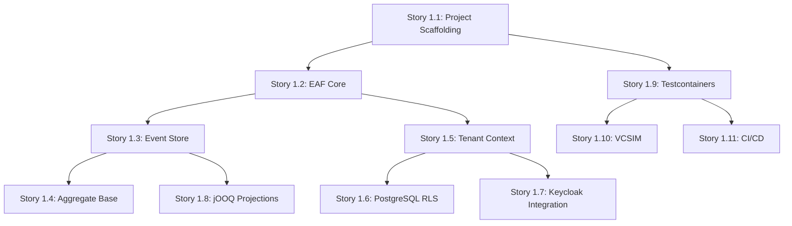

# Epic 1: Foundation - Technical Specification

**Epic ID:** Epic 1
**Epic Name:** Foundation
**Author:** Bob (SM) + Winston (Architect)
**Date:** 2025-11-25
**Status:** Ready for Implementation

---

## 1. Epic Overview

### 1.1 Goal

Establish the technical foundation for all DVMM features including project structure, event sourcing infrastructure, multi-tenant context, and quality gates.

### 1.2 User Value

None directly (technical foundation exception) - but enables ALL subsequent user-facing features.

### 1.3 Scope

| Metric | Value |
|--------|-------|
| **Stories** | 11 |
| **Risk Level** | Low |
| **FRs Covered** | FR66, FR67, FR80 |
| **Estimated Sprints** | Sprint 0 (1w) + Sprint 1-2 (2w each) |

### 1.3.1 In-Scope

| Metric | Value |
|--------|-------|
| **Stories** | 11 |
| **Risk Level** | Low |
| **FRs Covered** | FR66, FR67, FR80 |
| **Estimated Sprints** | Sprint 0 (1w) + Sprint 1-2 (2w each) |

### 1.3.2 Out-of-Scope

-   **User Interface (UI) Development**: This epic focuses solely on backend foundational elements.
-   **Specific Business Logic Implementation**: Beyond basic EAF patterns, detailed business rules are out of scope.
-   **Full Observability Stack Setup**: While foundational components support observability (e.g., Correlation IDs), the complete setup of monitoring, logging, and alerting tools is out of scope.
-   **Security Compliance Audits**: This epic establishes security mechanisms (e.g., RLS, Keycloak), but formal compliance audits are out of scope.
-   **Performance Benchmarking (initial)**: Initial setup includes performance gates, but detailed load testing and optimization are out of scope for this foundational epic.

### 1.4 Epic Dependencies

```
Epic 1 (Foundation) ──► Enables all subsequent epics
        │
        ▼
Epic 2 (Core Workflow) ───► Tracer Bullet demo
```

**No upstream dependencies** - Epic 1 is the starting point.

---

## 2. Architecture Context

### 2.1 Relevant ADRs

| ADR | Decision | Impact on Epic 1 |
|-----|----------|------------------|
| **ADR-001** | EAF Framework-First Architecture | Defines module structure for Stories 1.1, 1.2 |
| **ADR-002** | IdP-Agnostic Authentication | Keycloak adapter for Story 1.7 |
| **ADR-003** | Event Sourcing with PostgreSQL | Event Store schema for Story 1.3 |

### 2.2 Module Structure (from ADR-001)

```
eaf-monorepo/
├── build-logic/                     # Story 1.1
│   └── conventions/
│       ├── eaf.kotlin-conventions.gradle.kts
│       ├── eaf.spring-conventions.gradle.kts
│       └── eaf.test-conventions.gradle.kts
│
├── eaf/                             # 🔷 FRAMEWORK
│   ├── eaf-core/                    # Story 1.2
│   ├── eaf-eventsourcing/           # Story 1.3, 1.4
│   ├── eaf-tenant/                  # Story 1.5, 1.6
│   ├── eaf-auth/                    # Story 1.7
│   └── eaf-testing/                 # Story 1.9
│
├── dvmm/                            # 🔶 PRODUCT
│   ├── dvmm-domain/                 # Uses eaf-core
│   ├── dvmm-application/            # Uses eaf-eventsourcing
│   ├── dvmm-api/                    # Uses eaf-auth
│   ├── dvmm-infrastructure/         # Story 1.8
│   └── dvmm-app/                    # Main application
│
└── .github/workflows/               # Story 1.11
    └── ci.yml
```

### 2.3 Technology Stack

| Component | Technology | Version | Notes |
|-----------|------------|---------|-------|
| **Language** | Kotlin | 2.2+ | K2 Compiler enabled |
| **Framework** | Spring Boot | 3.5+ | WebFlux for reactive |
| **Build** | Gradle | 8.x | Version Catalogs |
| **Database** | PostgreSQL | 16 | RLS, JSONB |
| **ORM (Read)** | jOOQ | 3.20+ | Type-safe queries |
| **Testing** | JUnit 6 + Testcontainers | Latest | PostgreSQL, Keycloak |
| **Coverage** | Kover | Latest | ≥80% gate |
| **Mutation** | Pitest | Latest | ≥70% gate |
| **Architecture** | Konsist | Latest | Rule enforcement |

### 2.4 Key Schemas

#### Event Store Schema (eaf_events)

```sql
-- V001__create_event_store.sql
CREATE SCHEMA IF NOT EXISTS eaf_events;

CREATE TABLE eaf_events.events (
    id              UUID PRIMARY KEY DEFAULT gen_random_uuid(),
    aggregate_id    UUID NOT NULL,
    aggregate_type  VARCHAR(255) NOT NULL,
    event_type      VARCHAR(255) NOT NULL,
    payload         JSONB NOT NULL,
    metadata        JSONB NOT NULL DEFAULT '{}',
    tenant_id       UUID NOT NULL,
    version         INT NOT NULL,
    created_at      TIMESTAMPTZ NOT NULL DEFAULT NOW(),

    CONSTRAINT uq_aggregate_version UNIQUE (aggregate_id, version),
    CONSTRAINT chk_version_positive CHECK (version > 0)
);

CREATE INDEX idx_events_aggregate ON eaf_events.events (aggregate_id, version);
CREATE INDEX idx_events_tenant ON eaf_events.events (tenant_id);
```

#### RLS Policy Pattern

```sql
-- V002__enable_rls.sql
ALTER TABLE eaf_events.events ENABLE ROW LEVEL SECURITY;
CREATE POLICY tenant_isolation ON eaf_events.events
    USING (tenant_id = current_setting('app.tenant_id', true)::UUID);
```

---

## 3. Story Implementation Guides

### Story 1.1: Project Scaffolding

**Prerequisites:** None

**Implementation Checklist:**

- [ ] Create monorepo structure per ADR-001
- [ ] Configure `settings.gradle.kts` with all modules
- [ ] Set up `gradle/libs.versions.toml` (Version Catalog)
- [ ] Create build-logic conventions:
  - `eaf.kotlin-conventions.gradle.kts`
  - `eaf.spring-conventions.gradle.kts`
  - `eaf.test-conventions.gradle.kts`
- [ ] Configure Kotlin 2.2 with K2 compiler
- [ ] Configure Spring Boot 3.5 with WebFlux
- [ ] Set up Kover for coverage reporting
- [ ] Set up Pitest for mutation testing
- [ ] Create initial Konsist test scaffold

**Key Files to Create:**

```
eaf-monorepo/
├── settings.gradle.kts
├── build.gradle.kts
├── gradle/
│   └── libs.versions.toml
├── build-logic/
│   ├── settings.gradle.kts
│   └── conventions/
│       └── src/main/kotlin/
│           ├── eaf.kotlin-conventions.gradle.kts
│           ├── eaf.spring-conventions.gradle.kts
│           └── eaf.test-conventions.gradle.kts
├── eaf/
│   ├── eaf-core/build.gradle.kts
│   ├── eaf-eventsourcing/build.gradle.kts
│   ├── eaf-tenant/build.gradle.kts
│   ├── eaf-auth/build.gradle.kts
│   ├── eaf-auth-keycloak/build.gradle.kts
│   └── eaf-testing/build.gradle.kts
└── dvmm/
    ├── dvmm-domain/build.gradle.kts
    ├── dvmm-application/build.gradle.kts
    ├── dvmm-api/build.gradle.kts
    ├── dvmm-infrastructure/build.gradle.kts
    └── dvmm-app/build.gradle.kts
```

**Version Catalog Example:**

```toml
# gradle/libs.versions.toml
[versions]
kotlin = "2.2.21"
spring-boot = "3.5.8"
jooq = "3.20.8"
testcontainers = "2.0.2"      # Breaking: module prefix changed
konsist = "0.17.3"
junit = "6.0.1"               # Breaking: unified versioning
coroutines = "1.10.2"
mockk = "1.14.6"

[libraries]
kotlin-stdlib = { module = "org.jetbrains.kotlin:kotlin-stdlib", version.ref = "kotlin" }
spring-boot-webflux = { module = "org.springframework.boot:spring-boot-starter-webflux" }
jooq = { module = "org.jooq:jooq", version.ref = "jooq" }
# Testcontainers 2.x: modules now prefixed with 'testcontainers-'
testcontainers-postgresql = { module = "org.testcontainers:testcontainers-postgresql", version.ref = "testcontainers" }
junit-jupiter = { module = "org.junit.jupiter:junit-jupiter", version.ref = "junit" }

[plugins]
kotlin-jvm = { id = "org.jetbrains.kotlin.jvm", version.ref = "kotlin" }
spring-boot = { id = "org.springframework.boot", version.ref = "spring-boot" }
```

**Acceptance Criteria:**

```gherkin
Given I clone the repository
When I run `./gradlew build`
Then the build succeeds with zero errors
And all modules compile successfully
```

---

### Story 1.2: EAF Core Module

**Prerequisites:** Story 1.1

**Implementation Checklist:**

- [ ] Create `Result<T, E>` sealed class
- [ ] Create `DomainError` sealed class hierarchy
- [ ] Create value classes: `CorrelationId`, `TenantId`, `UserId`
- [ ] Create extension functions for Result mapping

**Key Types:**

```kotlin
// eaf-core/src/main/kotlin/com/eaf/core/result/Result.kt
sealed class Result<out T, out E> {
    data class Success<T>(val value: T) : Result<T, Nothing>()
    data class Failure<E>(val error: E) : Result<Nothing, E>()

    fun <R> map(transform: (T) -> R): Result<R, E> = when (this) {
        is Success -> Success(transform(value))
        is Failure -> this
    }

    fun <R> flatMap(transform: (T) -> Result<R, E>): Result<R, E> = when (this) {
        is Success -> transform(value)
        is Failure -> this
    }
}

fun <T> T.success(): Result<T, Nothing> = Result.Success(this)
fun <E> E.failure(): Result<Nothing, E> = Result.Failure(this)
```

```kotlin
// eaf-core/src/main/kotlin/com/eaf/core/error/DomainError.kt
sealed class DomainError {
    data class ValidationFailed(val field: String, val message: String) : DomainError()
    data class ResourceNotFound(val type: String, val id: String) : DomainError()
    data class InvalidStateTransition(val from: String, val action: String) : DomainError()
    data class QuotaExceeded(val current: Int, val max: Int) : DomainError()
    data class InfrastructureError(val cause: String) : DomainError()
}
```

```kotlin
// eaf-core/src/main/kotlin/com/eaf/core/types/Identifiers.kt
@JvmInline
value class TenantId(val value: UUID) {
    companion object {
        fun generate(): TenantId = TenantId(UUID.randomUUID())
        fun fromString(s: String): TenantId = TenantId(UUID.fromString(s))
    }
}

@JvmInline
value class UserId(val value: UUID) {
    companion object {
        fun generate(): UserId = UserId(UUID.randomUUID())
    }
}

@JvmInline
value class CorrelationId(val value: UUID) {
    companion object {
        fun generate(): CorrelationId = CorrelationId(UUID.randomUUID())
    }
}
```

**Acceptance Criteria:**

```gherkin
Given I import eaf-core
When I use Result<T, E> for operations
Then I can handle Success and Failure cases exhaustively
And DomainError sealed class has all required variants
```

---

### Story 1.3: Event Store Setup

**Prerequisites:** Story 1.1, Story 1.2

**Implementation Checklist:**

- [ ] Create Flyway migration V001__create_event_store.sql
- [ ] Implement `EventStore` interface in eaf-eventsourcing
- [ ] Implement `PostgresEventStore` in dvmm-infrastructure
- [ ] Add optimistic locking via version constraint
- [ ] Configure Jackson for JSONB serialization

**Event Store Interface:**

```kotlin
// eaf-eventsourcing/src/main/kotlin/com/eaf/eventsourcing/EventStore.kt
interface EventStore {
    suspend fun append(
        aggregateId: UUID,
        events: List<DomainEvent>,
        expectedVersion: Long
    ): Result<Long, EventStoreError>

    suspend fun load(aggregateId: UUID): List<StoredEvent>

    suspend fun loadFrom(aggregateId: UUID, fromVersion: Long): List<StoredEvent>
}

sealed class EventStoreError {
    data class ConcurrencyConflict(
        val aggregateId: UUID,
        val expectedVersion: Long,
        val actualVersion: Long
    ) : EventStoreError()
}
```

**PostgreSQL Implementation:**

```kotlin
// dvmm-infrastructure/src/main/kotlin/.../PostgresEventStore.kt
@Repository
class PostgresEventStore(
    private val dsl: DSLContext,
    private val objectMapper: ObjectMapper
) : EventStore {

    override suspend fun append(
        aggregateId: UUID,
        events: List<DomainEvent>,
        expectedVersion: Long
    ): Result<Long, EventStoreError> {
        return try {
            var version = expectedVersion
            events.forEach { event ->
                version++
                dsl.insertInto(EVENTS)
                    .set(EVENTS.AGGREGATE_ID, aggregateId)
                    .set(EVENTS.AGGREGATE_TYPE, event.aggregateType)
                    .set(EVENTS.EVENT_TYPE, event::class.simpleName)
                    .set(EVENTS.PAYLOAD, JSONB.valueOf(objectMapper.writeValueAsString(event)))
                    .set(EVENTS.METADATA, JSONB.valueOf(objectMapper.writeValueAsString(event.metadata)))
                    .set(EVENTS.TENANT_ID, event.metadata.tenantId.value)
                    .set(EVENTS.VERSION, version.toInt())
                    .execute()
            }
            version.success()
        } catch (e: DataIntegrityViolationException) {
            EventStoreError.ConcurrencyConflict(aggregateId, expectedVersion, loadCurrentVersion(aggregateId)).failure()
        }
    }
}
```

**Acceptance Criteria:**

```gherkin
Given an aggregate emits events
When I call eventStore.save(aggregateId, events, expectedVersion)
Then events are persisted to domain_events table
And optimistic locking prevents concurrent writes to same aggregate
```

---

### Story 1.4: Aggregate Base Pattern

**Prerequisites:** Story 1.2, Story 1.3

**Implementation Checklist:**

- [ ] Create `AggregateRoot<TId>` abstract class
- [ ] Implement event application with version tracking
- [ ] Add uncommitted events collection
- [ ] Implement reconstitute() for event replay
- [ ] Add snapshot support with configurable threshold

**Aggregate Base Class:**

```kotlin
// eaf-eventsourcing/src/main/kotlin/com/eaf/eventsourcing/aggregate/AggregateRoot.kt
abstract class AggregateRoot<TId : Any> {
    abstract val id: TId

    var version: Long = 0
        protected set

    private val _uncommittedEvents = mutableListOf<DomainEvent>()
    val uncommittedEvents: List<DomainEvent> get() = _uncommittedEvents.toList()

    protected fun applyEvent(event: DomainEvent, isReplay: Boolean = false) {
        handleEvent(event)
        version++
        if (!isReplay) {
            _uncommittedEvents.add(event)
        }
    }

    protected abstract fun handleEvent(event: DomainEvent)

    fun clearUncommittedEvents() {
        _uncommittedEvents.clear()
    }

    companion object {
        const val DEFAULT_SNAPSHOT_THRESHOLD = 100
    }
}
```

**Snapshot Support:**

```kotlin
// eaf-eventsourcing/src/main/kotlin/com/eaf/eventsourcing/snapshot/AggregateSnapshot.kt
data class AggregateSnapshot(
    val aggregateId: UUID,
    val aggregateType: String,
    val version: Long,
    val state: String,  // JSON serialized
    val tenantId: UUID,
    val createdAt: Instant
)

interface SnapshotStore {
    suspend fun save(snapshot: AggregateSnapshot)
    suspend fun load(aggregateId: UUID): AggregateSnapshot?
}
```

**Acceptance Criteria:**

```gherkin
Given I extend AggregateRoot<TId, TEvent>
When I call aggregate.applyEvent(event)
Then the event is added to uncommittedEvents list
And version is incremented per applied event
```

---

### Story 1.5: Tenant Context Module

**Prerequisites:** Story 1.2

**Implementation Checklist:**

- [ ] Create `TenantContextElement` implementing `CoroutineContext.Element`
- [ ] Create `TenantContext` object with `current()` suspend function
- [ ] Create `TenantContextWebFilter` for JWT extraction
- [ ] Implement fail-closed semantics (no tenant = 403)

**Tenant Context Implementation:**

```kotlin
// eaf-tenant/src/main/kotlin/com/eaf/tenant/TenantContext.kt
data class TenantContextElement(
    val tenantId: TenantId
) : AbstractCoroutineContextElement(TenantContextElement) {
    companion object Key : CoroutineContext.Key<TenantContextElement>
}

object TenantContext {
    suspend fun current(): TenantId {
        return coroutineContext[TenantContextElement]?.tenantId
            ?: throw TenantContextMissingException()
    }

    suspend fun currentOrNull(): TenantId? {
        return coroutineContext[TenantContextElement]?.tenantId
    }
}

class TenantContextMissingException : RuntimeException(
    "Tenant context is missing. All requests must include tenant information."
)
```

**Web Filter:**

```kotlin
// eaf-tenant/src/main/kotlin/com/eaf/tenant/TenantContextWebFilter.kt
@Component
@Order(Ordered.HIGHEST_PRECEDENCE + 10)
class TenantContextWebFilter : CoWebFilter() {

    override suspend fun filter(exchange: ServerWebExchange, chain: CoWebFilterChain) {
        val tenantId = exchange.extractTenantFromJwt()
            ?: throw ResponseStatusException(HttpStatus.FORBIDDEN, "Missing tenant context")

        withContext(TenantContextElement(tenantId)) {
            chain.filter(exchange)
        }
    }

    private fun ServerWebExchange.extractTenantFromJwt(): TenantId? {
        val jwt = request.headers.getFirst(HttpHeaders.AUTHORIZATION)
            ?.removePrefix("Bearer ")
            ?: return null
        // Extract tenant_id claim from JWT
        return extractTenantIdClaim(jwt)
    }
}
```

**Testability Concern TC-001 Tests:**

```kotlin
// eaf-tenant/src/test/kotlin/.../TenantContextPropagationTest.kt
class TenantContextPropagationTest {

    @Test
    fun `tenant context survives dispatcher switch`() = runTest {
        val tenantA = TenantId.generate()

        withContext(TenantContextElement(tenantA)) {
            // Switch to IO dispatcher
            withContext(Dispatchers.IO) {
                assertThat(TenantContext.current()).isEqualTo(tenantA)
            }
        }
    }

    @Test
    fun `tenant context survives async boundary`() = runTest {
        val tenantA = TenantId.generate()

        withContext(TenantContextElement(tenantA)) {
            val result = async {
                TenantContext.current()
            }
            assertThat(result.await()).isEqualTo(tenantA)
        }
    }

    @Test
    fun `tenant context isolated under concurrent load`() = runTest {
        val tenantA = TenantId.generate()
        val tenantB = TenantId.generate()

        val results = (1..100).map { i ->
            async {
                val tenant = if (i % 2 == 0) tenantA else tenantB
                withContext(TenantContextElement(tenant)) {
                    // Simulate work with dispatcher switches
                    withContext(Dispatchers.IO) {
                        delay(Random.nextLong(10))
                        tenant to TenantContext.current()
                    }
                }
            }
        }.awaitAll()

        // Verify no cross-contamination
        results.forEach { (expected, actual) ->
            assertThat(actual).isEqualTo(expected)
        }
    }
}
```

**Acceptance Criteria:**

```gherkin
Given a request with valid JWT containing tenant_id claim
When the request is processed
Then TenantContext.current() returns the tenant ID
And missing tenant context throws TenantContextMissingException
```

---

### Story 1.6: PostgreSQL RLS Policies

**Prerequisites:** Story 1.5

**Implementation Checklist:**

- [ ] Create Flyway migration V002__enable_rls.sql
- [ ] Configure HikariCP to set tenant context on checkout
- [ ] Create RlsConnectionCustomizer
- [ ] Implement fail-closed RLS policy
- [ ] Disable superuser bypass for application role

**RLS Migration:**

```sql
-- V002__enable_rls.sql

-- Enable RLS on event store
ALTER TABLE eaf_events.events ENABLE ROW LEVEL SECURITY;
CREATE POLICY tenant_isolation_events ON eaf_events.events
    USING (tenant_id = current_setting('app.tenant_id', true)::UUID);

ALTER TABLE eaf_events.snapshots ENABLE ROW LEVEL SECURITY;
CREATE POLICY tenant_isolation_snapshots ON eaf_events.snapshots
    USING (tenant_id = current_setting('app.tenant_id', true)::UUID);

-- Create application role without superuser bypass
CREATE ROLE dvmm_app NOINHERIT;
GRANT USAGE ON SCHEMA eaf_events TO dvmm_app;
GRANT SELECT, INSERT ON eaf_events.events TO dvmm_app;
GRANT SELECT, INSERT, UPDATE ON eaf_events.snapshots TO dvmm_app;

-- Force RLS for application role
ALTER TABLE eaf_events.events FORCE ROW LEVEL SECURITY;
ALTER TABLE eaf_events.snapshots FORCE ROW LEVEL SECURITY;
```

**Connection Customizer:**

```kotlin
// eaf-tenant/src/main/kotlin/com/eaf/tenant/rls/RlsConnectionCustomizer.kt
@Component
class RlsConnectionCustomizer(
    private val dataSource: DataSource
) {

    suspend fun <T> withTenantContext(block: suspend (Connection) -> T): T {
        val tenantId = TenantContext.current()
        return dataSource.connection.use { conn ->
            conn.createStatement().execute(
                "SET LOCAL app.tenant_id = '${tenantId.value}'"
            )
            block(conn)
        }
    }
}
```

**Testability Concern TC-002 Implementation:**

```kotlin
// eaf-testing/src/main/kotlin/com/eaf/testing/RlsEnforcingDataSource.kt
class RlsEnforcingDataSource(
    private val delegate: DataSource
) : DataSource by delegate {

    override fun getConnection(): Connection {
        val tenant = TenantTestContext.current()
            ?: throw IllegalStateException(
                "NO TENANT CONTEXT IN TEST! " +
                "Use @WithTenant annotation or TenantTestContext.set()"
            )

        return delegate.connection.also { conn ->
            conn.createStatement().execute(
                "SET LOCAL app.tenant_id = '${tenant.value}'"
            )
        }
    }
}
```

**Acceptance Criteria:**

```gherkin
Given RLS is enabled on tenant-scoped tables
When a query runs without proper tenant context
Then zero rows are returned (fail-closed)
And app.tenant_id session variable is set per connection
```

---

### Story 1.7: Keycloak Integration

**Prerequisites:** Story 1.5

**Implementation Checklist:**

- [ ] Configure Spring Security OAuth2 Resource Server
- [ ] Create custom JWT claim extractor for tenant_id
- [ ] Configure CORS for frontend origin
- [ ] Implement role extraction from JWT

**Security Configuration:**

```kotlin
// dvmm-api/src/main/kotlin/com/dvmm/api/security/SecurityConfig.kt
@Configuration
@EnableWebFluxSecurity
class SecurityConfig {

    @Bean
    fun securityWebFilterChain(http: ServerHttpSecurity): SecurityWebFilterChain {
        return http
            .csrf { it.disable() }
            .cors { it.configurationSource(corsConfiguration()) }
            .authorizeExchange { auth ->
                auth
                    .pathMatchers("/actuator/health").permitAll()
                    .pathMatchers("/api/**").authenticated()
                    .anyExchange().authenticated()
            }
            .oauth2ResourceServer { oauth2 ->
                oauth2.jwt { jwt ->
                    jwt.jwtAuthenticationConverter(jwtAuthenticationConverter())
                }
            }
            .build()
    }

    private fun jwtAuthenticationConverter(): ReactiveJwtAuthenticationConverter {
        val converter = ReactiveJwtAuthenticationConverter()
        converter.setJwtGrantedAuthoritiesConverter { jwt ->
            val roles = jwt.getClaimAsStringList("roles") ?: emptyList()
            Flux.fromIterable(roles.map { SimpleGrantedAuthority("ROLE_$it") })
        }
        return converter
    }

    private fun corsConfiguration() = CorsConfigurationSource {
        CorsConfiguration().apply {
            allowedOrigins = listOf("http://localhost:3000")
            allowedMethods = listOf("GET", "POST", "PUT", "DELETE", "OPTIONS")
            allowedHeaders = listOf("*")
            allowCredentials = true
        }
    }
}
```

**Application Properties:**

```yaml
# application.yml
spring:
  security:
    oauth2:
      resourceserver:
        jwt:
          issuer-uri: ${KEYCLOAK_ISSUER_URI:http://localhost:8180/realms/dvmm}
          jwk-set-uri: ${KEYCLOAK_JWK_URI:http://localhost:8180/realms/dvmm/protocol/openid-connect/certs}
```

**Acceptance Criteria:**

```gherkin
Given a valid Keycloak JWT token
When a request includes Authorization: Bearer <token>
Then the request is authenticated and user context is available
And invalid/expired tokens return HTTP 401
```

---

### Story 1.8: jOOQ Projection Base

**Prerequisites:** Story 1.3

**Implementation Checklist:**

- [ ] Configure jOOQ Gradle plugin for code generation
- [ ] Generate from Flyway migrations
- [ ] Create `BaseProjectionRepository` with tenant filter
- [ ] Implement pagination helpers

**jOOQ Gradle Configuration:**

```kotlin
// dvmm-infrastructure/build.gradle.kts
plugins {
    id("nu.studer.jooq") version "9.0"
}

jooq {
    configurations {
        create("main") {
            generateSchemaSourceOnCompilation.set(true)
            jooqConfiguration.apply {
                jdbc.apply {
                    driver = "org.postgresql.Driver"
                    url = "jdbc:postgresql://localhost:5432/dvmm"
                    user = "dvmm"
                    password = "dvmm"
                }
                generator.apply {
                    name = "org.jooq.codegen.KotlinGenerator"
                    database.apply {
                        inputSchema = "dvmm"
                    }
                    target.apply {
                        packageName = "com.dvmm.infrastructure.jooq"
                        directory = "build/generated-sources/jooq"
                    }
                }
            }
        }
    }
}
```

**Base Repository:**

```kotlin
// dvmm-infrastructure/src/main/kotlin/.../BaseProjectionRepository.kt
abstract class BaseProjectionRepository<T : Any>(
    protected val dsl: DSLContext
) {
    // Note: RLS handles tenant filtering at database level
    // No explicit tenant filter needed in queries

    protected fun <R : Record> SelectWhereStep<R>.paginate(
        page: PageRequest
    ): SelectLimitPercentAfterOffsetStep<R> {
        return this
            .limit(page.size)
            .offset(page.page * page.size)
    }
}

data class PageRequest(
    val page: Int = 0,
    val size: Int = 20
)

data class PagedResponse<T>(
    val items: List<T>,
    val page: Int,
    val size: Int,
    val totalElements: Long,
    val totalPages: Int = ((totalElements + size - 1) / size).toInt()
)
```

**TC-004 awaitProjection Helper:**

```kotlin
// eaf-testing/src/main/kotlin/com/eaf/testing/ProjectionTestUtils.kt
suspend fun <T> awaitProjection(
    aggregateId: UUID,
    repository: suspend () -> T?,
    timeout: Duration = 5.seconds
): T = withTimeout(timeout) {
    while (true) {
        repository()?.let { return@withTimeout it }
        delay(50.milliseconds)
    }
    @Suppress("UNREACHABLE_CODE")
    error("Should not reach here")
}
```

**Acceptance Criteria:**

```gherkin
Given jOOQ code generation runs during build
When I query using generated record classes
Then queries are type-safe and compile-time checked
And tenant_id filter is automatically applied via RLS
```

---

### Story 1.9: Testcontainers Setup

**Prerequisites:** Story 1.1

**Implementation Checklist:**

- [ ] Configure Testcontainers with PostgreSQL 16
- [ ] Configure Keycloak container for auth tests
- [ ] Implement singleton container pattern
- [ ] Create test fixtures module

**Testcontainers Configuration:**

```kotlin
// dvmm-app/src/test/kotlin/.../TestContainersConfig.kt
@TestConfiguration
class TestContainersConfig {

    companion object {
        @Container
        @JvmStatic
        val postgres: PostgreSQLContainer<*> = PostgreSQLContainer("postgres:16-alpine")
            .withDatabaseName("dvmm_test")
            .withUsername("test")
            .withPassword("test")
            .withReuse(true)

        @Container
        @JvmStatic
        val keycloak: KeycloakContainer = KeycloakContainer("quay.io/keycloak/keycloak:23.0")
            .withRealmImportFile("/test-realm.json")
            .withReuse(true)

        init {
            postgres.start()
            keycloak.start()
        }
    }

    @Bean
    @Primary
    fun testDataSource(): DataSource {
        return RlsEnforcingDataSource(
            HikariDataSource().apply {
                jdbcUrl = postgres.jdbcUrl
                username = postgres.username
                password = postgres.password
            }
        )
    }
}
```

**Test Fixtures:**

```kotlin
// dvmm-app/src/testFixtures/kotlin/.../TestFixtures.kt
object TestTenantFixture {
    fun createTenant(name: String = "Test Tenant"): TenantId {
        return TenantId.generate()
    }
}

object TestUserFixture {
    fun createUser(
        tenantId: TenantId,
        role: String = "USER"
    ): TestUser {
        return TestUser(
            id = UserId.generate(),
            tenantId = tenantId,
            email = "test-${UUID.randomUUID()}@example.com",
            roles = listOf(role)
        )
    }

    fun generateJwt(user: TestUser): String {
        // Generate valid JWT for test user
        return JwtBuilder()
            .subject(user.id.value.toString())
            .claim("tenant_id", user.tenantId.value.toString())
            .claim("roles", user.roles)
            .build()
    }
}
```

**TC-003 Event Store Isolation:**

```kotlin
// eaf-testing/src/main/kotlin/com/eaf/testing/IsolatedEventStore.kt
@Target(AnnotationTarget.CLASS)
@ExtendWith(EventStoreIsolationExtension::class)
annotation class IsolatedEventStore(
    val strategy: IsolationStrategy = IsolationStrategy.TRUNCATE
)

enum class IsolationStrategy {
    TRUNCATE,           // Fast ~5ms, for unit/integration
    SCHEMA_PER_TEST     // Slower ~50ms, for E2E with parallelization
}

class EventStoreIsolationExtension : BeforeEachCallback {
    override fun beforeEach(context: ExtensionContext) {
        val annotation = context.requiredTestClass.getAnnotation(IsolatedEventStore::class.java)
        when (annotation?.strategy ?: IsolationStrategy.TRUNCATE) {
            IsolationStrategy.TRUNCATE -> truncateEventStore()
            IsolationStrategy.SCHEMA_PER_TEST -> createIsolatedSchema(context.uniqueId)
        }
    }
}
```

**Acceptance Criteria:**

```gherkin
Given I run integration tests
When PostgreSQL container is needed
Then Testcontainers starts PostgreSQL 16 automatically
And containers are reused across test classes
```

---

### Story 1.10: VCSIM Integration

**Prerequisites:** Story 1.9

**Implementation Checklist:**

- [ ] Add VCSIM Docker container to Testcontainers
- [ ] Create VcsimTestFixture helpers
- [ ] Configure connection parameters injection
- [ ] Implement state reset between tests

**VCSIM Container:**

```kotlin
// dvmm-app/src/test/kotlin/.../VcsimContainerConfig.kt
@TestConfiguration
class VcsimContainerConfig {

    companion object {
        @Container
        @JvmStatic
        val vcsim: GenericContainer<*> = GenericContainer("vmware/vcsim:latest")
            .withExposedPorts(8989, 443)
            .withCommand("-api-version", "7.0")
            .withReuse(true)

        init {
            vcsim.start()
        }
    }

    @Bean
    fun vcsimConnectionProperties(): VsphereConnectionProperties {
        return VsphereConnectionProperties(
            url = "https://localhost:${vcsim.getMappedPort(443)}/sdk",
            username = "user",
            password = "pass",
            skipCertificateValidation = true
        )
    }
}
```

**VCSIM Test Fixture:**

```kotlin
// dvmm-app/src/testFixtures/kotlin/.../VcsimTestFixture.kt
object VcsimTestFixture {

    fun createTestVm(
        name: String = "test-vm-${UUID.randomUUID().toString().take(8)}",
        cpuCores: Int = 2,
        memoryGb: Int = 4
    ): VmSpec {
        return VmSpec(
            name = name,
            cpuCores = cpuCores,
            memoryGb = memoryGb,
            storageGb = 50,
            networkName = "VM Network"
        )
    }

    suspend fun resetVcsimState(vcsimClient: VcsimClient) {
        // VCSIM doesn't persist state, restart container for clean slate
        // Or use VCSIM API to delete all test VMs
        vcsimClient.listVms().forEach { vm ->
            if (vm.name.startsWith("test-")) {
                vcsimClient.deleteVm(vm.id)
            }
        }
    }
}
```

**Acceptance Criteria:**

```gherkin
Given I run VMware integration tests
When VCSIM container starts
Then it provides vSphere API compatible endpoints
And connection parameters are injected via test properties
```

---

### Story 1.11: CI/CD Quality Gates

**Prerequisites:** Story 1.9

**Implementation Checklist:**

- [ ] Create GitHub Actions workflow ci.yml
- [ ] Configure build, test, coverage, mutation gates
- [ ] Set up branch protection for main
- [ ] Configure PR merge requirements

**GitHub Actions Workflow:**

```yaml
# .github/workflows/ci.yml
name: CI Pipeline

on:
  push:
    branches: [main, develop]
  pull_request:
    branches: [main]

jobs:
  build:
    runs-on: ubuntu-latest

    services:
      postgres:
        image: postgres:16-alpine
        env:
          POSTGRES_DB: dvmm_test
          POSTGRES_USER: test
          POSTGRES_PASSWORD: test
        ports:
          - 5432:5432
        options: >-
          --health-cmd pg_isready
          --health-interval 10s
          --health-timeout 5s
          --health-retries 5

    steps:
      - uses: actions/checkout@v4

      - name: Set up JDK 21
        uses: actions/setup-java@v4
        with:
          java-version: '21'
          distribution: 'temurin'

      - name: Cache Gradle packages
        uses: actions/cache@v4
        with:
          path: |
            ~/.gradle/caches
            ~/.gradle/wrapper
          key: ${{ runner.os }}-gradle-${{ hashFiles('**/*.gradle*', '**/gradle-wrapper.properties') }}

      - name: Build
        run: ./gradlew build -x test

      - name: Unit Tests
        run: ./gradlew test

      - name: Integration Tests
        run: ./gradlew integrationTest

      - name: Code Coverage (Kover ≥80%)
        run: ./gradlew koverHtmlReport koverVerify

      - name: Mutation Testing (Pitest ≥70%)
        run: ./gradlew pitest

      - name: Architecture Tests (Konsist)
        run: ./gradlew konsistTest

      - name: Upload Coverage Report
        uses: actions/upload-artifact@v4
        with:
          name: coverage-report
          path: build/reports/kover/

      - name: Upload Mutation Report
        uses: actions/upload-artifact@v4
        with:
          name: mutation-report
          path: build/reports/pitest/
```

**Gradle Quality Configuration:**

```kotlin
// build.gradle.kts (root)
// Kover configured via eaf.test-conventions plugin
// See build-logic/conventions/src/main/kotlin/eaf.test-conventions.gradle.kts
kover {
    reports {
        verify {
            rule {
                minBound(80) // 80% minimum coverage
            }
        }
    }
}
```

**Branch Protection Settings (manual):**
- Require status checks to pass before merging
- Require branches to be up to date before merging
- Required status checks: `build`
- Require pull request reviews before merging

**Acceptance Criteria:**

```gherkin
Given I push code or open a PR
When GitHub Actions workflow runs
Then the pipeline executes build, test, coverage, mutation, architecture
And pipeline FAILS if ANY gate fails
And PR merge requires passing pipeline
```

---

## 4. Technical Dependencies

### 4.1 Story Dependencies



### 4.2 Recommended Implementation Order

| Sprint | Stories | Notes |
|--------|---------|-------|
| **Sprint 0** | 1.1, 1.2, 1.9 | Project setup, core types, test infra |
| **Sprint 1** | 1.3, 1.4, 1.5, 1.6 | Event sourcing, tenant context |
| **Sprint 2** | 1.7, 1.8, 1.10, 1.11 | Auth, projections, VCSIM, CI/CD |

---

## 5. Testing Strategy

### 5.1 Test Pyramid

| Level | Target Coverage | Example |
|-------|-----------------|---------|
| **Unit** | ≥85% | `VmRequestAggregateTest` |
| **Integration** | ≥80% | `EventStoreIntegrationTest` |
| **Architecture** | Pass | `ArchitectureRulesTest` |
| **Contract** | Pass | `VsphereContractTest` |

### 5.2 Critical Test Scenarios

#### TC-001: Tenant Context Propagation

```kotlin
@Test
fun `tenant context isolated under concurrent load`() = runTest {
    // 100 parallel coroutines, 50 Tenant A, 50 Tenant B
    // Verify NO cross-contamination
}
```

#### TC-002: RLS Enforcement

```kotlin
@Test
fun `RLS prevents cross-tenant data access`() {
    // Tenant A creates VM request
    // Tenant B queries - MUST NOT see Tenant A's data
}

@Test
fun `queries without tenant context fail`() {
    // Direct SQL without tenant context
    // MUST throw IllegalStateException
}
```

#### TC-003: Event Store Isolation

```kotlin
@IsolatedEventStore(strategy = IsolationStrategy.TRUNCATE)
class EventStoreIsolationTest {
    @Test
    fun `events from previous tests not visible`() {
        // Test starts with clean event store
    }
}
```

#### TC-004: Projection Awaiting

```kotlin
@Test
fun `can await projection updates`() = runTest {
    // Process command
    // awaitProjection() blocks until projection updated
    // Timeout after 5 seconds if not updated
}
```

---

## 6. FR Traceability

| FR | Description | Story | Verification |
|----|-------------|-------|--------------|
| **FR66** | Each tenant's data is completely isolated | Story 1.6 | RLS Integration Test |
| **FR67** | System rejects requests with missing tenant context | Story 1.5 | WebFilter Unit Test |
| **FR80** | System logs all infrastructure errors with correlation IDs | Story 1.2 | Logging Integration Test |

---

## 7. Risks, Assumptions & Open Questions

### 7.1 Risks

| ID | Risk | Likelihood | Impact | Mitigation | Owner |
|----|------|------------|--------|------------|-------|
| **R1** | Kotlin 2.2/K2 Compiler Instability - potential edge cases in production | Medium (30%) | Medium | Fallback plan to Kotlin 2.1.x documented; K2 only for new modules | Architect |
| **R2** | RLS Performance degradation at >1000 tenants | Medium (25%) | High | Benchmark in Sprint 1 with simulated load; validate index strategy | Dev + DBA |
| **R3** | TenantContext propagation failure across async/coroutine boundaries | Low (15%) | Critical | TC-001 tests mandatory; code review checklist for coroutine usage | Dev Lead |
| **R4** | Testcontainers startup time impacts CI pipeline duration | High (60%) | Low | Enable container reuse; parallel test execution | Test Architect |
| **R5** | 80% coverage gate blocks Sprint 0 delivery | Medium (40%) | Medium | Initial gate at 70%, increase to 80% after Sprint 1 | SM + TEA |
| **R6** | VCSIM API divergence from real vSphere 7.0 | Medium (35%) | High | Contract tests against real vSphere instance (staging) before Epic 2 | Test Architect |

### 7.2 Assumptions

| ID | Assumption | Validation Status | Impact if Wrong |
|----|------------|-------------------|-----------------|
| **A1** | Development team has Event Sourcing experience | ⚠️ UNVALIDATED | +2 sprints for ramp-up, training required |
| **A2** | Keycloak dev instance available from Sprint 0 | ⚠️ UNVALIDATED | Story 1.7 blocked; mock-auth fallback needed |
| **A3** | PostgreSQL 16 with RLS approved for production | ✅ VALIDATED (Ops) | - |
| **A4** | JDK 21 LTS as runtime environment | ✅ VALIDATED | - |
| **A5** | jOOQ blocking calls acceptable for MVP performance | ⚠️ UNVALIDATED | Performance issues under load; R2DBC migration required |

### 7.3 Open Questions

| ID | Question | Decision Needed By | Stakeholder |
|----|----------|-------------------|-------------|
| **Q1** | Snapshot threshold set to 100 events - based on what metrics/benchmarks? | Sprint 1 Start | Architect |
| **Q2** | jOOQ blocking vs. R2DBC reactive - final architectural decision? | Sprint 0 End | Architect + Dev Lead |
| **Q3** | User-facing error messages for auth/tenant failures - define standard? | Sprint 1 | UX + PM |
| **Q4** | VCSIM limitations - which vSphere 7.0 features are missing/broken? | Before Epic 2 | Test Architect |
| **Q5** | Keycloak realm configuration ownership - who is responsible? | Sprint 0 | Ops/DevOps |
| **Q6** | Quality gate thresholds - final or iteratively adjusted? | Sprint 0 End | SM + TEA |

### 7.4 Decision Log

| ID | Decision | Date | Rationale | Decided By |
|----|----------|------|-----------|------------|
| *No decisions recorded yet* | | | | |

---

## 8. Related Documents

| Document | Location | Description |
|----------|----------|-------------|
| PRD | `docs/prd.md` | Product Requirements |
| Architecture | `docs/architecture.md` | Technical Architecture |
| Epics | `docs/epics.md` | Epic & Story Breakdown |
| Security | `docs/security-architecture.md` | Security Design |
| DevOps | `docs/devops-strategy.md` | CI/CD & Operations |
| Test Design | `docs/test-design-system.md` | Test Strategy |

---

_Generated by BMAD Epic Tech Context Workflow_
_Date: 2025-11-25_
_Epic: Epic 1 - Foundation_
